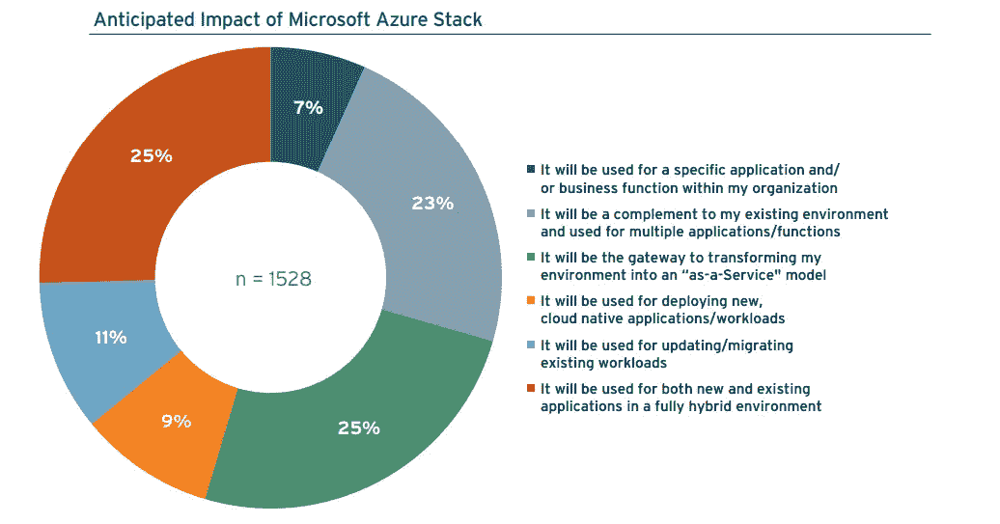
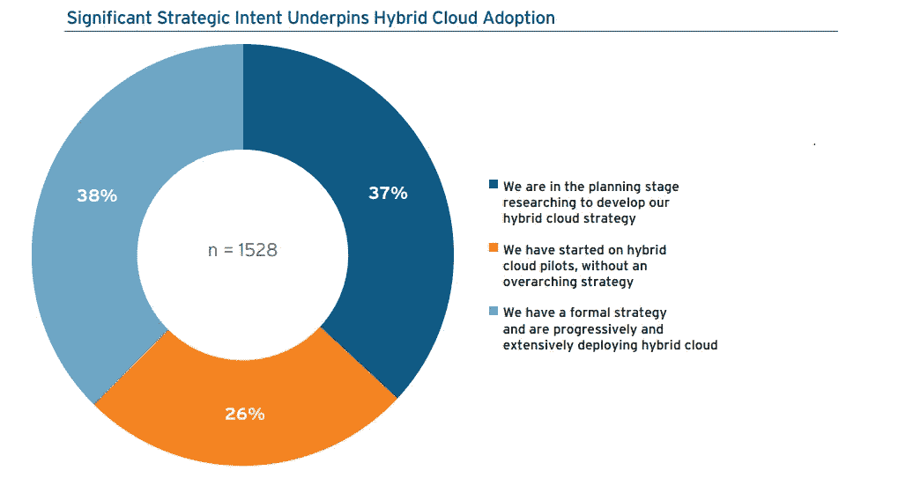
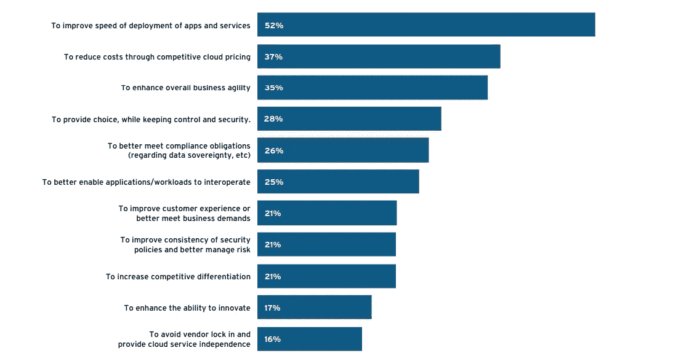

# 2018 年欧洲云采用状况

> 原文：<https://medium.datadriveninvestor.com/state-of-cloud-adoption-in-europe-in-2018-dca5b06d94d6?source=collection_archive---------7----------------------->

由于一些历史原因，云托管服务在欧洲并不普及。然而，在 2018 年，云成为标准选择，原因如下。

欧盟并不是铁板一块。它由 28 个国家组成，拥有 28 套不同的法规，尤其是数据保护法规。最能体现这一点的是[原产国原则](https://en.wikipedia.org/wiki/Country_of_origin_principle)，该原则规定原产国的法律适用于数据处理，而不是实际处理发生地国家的法律。例如，一家与英国客户合作的法国公司必须遵守英国立法。此外，各国政府必须安全地存储他们的私人数据，这意味着在大多数情况下要存储在专用的数据中心。

因此，根据欧盟统计局的数据，截至 2016 年，只有 [21%的欧盟企业](https://ec.europa.eu/eurostat/statistics-explained/index.php/Cloud_computing_-_statistics_on_the_use_by_enterprises)和组织(主要是初创公司)在使用云托管。更确切地说，在一些欧洲国家，没有一个云数据中心！

然而，合规性问题并不是欧洲采用云的唯一障碍:

1.  **隐含安全顾虑**。尽管云网络安全可靠性的多种证明(如 AWS 和美国国防部之间的100 亿美元合同)，欧盟的企业通常认为与本地基础设施相比，云不太安全。因此，欧洲就业市场缺乏合格的云安全专家，企业通常被迫将其云过渡外包给可靠的托管服务提供商。
2.  **连接延迟**。正如我们上面提到的，欧洲几乎没有云数据中心，因此对于许多客户来说，连接延迟可能是一个问题，尤其是在服务本地受众时。
3.  **云运营成本**。与美国的可用性区域相比，欧元比美元疲软，欧洲云服务的成本更高。如果涉及大数据处理，本地云解决方案可能更可行。
4.  **缺乏技能**。将遗留软件生态系统迁移到云中是一个复杂的过程，有许多水下暗礁，可能会导致代价高昂的错误。前几年对云架构师和工程师的低需求导致了一种情况，即企业无法获得他们需要的人才，因为没有可用的人才。

随着欧盟公司为 GDPR 做好准备，情况在 2017 年发生了变化。

# 2017 年的构造转变:云的崛起

在 2016 年底签署并于 2018 年 5 月生效的《通用数据保护条例》或 [GDPR](https://itsvit.com/blog/gdpr-can-ruin-trampoline-business/) 获得批准后，欧盟企业看到了将本地基础设施的安全性与公共云的可扩展性和高可用性相结合的机会。这就是多云和混合云环境所提供的，因此云计算目前正在整个欧盟兴起。

事实上，来自著名分析机构 451 Research[EMEA 云报告的数据清楚地显示了几个重要趋势:](https://www.eu.ntt.com/en/lp/Going_Hybrid_Report.html)

1.  大约 80%的 EU-企业目前正处于设计云过渡战略或运行试点项目以评估其可行性的阶段。
2.  **在接受调查的 1500 多家**企业中，有 63%** 目前正处于过渡阶段。提到的主要挑战是安全问题、遗留基础设施的复杂性以及新运营模式的学习曲线。**
3.  **44%的传统基础设施**过渡是通过[提升和转移](https://itsvit.com/blog/cloud-native-vs-lift-shift-way-choose/)或重构完成的，而不是通过开发全新的云原生版本的应用程序。
4.  大约 48%的公司计划使用 MS Azure 作为他们的公共云网关和云基础设施的提供商。
5.  超过 23%的公司承认他们将需要第三方的帮助来克服合规性、安全性和云运营挑战。
6.  EMEA 65%的企业都在使用 Office365 作为他们的生产力套件，所以选择 Azure 是显而易见的。

因此，欧洲目前正在大幅提升其云采用率，并在全球范围内领先，与 2017 年相比，云采用项目数量增加了 [84%。不幸的是，正如迈克菲的报告](https://dzone.com/articles/in-europe-cloud-is-the-new-default)显示的那样，即使企业努力向云转移，**EMEA 公司**目前使用的云服务**有 74%不符合 GDPR 的安全要求**。

这促进了对混合云的需求，在混合云中，面向客户的工作负载在公共云中运行，如 GCP、 [AWS 或 Azure](https://itsvit.com/blog/aws-vs-ms-azure-cloud-provider-choose/) ，而任务关键型系统和数据安全地驻留在私有云、本地云或虚拟服务器中，如 VMware、vSphere 或 OpenStack。

因此，欧洲目前的云采用率正在飙升，并在全球范围内领先，与 2017 年相比，云采用项目的数量[增长了 84%](https://dzone.com/articles/in-europe-cloud-is-the-new-default)。不幸的是，正如迈克菲公司的报告所示，即使企业努力向云迁移，EMEA 公司目前使用的云服务中仍有 74%不符合 GDPR 的安全要求。

这促进了对混合云的需求，在混合云中，面向客户的工作负载在公共云中运行，如 GCP、 [AWS 或 Azure](https://itsvit.com/blog/aws-vs-ms-azure-cloud-provider-choose/) ，而任务关键型系统和数据安全地驻留在私有云、本地云或虚拟服务器中，如 VMware、vSphere 或 OpenStack。

# 混合云:长期安全性和可扩展性

关于 2018 年欧洲云采用状况的 451 研究报告进一步强调了混合云对欧盟企业的重要性，因为在 1，528 名调查参与者中， **37%** 已经制定了长期的混合云战略和基础设施，而 **26%** 目前正在进行试点和设计这样的战略。

采用混合云有多种原因，最主要的原因是需要提高新应用程序开发和部署的速度，其次是需要节省预算和提高业务灵活性。

虽然这些优势似乎显而易见，不言而喻，但本研究中接受调查的企业报告了他们在云计算之路上遇到的某些严峻挑战:

1.  **数据安全挑战**。从数据安全性的角度来看，混合云工作负载在状态、时间、容量、速度以及相互之间和与其他基础架构组件的交互复杂性方面都有所不同。配置所有流程以安全运行是一项令人生畏的任务，需要付出大量努力。
2.  **操作复杂**。当 IT 团队必须通过多个控制面板同时管理多个平台时，人为错误的风险会呈指数级增长。构建 CI/CD 管道，使多个常规操作方面实现自动化非常有帮助，但是制定这样的解决方案需要操作的全球视野。
3.  **遗留基础设施迁移问题**。很明显，遗留环境不能完全迁移到云中。一些公司选择提升和转移策略，而另一些公司则选择重构或构建云原生应用，但这导致了昂贵的重新开发，并大大减慢了项目进度。

应对这些挑战的最常见解决方案是雇佣一家可靠的[托管服务提供商](https://clutch.co/it-services/msp)公司，他们在云过渡方面的丰富经验有助于解决上述问题。

# 关于 2018 年欧盟云状况的结论

因此，截至 2018 年，欧盟、中东和非洲的云计算发展势头强劲。斯堪的纳维亚国家走在了前面，他们通过支持多个创业加速器和其他政府项目，鼓励所有企业向云迁移。AWS 和 Azure 对这个地区非常感兴趣，已经在那里建立了数据中心，并计划进一步增加它们的存在。

如果您还没有考虑迁移到云，那么时间就要到了，因为拒绝采用云的企业可能会失去多种可行的优势，并失去竞争优势。

如果缺乏所需的专业知识让你担心，它会很乐意伸出援手。我们将构建云解决方案，帮助您实现业务目标！