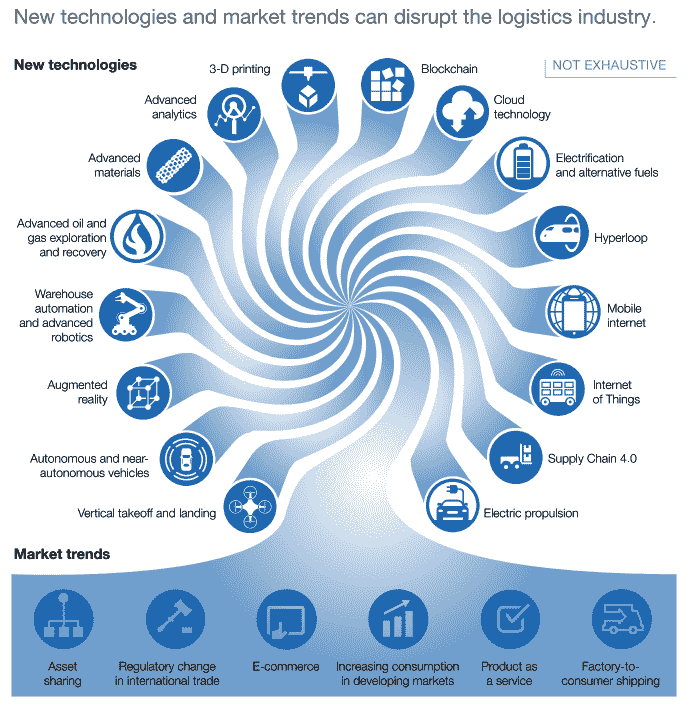

# 物流的未来:期待什么

> 原文：<https://medium.datadriveninvestor.com/state-of-the-logistics-world-810f3510ca37?source=collection_archive---------12----------------------->

## 基于 [BGSA 供应链会议](http://www.bgsaconference.com)上 250 名首席执行官和领导者的主要发现

Photo by [mostafa meraji](https://unsplash.com/@mostafa_meraji?utm_source=medium&utm_medium=referral) on [Unsplash](https://unsplash.com?utm_source=medium&utm_medium=referral)

[BGSA 供应链大会](http://www.bgsaconference.com)聚集了运输、物流和供应链领域的 250 多位顶级首席执行官和行业领袖。这意味着我们可以向这个市场上最优秀、最聪明的人学习。我们学到了什么？

几个关键的挑战和机遇非常突出。

 [## 一个 M&A 的爱情故事(第 1 部分，共 3 部分)|数据驱动的投资者

### 上周，我们报道了三集系列节目“M&A 爱情故事”的第二集。今天我们回到开头来谈谈…

www.datadriveninvestor.com](https://www.datadriveninvestor.com/2018/07/10/an-ma-love-story-part-1-of-3/) 

**挑战**

我们看到当今供应链市场面临三大挑战。

***贸易:战争与和平***

第一个挑战是动荡的政治气候。

一方面，我们避免了与加拿大和墨西哥的贸易战，当时特朗普政府取消了北美自由贸易协定，但随后在 9 月份以类似协议取而代之。

另一方面，我们可能正在与中国展开一场更大的战争。特朗普总统和中国核心领导人新金平同意推迟 12 月 1 日的报复性关税。但如果他们无法达成协议，美国将对 2000 亿美元的中国商品征收 25%的关税，中国将对美国汽车重新征收 40%的关税。

美国供应链已经感受到了后果。西海岸航运数据显示对中国的出口下降。11 月，长滩有超过 186，000 个集装箱被空载运回亚洲，增长了 11%。似乎中国正在尽可能地寻找非美国的产品来源。

短期来看，数据喜忧参半。事实上，美国上个季度进口了创纪录水平的产品。此外，长滩港的吞吐量创下历史新高，超过了 750 万个集装箱。许多分析师认为，美国零售商在 2018 年底追求中国采购量的激增，以击败 2019 年的关税。如果属实，这种预购可能导致 2019 年经济放缓。

特朗普贸易政策的一个意想不到的后果是回流趋势。关税旨在鼓励美国消费者购买美国货。反过来，特朗普寻求给美国带来制造业就业岗位。开利等一些公司宣布了在美国扩大生产的计划。然而，其他公司已宣布计划增加在中国的生产，以避免美中对面向非美国消费者的产品征收关税。例如，宝马开始在中国生产 X3 SUV，并宣布计划让中国成为电气化 X3 的出口中心。

对于供应链公司来说，一个好消息是波动性。更多的不确定性通常意味着货运代理和其他轻资产公司更多的利润机会。

***劳动力:10 万美元的卡车司机***

第二个挑战是紧张的劳动力市场。

想想卡车司机。

在沃尔玛，初级司机现在的工资达到了创纪录的 8.6 万美元。为了反映收益成本，沃尔玛每年要为此花费超过 10 万美元。与此同时，在 YRC，卡车司机们开始朝着新的集体谈判协议迈进，取代将于 3 月 31 日到期的 5 年延长协议。这些合同涵盖了 20，000 名卡车司机。用卡车司机厄尼·索尔的话说，“我们对这些谈判中的让步不感兴趣！”

卡车运输类股暴跌，Knight、Werner、ArcBest 和 YRC 等公司的 EBITDA 分别为 6 倍、5 倍、4 倍和 3 倍，这是巧合吗？

然而，这些成本飙升也带来了意想不到的后果。随着劳动力变得更加昂贵，技术变得更具竞争力。2019 年将是自动驾驶卡车获得牵引力的一年吗？

麦肯锡估计，卡车的完全自动化可以在未来十年削减高达 45%的运营成本，为该行业节省超过 1000 亿美元。好处包括:

*   两辆卡车排成一排—由于燃料改进，节省了 1%
*   无人驾驶车队——使“跟随卡车”能够无人驾驶，额外节省 10%的成本
*   受限的自主性——允许无人驾驶卡车在地理围栏区域运行，节省 20%的成本
*   全自动卡车——消除了所有功能的驾驶员，包括装载、驾驶和交付，实现了整整 45%的节约

这些是乐观的预测，还是现实的？在澳大利亚矿山，小松多年来一直在运营无人驾驶工程车辆。在乘客方面，英特尔正在推出一支由 100 辆自动驾驶汽车组成的车队。

总而言之，引用威廉·吉布森的话，“未来已经到来。就是分布不均匀！”

***技术:章鱼的多条手臂***

这给我们带来了第三个挑战:技术颠覆。2018 年是技术快速变化和投资的一年。下图展示了由 6 大趋势推动的 16 项新技术。这些因素中的每一个都代表着对当今供应链公司既定秩序的威胁。

*资料来源:麦肯锡*

例如，电子商务、云技术和“供应链 4.0”的交叉导致了数字货运经纪人的激增。护卫队变成了独角兽。据传 Transfix 也不远了。优步积极投资其优步货运计划。2018 年，该行业共有 20 多家公司筹集了资本。与此同时，数百家企业正在投资“数字化转型”，以求跟上潮流。

***最大的颠覆者:亚马逊***

许多公司正在利用技术来追求突破。没有哪家公司比亚马逊在这方面做得更好。凭借 7400 亿美元的企业价值作为战争资金，亚马逊正在部署其资源来追求物流。

亚马逊将其物流业务视为一项差异化优势。上个季度，亚马逊向亚马逊 Prime 会员“免费”发送了超过 10 亿份假日套餐。上个季度，它在运费上花费了 90 多亿美元，比上一年增长了近 30%。亚马逊已经递送了大约 10%的包裹。

2018 年，亚马逊购买了运输和物流资产。在仓储方面，亚马逊开始部署其对全食超市的收购，以便将其商店转变为配送中心。在运输方面，亚马逊将其航空资产翻倍，宣布将在与 ATSG 的租赁协议中增加 33%的飞机，同时将之前的租赁期限延长 2 至 10 年。ATSG 和阿特拉斯航空公司现在运营着 40 架 767 飞机。此外，亚马逊还就认股权证进行了谈判，这些认股权证可能会将亚马逊在 ATSG 的持股比例提高至 39.9%，在 Atlas 的持股比例提高至 20%。下一步会是收购运输公司吗？

与此同时，亚马逊继续投资创新。对于亚马逊计划的一个很好的领先指标，我们可以看看它的专利。亚马逊 2018 年的专利包括一个“机器人投手”。亚马逊手臂旨在识别、抓取物体并将其扔进垃圾箱。另一项专利在腕带上提供超声波脉冲来引导员工的手。疯狂还是恐怖？2019 年见。

**机遇**

面对这些政治动荡、劳动力短缺和技术破坏的挑战，机会在哪里？

***技术:帝国反击战***

一个主要的机会是现任者利用技术进行反击。

例如，在零售物流领域，亚马逊的战略举措正在推动竞争对手采取行动。Target 正寻求用自己的供应链投资复制亚马逊 Prime 的能力。在收购 Shipt 和 Grand Junction 之后，Target 现在正寻求扩大其生产能力。Shipt 将很快覆盖 5000 万个家庭。Target 将为“Redcard”持有者提供免费的 2 天送货服务，购买超过 35 美元的商品，包括免下车服务。

沃尔格林看到了亚马逊对 Pillpack 的收购，决定也做出回应。他们与联邦快递(Fedex)建立了合作伙伴关系，在全国范围内实现次日处方送达。

在知识产权方面，沃尔玛也在投资专利。最近的一项专利试图提供一种“全新的在线体验”。消费者将能够在购买前远程看到单个新鲜商品。

最后，其他运输和零售公司正在建立伙伴关系，共同创新。例如，必胜客和丰田联手创造了一辆“馅饼制作车”在卡车车厢里，机器人将根据需求生产比萨饼。

***现任者创建企业风险集团***

第二个主要机会是在职者创建企业风险集团。

福特汽车公司就是一个恰当的例子。

汽车工业一直受到技术革新的困扰。2017 年，我们看到了 ACES 的出现，ACES 是包括自主、互联、电气化和共享在内的主要趋势的缩写。

福特和通用汽车作为老牌美国市场领导者享受了近一个世纪。尽管他们的领导地位根深蒂固，领先了 100 年，但今天，这两家公司的总市值现在还不到优步和特斯拉的总市值——这两家初创公司仅仅在 15 年前还不存在。

从许多方面来看，汽车制造商的遭遇是货运业的前奏。随着特斯拉推出电动卡车，以及无人驾驶技术开始扎根，整个交通行业可能会经历同样的转变。例如，在物流领域，XPO、CH Robinson、Echo 和 Hub Group 等公司的股票在 2018 年从峰值跌至谷底，跌幅高达 50%，部分原因是担心技术中断。

那么福特是如何应对的呢？

福特将这些变化描述为“100 年来最快的转变”当福特看到这些趋势时，他们决定用关键的投资和收购来应对。福特在硅谷成立了一个战略风险部门，名为福特研究和创新中心。福特随后投资了几家自动驾驶汽车先驱，包括威力登激光雷达、民用地图、SAIPS、ARGO AI 和尼伦伯格神经科学。

今天，福特不仅将自己的未来视为汽车制造商，还视为“移动经理”。仅仅在两年前，这些变化是不可想象的。其他交通部门和公司会效仿吗？

我们预计，2019 年将有更多的运输和物流公司选择进行战略投资组合。

***整顿:晚会继续***

这给我们带来了第三个主要机会:交易活动。在所有这些积极的催化剂中，我们继续见证 M&A 在所有行业的创纪录活动。

2018 年的主要交易包括几个主题:

*   **利基整合** : MNX 收购 Network Global Logistics，成为时间关键型物流的市场领导者。潘世奇收购了 Old Dominion 卡车租赁公司，扩大了其核心租赁业务。RoadOne 收购了 First Coast Logistics，巩固了其货运网络。Transportation Insight 收购了诺兰运输集团(Nolan Transportation Group)，在卡车经纪和货运管理方面加倍努力。Lineage 收购了包括 Service Cold Storage 在内的一系列冷藏公司，试图挑战 Americold。
*   **地域扩张** : DSC 物流卖给韩国 CJ 物流。CFI(以前是 Con-Way Freight，现在是 Transforce 的一部分)收购了 Optimal Freight，从而在整个 NAFTA 范围内实现了基于货车装载和资产的第三方物流扩张。联邦快递与 Wirecard 合作，在印度、德国和其他地方提供支付处理和零售渠道。与此同时，AIT 收购了 ConneXion World Cargo，将这家总部位于英国的货运公司纳入旗下。泛亚班拿在南非增加了天合服务，重点是易腐食品。嘉里物流去意大利收购石油/天然气货代的 Saga Italia。而 Kuehne + Nagel 在厄瓜多尔收购了泛大西洋物流。
*   **服务协同:** BNSF 购买了无限运费，增加了平板运输能力。Pilot 购买了 Manna，在家具行业获得了最后一英里的立足点。赖德收购了 MXD，成为“庞大电子商务”领域的第二号人物和 Hub buyed case stack，将联运物流与轻资产仓储相结合。
*   **全球科技** : Project44 收购了 GateHouse，增加了一家拥有欧洲可见性数据的丹麦企业。与此同时，总部位于澳大利亚的 WiseTech 收购了一系列总部位于美国的海关经纪技术公司。
*   **物流加技术**:宇森物流增加了 ILG，获得了一个拥有全球 700 多家客户的电子商务仓储平台。赖德收购了 MXD，增加了电子商务履行。联邦快递收购了总部位于英国的 P2P Mailing，提供电子商务运输解决方案，并扩大了联邦快递的跨境能力。
*   **中国**:在忙碌的一年，中国值得属于自己的一类。阿里巴巴及其物流子公司菜鸟网络向最后一公里物流公司 ZTO 快递投资了 14 亿美元。尽管这笔交易规模巨大，但这是阿里巴巴继 YTO 快递和百世之后的第三笔此类交易。与此同时，JD.com 向中国第二大物流地产供应商中国物流地产控股有限公司投资 1.15 亿美元。

所有这些情节将在 2019 年继续发展。

**在 BGSA 供应链 2019 大会上这对我们意味着什么**

在这些挑战和机遇中，这对我们今天意味着什么？

我们相信这些压力凸显了连接的价值。在 2019 年 BGSA 供应链大会上，您被供应链各个领域 250 多位最优秀、最聪明的领导者所包围。价值的一个来源是向你的同龄人学习的机会。小组代表了这样做的一种正式方式。另一个价值来源是有机会一对一地坐下来讨论具体的想法。

在这次会议的历史上，我们相信在这次会议上已经达成了 50 多项交易。这包括合并、收购、投资和客户合同。

一个恰当的例子是大章克申。当罗布霍华德(Rob Howard)创办他的电子商务和最后一英里物流技术公司时，他来到了这里。他说服我们投资这家公司。然后他会见了十几个潜在客户。当家得宝签约时，它证实了 Grand Junction 有一个令人信服的解决方案，并正在获得牵引力。生意蒸蒸日上。不到两年后，塔吉特百货公司来了，给了罗布一个他无法拒绝的报价。在这次会议上，Rob 会见了投资者、客户和合作伙伴。结果对每个人来说都很棒。

***透视 BGSA 和剑桥***

在这种背景下，2018 年对于 [BG 战略顾问](http://www.bgstrategicadvisors.com)及其客户来说是激动人心的一年。在市场的所有变化中， [BGSA](http://www.bgsa.com) 有幸被邀请与许多杰出的供应链公司合作进行战略和并购活动。我们很高兴在卡车经纪、货运代理、仓储、逆向物流、供应链技术、电子商务和其他领域开展业务。例如，BGSA 将逆向物流和售后服务公司 Clover Telecom 出售给 Linx Partners。

此外，我们与我们的附属私募股权公司[剑桥资本](http://www.cambridgecapital.com)度过了令人兴奋的 2018 年。剑桥奉行专业化战略，致力于投资供应链各领域的优秀公司。我们寻求与 Grand Junction 这样的管理团队建立合作伙伴关系，我们的团队可以帮助创造超越金钱的价值。剑桥带来了独特的能力，包括:

*   *专有见解*:供应链领域无与伦比的专业知识
*   *顶级团队*:二十年的运营、投资和交易经验
*   *价值创造*的业绩记录*；包括内部收益率超过 50%的五笔交易*

剑桥资本 2018 年的一个亮点是对 [Bringg](https://techcrunch.com/2019/01/15/bringg-a-delivery-logistics-platform-used-by-walmart-mcds-and-more-raises-25m/) 的后续投资。另一个亮点是对[配送圈](https://cambridgecapital.com/2018/06/12/deliverycircle-to-expand-nationally/)的投资。这两家公司都代表了对至关重要的最后一英里物流市场互补的基于技术的方法。

剑桥资本目前正在寻找新的投资机会，所以如果您想讨论剑桥如何适合您的企业，请告诉我们。

总之，我们感谢您的参与，感谢您在使这次活动成为一次对所有人都有教育意义、有益且愉快的活动中所发挥的作用。

请保存明年 BGSA 供应链的日期:2020 年 1 月 22 日至 24 日。同时，我们期待物流和供应链领域的朋友们在 2019 年取得成功。

由[本杰明·戈登](http://www.benjamingordon.me)、[剑桥资本](http://www.cambridgecapital.com)和 [BGSA](http://www.BGSA.com) 的首席执行官