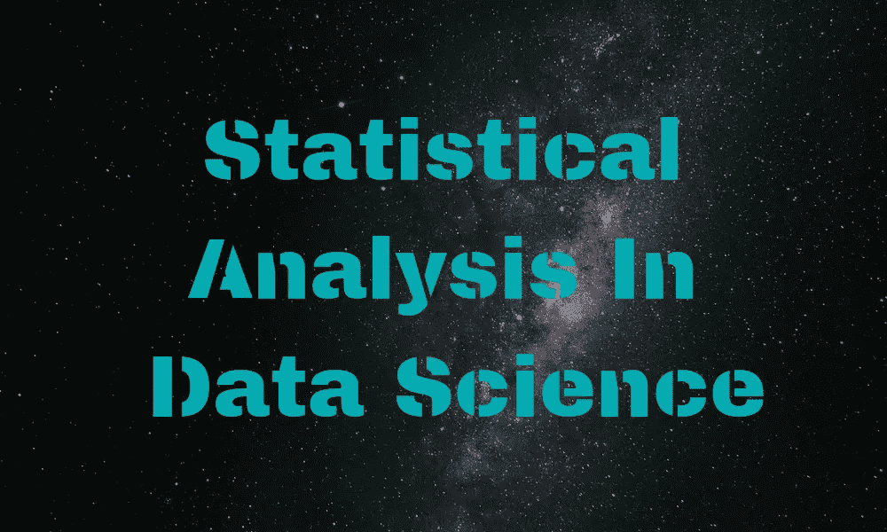

# 数据科学中的统计分析

> 原文：<https://medium.datadriveninvestor.com/statistical-analysis-in-data-science-631b55f893e9?source=collection_archive---------13----------------------->

在数据科学的管道中，你总是需要统计分析。在这篇文章中，我将分享一些关于统计分析的想法，以及数据科学家如何在建立机器学习模型的每个步骤中使用统计分析。

# 为什么要使用统计分析？

数据科学家在进行统计分析后提供的见解具有巨大的价值。它可以被证明是一家公司下一季度的利润，可以是一个大型机器学习项目的数据分析。

使用统计和统计数据，您可以以更复杂的方式探索、提取和可视化数据，以便更好地理解结果。

在数据科学领域，这个过程被称为 [**探索性数据分析**](https://towardsdatascience.com/exploratory-data-analysis-8fc1cb20fd15) 或简称 EDA。现在让我们看看数据科学家使用 EDA 和统计学的一些方法。

> [DDI 编辑推荐—数据科学与商业分析统计](http://go.datadriveninvestor.com/stats4ds/matf)

# 分析数据

事实是，对数据的分析要晚得多。在此之前，EDA 的过程经历了选择数据源、提取数据和清洗数据。但是，在检索到定义明确的数据之后，我们将把重点放在用法上。

分析数据的过程包含一点统计数学。通过寻找平均值、众数和中位数来分析和探索数据是这一阶段非常常见的程序。数据科学家和数据分析师在这方面花费了相当多的时间。经常有人说，清理和分析占用了整个机器学习项目时间的 80%。

此外，这有助于探索不同类型的数据。***‘但是什么类型的数据？’*** 你可能会问。在更高的层次上，这些可以被定义为分类数据和数值数据。

分类数据是以类别或标签的形式给出最终输出的数据。例如，在分析患者数据时，我们可能会将他们归类为患有某种疾病或未患有该疾病。然而，数字数据提供特定的数字进行分析，并根据分析做出预测。

# 可视化数据

数据分析完成后，数据科学家将继续对数据进行可视化处理。可视化是以曲线图和图表的形式。这些可以包括条形图，直方图，散点图，饼图等等。你可以在这里 阅读更多关于数据可视化 [**。**](https://guides.library.duke.edu/datavis/vis_types)

但是可视化有什么帮助呢？ 这里的答案可能相当简单。仅分析书面数据可能是有用的，但当我们将它与图片结合起来时，整个故事就变得清晰了。很多时候，分析师在进行数据可视化时会有“啊哈”的时刻，如果他们只专注于数值或分类分析，这种情况可能不会发生。

可用于数据可视化的工具数不胜数。行业专家广泛使用这些工具进行更好的可视化，从而做出更好的预测。一些知名的工具有[**【Matplotlib】**](https://matplotlib.org/)[**Seaborn**](https://seaborn.pydata.org/)[**gg plot**](https://pypi.org/project/ggplot/)[**Plotly**](https://plot.ly/python/)。还有很多。如果你想有一个深入的阅读，你可以访问这个 [**网站在这里**](https://www.fusioncharts.com/blog/best-python-data-visualization-libraries/) 。

在做项目时，数据可视化可能是进行下一步之前非常关键的一步，因为这提供了否则很容易错过的洞察力。

# 建立模型和进行预测

在数据科学家完成数据的分析和可视化之后，下一步涉及建立机器学习模型。该模型应该迎合项目的需要，并在整个过程中进行必要的优化。

在该过程中建立的模型应该具有最低阈值性能。这对于未来的预测非常重要。数据科学家可以判断哪些产品可以在未来几个月内推动公司销售走向盈利。不准确的模型和预测在这个阶段会被证明是非常昂贵的。

显然，故事并没有到此结束。未来会对模型进行许多调整，同时努力提高预测的准确率。从这里开始，可以收集新的数据并输入到模型中，使其更加健壮。

如果你喜欢这篇文章，想要一点不同的视角，那么你应该读读这篇文章，数据科学家使用统计学的 7 种方式。

别忘了分享并在评论区留下你的想法。此外，在 [**Twitter**](https://twitter.com/SovitRath5) 上关注我，定期更新我的帖子。还有，你可以一直 [**把**](https://debuggercafe.com/contact-us/) 跟我 [**这里**](https://debuggercafe.com/contact-us/) 。

标签:[数据分析](https://debuggercafe.com/tag/data-analytics/)，[数据科学](https://debuggercafe.com/tag/data-science/)，[机器学习](https://debuggercafe.com/tag/machine-learning/)，[统计分析](https://debuggercafe.com/tag/statistical-analysis/)

*原载于 2019 年 2 月 24 日*[*debuggercafe.com*](https://debuggercafe.com/statistical-analysis-data-science/)*。*