# 商业分析统计，参考

> 原文：<https://medium.datadriveninvestor.com/statistics-for-business-analytics-a-reference-6836d354c5a2?source=collection_archive---------31----------------------->

本文总结了基里尔·叶列缅科主持的 Udemy 课程《商业分析统计学 A-Z》中的公式和例子。它不是为了让你深入研究这些理论，而是作为参考。

本文涵盖的主题:

*   分布
*   中心极限定理
*   z 检验
*   t 检验
*   假设检验和统计显著性
*   单尾和双尾检验

如果你想更深入地钻研理论，这里有一个课程链接。

# 分布

## 连续值与离散值

一个**连续变量**可以取无穷多个不可数的值。例如身高、体重、长度、时间

一个**离散变量**在一个特定的实数值范围内，对于该变量允许取的范围内的任何值，都有一个正的最小距离到最近的另一个允许值。例如物品数量、骰子结果、鞋码。

来源:[维基百科](https://en.wikipedia.org/wiki/Continuous_or_discrete_variable)

## 分布类型

在离散分布中，值属于某个类别或组。有可能计算出某个值出现在特定类别中的概率。

连续分布由包含样本/总体中所有值的直线表示。不可能计算某个值的概率。相反，我们必须计算某个值属于某个区域的概率。

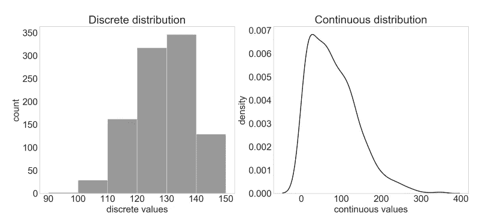

Distribution types

## 正态分布

正态分布也被称为**高斯分布**或**钟形曲线**(尽管还有许多其他分布也采用钟形)。

Normal distribution

图片来源:[维基百科](https://en.wikipedia.org/wiki/Normal_distribution)

## 歪斜

偏斜度是对分布中数值分布的不对称性的度量。偏斜度可以是正的，也可以是负的。左偏斜分布在其尾部(分布的左侧)具有异常值，而右偏斜分布在其分布的右侧具有异常值。

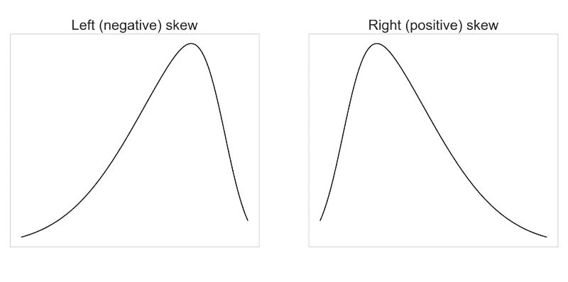

Skewness

## 平均值、中间值、众数

给定以下值的分布:

[2, 2, 3, 3, 4, 5, 6, 7, 7, 8, 8, 8, 8, 9, 10]

**Mean** value 是所有值之和的平均值(=上例中的 6)。

**中值**是排序分布指数的中间值(=上例中的 7)。索引位置 8 处的值，因为分布的大小是 15)。如果分布中有偶数个值，则中值是两个最中间值的平均值。

**模式**是最常见的值(=上例中的 8)。

图片来源: [Stackexchange](https://stats.stackexchange.com/questions/326304/in-a-given-set-of-numbers-can-there-be-more-than-half-above-mean-median-or-mode)

# 中心极限定理

## 人口和样本

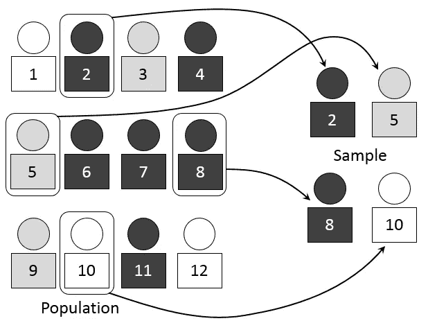

图片来源:[维基百科](https://en.wikipedia.org/wiki/Sample_(statistics))

**人口参数**

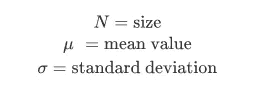

**样本统计**

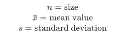

## 中心极限定理

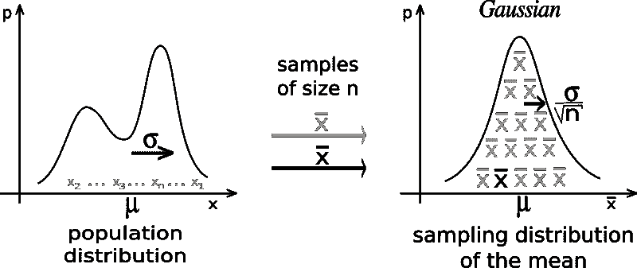

图片来源:[维基百科](https://en.wikipedia.org/wiki/Central_limit_theorem)

**采样分布**

抽样分布的标准偏差为

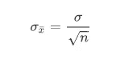

在哪里

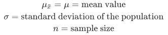

# z 分数

**一个样品**

给定一个 x 值，就可以计算出 Z 值

在哪里

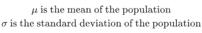

**样本分配**

给定平均值 x

在哪里

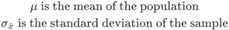

**Z 工作台**

[链接到 Z 工作台](http://users.stat.ufl.edu/%7Eathienit/Tables/Ztable.pdf)

**示例**

你是一名业务分析师，在一家快递服务公司工作。

一个商业客户要求将一大批货物从丹佛紧急运送到盐湖城。当被问及货物的重量时，他们无法提供准确的重量，但他们指出总共有 36 箱。

根据之前与该客户的合作经验，您知道这种类型的货物遵循 72 磅的平均值和标准差的分布。戴夫。三磅重。

你目前在丹佛拥有的唯一一架飞机是塞斯纳 208B 大篷车，最大载重量为 2630 磅。

根据这些信息，所有货物能够安全装上飞机并运输的可能性有多大？

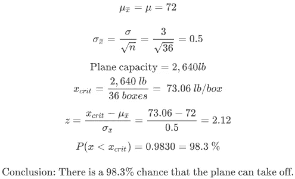

# 假设检验和统计显著性

## 假设检验

1.  陈述零假设 H0(当前状态)。
2.  陈述另一个假设，H1。
3.  计算 z 值
4.  根据 z 得分检查 P 值
5.  给定一定的置信水平(通常为 95%)，要么拒绝零假设，要么断定没有足够的证据拒绝零假设。

**示例**

2015 年，千禧一代带着性病每周看 26.5 个小时的电视。戴夫。10 个小时。今天你调查了 50 名千禧一代，他们每周看 24 小时电视。参数降低了吗？

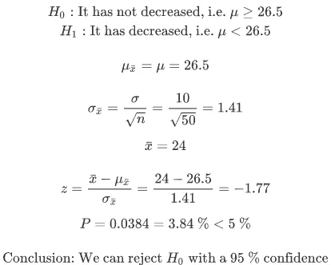

## 拒绝区域

我们可以定义拒绝区域，并将计算的 z 值与 P 临界的 z 值进行比较，而不是检查某个 z 值的 P 值是否低于/高于选定的置信水平。

**例子**

在上例中，值-1.77 小于-1.65，这意味着我们的值在剔除区域内。**注意**如果 z 分数为正，则它必须高于 z 临界值，以便该值在剔除区域内。

**常见拒绝区域值**

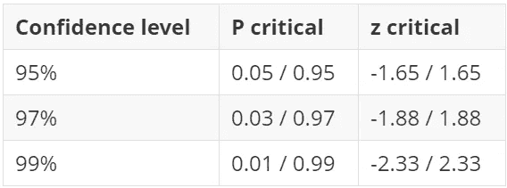

# 学生的 t 分布

t 分布可以代替正态分布用于更小的数据集(样本大小< 30). The caveat is that it has heavier tails.

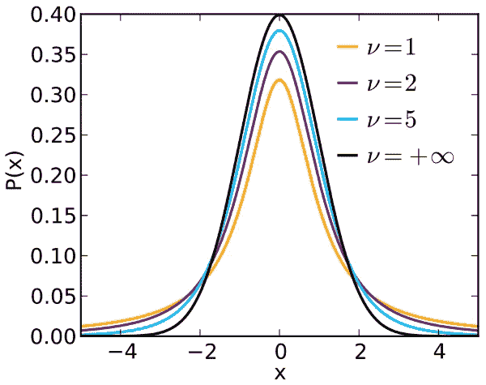

Image source: [维基百科](https://en.wikipedia.org/wiki/Student%27s_t-distribution)

## t 检验

t 检验可用于样本量小于 30 的情况。如果样本量大于该值，最好依靠 Z 检验计算。

使用以下公式计算 t 值。

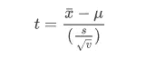

在哪里

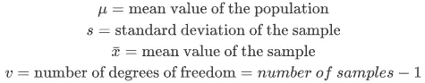

根据置信水平、自由度数量以及测试是单尾还是双尾，在 t 表中查找 t 临界值。如同剔除区域一样，将 t 临界值与计算的 t 值进行比较。

**t 表**

[链接到测试表](http://www.sjsu.edu/faculty/gerstman/StatPrimer/t-table.pdf)

**示例**

建议每天走一万步才健康。你想知道一般美国人是否符合这一建议。您随机调查了 10 个人，询问他们平均每天走多少步，得到了以下回答:

7900
8200
11350
10150
8200
9600
6950
6200
8950
8450

很明显，在您的样本中，受访者平均走了不到 10，000 步。但是你能推断出整个美国人口也是如此吗？

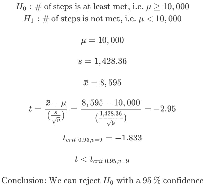

## 单尾和双尾检验

单尾检验用于检验一个方向的统计显著性，双尾检验用于检验两个方向的统计显著性。双尾测试将测试平均值是否显著大于 *x* 以及平均值是否显著小于 *x* 。

请注意双尾检验的假设差异。

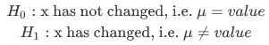