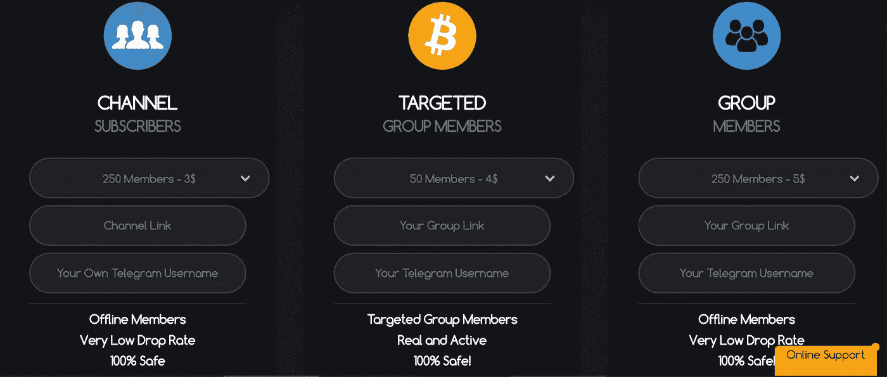

# 在虚假的秘密评论中保持真实

> 原文：<https://medium.datadriveninvestor.com/staying-real-in-a-world-of-fake-crypto-reviews-c64238a61fd6?source=collection_archive---------5----------------------->

Crypto 迫使营销重新发明。自从脸书和谷歌禁止推广 ico 和加密货币后，人们开始有了创造力。如果不能访问世界上最大的用户数据库，你怎么能从零开始发展一个社区呢？多元化是答案。企业家们意识到一个渠道不足以做大，所以每个人都开始追逐不同的利基市场和受众。

上市网站、加密影响、专家评审平台的数量和收入都在飞速增长。从没有营销工具，到拥有太多营销工具。建立一个上市网站不是一件小事，因为一个人应该跟踪 ico，分析它们，跟踪它们，并对它们进行评级。显然，将这些新渠道货币化是拥有一个有效系统的关键。尽管从商业的角度来看这很好，但是我们已经到了几乎不可能区分合法的评审评估和付费的评审评估的地步。此外，ICO(讽刺的是，其目的是筹集资金)的启动成本已经变得非常高，很少有人能够负担得起。

# 专家呢？

这些人进行了一项实验，以确定购买专家评分有多容易。对于我们这些曾经相信那些所谓专家的人来说，他们的结果相当可怕。人们应该非常怀疑那些自称为密码市场的*专家*的人。一些基本的尽职调查可能表明，这些人真的没有任何东西来支持他们在该领域的经验。作为一个快速实验，你可以去 icobench.com，随机挑选一些评审 ico 的专家，看看他们给出了多少个> 4 星评审。虽然有些人更小心，并试图至少使评论看起来合法，但有些人对给每个人 5 星评论没有问题。

# 顾问。必须的？

另一个问题与加密/区块链顾问有关。理论上，顾问是在该领域具有某种专业知识的人，他可以帮助项目开发人员创建一个合理的令牌，给出有用的见解和关键的反馈。好的顾问通常是律师、经济学家或在密码市场有经验的商人。因为他们的名声在他们之前，他们的参与给了你的项目更高层次的信心。然而，现在的顾问仅仅是专家的名字，他们会在自己的网站上列出来以获得某种信任。将他们的名字放在你的网站上的成本取决于*专家*在社区中的认可度。那些团队只来自一个国家的 ICOs 有时会觉得有必要在他们的网站上添加一些外国名字，因为这给了他们更多的可信度。然而，大多数时候这些实践并不能真正帮助项目或投资者。现在，请注意，业内有人可以提供真正的建议，尽管通常情况下，只要他们的名字出现在 ICO 的网站上，他们的反馈并不重要。更多关于这个[这里](https://www.crowdfundinsider.com/2018/04/132429-the-sometimes-dubious-practice-of-ico-advisors/)。

# 电报组。关于虚假社区

在线社区绝对是 ico 的圣杯。电报组是任何推出加密服务或产品的人的关键。在投资一个项目之前，每个人都希望看到围绕这个项目的大肆宣传。如果这么多人喜欢，那一定很棒吧？可悲的是，这些大型团体往往不是真正的社区。用很少的钱就可以买到掉线率很低的电报用户。空投也被用来制造宣传，吸引用户加入 ICO 群体，目的是利用他们。然而，这些用户中的 99.9%永远不会参与、互动或投资你的项目。所以，我不禁想知道这到底有什么意义？！

# 解决方法是什么？

我们并不天真地认为评论都是合法的，社区是真实的，一切都是透明的。然后，非货币化的审查系统是不可持续的。没人在密码行业做慈善。我们实际上认为货币化是这里的关键。

知识和时间可以货币化，同时评论可以保持诚实和透明。区块链可以帮助我们开发这样的平台，这些平台可以为我们工作，而不是相反。那么，有什么比它的表现更能说明一个 ICO 的成功呢？如果能够知道项目领导人是否完成了他们的里程碑，他们会用这笔钱做什么，这实际上是一个比虚假的专家评论和虚假的社区更好的绩效指标。这正是我们将提供给你的！敬请期待！