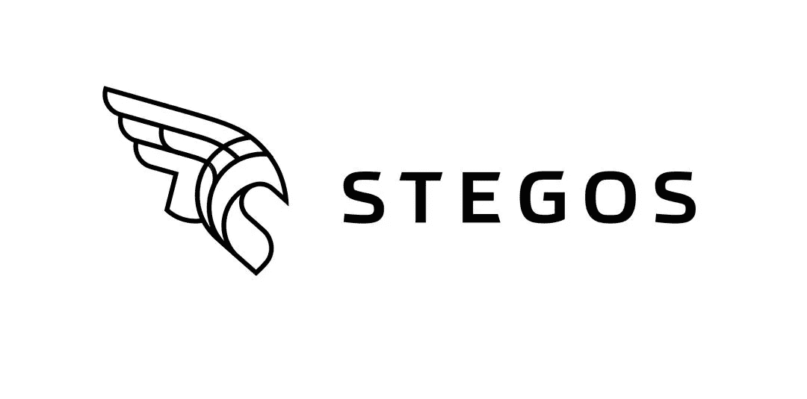

# 隐写隐私平台

> 原文：<https://medium.datadriveninvestor.com/stegos-privacy-platform-fb1bf6607f7f?source=collection_archive---------11----------------------->

> **隐私应用平台**
> 
> **Stegos 为构建去中心化的移动应用提供了绝对私密和安全的基础**

# 为什么需要我们，为谁需要我们？

主要问题是用户个人信息的不可靠性和易访问性，因此使用各种 VPN 服务和数据加密服务是有意义的。

如果你认为没有人需要你，那你就错了。大多数人不重视个人数据的保护。而当有人占有你的个人信息时，不难猜到你在冒什么风险。访问各种服务的帐户、银行卡信息、您和您所爱的人的照片等等。而你提供给攻击者的这一切。

 [## 区块链驱动的社交媒体 2.0 能取代脸书吗？数据驱动的投资者

### 到 2021 年，活跃的社交媒体用户的数量预计将达到令人难以置信的水平，超过三分之一的…

www.datadriveninvestor.com](https://www.datadriveninvestor.com/2019/03/20/could-blockchain-powered-social-media-2-0-dethrone-facebook/) 

# 威胁的类型

**《中间的人》**

事实上，这个名字完美地反映了本质——在你的浏览器和网站之间是一个想要赚钱的攻击者。这个恶棍可能是你的互联网提供商的系统管理员，走廊上的邻居，入侵了阁楼上的设备，你所在酒店的 IT 员工，甚至是你的移动运营商。

**《邪恶双胞胎》**

W 当有人提出一个已经在你手机上的同名 WiFi 点，比如:麦当劳或者免费。之后，您的手机会自动连接到该网络，流量会通过攻击者的设备。WiFi 网络的搜索是这样设计的，设备连接到信号最强的接入点，所以如果你去有免费接入点的地铁，旁边会有一个人拿着开着 WI-FI 的手机，那么你的手机就会连接到小人的手机。

这些只是众多例子中的几个。所有这些类型的剥削都被设计成让你几周甚至几个月都不会注意到它们，继续工作并给别人带来利润，有时你自己会亏损。有时，攻击者会将您的计算机清除掉其他人的病毒，只留下自己的病毒，这样您的计算机就不会太慢，也不会引起怀疑。所以，不要以为黑你对谁都没好处。你比任何一家银行都容易破解得多，如果攻击者用大量的人来做这件事，那么收益会很大，风险最小。

# 什么是隐写？

Stegos Privacy Platform (Stegos)结合了独特的区块链和令牌设计，实现了第一种完全私有、安全、可还原和环境可持续的加密货币。Stegos 是完全可扩展和可删改的，确保链始终保持紧凑而不损害信任。这使得 Stegos 成为世界上第一个除支付交易外，还提供安全和机密数据存储和传输的公共区块链。

**该平台的主要优势:**

*   机密
*   可量测性
*   难以捉摸的
*   小而快
*   移动采矿

一个基于区块链的私有分散解决方案是一个更好的方法来保护你的私有信息的安全并与你信任的人分享。这就是为什么 Stegos 项目是一个非常好的解决方案，可以让你保持你的隐私。

T 隐写术和其他项目的主要区别在于使用了一致的 GPO。游戏化的利害关系证明(gPoS)共识标准的利害关系证明共识可能会使许多具有较小利害关系的用户缺乏积极性。为了解决这一问题，Stegos 采用了游戏化赌注证明(GPO ),之所以这么说，是因为每个运行了一定时间的验证器都有机会获得随机的验证器服务奖励，而不管其赌注大小如何 1。为此，来自每个区块的奖励的一部分被添加到服务奖励池中，该奖励池继续增长，直到在基于可验证的分布式随机性的正在进行的加密抽奖中选出获胜者。因为智能手机节点可以拥有完整的验证功能，任何人都可以从自己的口袋里赚取令牌。

gPOS 共识的实现表明开发者对所有用户表现出了极大的忠诚。这是一个非常周到的步骤来推广这个平台。很好的是，每个用户都可以因为下注少量代币而获得奖励。

# 结论

也许我重复一下，但是在众多的孪生项目中，很高兴看到一个真正原创的项目，它结合了 VPN 服务的基本功能和区块链技术的创新。我认为 gPOS 的实现是这个项目的主要特征之一。我认为这个项目很有前途。

小心点，保持隐私。