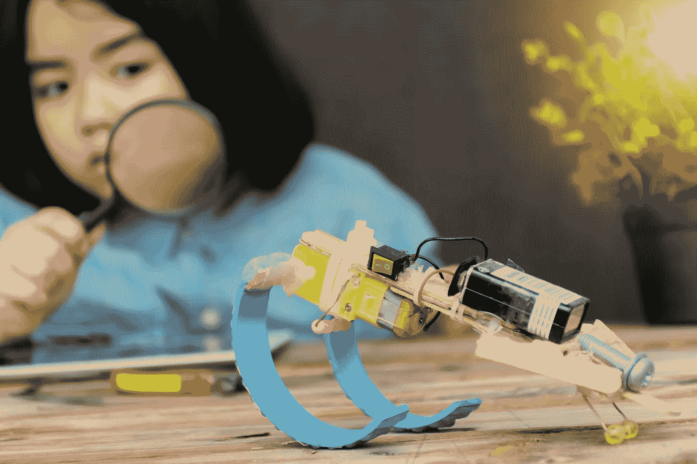
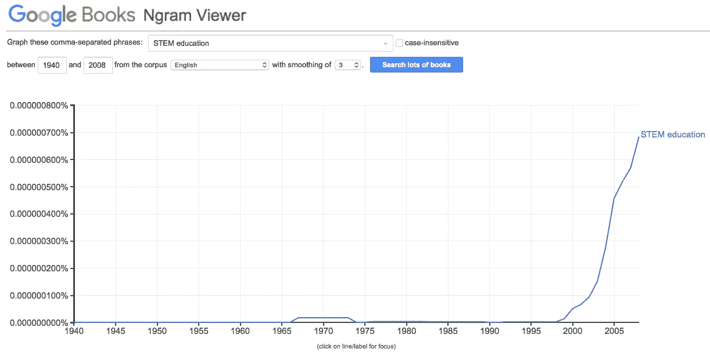
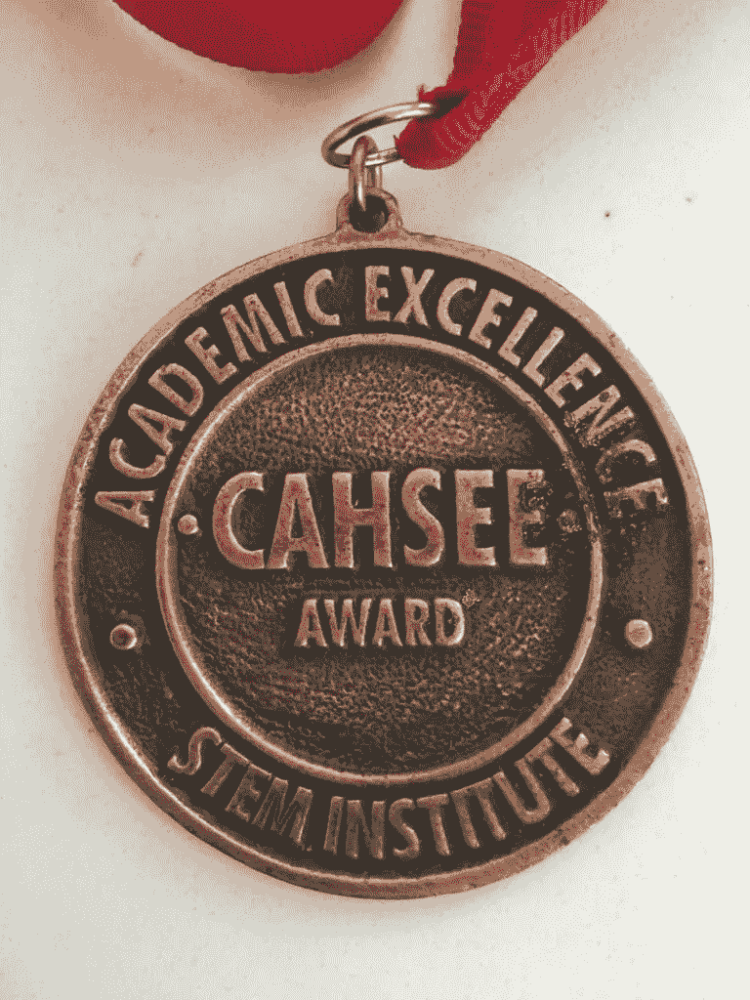
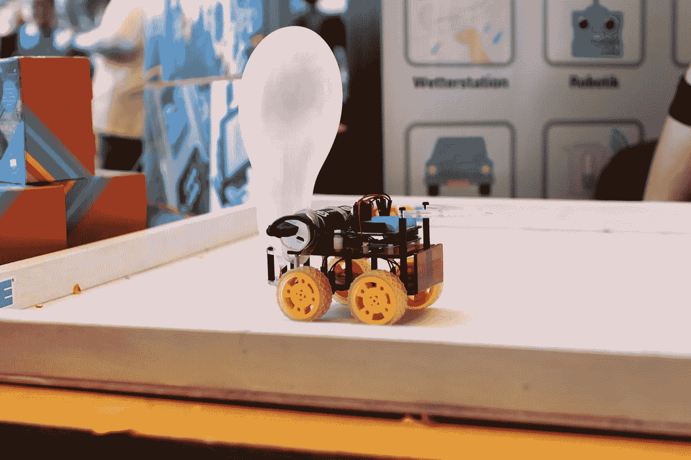

# STEM 教育失去的十年和未来

> 原文：<https://medium.datadriveninvestor.com/stem-educations-lost-decade-and-tenor-3f741bd728e6?source=collection_archive---------2----------------------->

## 对一场流行的全球运动的当代洞察

Image: Getty ID# 180411745 / Puzzle Piece Timeline

*作者:* [*安德鲁·b·劳普*](https://medium.com/u/d8c8d333927a?source=post_page---------------------------)*/*[*@ stem CEO*](https://twitter.com/stemceo)

用经常被滥用的比喻来说，TEM 教育就像种一棵想象中的树。我们播下种子，希望儿童和成年人有一天能收获强大的体验式学习机会的好处，这些机会不仅传授事实，还培养一种思维方式、批判性思维和解决问题的技能。但是并不是所有的树都是直接由种子长成的。取而代之的是，我们把树苗从花盆中取出，硬化，然后放到地里。

Image: Shutterstock ID# 1376257520 / Robot & Plant Experiment

如果你曾经这样做过，你就会看到一个纠缠在一起的根球是多么的微妙。让植物茁壮成长的一部分工作包括照料其根部，以促进其茁壮成长。对于 STEM 教育，我认为进一步研究其历史根源以了解我们从何而来非常重要——这将有助于为后代巩固这项运动。

**定义词干**

我们过于宽泛地谈论 STEM 的重要性，所以并不是每个人都有相同的定义——或者甚至确信它可以被定义——这并不奇怪。老师和家长也很焦虑，他们被这种抽象的主观性和主题的难度压垮了，经常不知道从哪里开始。

 [## 教科书行业如何最终被颠覆，并将继续改变|数据驱动…

### 就此而言，教科书产业在美国乃至全世界都有着悠久的历史。事实上，他们已经…

www.datadriveninvestor.com](https://www.datadriveninvestor.com/2018/09/25/how-the-textbook-industry-has-finally-been-disrupted-and-will-continue-to-change/) 

这种焦虑的一个原因是 STEM 无处不在，许多人忘记了在上下文中使用它。现在，它被作为一个笼统的术语来描述除教育以外的垂直行业，或者仅仅是它与之共享字母的主题——例如， [STEM careers](https://www.forbes.com/sites/forbestechcouncil/2018/11/08/moving-target-preparing-todays-minds-for-the-stem-jobs-of-tomorrow/#78d85669e147) 或 [STEM toys](https://www.forbes.com/sites/forbestechcouncil/2018/05/29/the-rise-of-the-stem-toy/) 。所以，让我们的定义保持清晰和简洁，集中在词干之后的单词。在这种情况下，可以定义如下:

> " STEM 教育是科学、技术、工程和数学的教与学."

我修改了一个[的流行定义](https://www.stem.org/cm/dpl/downloads/content/69/R42642.pdf)来附加:

> “它包括正规和非正规环境中从学前到博士后的所有发展水平的教学和成人教育活动，这已发展成为促进和平和人类进步的国际运动。”

Image: Shutterstock ID# 1233970432 / A Closer Look

当然，那些实践它的人应该注意他们社区现有的计划和文化差异。通过这种方式，我们可以定义 STEM 教育，同时对其进行调整以满足其受益者的需求和期望。

**STEM 的起源**

那么，STEM 是什么时候正式开始出现在印刷品上的呢？《大英百科全书》认为国家科学基金会(NSF)在 2001 年创造了这个术语。该组织在 21 世纪初从不那么巧妙和机械的 SMET 转向 STEM，直到那时他们一直在短暂地使用它来谈论相同的主题。

但这还不是故事的全部。对谷歌的 NGRAM 和谷歌学术在出版物中具体提及“STEM 教育”的研究显示，它始于 20 世纪 90 年代初。

Figure 1\. Google Books. “STEM Education” Keyword Data ©2019 Google. Retrieved July 23rd, 2019

进一步的研究表明，在 1996 年，出版物*西班牙裔工程师* [发表了一篇关于“STEM 学院”的文章](https://books.google.com/books?id=kqnRETS9FWwC&lpg=PA1&pg=PA10#v=onepage&q&f=false)，该学院旨在通过高级大学课程向高中生介绍严格的 STEM 教育。该项目由[Charles e . Vela](http://www.cahsee.org/about/founder.asp.htm)博士开发，他是科学和工程教育促进拉美裔中心(CAHSEE)的创始人，在 1992-1993 年期间由 NASA 和拉美裔专业工程师协会(SHPE) [赞助。](https://www.cahsee.org/news/040412best.asp.htm)

Image: Dr. Charles E. Vela (CAHSEE) / 1993 STEM Institute Achievement Medal

当然，这种规模的教育革命不会在没有很多人支持的情况下出现。根据他早期的互联网传记页面，[莫顿·m·斯特恩海姆](https://www.umassk12.net/mort/bio.html)于 1994 年创建了马萨诸塞大学阿姆赫斯特分校 [STEM 教育学院](http://k12s.phast.umass.edu/stem/stem.html)，该学院管理 STEM 教师教育合作项目( [STEMTEC](http://k12s.phast.umass.edu/~stemtec/) )。同时，[细菌学家丽塔·考威尔](https://www.nsf.gov/news/speeches/colwell/colwell_bio.jsp)博士，作为国家科学基金会的第一位女性主任，资助了 STEM 倡议，同时以跨机构的身份使用这个术语——与她的同事朱迪思·拉马利博士一起。他们还有一个早期的盟友，密歇根州众议员弗农·埃勒斯，他在 2005 年与前众议员马克·尤德尔共同创立了 STEM 教育核心小组。埃勒斯是科学的热情支持者，他帮助将 STEM 教育引入公众意识。

**什么梗不是**

现在，我们对它的历史有了稍微清晰的了解，也有了更好的方法来定义它，是时候理解什么是 STEM 了。不管一些营销活动会让你相信什么，这不是一个聪明的玩具机器人或一个巧妙包装的编码课程。没有一家科技公司、风险投资公司或个人——无论多么富有、有影响力或出于好意——拥有 STEM。不能买卖。

Image: Shutterstock ID# 1104301313 / Balloon-Powered, STEM Education Aid

> 这是因为它是一种精神状态，最终是一个超越社会的社会公正问题，有可能造福于世界各地的每一个人。我们考虑用于 STEM 教学和学习的任何产品都应该有助于更高层次的思考。小工具服务于这种心态，但对它的深刻理解不会围绕一次购买而形成。

这一点尤为重要，因为有人试图将 STEM 教育推向一个狭窄的[科目集](http://www.awnow.org/2016/05/09/stem-is-greater-than-programming-and-robotics/)并掌握在少数人手中，远离创造性的跨学科研究和使该运动如此丰富的利他主义意图。STEM 中的包容性要求我们不仅关注代表性不足的群体，还必须关注那些没有游说资金支持的鲜为人知的主题。

打个比方，这场运动的真正倡导者应该扮演树木学家的角色。一旦树根被浇了水，每个生长中的树枝都得到了适当的照顾，这棵树将会在未来的岁月里继续茁壮成长。通过确保每个人都觉得自己可以成为 STEM 的一部分，这种全球性的教育现象具有无限的潜力。

Image: Shutterstock ID# 123174823 / Educator Teaching Students Under A Tree

本文原载于 2019 年 7 月 25 日的*福布斯社区之声*。

[安德鲁·b·劳普](https://medium.com/u/d8c8d333927a?source=post_page---------------------------)是创始人/执行董事 [@stemdotorg](https://twitter.com/stemdotorg) 。*“通过健全的政策&实践使科学、技术、工程和数学(STEM)教育民主化……”*