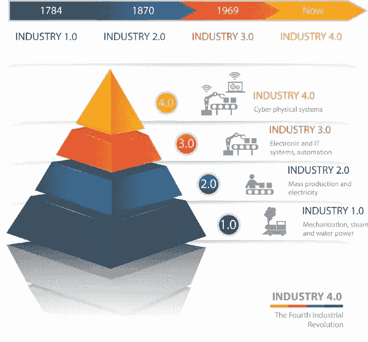
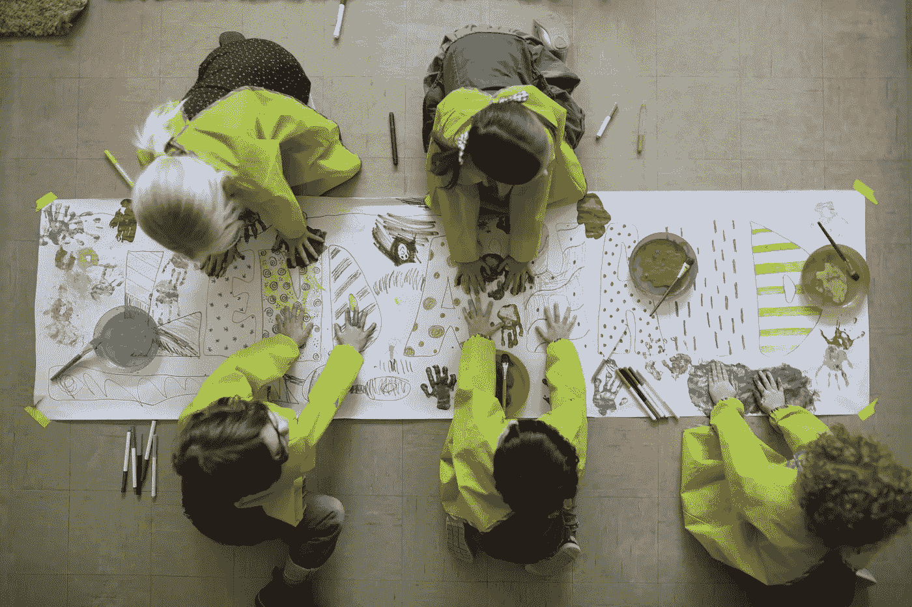
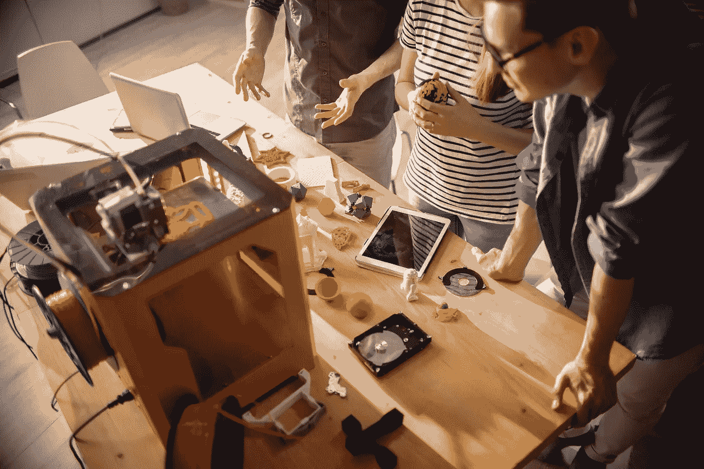
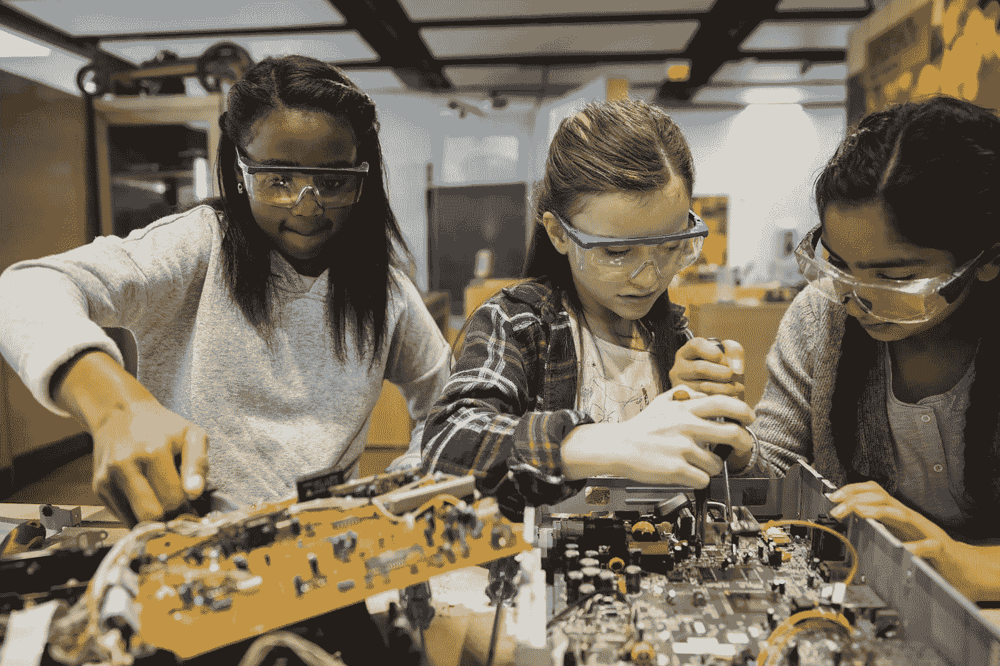
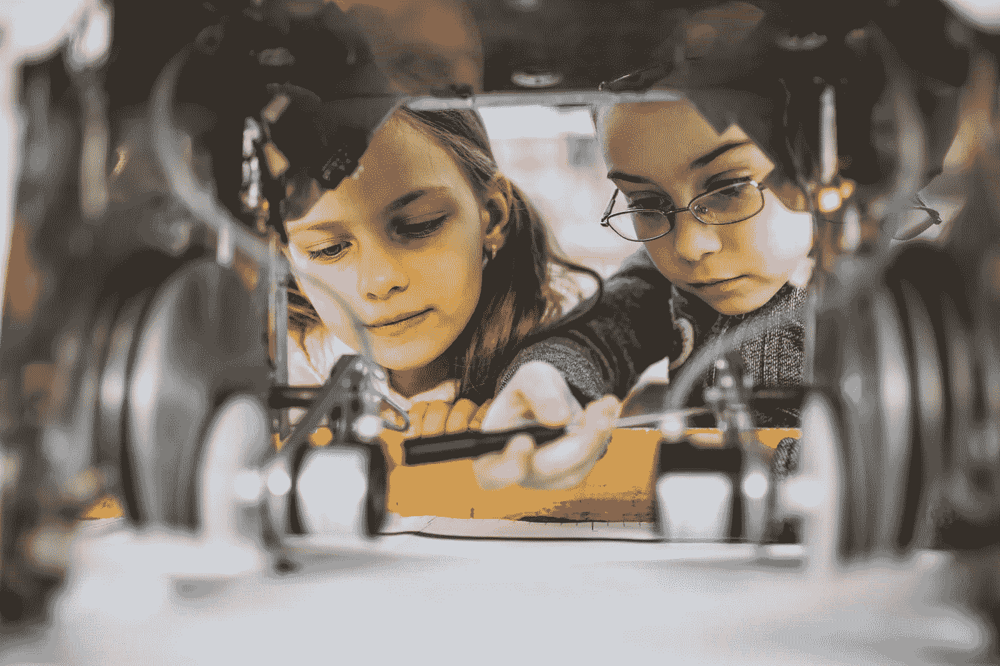

# STEMerica:咆哮着进入 21 世纪 20 年代

> 原文：<https://medium.datadriveninvestor.com/stemerica-roaring-into-the-2020s-517414fd8ba7?source=collection_archive---------5----------------------->

## 未来十年的教育见解和趋势

Image: Getty ID# 587503425 / Boy Roaring At Lion

*作者:* [*安德鲁·b·劳普*](https://medium.com/u/d8c8d333927a?source=post_page-----bc7b73a1ac7b----------------------)*/*[*@ stem CEO*](https://twitter.com/stemceo)

*作者注:本文是对过去 15 个月谷歌最具指数化的 STEM 趋势特征之一的跟进。*[*“2019 年 STEM 教育的驱动力是什么？”*](https://medium.com/datadriveninvestor/whats-driving-stem-education-in-2019-bc7b73a1ac7b) [*数据驱动投资人*](https://medium.com/u/de42e9af1960?source=post_page-----517414fd8ba7--------------------------------)*&*[*中参谋*](https://medium.com/u/a32c340ea342?source=post_page-----517414fd8ba7--------------------------------) *，感谢* [*认可我的作品*](https://medium.com/@stemceo/medium-top-writer-eeec8b8f9b32) *以及所有花时间阅读它的人。*

100 年前，喧嚣的 20 年代将美国人推进了显著繁荣的十年。随着装配线简化了涌入美国城市的人们所购买的商品的大规模生产，技术进步引领了一场重大的经济繁荣。媒体蓬勃发展，报纸和广播针对有可支配收入的人群提供了大量广告。节省时间的家庭发明也为休闲活动创造了空间，因此这十年是追求幸福的十年，也是强劲经济的十年。

Figure 1: Getty ID# 978943568 / Fourth Industrial Revolution

科学和技术促进了繁荣。从通信和运输到家用商品，那个时代的发明家们兑现了对更美好明天的承诺。民众接受了这一点，经济增长开始运行。并非 20 世纪 20 年代的一切都是绝对的幸事，但那个时代的成就引出了一个问题:美国如何重新安排其科学和技术的优先次序，以投身于第四次工业革命？

关键最终在于我们如何对待 STEM 教育并投资于后代。科学、技术、工程和数学的教学对美国在未来十年的全球竞争至关重要。为了培养未来的发明家、企业家和领导者，我们必须致力于改革 STEM 教育。

 [## 教科书行业如何最终被颠覆，并将继续改变|数据驱动…

### 就此而言，教科书产业在美国乃至全世界都有着悠久的历史。事实上，他们已经…

www.datadriveninvestor.com](https://www.datadriveninvestor.com/2018/09/25/how-the-textbook-industry-has-finally-been-disrupted-and-will-continue-to-change/) 

# 前进的道路:研究人员在说什么

## 1.对“干”的更深理解

STEM 教育发生在人生的所有阶段，包括学校内外。虽然今天 STEM 的概念经常被视为课程、玩具和教学产品形式的商品，但事实是[该运动的起源在于教育家](https://medium.com/datadriveninvestor/stem-educations-lost-decade-and-tenor-3f741bd728e6)，他们倡导包容性，并希望所有人都能在这些学科中获得深入、有意义的学习。审视这些历史根源，以了解我们从何而来，并为后代巩固这场运动，这一点很重要。

Image: Getty ID# 705001961 / Students Building STEM Models In Library

## 2.让孩子成为孩子，而不是应试者

[根据 2015 年 NEA 的一项调查](http://neatoday.org/2016/02/18/standardized-tests-not-developmentally-appropriate/)，70%的教师认为他们学生的标准化考试不适合他们的发展。由于不让一个孩子掉队的强制性测试，学生们花了更多的时间准备高风险的考试，这些考试试图通过狭窄形式的提问来评估真正的学习。值得注意的是，在芬兰——世界上最好的教育体系之一——孩子们不参加标准化考试，表现更好。是时候采用更全面的方法了。

Image: Getty ID# 1136461809 / Student Test Taker

## 3.尽早并经常引入 STEM

伦敦大学国王学院报告称，大多数孩子对科学的看法是在他们 14 岁时形成的；或者到中学结束的时候。如果我们要激发对科学的热爱、对数学的信心以及追求 STEM 职业的渴望，那么在学生年轻的时候就应该这样做。实施应该采取真实游戏和探索的形式，而不是死记硬背。当学生用积木和其他操作工具进行实验时，鼓励他们质疑和尝试新的方法形成了科学思维的基础。

## 4.在金钱和时间上给老师更好的报酬

整整 18%的 T2 教师从事额外的工作来使收支平衡。他们也是[以有史以来最快的速度离开这个行业，而且他们不容易被取代。STEM 教师尤其难找，因为技术专业的薪酬通常远高于教师的起薪。为了吸引和留住有积极性的教师，他们需要有竞争力的工资。他们还需要额外的时间向导师学习，导师不仅是学科专家，也是课堂管理和教学的大师。](https://www.newsweek.com/public-school-employees-leaving-jobs-record-rate-1274121)

Image: Getty ID# 508065709 / Smiling STEM Teacher

## 5.把图书馆放在学习的中心

学校图书馆不再仅仅是为了书。在她的工作中，Azedah Jamalian 发现 61%的中学图书馆还为学生提供了创客空间，让他们进行实验和建立想法。学校图书馆员正在努力消除他们在安静的空间工作的想法，而是将图书馆转变为学习中心，学生和教师不仅可以在那里找到信息，还可以用它来共同解决问题。这就是 STEM 的本质，它应该处于学校社区的中心。

Image: Getty ID# 1137620167 / Student And Teacher Discussing DNA Model In Library

## 6.支持艺术和人文学科

STEM 经常被定位在艺术和人文学科的对立面。虽然资金确实有限，但争论一个主题比另一个更有价值会适得其反。科学思维也是创造性思维，STEM 领域受益于设计、心理学和许多其他学科的专业知识。在为所有学生倡导更好的资助和更强的实践时，STEM 和人文教师应该是盟友，而不是对手。

Image: Getty ID# 944747626 / Students Painting Together

## 7.终身教育，不仅仅是大学教育

总的来说，在过去的 20 年里，[大学入学率大幅上升，从 1996 年到 2006 年上升了 24%，从 2006 年到 2016 年又上升了 12%。学生贷款债务也急剧增加，债务人的数量在过去 15 年翻了一番](https://nces.ed.gov/fastfacts/display.asp?id=98)。父母、老师和整个文化都在推动孩子上四年大学，但这并不是每个人的正确选择。强大的 STEM 教育还应包括在贸易、医疗支持工作等领域取得成功所需的实践学习。

Image: Getty ID# 886646974 / Students Using 3D Printer In Makerspace

## 8.致力于融入课堂

优秀的 STEM 教育通常被视为一种丰富的活动。的确如此，但这并不意味着只有优等生才值得学习。所有的学生，无论背景或能力如何，都应该有机会接受满足他们需求的 STEM 教育。这意味着为学习差异提供便利，并确保 STEM 项目为负担不起自带 iPads 上学的学生提供公平的技术获取途径。STEM 适合所有人。

Image: Getty ID# 554993405 / Girls Taking Apart Computers

## 9.结束武断的学校认证

K-12 学校认证系统已经过时，而且它们[与责任标准](https://www.educationnext.org/k-12-accreditations-next-move-storied-guarantee-looks-to-accountability-2-0/)不一致。全国有几个认证委员会，他们的标准和程序并不总是透明的。越来越多的研究发现，当前形式的这种做法既昂贵又无助于推动学校提高教育成果。相反，是时候将资金集中在已经证明效果的项目上，并使用 AI /大数据来更好地了解学校。

## 10.注重质量，而不是数量

中国和印度拥有 STEM 学位的大学毕业生数量远远超过美国。这很大程度上是因为人口，所以不可能在数量上竞争。然而，我们可以培养出质量更好、技能更高的工人，他们只是在自己的工作中做得最好。为了确保美国的 STEM 专业人员是世界上最受欢迎的，我们需要提供从幼儿园到大学的世界级教育。

Image: Getty ID# 533978041 / Boy Using A Tablet In A Dark Room

20 世纪 20 年代的经济繁荣是政府支持商业的政策、宽松的信贷和令人难以置信的技术进步同时发生的结果。随着我们迅速接近即将到来的十年，美国发现自己再次处于新时代的风口浪尖。自动化、人工智能和超级连通性都准备以不可预测的方式改变经济。

美国会继续领先吗？有了 STEM 领域受过良好教育的领导者，下一个十年将迎来新世纪的 20 年代。因此，明天的繁荣始于今天对美国家庭和教室中 STEM 教育的承诺。

Image: Getty ID# 945023608 / Two Girls Working On A Robot

*“促进 STEM 学习的第一种方法？停止不断的标准化考试”——这篇文章的迭代，最初于 2019 年 11 月 8 日在《新闻周刊》上发表，并于 2019 年 11 月 11 日更新为 Medium。*

[Andrew B. Raupp](https://medium.com/u/d8c8d333927a?source=post_page-----bc7b73a1ac7b----------------------) 是创始人/执行董事 [@stemdotorg](https://twitter.com/stemdotorg) 。*“通过健全的政策使科学、技术、工程和数学(STEM)教育民主化&实践……应用 STEM 更好地理解它”*