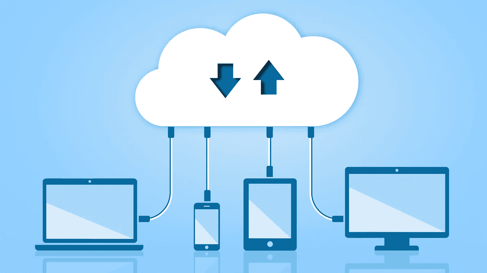

# 逐步云迁移清单

> 原文：<https://medium.datadriveninvestor.com/step-by-step-cloud-migration-checklist-4735b9456802?source=collection_archive---------0----------------------->

Image Credits: Shutterstock

Gartner 称，公司将 36%的 IT 支出投资于云服务。

高管们正在竞标云计算，并让投资量来说明他们期望的回报。这将云迁移推到了业务优先级列表的前端和中心。

但是[云迁移](https://www.servetel.in/blog/why-move-your-business-to-cloud/)不能通过魔杖实现。它要求企业在开始学习这门课程之前，充分准备好许多先决条件，并准备好基本要素。

为了让你更容易做到这一点，我整理了一份问题清单，你必须在冒险之前找到答案。

 [## 信息图:云之旅|数据驱动的投资者

### 聪明的企业领导者了解利用云的价值。随着数据存储需求的增长，他们已经…

www.datadriveninvestor.com](https://www.datadriveninvestor.com/2018/09/22/infographic-journey-to-the-clouds/) 

## 1.什么都要迁移？

## 2.使用哪种云架构？

## 3.选择哪家云服务提供商？

## 4.在这个过程中应该优先考虑什么？

## 5.如何测试迁移成功？

我们开始吧。

# 1.什么都要迁移？

并不是每个应用程序都要托管在云上。有些应用程序在本地服务器上运行效果最好。在您使用的大量应用程序中，找出需要云迁移的应用程序列表。

清楚地了解您在云上想要什么，开始您的迁移过程。为此，请根据以下参数评估应用程序，

-有哪些使用频率高、应用广泛的 app？

-应用程序的迁移过程有多复杂？

-应用程序是否需要重新设计，以便在云基础架构上实现更好的兼容性？如果是，列出它们。

-应用的合规性会干扰迁移吗？

-您的应用程序是否会收集无法存储在云中的敏感客户数据？

-您移动的每个应用程序的投资回报率是多少？

# 2.使用哪种云架构？

为您的企业选择合适的云架构至关重要。您应该根据您的业务需求权衡可用云架构(公共云、私有云和混合云)的利弊。

如果您正在运营一家员工数量有限的中小型公司，公共云是不二之选。然而，如果您领导着一个具有复杂的法规遵从性和安全标准的大型组织，并且希望完全控制您的基础架构和服务，那么请选择私有云。

混合模式适合介于两者之间的组织。他们可以选择将敏感数据或应用程序存储在私有云上。并将其他非敏感数据或应用转移到公共云。

# 3.选择哪家云服务提供商？

如果您正在进行云迁移，那么下一步就是选择合适的云服务提供商。在选择服务提供商时，许多因素都会发挥作用，

## 1.安全标准

不同的提供商遵循不同的安全机制来保护他们的应用程序和数据。访问云服务提供商的详细文档，了解他们如何实施安全性。

例如， [AWS](https://aws.amazon.com/security/) 和 [Google Cloud](https://cloud.google.com/security/) 已经在他们的网站上详细列出了他们的安全特性、集成、产品等等。获取这些文档并通读它们，以了解各种云服务提供商提供的安全性。

## 2.合规标准

如果您采用公共云基础架构，请确保选择符合行业合规标准的服务提供商。无论是[、GDPR](https://medium.com/@manishamishra0307/how-is-gdpr-affecting-cloud-service-providers-70e5fd44e933) 、PCI、HIPPA 还是任何其他行业合规性。一旦您的应用程序和数据托管在云上，确保符合所有相关的行业标准。

## 3.体系结构

下一个重要步骤是遵循易于实现并与您的工作流集成的架构。例如，如果你已经在使用谷歌套件，建议使用谷歌云。因为与 Azure 或其他云平台相比，集成过程将更加顺畅。

## 4.SLA

在比较云服务提供商时，服务水平协议(SLA)是一个需要考虑的重要因素。在确定服务提供商之前，请特别注意响应时间、数据可用性和停机时间指标。

## 5.支持

一旦完成迁移，您的业务将完全依赖于云基础架构的持续无缝可用性。在这种关键情况下，您必须仔细检查服务提供商的客户支持质量以及在危机时刻的可用性。确保所提供的支持易于获得，并且符合您的工作时间。

## 6.费用

云提供了一种按使用付费的模式。但是对于企业需求，成本可以根据您的使用情况按周、月或年进行四舍五入。例如， [AWS](https://aws.amazon.com/pricing/) 提供现收现付、预订的实例，并提供大额预付和批量折扣。

根据您的业务和客户需求评估提供商的定价模式，以做出最终决定。

# 4.如何在迁移过程中确定应用程序的优先级？

首先，确定您计划迁移的应用程序的业务重要性。如果应用程序对业务至关重要，那么降低它在迁移列表中的优先级。强烈建议首先迁移最不复杂的应用程序。

新基础设施的不确定性会对应用程序的运行产生不利影响。因此，优先迁移不太可能出错的应用程序。

第二个重要的分析—应用程序依赖性。概述相关应用程序及其与其他应用程序的连接。

具有大量依赖项的应用程序是最难迁移的，因此应该在未来阶段考虑。

第三，考虑只需要重新托管的应用程序或使用最少资源的应用程序，如低存储、计算、网络带宽等。需要重新设计或构建的应用程序应该推到最后。

# 5.如何测试迁移成功？

测试可能会很棘手和复杂。然而，不可否认的是，这对于成功的迁移非常重要。不管您的迁移有多顺利，测试都会让您对您的应用程序有一个透明而全面的了解。

传统的测试方法是不够的。您必须从许多方面测试应用程序，例如功能、性能、安全性、集成和灾难恢复。下面是云迁移后可以使用的测试用例列表。

## 1.性能试验

云上的一个用户操作不应该影响另一个用户

意外负载不会影响用户性能

应用程序在所有设备上的一致性能

## 2.安全测试

只有授权用户才能访问数据

数据是加密的

未经授权的用户无法访问客户的私人数据

防火墙、防病毒等安全机制完好无损

## 3.功能测试

有效输入的预期结果

无效输入的错误消息

快速周转时间

没有运行时错误

与其他应用程序顺利集成

浏览器和设备兼容性

## 4.灾难和业务连续性测试

灾难期间的正常运行时间

数据备份频率

硬件故障机制

# 采取行动

虽然迁移到云是一个令人厌倦的过程，但是如果您遵守上面的清单，即创建详尽的计划，采取主动措施并彻底测试迁移，您就可以毫不费力地迁移到云。关键是不要因为这个过程需要付出巨大的努力而退缩，而是要为这个巨大的商业飞跃做好准备，引领你走向成功。