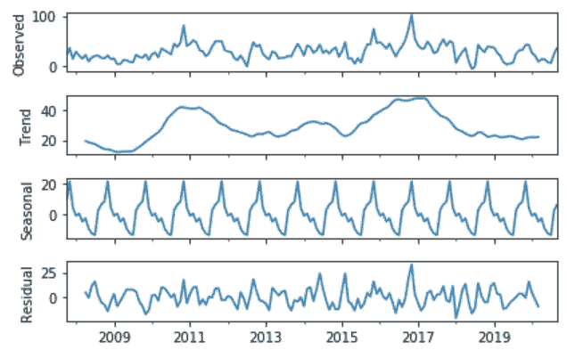
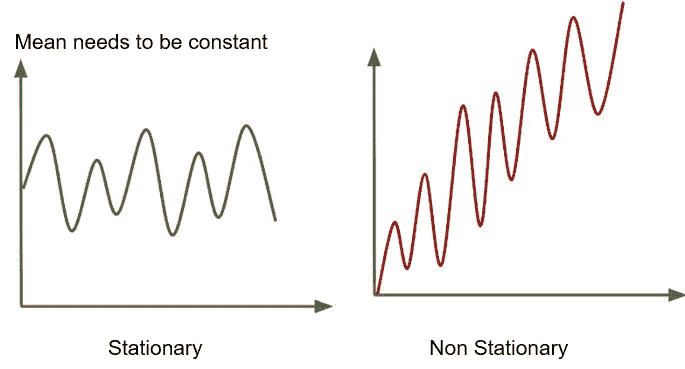
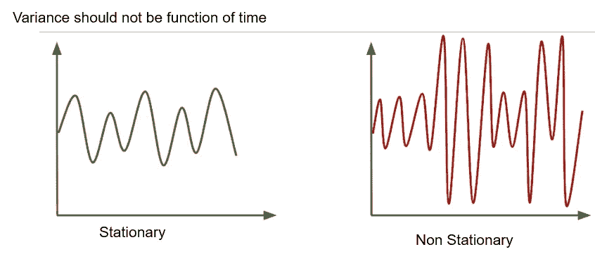
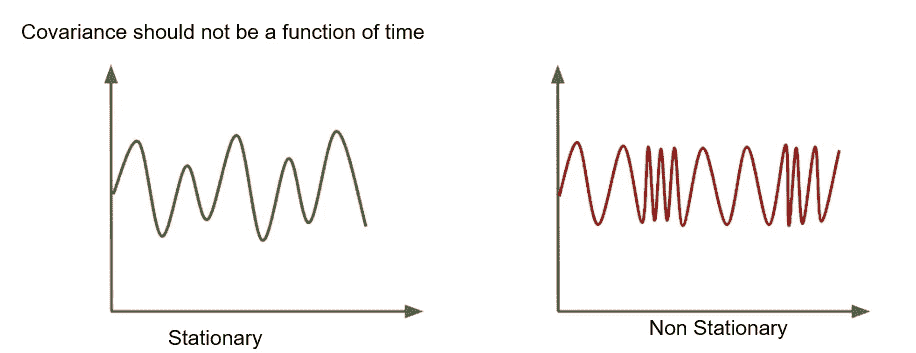
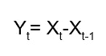
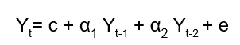
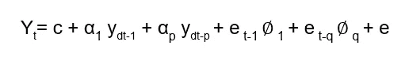

# 逐步时间序列分析

> 原文：<https://medium.datadriveninvestor.com/step-by-step-time-series-analysis-d2f117554d7e?source=collection_archive---------0----------------------->

***在本帖中，我们将了解如何通过时间分解来识别时间序列中的模式，时间序列数据的类型。为什么时间序列数据需要稳定，如果数据不稳定，如何使数据稳定。如何处理不同类型的时间序列数据最后说说 ARIMA。***

*在下一篇文章中，我们将探索一个时间序列数据集，并应用不同的时间序列技术，如 ARIMA、萨里玛和萨里马克斯进行预测。*

## 什么是时间序列？

时间序列是时间间隔相等的数值序列的集合。我们可以分析时间序列数据，以识别潜在的模式来进行预测。

 [## 为什么数据将改变投资管理|数据驱动的投资者

### 有人称之为“新石油”虽然它与黑金没有什么相似之处，但它的不断商品化…

www.datadriveninvestor.com](https://www.datadriveninvestor.com/2019/01/25/why-data-will-transform-investment-management/) 

时间序列数据在以下方面有所不同

*   **基于时间的依赖。观察并不是相互独立的，但是当前观察将依赖于之前的观察**。今天的温度无法独立预测，而是取决于昨天的天气状况。
*   **可随时间增加和减少的趋势以及季节性趋势**。雨衣的销量每年都会增加或减少，这取决于该年的降雨量，也与季节性有关。

**时间序列分析的目标是**

*   识别导致时间序列模式特定趋势的潜在力量
*   预测时间序列变量的未来值

这将有助于从观察到的时间序列数据中识别模式。

## 识别时间序列数据中的模式

时间序列分析假设时间序列数据由一些系统模式和一些随机噪声组成

如果我们去除随机噪声，那么系统模式将更加突出。这可以使用**时间序列分解**来完成。

时间序列数据中的系统模式可以具有**趋势**或**季节性。**

时间序列数据的趋势可以是线性的，也可以是非线性的，随时间变化，在已知的时间范围内不会重复。在系统的时间间隔内，数据存在重复。

随着时间的推移，对固定产品的需求会随着需求的季节性而稳步增长。返校月对文具的需求非常大。

**时间序列分解-**

时间序列的**分解**是一项统计任务，将一个时间序列分解成几个部分。每个组件代表一个基本的模式类别。

**时间序列模式的类型:**

1.  **趋势(T)** -反映系列的长期进展。当数据中存在持续的上升或下降方向时，趋势就存在。趋势分量不必是线性的
2.  **循环(C)** —反映重复但非周期性的波动。这些波动的持续时间通常至少为两年
3.  **季节性**-反映时间序列数据中存在的季节性，如对人字拖的需求，将在夏季达到最高。季节性发生在固定的时间段，可以是每周、每月、每季度等。
4.  **Random(R)**-反映随机或不规则的影响。这是我们从时间序列数据中去除所有其他成分后的剩余值

时间序列分解可以是加法或乘法

**加法模型**

**Y= T + S + C + R**

当出现以下情况时，应使用加法分解

*   趋势周期周围的季节变化幅度不随时间序列水平而变化

**乘法模型**

**Y= T * S * C * R**

在下列情况下，应使用乘法分解

*   趋势的变化与时间序列的水平成比例

Additive Time series decomposition

**我们如何预测时间序列？**

大多数时间序列数据将是非平稳的，但是许多时间序列技术中的一个共同假设是数据是平稳的。时间序列数据在一段时间内会有一些模式或行为。如果我们理解了潜在的模式，那么我们可以很有可能地说，时间序列在未来也会遵循同样的模式

静态数据的属性是它具有

*   常数平均值，
*   恒定方差和
*   自相关不随时间变化。

## 什么是平稳数据？

平稳序列的统计特性如均值、方差和自相关是恒定的，不依赖于时间。不显示趋势或季节性和数据波动的数据集完全是外部的。

平稳数据是看起来平坦的序列，没有趋势，随时间恒定变化，随时间恒定自相关结构，没有基于季节性的周期性波动。

使用静态数据集，模型可以根据均值和方差在未来期间保持不变的事实进行预测

平稳序列很容易预测。如果我们理解了平稳序列的统计性质，那么我们就可以很容易地预测未来。该系列的统计特性在未来将与过去一样保持不变。

## 我们如何知道数据是否是平稳的？

*   视觉的
*   增广迪基-富勒-ADF

**目测**

Stationary data with constant mean and Non Stationary data with changing mean

Non Stationary data with high variance

**增强的迪基-富勒(ADF)试验**

增广的 Dickey-Fuller(ADF)是最流行的统计方法，用于确定序列是否平稳。它也被称为单位根检验。

单位根检验确定趋势对时间序列的定义有多强

> **ADF 检验的 H0 零假设是时间序列可以用一个单位根来表示，即不是平稳的。这意味着时间序列具有一些依赖于时间的结构。**
> 
> **Ha- Alternate 假设时间序列是平稳的**

ADF 测试给了我们

*   测试统计，
*   p 值和
*   临界值。

> 如果检验统计量>临界值，则表明序列不是平稳的。

或者

> 如果 p>0.05，则不能拒绝零假设。这意味着时间序列有单位根，不是平稳的
> 
> **如果 p 值< = 0.05** :拒绝零假设，数据没有单位根，是平稳的

## 时间序列数据不是平稳的怎么办？

我们可以应用**不同的技术**来使数据稳定。这种技术有助于生成具有恒定位置和比例的序列

*   **差异:**计算数据中连续项或点之间的差异。**执行差分以去除变化的平均值。**

Differencing

*   **季节性差异:**同一季节的观测值与前一次观测值之间的差异。对于例如；节日期间巧克力的销量很高。对于季节性差异，我们采用去年节日期间的巧克力销售额和今年节日期间的销售额
*   **对数变换或平方根或幂变换:**有助于稳定序列的非恒定方差

## 如何减少时间序列数据中的随机噪声？

**平滑**是一种统计技术，可以揭示时间序列数据中存在的潜在趋势、季节性或循环模式。平滑数据消除了随机变化，揭示了趋势和周期成分

可以使用以下方式应用平滑

*   求平均值
*   指数平滑法随着观察值的变老，分配指数递减权重。与先前的观察相比，给予最近的观察更高的权重

# 分析时间序列的趋势

作为趋势分析的一部分，我们通过应用平滑来去除随机噪声。移动平均是最常见的平滑技术。它可以是简单平均值或加权平均值。移动平均平滑的好处是其结果受异常值的影响较小。

单调的时间序列数据可以用线性函数来近似。对于非单调的非线性数据，我们应用像对数变换、指数变换或平方根变换这样的变换来消除非线性。

# 分析时间序列中的季节性

季节性是一年内变化的结构模式。了解数据的季节性有助于对任何时间序列数据进行预测，如管理正确的库存水平或计划正确产品的生产。

时间序列中存在的季节性可以通过以下方式识别

*   时间序列的领域知识有助于理解多年重复的结构化模式
*   使用数据图表。
*   获得滞后自相关函数。
*   ANOVA:方差分析——用于测试两组，以检查它们之间的差异。

既然我们已经理解了时间序列的基本模式，那么是时候进行预测了。我们将探索 ARIMA

# ARIMA 自回归综合移动平均

ARIMA 是时间序列的统计分析模型，帮助我们预测时间序列的未来趋势。

**它是回归分析的一种形式，评估因变量相对于其他变化变量**的强度

**非季节性 ARIMA** :基础设施规划预测县人口

**季节性 ARIMA:** 预测一年中不同月份对不同产品的需求

ARIMA 有三个组成部分

## 自回归:AR(p)

*   过去的值用于序列 *Y* 的回归方程中
*   自回归利用观测值和滞后观测值之间的依赖关系
*   数据的增长/下降模式是用自回归来解释的
*   自回归参数 *p* 指定模型中使用的滞后数
*   AR 的鉴定最好使用 PACF

Representation for AR(2). c is a constant and e is error term

## 综合:一(d)

*   差分使时间序列数据平稳
*   计算数据增长/下降的变化率
*   d 代表数据必须被“差分”以产生稳定数据的次数

## 移动平均值:MV(q)

*   连续时间点之间的噪声由移动平均值来解释。利用观测值与其残差之间的相关性的模型，该残差来自应用于滞后观测值的移动平均模型
*   将模型的误差表示为先前误差项的组合
*   q 代表加到 Y 上或从 Y 上减去的误差项的超前或滞后值的数量
*   消除时间序列中的噪声
*   MA 模型的识别最好由 ACF 来完成

**ARIMA 模型被表示为 ARIMA(p，d，q)。也被称为非季节性 ARIMA 模型**

**p=模型中使用的滞后数量**

**差异度**

**q-模型中包含的误差项数量**

ARIMA

# 萨里玛-季节性 ARIMA 自动回归综合移动平均线

季节性 ARIMA 模型依靠季节性滞后和差异来拟合季节性模式。

萨里玛模型由萨里玛(P，D，q)x(P，D，Q)表示

与 ARIMA 模型相比，我们增加了三项

**P 是季节性自回归项的个数**

**D 是季节差异数**

**Q 是季节移动平均线的项数**

## 我们如何选择 P，D 和 Q 的值，以及 P，D 和 Q 的值？

我们使用自相关函数(ACF)或部分自相关函数(PACF)来寻找在 ARIMA 使用的 p、d 和 q 的值。

自相关告诉我们一个时间序列与其先前值的相关程度。它是由 *k* 个时间单位分隔的时间序列的观测值之间的相关性。

部分自相关测量与其他被考虑项的关系强度

我们还可以使用 **pmdarima(金字塔 arima)** 库，该库对 P、D 和 q 以及 P、D 和 q 的多个组合进行网格搜索。这是构建良好的 ARIMA 或萨里玛模型的最有效方式。

pmdarima 库比较 AIC(Akaike 信息标准)度量来评估不同 arima 模型的性能

***在下一篇关于时间序列的文章中，我们将探索使用 Python 中不同模型的时间序列数据集***

## 参考资料:

[sciencedirect.com](https://www.sciencedirect.com/science/article/pii/089571779390126J#targetText=Identification%20of%20patterns%20in%20time,identify%20seasonality%20with%20greater%20confidence.)

[https://people.duke.edu/~rnau/411arim3.htm](https://people.duke.edu/~rnau/411arim3.htm)

 [## 6.4.时间序列分析导论

### 时间序列方法考虑了数据中可能的内部结构。时间序列数据通常出现在…

www.itl.nist.gov](https://www.itl.nist.gov/div898/handbook/pmc/section4/pmc4.htm)  [## 4.1 季节性 ARIMA 车型|统计 510

### 时间序列中的季节性是在 S 个时间段内重复的有规律的变化模式，其中 S 定义了…

newonlinecourses.science.psu.edu](https://newonlinecourses.science.psu.edu/stat510/lesson/4/4.1) 

[https://www . investopedia . com/terms/a/auto regressive-integrated-moving-average-ARIMA . ASP](https://www.investopedia.com/terms/a/autoregressive-integrated-moving-average-arima.asp)