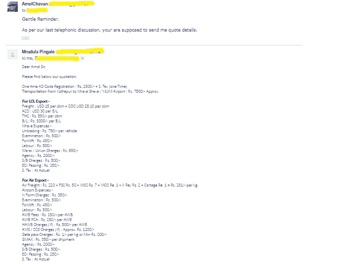
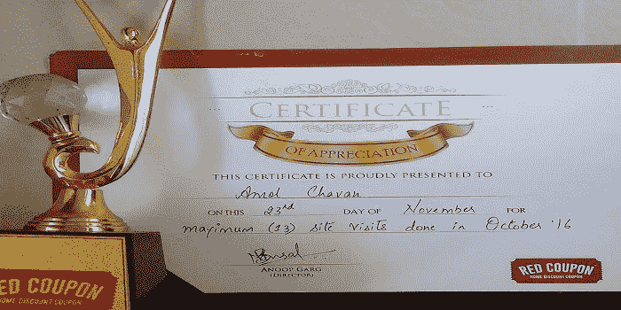

# 摆脱朝九晚六工作生活，过上无工作生活的步骤

> 原文：<https://medium.datadriveninvestor.com/steps-to-escape-from-9-6-job-life-and-live-job-free-life-f3d33e3649e2?source=collection_archive---------0----------------------->


【2015 年，我离开了***Rs 80K/月*** *的高薪工作，无忧无虑地追求自己的幸福，过着朝九晚六的自由生活。我开始了创业之旅，这塑造并改变了我充分享受生活的观点。*

> 你知道，我们的工作是如何塑造我们的生活的？

在大多数情况下，我们的生活是由我们的工作驱动的…

“我们在朝九晚六的工作生活的激烈竞争中奔跑，支付沉重的财务费用，但我们仍然希望财务自由。”

你不会在朝九晚六的工作生活中获得任何自由，相反，你会被困在朝九晚六的工作生活中。

# 工作生活-激烈的竞争-

我也和你现在的情况一样。

我被困在朝九晚六的工作生活中，没有过我不想过的生活，只是来来回回。

你们中的大多数人也和我之前经历的情况一样，就像…

*   2008 年至 2009 年是一场可怕的衰退，我深陷其中。
*   大一的时候面试了差不多 20+次都失败了。
*   奋斗了 8 个月后，我找到了第一份工作..
*   我过去常常在办公室熬夜工作。
*   我越工作越累。
*   我希望我的努力工作能让我明年获得学分和加薪…..但是从来没有…
*   我的组织解雇了高层管理人员…等等…..

我开始讨厌公司生活、噪音、那些政治和评价希望……

> 我的生活被我的工作所驱动。


然后

*那个“* ***我*** *”开始吸我了…*

几年后，我终于看到了内在的自我，然后问了几个问题，如下…你现在也在想，但你没有采取任何行动..

*   我们做一项工作是一年还是一年以上？
*   我们在经济上是否有能力在生活中获得成功。？
*   3-4 年前我们在哪里，在一份典型的朝九晚五的工作中，到目前为止你已经取得了多少成就。
*   如果经济衰退再次冲击市场，而我们也是其中的一部分，该怎么办？
*   如果一个组织再次开火会发生什么？
*   没有工作怎么生存？
*   如果我们没有工作，我们的家庭会怎么样？
*   如何支付房贷，车贷 EMI 等每月巨额开支？？

我和我的朋友达尔山讨论我的痛苦，他曾经在游戏行业工作到深夜，比我更窒息……

我的经理也遇到了同样的情况；甚至他还有更大的压力。

达尔山和我的经理过得好吗？答案是否定的。

在 IT 行业工作了几年后，我意识到这并不是我想要的理想工作。

但是这是一场激烈的竞争…然后我决定尽快离开，所以开始寻找其他的选择…

为了摆脱朝九晚六的工作竞争，你需要找到一种方法来支付每月的开支，而没有积极的收入。

> 当我们的被动收入大于支出时，我们就可以说我们已经脱离了朝九晚六的激烈竞争。这就是财务自由的意义所在。

你不知道未来会发生什么…与其思考和担心它，你为什么不考虑在生活中创造一些备份…..

我创造了备份，是的，我得到了成长和自由。

多年来，我尝试了几个商业想法，但都失败了，现在我在经营我的副业，不用担心升职、休假和薪水。

现在，我正在成为自己的老板。

我强调你，慢慢成长，每天过着没有工作的生活，像国王一样生活。

做自己的老板。

但是怎么做呢？

答案就像下面一样简单，但是为了尝试下面的解决方案，你必须明确你必须承担风险并采取行动…

这是一个大秘密…

# 没有什么神奇的公式可以让你过上没有工作、没有薪水的生活。你必须在生活中创造备份…

通往无薪生活的道路也没有你想象的那么舒适，也没有你想象的那么享受。在你计划逃离朝九晚六的工作生活之前，你必须问以下问题。

*   没有雇主，我如何赚取收入？如何开展副业？
*   还有，你一定要想好，我希望自己未来的生活下一步是什么样子的？

这篇文章纯粹关注于如何开始一个副业，没有工作的生活(没有薪水的生活)以及如何在不担心工作和薪水的情况下创造财务支持…

我敢肯定你们会喜欢的。

> 我不相信晚退休，如果你能通过日复一日的成长来享受今天的生活，并致力于简单的成长秘诀，那么晚退休有什么意义呢？

# **商业副业-工作自由生活-**


这是我人生中最大的转折，因为我已经迈出了创业的第一步。这些年来我在生意上有失败，有学习，也有成功。

每个人都有一个或好或坏的故事，这个故事将是你成功的关键，但你必须发现并采取正确的行动来实现成长。

我喜欢给你讲一个我改变创业生活的故事。

这些年来，我经营了如下多种业务…

让我来给你解释一下…

1.  **电子商务门户网站 Flipkart 的卖家**

在 Infosys 工作期间，我在最大的电子商务门户网站 Flipkart 上开始了这项在线销售业务。

对我来说，边工作边管理有点困难。

经过探索和 Flipkart 的培训，我开始寻找我的产品的照片拍摄。

我联系了几家与 Flipkart 捆绑在一起的照相馆，但这里的问题是，它们所覆盖的产品图像比产品本身更昂贵。

我收到了 Flipkart 几个产品照片的退稿。在花钱买了打印机、Flipkart 包装袋和产品后，我决定放弃这个想法，因为我没有成功。

**学习**-学习商业计划、电子商务&物流市场、与制造商和不同供应商打交道、谈判等。

**建议**——非常适合一个不工作和工作的人(如果你有人力资源)并准备建立一个网上商店。

**结果**——失败。

**金钱损失** —大约 9000 卢比。[/su_box]

**2)进出口(EXIM)**

在前一次尝试失败后，我参加了一整天的价值 7000 卢比的进出口(EXIM)专业培训。

我开始进一步探索，并决定将 KOLHAPURI Chappal(鞋类)出口到美国和迪拜市场。

我打电话给制造商和[海关代理(CHA)](https://en.wikipedia.org/wiki/Customs_house_agent) 询问报价，我得到了一个意外的报价。



在计算了资金、时机和风险后，我意识到这不是一个人的生意，因为有大量的文件、国际规则、程序和政策。

这是一项耗时的工作，也是我工作时的主要限制。

我放弃了做生意的想法。

**学习-** 进出口、国际贸易、外汇、与制造商和不同供应商的交易、谈判等。

**建议**——如果有足够的时间、资金和后援以及风险承担能力，就去做。

**结果**-启动前关闭。

金钱损失 —大约 7000 卢比。

**3)印度在线特许经销商(数字营销和目录服务)-**

我以前的失败从来不会影响我。我不断探索新的机会，从不回头。这个机会是我通过互联网得到的。

这是小企业家的数字营销和网站建设者的在线专营权。

我与 Indiaonline.in 签订了价值 25000 卢比的协议，还建立了一个网站(以大约 2000 卢比的价格购买了主机和网站生成器，为期一年)

经过培训后，我曾经追着小店主为数字存在建立一个网站，并在门户网站上注册。

我失去了兴趣，因为小店主对这个概念不感兴趣。他们不懂得处理互联网，对线下市场很满意。

我不再在它上面花费时间和金钱。

**学习** —如何识别市场、当地商业思维、销售技巧、网站建设和虚拟主机、与当地店主打交道等。

**建议**——创业前分析客户区域和市场。你必须有很强的销售、谈判和人际交往技能。

**结果**——损失了金钱和时间。

**金钱损失** —大约 30000 卢比[/su_box]

**4)房地产特许经营权(RedCoupon)**

它是代表建筑商销售公寓的房地产特许经营商(渠道合作伙伴)。

> *我没有多想就盲目地离开了高薪的朝九晚六的工作，我冒了人生中最大的风险。*

这次我是认真的，因为我有时间，而且我过着没有工作的生活。

我已经和公司**经销商**达成了 **Rs 1.5 Lacs** 的协议。

我过去常常打电话给客户，向他们推销现场参观。我意识到房地产是一个非常活跃的领域，即使你有可靠的 USP(独特的销售主张)，说服某人从你这里买房子也有点困难。

我在这项业务上取得了成功，从 RedCoupon 获得了最大的网站访问量，并在当月完成了 1 笔销售。



我正要再卖 5 套房子，但突然被政府否决了。印度宣布纸币面额。房地产市场因此受到严重阻碍。

一天之内，我的 5 笔交易被取消了。我很努力，但最终客户不准备购买单位，直到未来 6 个月。

我在这个行业呆了 9 个月，过着没有工作的生活。

最后，我决定退出这个行业。

**学习** —房地产、电话推销&销售、处理终端消费者行为和角色、谈判等。

**建议** —如果你有扎实的说服力、销售技巧、大量的时间和金钱，这是理想的选择。

> 冒险，不要辞职，除非你有足够的后备力量。

**结果**——部分成功，部分失败。失去了太多的时间、金钱和努力。

**钱输了\赚了**——

*   **损失** **—约 1.65 卢比拉特**
*   **赚取**—1 笔交易完成的佣金**30000 卢比**

**5) GrowthFunda -**

在与房地产加盟商合作期间，我还参加了认证数字营销课程，以加强我的技能和学习新事物。它帮助了我。

那是 2017 年 1 月，我计划在获得数字营销知识后开始一项新的在线业务，这就是 Growthfunda 的想法如何演变的。

我从 [SiteGround](https://www.siteground.com/index.htm?afcode=6be73bbc3c7a855bf9d30b7f3f3866ee) 购买了虚拟主机，从 [GeneratePress](https://generatepress.com/?ref=802) 购买了 Wordpress Theme，并开始建立我的商业博客网站。

一个新生儿诞生了，名字叫做[*Growth funda*](https://www.growthfunda.com)*——关于商业、技术、金钱、数字营销&黑客的成长黑客博客。*

由于我以前的失败，经济损失，我妈妈的重病和大约 9 个月的间隙，我决定回到我的核心 IT 领域。我得到了工作机会。现在我一边工作，一边成功地经营着网上生意。

是的，我最终获得了成功，但这是因为我以前的尝试失败了。

**其他学习** —数字营销、WordPress、博客、在线商务、阅读/写作技巧、在线赚钱、在线省钱。

**建议**——互联网是一个大海洋，尽可能多地掌握一项技能，培养阅读技能

**结果**——**成功。一天天成长…** [/su_box]

# 解决无工作生活的方法-

现在你知道什么是激烈的竞争，以及导致我们留在其中的一些力量。现在让我们向前迈进，开始讨论如何才能挣脱束缚。

逃离激烈的竞争需要我们购买产生被动收入的资产。

这是我们从投资中获得的现金流(就努力和金钱而言)。

帮助我们实现一劳永逸地脱离激烈竞争的目标的主要资产类别是——*业务*

建立副业\收入和过无工作的生活——这是主要的解决方案。


我花了将近 2 年的时间开始我成功的网上生意，因为。我已经开始了，失败了，在以前的尝试中学到了..

你必须阅读我的失败，从今天开始思考副业的想法，副业的收入的想法，赚钱的想法，这些想法会给你无工作的生活(无薪水的生活)，这将是你一生的备份。

我在这里从我这边尽可能的帮助你每一步。

你可以认为这是数字世界最大的机会。

从小处着手，以后再发展。

你可以开一个博客，在电子商务上销售，经营咨询服务，写一本书，自由职业有 n 个副业想法。

如果你的业务对他们来说是增值的，人们会很乐意付钱给你。

## **我一步一步走向无工作生活的方法**

```
**Step 1- Find you backup**
```

不要想太多首先通过做一些快速的调查来确定你的商业想法，如果合适的话，就去做。你的爱好、故事、激情可能会变成生意..

大多数人把时间花在过度思考上，而没有采取任何认真的行动。

他们害怕赔钱，害怕风险，害怕社会(如果你创业，别人会怎么想，等等等等…)

```
**Step 2- Identify your niche**
```

它可以是你的爱好、兴趣、技能或任何你可以写和感兴趣的东西。

如果你有多个利基，然后根据需求进行分类。

阅读一些有影响力的帖子，尝试了解市场

*   *有什么样的小众影响者推荐？*
*   *有多迷人？*
*   你做这件事可行吗？
*   *看一些评论网站？*
*   **提示** - *借助社交媒体来研究你的利基市场，并确定有影响力的人。*

```
**Step 3- Create a** [**business plan**](https://www.growthfunda.com/business-plan/)
```

一旦你确定利基移动到下一个重要步骤的商业规划。在初始阶段，你可能会创建一个商业计划草案，直到你最终确定利基。

正如我在之前的[博客](https://www.growthfunda.com/business-plan/)中提到的，商业计划是你成功的关键。为了成功，你必须制定传统的和精益的商业计划。

*   **看这里** [— 2018 撰写商业计划书终极指南【精益 Vs 传统商业计划书模板+软件】](https://www.growthfunda.com/business-plan/)

```
**Step 4- Build Website**
```

要建立知名度和品牌建设，你必须有网站。

我建议你在 Wordpress 上建立网站，作为它在全球最有用和最受欢迎的平台。如果你能自己学习 Wordpress，那么从专业的网站开发公司那里寻求帮助将会很棒。

*   **提示** - *最初使用好的 SEO 友好的 Wordpress 主题来建立一个网站，这样你就可以在预算内建立它。*

使用来自[网站的虚拟主机](https://www.siteground.com/index.htm?afcode=6be73bbc3c7a855bf9d30b7f3f3866ee)和 WordPress 主题[生成器](https://generatepress.com/?ref=802)

我推荐这些是因为，

我在 Growthfunda 上同时使用网站托管和 WordPress 主题生成器。

**在进行下一步之前，这里是我购买的交易**

**1)generate press**——你可以探索一下[**generate press**](https://generatepress.com/?ref=802)的一些特性

我买了一个 GeneratePress 主题，因为它有一些功能，比如

*   50 强之一的主题。
*   **SEO** 友好
*   **通过使用 Section 等功能，在页面生成器上省钱**。(这是我用来省钱的方法)
*   易于学习、修改和掌握…
*   **所有 14 个模块** &未来发布
*   **无限制**网站& **终身**使用
*   **1 年**的更新&支持
*   **30 天**退款保证

他们最好的产品有**特别折扣优惠**，这对打算建立 WordPress 网站的人来说很好。

你可以在这里购买发电机。

**2)场地**

因为功能的原因，我还从**网站**购买了虚拟主机

*   SiteGround 继续为你提供高质量 WordPress 产品的大折扣
*   **99.99%的运行时间。**
*   现有的最佳计划。
*   **提升速度**-我们加载网站的速度更快了！
*   行业平均加载时间:**4.7 秒**
*   我们没有缓存的加载时间:**1.7 秒**
*   我们的缓存加载时间:**1.3 秒**
*   **支持**——电话我们马上接！
*   4 家公司等待时间超过 10 分钟。
*   只有另外两家公司立即采取了行动。
*   90%的主机没有非美国电话线。

你可以在这里购买 SiteGorund。

```
**Step 5- Learn Content Marketing and Digital Marketing**
```

这是一个数字时代，要想在商业中取得成功，你必须知道内容营销或数字营销。

无论你经营的是博客还是任何服务\产品公司，内容营销\数字营销都很重要。你也可以在周末学习所有这些东西。因为网上有很多东西可以学。

*   提示- *与数字营销、社交媒体影响者和权威人士接触。看看营销大师* [***尼尔·帕特尔***](https://neilpatel.com/) *和社交媒体专家、主题演讲人* [***德夫·加德维***](https://www.devgadhvi10x.com) 如何产生多流和百万富翁业务。

```
**Step 6- Write Catchy Content, Engage and Promote Your Online Business**
```

是的，内容为王…

写长的以 SEO 为中心的博客文章，有规律地写一篇病毒式的文章来吸引读者。

在社交媒体上参与，询问对你的博客文章、产品的反馈，抓住你的第一个读者\客户。这是成功的关键，因为你总能从顾客的建议和想法中学习，因为顾客是上帝。

*   **提示** - *与你的读者互动，与他们接触，定期回复他们的问题，以建立透明度。*

```
**Step 7- Monetize Your Website**
```

如果你把你的网站看作是一个严肃的在线业务和收入来源，那么你必须把你的网站货币化。

不要早早期待果实。一旦你在网站上有了大量的读者和互动，钱可以在睡觉的时候点击一下就赚到了。

*   **提示** - *在最初的日子里不要谈论太多的钱，首先你必须专注于内容、服务\产品和客户。*

```
**Step 8- Leave Job**
```

你的等待结束了，一旦你开始在网上赚钱，满足你的需求，就离开朝九晚五的工作。

*   **提示** - *不要急着离职，直到你有了一个坚实的后备，并且对它感到满意。*

> 你一定会走向朝九晚六的无工作生活和财务自由生活

# **无工作生活的重要提示**

你不会想错过下一部分的…

我接触并了解到有五种基本方法可以摆脱朝九晚五的工作竞争，享受无工作生活(无薪水生活)

*   *建立备份。*
*   *建立集约型储蓄和副业。*
*   *成立副业。*
*   *被动收入和自动化金融。*
*   *解除阻塞…*

但是为了实现这一点，你必须确定生活的原因、内容和地点。

你必须是一个行动者，而不是唯一的思考者，你必须发现你的内在技能、潜力和态度的改变。

不断学习，获取新知识。

**额外提示**——*你可以尝试冥想，阅读励志书籍，观看励志视频，参加影响者研讨会，这些都会让你充满热情。*

# **结论**

你还在等什么？如果我能做副业，为什么你不能？

你不必在你的余生继续从事你讨厌的工作。你不必困在一个不能激励你的情境中。

逃离朝九晚六工作的激烈竞争，最重要的第一件事是:努力创造一份比你每月总账单更多的被动收入。

就是这样。

> 你只需要迈出第一步，而且必须是行动者，因为失败是成功和学习的关键。

我想听听那些投身于自主创业或计划采取行动的人的想法。

你对无工作生活的方法、商业计划和想法是什么？你向自由迈进一步了吗？

如果您有任何疑问，请告诉我，我会尽我最大的努力为您提供指导和帮助。

如果有任何疑问，你也可以在这里把我和社交网络联系起来[脸书](https://www.facebook.com/growthfunda)、[推特](https://twitter.com/growthfundaAmol)、 [Linkedin、](https://www.linkedin.com/in/growthfunda) [Quora](https://www.quora.com/profile/Amol-Chavan-79) 。

你对产生副业想法有什么看法？

或者你对流程中的某个步骤有疑问。

如果你有采取行动的动力和强烈愿望，请在评论中告诉我。

同样，如果你也想摆脱朝九晚五的工作生活，我 ***很想听听你的故事*** ，也很想帮助你，只要把你的故事写在**评论里**

我会回答你的评论和问题。

另外，不要忘记…

为我的博客 growthfunda 订阅这些有用的文章，并免费获得我下一篇文章的更新。

## 本文原创详细贴 [@Growthfunda](https://www.growthfunda.com/job-free-life/)