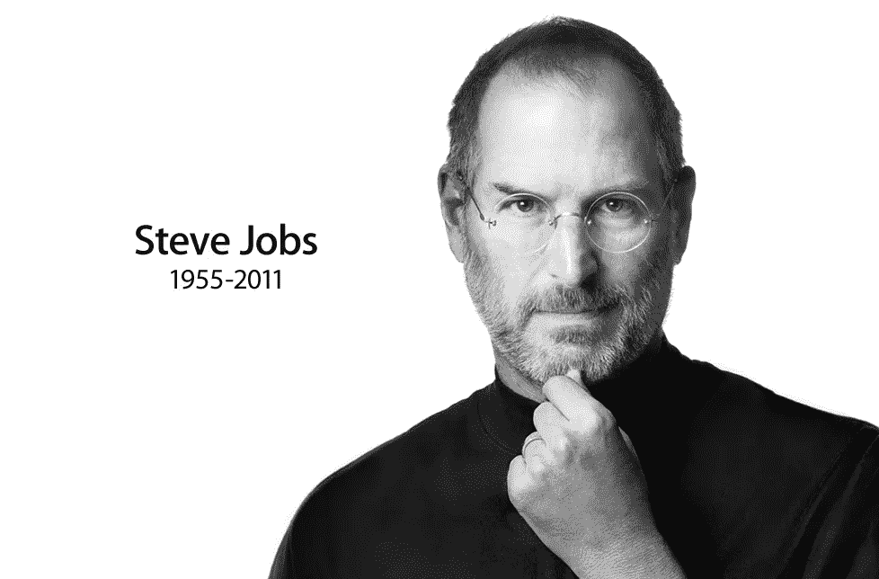

# 史蒂夫·乔布斯:领导力的核心课程

> 原文：<https://medium.datadriveninvestor.com/steve-jobs-core-lessons-e68d363ac71?source=collection_archive---------11----------------------->

阅读传记的最大好处，也是我喜欢传记的原因，是你可以从最好的传记中学到的东西。拥有像乔布斯这样的商业大师作为导师，不是每个人都能拥有的，幸运的是，传记让这个梦想接近现实。以下是我从工作中学到的最好的东西。

# **乔布斯核心人格特质和管理道德**

1.乔布斯是一个被遗弃的孩子，当他问爸爸妈妈他的亲生父母是否不想要他时，他们缓慢地重复道:“我们特意挑选了你

".所以，被抛弃，被选择，被特别，成了乔布斯认为自己的一部分。

2.从童年早期开始，他的父亲是一名熟练的机械师，他会带他向他展示如何修理。他会向他指出设计、线条、通风口等细节。乔布斯也看到他的父亲在谈判中运用他的技巧，为他想要购买的零件讨价还价。他父亲的这些经历

向他灌输了说服技巧和对细节的关注，这在他的职业生涯中很有用。

3.另一个影响乔布斯观点的因素是他童年时对街区的探索，这让他接触到了约瑟夫·艾希勒建造的简单、智能、廉价的房屋。从这些经历和后来的禅修中，他形成了一种简单的倾向，这种倾向影响了他后来的所有想法和设计。

4.**乔布斯的一个核心性格特征对他的所有成就都有重大影响，那就是他会坚持不懈地得到他需要的或者他认为正确的东西:**

> *1972 年夏天，毕业后，他和布伦南搬到了洛斯阿尔托斯山上的一个小木屋里。“我要和克里斯安一起住在小木屋里，”一天，他对父母宣布。他父亲大发雷霆。“不，你不是，”他说。“除非我死了。”他们最近为大麻吵了一架，年轻的乔布斯又一次任性了。他只是说了声再见就走了。*
> 
> 有一天，乔布斯走进视频游戏制造商雅达利的大厅，希望被雇佣，并告诉人事主管，除非他们给他一份工作，否则他不会离开。人事主管被他蓬乱的头发和装束吓了一跳。

5.也许乔布斯最大胆的特质是他的**现实扭曲力场**，这让他相信在别人看来完全不可能的事情，他总是坚持认为有些奇怪的事情是可以做到的，有趣的是，他经常是对的。

6.他拒绝接受自动接受的真理，他想亲自检验一切。

7.乔布斯开始相信，他可以将自己的自信传递给他人，从而推动他们去做他们以前认为不可能的事情

8.帮助乔布斯最终成为他的一个显著因素是他与许多伟大的人和导师接触，并进入不同的企业和职业。例如:

> 雅达利的经历帮助塑造了乔布斯的商业和设计方法。他很欣赏雅达利的“插入 25 分钟躲避克林贡人”游戏的用户友好性。“这种简单性感染了他，使他成为一个非常专注于产品的人，”罗·韦恩说。乔布斯也吸收了布什内尔的一些不做俘虏的态度。“诺兰不会接受否定的回答，”据奥尔康说，“这是史蒂夫对做事方式的第一印象。诺兰从来不像史蒂夫那样辱骂他人。但他也有同样积极的态度。这让我畏缩，但该死的，它把事情做好了。从这个角度来说，诺兰是乔布斯的导师。

9.布什内尔教导乔布斯:

> 我告诉他，如果你表现得好像你能做某事，那么它就会成功。我告诉他，‘假装完全掌控一切，人们会认为你是。

10.乔布斯的另一位导师马克·马库库拉告诉他:

> *千万不要以致富为目标开公司。你的目标应该是做一些你相信的事情，并建立一个持久的公司。*

这正是乔布斯在苹果公司所做的。他总是想着产品，而不是利润。马库拉向乔布斯灌输了苹果哲学，这种哲学围绕着以下三个核心原则:

*   **同理心:**与顾客的感受建立亲密的联系，理解他们的需求。
*   **专注:**要做必须要做的事，其他每一个不重要的机会都必须剔除。
*   **估算:**人们对一家公司或产品的看法是基于它所传达的信号。"人们的确通过封面来判断一本书."如果你以一种草率的方式展示你的伟大产品，他们会被认为是草率的。

11.从艾伦·凯那里，施乐公司的伟大科学家乔布斯接受并应用了两条准则:

*   预测未来的最好方法是创造未来。
*   对软件认真的人应该自己做硬件。

12.我注意到的一件很棒的事情是许多非凡壮举的根源是这样的:

> 因为我不知道怎么会做不到，所以我被允许去做。

13.乔布斯一直是个完美主义者，总是抱怨年轻一代没有这种根深蒂固的品质。

14.乔布斯绝不会为了降低成本而牺牲质量和完美，也不会在乎为了满足他的期望项目会推迟多久。

15.乔布斯总是认为，“通过期望人们做伟大的事情，你可以让他们做伟大的事情。”这实际上是有心理学依据的。

16.比尔·阿特金森(Bill Atkinson)说过:“伟大的艺术延伸了品味，它不追随品味。”

17.“不，因为在我们展示给顾客之前，他们不知道自己想要什么”，每当有人建议做一些市场调查时，乔布斯总是这样回答。

18.旅程就是回报。乔布斯最喜欢的格言也证明了神经心理学的根源。一旦你达到目标，快乐就消失了。(如果有兴趣，可以查找多巴胺的工作机制及其作用)。

19.另一个乔布斯最喜欢的格言是:“当海盗比加入海军好。”他想在他的团队中灌输一种反叛精神，让他们表现得像一群为自己的工作感到自豪但却愿意霸占他人的侠客。

20.斯卡利前百事可乐公司总裁，第一位苹果公司首席执行官在管理一家运转不良的公司时有一个弱点，那就是他渴望取悦他人，这是他与乔布斯不同的许多特质之一:

> “我们会在晚上 11 点去 Mac 大楼，”斯卡利回忆道，“他们会带着乔布斯的代码来展示。在某些情况下，他甚至看都不看一眼。他会把它拿回来扔给他们。我会说，‘你怎么能拒绝呢？’他会说，‘我知道他们可以做得更好。’"

21.微软遵循了不同的哲学，他们最初的产品往往很笨拙，但他们极其执着，所以他们不断改进和完善他们的作品。

22.乔布斯非常强调只招一个玩家:

> *乔布斯从他的麦金塔电脑体验中领悟到了他认为是关键的管理经验:如果你想建立一个一流的团队，你必须冷酷无情。“随着一支球队的成长，容忍一些 B 级球员太容易了，然后他们又吸引了一些 B 级球员，很快你甚至会有一些 C 级球员，”他回忆道。“麦金塔的经历告诉我，A 玩家喜欢只和其他 A 玩家合作，这意味着你不能纵容 B 玩家。”*

23.当我翻阅这本书时，我注意到了几件有助于乔布斯想出点子的事情:

*   他总是站在技术和艺术的前沿，了解科学界和艺术界的最新成就。
*   他会积极游说学者，询问他们的需求和缺点，看看他是否能找到解决方案。
*   他的日常工作的一部分是偶尔与 100 名顶级经理在度假胜地举行务虚会，并保持头脑风暴的想法，并从 n+1 个提议中选择前 3 个。

24.让乔布斯为巨大成功做好准备的是在第一幕中被苹果解雇，开始“下一个”创业，沉迷于任何他渴望的项目，并以失败告终。简而言之，他的失败让他成为了我们在第三幕(即将回归苹果)中所熟知的“史蒂夫”。

25.这个有点阴暗:当他想获得别人不愿放弃的东西时(比如他与前妻生的女儿丽莎)，他会引发一条破坏性的无知之路。在他女儿的案例中，他破坏了前任的有效性和她的幸福，让丽莎搬进他的房子。

26.乔布斯从他的佛教生活中学到的一个教训是，物质财富往往会扰乱生活，而不是丰富生活。

27.乔布斯和斯卡利一起离开苹果后，他认为导致苹果衰落的一件事是，“斯卡利通过引入腐败的人和腐败的价值观摧毁了苹果”，“他们主要关心为自己赚钱，也为苹果赚钱，而不是制造伟大的产品。

28.如果乔布斯新的行动方针是正确的，他是不可阻挡的。但如果他有疑问，他有时会退缩，不愿去想那些不完全适合他的事情。

29.约伯的抱负是建立一个能够持久的公司，他问马库拉实现这个目标的公式是什么。马库拉回答说，持久的公司知道如何重塑自己。

30.我读到的一句美丽的话是乔布斯说的:我们在苹果已经忘记了我们是谁。记住你是谁的一个方法是记住你的英雄是谁。

31.**乔布斯最大的优势之一**就是知道如何专注。“决定不做什么和决定做什么一样重要，”他说。“公司如此，产品也是如此。”

> *几周后，乔布斯终于受够了。“站住！”他在一次大型产品战略会议上大喊大叫。“这太疯狂了。”他抓起一支记号笔，垫在白板上，画了一条横线和一条垂直线，做了一个四方形的图表。“这是我们需要的，”他继续说道。在两栏上面，他写了“消费者”和“专业”；他把这两排分别标为“台式”和“便携式”他说，他们的工作是制造四个伟大的产品，每个象限一个。“房间里鸦雀无声，”席勒回忆道。当乔布斯在苹果董事会 9 月份的会议上介绍这一计划时，也出现了令人震惊的沉默。“吉尔在每次会议上都敦促我们批准越来越多的产品，”伍拉德回忆道。“他一直说我们需要更多产品。史蒂夫进来说我们需要更少的。他画了一个有四个象限的矩阵，并说这是我们应该关注的地方。”起初，董事会推后。乔布斯被告知，这是一种风险。“我能让它工作，”他回答。董事会从未就新战略投票。乔布斯掌管一切，他勇往直前。*

32.乔布斯用了他的学费，受益匪浅。就设计而言，他会指着他喜欢的模型和草图，把他不喜欢的扔掉。

33.或许乔布斯融入苹果设计的最伟大格言之一是达芬奇的名言:“简单是终极的复杂。”他说，这需要很多艰苦的工作，“让事情变得简单，真正理解潜在的挑战，并提出优雅的解决方案。”正如我所说的:

> 为什么我们认为简单就是好？因为对于实体产品，我们必须感觉到我们可以主宰它们。当你给复杂事物带来秩序时，你就找到了让产品服从你的方法。简洁不仅仅是一种视觉风格。不仅仅是极简主义或者没有杂乱。它包括挖掘复杂性的深度。要做到真正的简单，你必须非常深入。例如，在某件事情上没有螺丝钉，你可能最终拥有一个如此错综复杂的产品。更好的方法是深入简单，了解它的一切以及它是如何制造的。你必须深刻理解一个产品的本质，才能去掉不必要的部分。

34.为了让 Ive 的审美欲望和各种设计奇思妙想成为现实，乔布斯不得不抵挡制造工程师的反对。

> *乔布斯说，当我们把设计拿给工程师时，他们想出了 38 个他们不能做的理由。我说，'不，不，我们要这么做'他们说，'嗯，为什么？'我说，‘因为我是首席执行官，我认为这是可以做到的。所以他们有点不情愿地做了。*

35.乔布斯一直遵循着让苹果公司成功的策略:制造畅销产品，并通过出色的营销来推广它们。

36.史蒂夫坚信动机至关重要:

> *随着年龄的增长，我越来越意识到动机的重要性。Zune 很烂，因为微软的人不像我们一样热爱音乐或艺术。我们赢了，因为我们个人热爱音乐。我们为自己制造了 iPod，当你为自己、你最好的朋友或家人做一些事情时，你不会逃避。如果你不喜欢某样东西，你就不会多走一步，多工作一个周末，挑战现状。*

37.乔布斯的商业规则之一就是永远不要害怕自相残杀。他说，如果你不拆自己的台，别人会拆的。

38.在设计产品时，苹果会拿出几个型号，选择一个，然后不断改进，直到看起来完美为止。

39.他相信(最近许多创造力大师也支持)创造力来自自发的会议，来自随机的讨论。你碰到某人，你问他们在做什么，你说‘哇’，很快你就想出了各种各样的主意。因此，苹果公司设计了他的大楼，以促进与员工的随机接触，否则他们不会意识到对方。

40.iPhone 的成功之处在于简化了在其他手机中复杂处理的事情。

41.对于像 IBM 这样的大公司为什么会衰落，乔布斯有他自己的理论。“公司做得很棒，不断创新，在某个领域成为垄断或接近垄断，然后产品质量就变得不那么重要了。公司开始重视优秀的销售人员，因为他们是影响收入的人，而不是产品工程师和设计师。当销售人员管理公司的时候，产品人员并不那么重要，他们中的很多人都不感兴趣。毕竟，正如迪伦所说:如果你不忙着出生，你就忙着死亡。

你认为乔布斯最好的品质是什么？请在评论中分享你的想法。

*最初发表于*[T5【livelikepros.com】](https://livelikepros.com/steve-jobs/)*。*