# Python 中 K-Means 聚类的股票市场聚类

> 原文：<https://medium.datadriveninvestor.com/stock-market-clustering-with-k-means-clustering-in-python-4bf6bd5bd685?source=collection_archive---------0----------------------->


这个机器学习项目是关于用 K-means 聚类算法对相似的公司进行聚类。这种相似性是基于每日的股票走势。

导入必要的包。

```
**from pandas_datareader import data 
import matplotlib.pyplot as plt
import pandas as pd
import datetime
import numpy as np
import plotly.graph_objects as go**
```

字典“companies_dict”定义为“key”是公司名称,“value”是公司股票代码。考虑 28 家公司。

```
**companies_dict = {
    'Amazon':'AMZN',
    'Apple':'AAPL',
    'Walgreen':'WBA',
    'Northrop Grumman':'NOC',
    'Boeing':'BA',
    'Lockheed Martin':'LMT',
    'McDonalds':'MCD',
    'Intel':'INTC',
    'Navistar':'NAV',
    'IBM':'IBM',
    'Texas Instruments':'TXN',
    'MasterCard':'MA',
    'Microsoft':'MSFT',
    'General Electrics':'GE',
    'Symantec':'SYMC',
    'American Express':'AXP',
    'Pepsi':'PEP',
    'Coca Cola':'KO',
    'Johnson & Johnson':'JNJ',
    'Toyota':'TM',
    'Honda':'HMC',
    'Mistubishi':'MSBHY',
    'Sony':'SNE',
    'Exxon':'XOM',
    'Chevron':'CVX',
    'Valero Energy':'VLO',
    'Ford':'F',
    'Bank of America':'BAC'}**
```

股票市场数据摘自雅虎财经。考虑的时间段是从“2015 年 1 月 1 日”到“2017 年 12 月 31 日”。公司的股票走势将根据以下 6 个参数进行比较:“高”、“低”、“开盘”、“收盘”、“成交量”、“调整收盘”。

高':-一天中的最高价格。
‘低’:一天中最低的价格。
'开盘价' :当日开盘价。
‘收盘’:当日收盘价。
‘成交量’:当日交易的股票总股数。
‘调整收盘’:考虑到任何公司行为，修正收盘价，以给出‘调整后收盘’价格。

```
**data_source = ‘yahoo’** # Source of data is yahoo finance.
**start_date = ‘2015–01–01’ 
end_date = ‘2017–12–31’
df = data.DataReader(list(companies_dict.values()),
 data_source,start_date,end_date)**
```

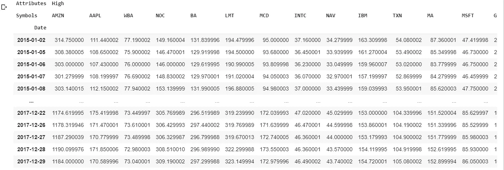

Numpy 数组更方便。因此,“库存 _ 开仓”和“库存 _ 收盘”定义如下

```
**stock_open = np.array(df[‘Open’]).T** # stock_open is numpy array of transpose of df['Open'] **stock_close = np.array(df[‘Close’]).T** # stock_close is numpy array of transpose of df['Close']
```

“变动”被定义为某一天的开盘价和收盘价的差异。正向运动建议做多股票(买入)，反向运动建议做空股票(卖出)。

```
**movements = stock_close — stock_open**
```

公司的“运动总和”定义为所有日期的收盘价和开盘价之差的总和。

```
**sum_of_movement = np.sum(movements,1)**
```

打印公司及其“运动总和”。

```
**for i in range(len(companies)):
 print(‘company:{}, Change:{}’.format(df[‘High’].columns[i],sum_of_movement[i]))**
```

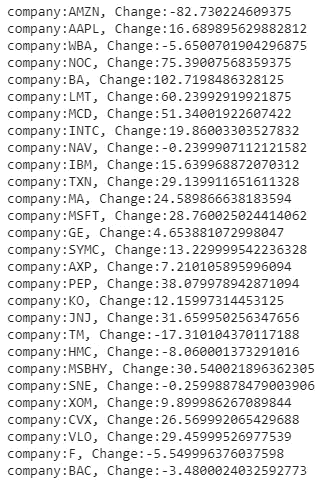

' AAPL '，' NOC '，' BA '，' LMT '，' MCD '，' INTC '，' IBM '，'马'，' MSFT '，'葛'，' SYMC '，' PEP '，' KO '，' JNJ '，' MSBHY '，' XOM '，' CVX '和' VLO '有正' sum_of_movement '。因此，买入这些股票是明智的。

' AMZN '，' WBA '，' NAV '，' TM '，' HMC '，' SNE '，' F '和' BAC '有否定的'运动总和'。因此，卖空股票是明智的。

**可视化数据(可以跳过这一节。只是基本情节和他们的解释)**

两家公司(亚马逊和苹果)的开盘价变化如下图所示。

```
**plt.figure(figsize = (20,10)) 
plt.subplot(1,2,1) 
plt.title(‘Company:Amazon’,fontsize = 20)
plt.xticks(fontsize = 10)
plt.yticks(fontsize = 20)
plt.xlabel(‘Date’,fontsize = 15)
plt.ylabel(‘Opening price’,fontsize = 15)
plt.plot(df[‘Open’][‘AMZN’])
plt.subplot(1,2,2) 
plt.title(‘Company:Apple’,fontsize = 20)
plt.xticks(fontsize = 10)
plt.yticks(fontsize = 20)
plt.xlabel(‘Date’,fontsize = 15)
plt.ylabel(‘Opening price’,fontsize = 15)
plt.plot(df[‘Open’][‘AAPL’])**
```

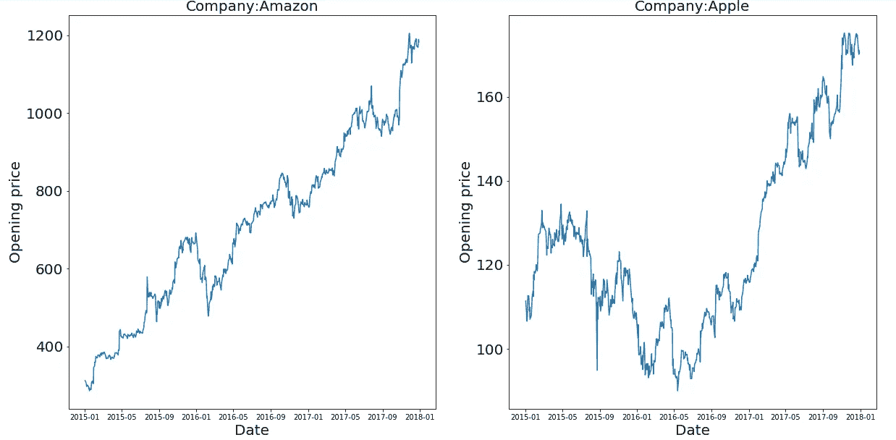

亚马逊的开盘价从 200 涨到 1200，而苹果的开盘价从 110 涨到 180。亚马逊也有相对较好的稳定增长。因此，在给定的时间段内，亚马逊比苹果有更好的增长。

[](https://www.datadriveninvestor.com/2019/02/21/best-coding-languages-to-learn-in-2019/) [## 2019 年最值得学习的编码语言|数据驱动的投资者

### 在我读大学的那几年，我跳过了很多次夜游去学习 Java，希望有一天它能帮助我在…

www.datadriveninvestor.com](https://www.datadriveninvestor.com/2019/02/21/best-coding-languages-to-learn-in-2019/) 

让我们画出亚马逊在 2015 年 1 月 2 日至 2015 年 1 月 23 日期间的开盘价和收盘价。

```
**plt.figure(figsize = (20,10))** # Adjusting figure size
**plt.title(‘Company:Amazon’,fontsize = 20)**
**plt.xticks(fontsize = 10)
plt.yticks(fontsize = 20)
plt.xlabel(‘Date’,fontsize = 20)
plt.ylabel(‘Price’,fontsize = 20)
plt.plot(df.iloc[0:30][‘Open’][‘AMZN’],label = ‘Open’)** # Opening prices of first 30 days are plotted against date
**plt.plot(df.iloc[0:30][‘Close’][‘AMZN’],label = ‘Close’)** # Closing prices of first 30 days are plotted against date
**plt.legend(loc=’upper left’, frameon=False,framealpha=1,prop={‘size’: 22})** # Properties of legend box
```

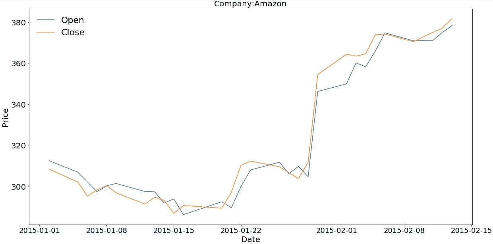

在 30 天的时间内,“开盘价”和“收盘价”都有整体上涨，这显示了该公司的积极一面。

前面定义的“变动”是某一天收盘价和开盘价的差异。亚马逊在 2015 年 1 月 2 日至 2015 年 2 月 13 日期间的“移动”变化如下图所示。

```
**plt.figure(figsize = (20,8)) 
plt.title('Company:Amazon',fontsize = 20)
plt.xticks(fontsize = 18)
plt.yticks(fontsize = 20)
plt.xlabel('Date',fontsize = 20)
plt.ylabel('Movement',fontsize = 20)
plt.plot(movements[0][0:30])**
```

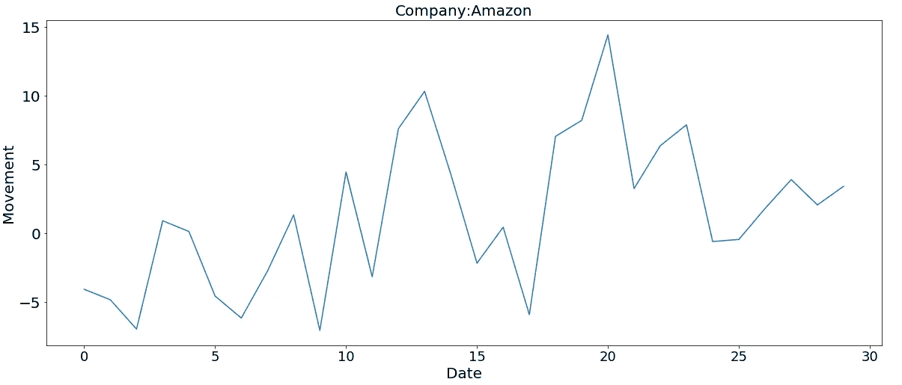

积极的“运动”是可取的，这表明价格在一天内有所上升。

另一个重要参数是“体积”。“2015 年 1 月 2 日”至“2017 年 12 月 31 日”期间的股票交易量如下图所示。

```
**plt.figure(figsize = (20,10)) 
plt.title(‘Company:Amazon’,fontsize = 20)
plt.xticks(fontsize = 18)
plt.yticks(fontsize = 20)
plt.xlabel(‘Date’,fontsize = 20)
plt.ylabel(‘Volume’,fontsize = 20)
plt.plot(df[‘Volume’][‘AMZN’],label = ‘Open’)**
```

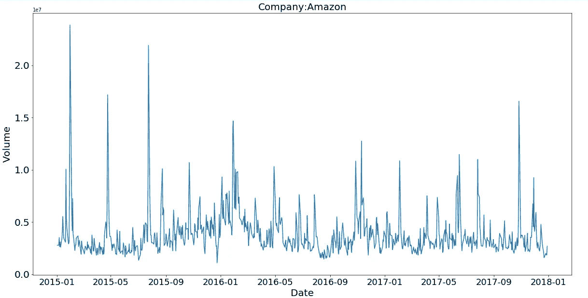

峰值表明在特定的日子里有大量的股票交易。这可能是由于公司管理层重组、所有权变更、年度公告、新企业和其他因素影响了公司在市场参与者心目中的形象。

下面是亚马逊前 60 天的蜡烛图。

```
**fig = go.Figure(data=[go.Candlestick(x=df.index,
 open=df.iloc[0:60][‘Open’][‘AMZN’],
 high=df.iloc[0:60][‘High’][‘AMZN’],
 low=df.iloc[0:60][‘Low’][‘AMZN’],
 close=df.iloc[0:60][‘Close’][‘AMZN’])])
fig.show()**
```

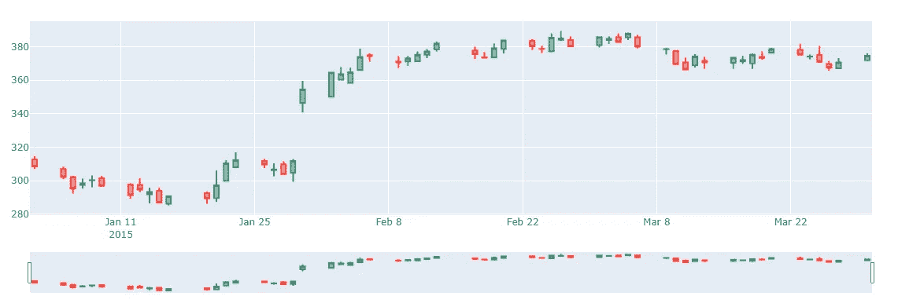

烛台模式是股票技术分析的一个重要工具，用来预测特定的市场运动。烛台模式将在后续文章中讨论。

## **需要标准化**

让我们来描绘一下亚马逊和苹果的“运动”的变化。

```
**plt.figure(figsize = (20,8)) 
ax1 = plt.subplot(1,2,1)
plt.title(‘Company:Amazon’,fontsize = 20)
plt.xticks(fontsize = 18)
plt.yticks(fontsize = 20)
plt.xlabel(‘Date’,fontsize = 20)
plt.ylabel(‘Movement’,fontsize = 20)
plt.plot(movements[0]) 
plt.subplot(1,2,2,sharey = ax1)
plt.title(‘Company:Apple’,fontsize = 20)
plt.xticks(fontsize = 18)
plt.yticks(fontsize = 20)
plt.xlabel(‘Date’,fontsize = 20)
plt.ylabel(‘Movement’,fontsize = 20)
plt.plot(movements[1])**
```

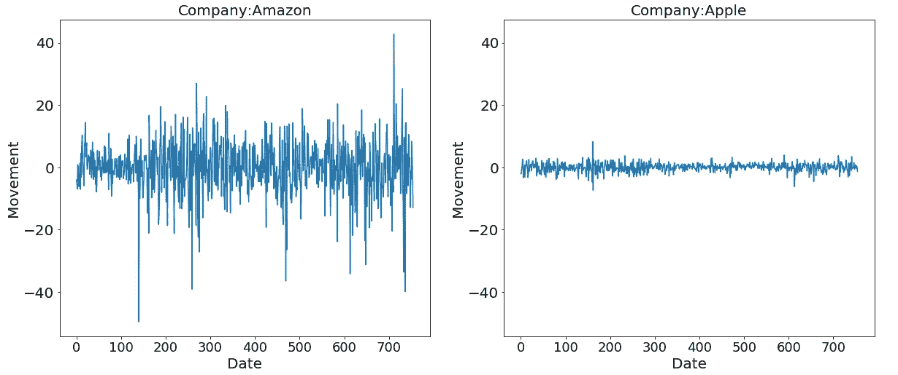

亚马逊和苹果的股价有不同的尺度。因此，亚马逊股价的 x 个单位的变化不同于苹果股价的 x 个单位的变化。一些公司的价值比其他公司高得多。因此，数据必须标准化。

规范化的目标是将数据集中数值列的值更改为一个通用范围，而不会扭曲值范围的差异。仅当要素具有不同的范围时才需要它，就像在当前场景中一样。

“norm_movements”被定义为“movements”的规范化版本。Normalizer()独立地重新缩放每一行“运动”。

```
**normalizer = Normalizer()** # Define a Normalizer **norm_movements = normalizer.fit_transform(movements)** # Fit and transform
```

打印“norm_movements”的最小值、最大值和平均值。

```
**print(norm_movements.min())
print(norm_movements.max())
print(norm_movements.mean())**
```

“norm_movements”的最小值、最大值和平均值分别为-0.259、0.26 和 0.001。所有值都在范围(-1，1)内，平均值接近于 0。

现在让我们画出亚马逊和苹果的“norm_movements”的变化。

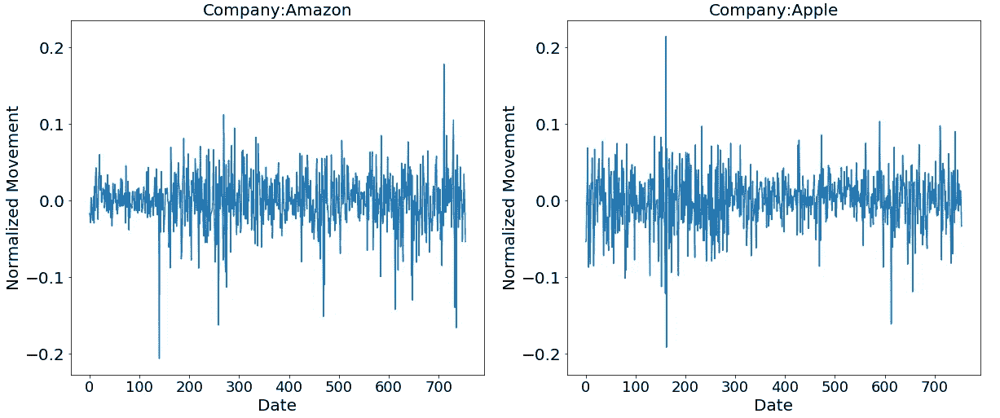

亚马逊和苹果的正常化运动在相似的范围内。

## **创建管道**

现在，我们创建一个管道，将数据标准化，然后应用 K-Means 聚类算法对每日股票走势相似的公司进行聚类。

```
# Import the necessary packages
**from sklearn.pipeline import make_pipeline
from sklearn.preprocessing import Normalizer
from sklearn.cluster import KMeans**# Define a normalizer
**normalizer = Normalizer()**# Create Kmeans model
**kmeans = KMeans(n_clusters = 10,max_iter = 1000)**# Make a pipeline chaining normalizer and kmeans
**pipeline = make_pipeline(normalizer,kmeans)**# Fit pipeline to daily stock movements
**pipeline.fit(movements)****labels = pipeline.predict(movements)**
```

将打印公司及其群编号。

```
**df1 = pd.DataFrame({‘labels’:labels,’companies’:list(companies)}).sort_values(by=[‘labels’],axis = 0)**
```

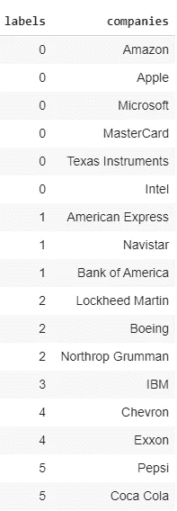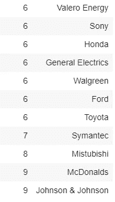

像百事可乐和可口可乐这样的软饮料制造商，像雪佛龙和埃克森这样的石油公司，像福特、丰田、本田这样的汽车制造商，像亚马逊、苹果、微软、英特尔这样的科技公司和像洛克希德·马丁、波音、诺斯罗普·格鲁曼这样的国防工业都聚集在一起。

如果再次运行流水线，我们会得到不同的聚类形成结果，因为在 K-Means 聚类中，质心初始化的开始步骤是随机的。

**kmeans.inertia_** 给出 K 均值聚类的代价函数得分。随着聚类数量的增加，惯性分数会下降。

## **PCA 减少**

具有 755 个特征(755 天)的高维数据“norm_movement”被缩减为具有 2 个特征(2 天)的二维数据，然后应用 k 均值聚类。这样我们就可以在二维图上画出聚集的公司。

下面给出了归一化、减少(PCA 减少)和应用 K-Means 聚类算法的流水线。

```
# Define a normalizer **normalizer = Normalizer()**# Reduce the data **reduced_data = PCA(n_components = 2)**# Create Kmeans model **kmeans = KMeans(n_clusters = 10,max_iter = 1000)**# Make a pipeline chaining normalizer, pca and kmeans **pipeline = make_pipeline(normalizer,reduced_data,kmeans)**# Fit pipeline to daily stock movements **pipeline.fit(movements)**# Prediction **labels = pipeline.predict(movements)**# Create dataframe to store companies and predicted labels
**df2 = pd.DataFrame({'labels':labels,'companies':list(companies_dict.keys())}).sort_values(by=['labels'],axis = 0)**
```

现在让我们看看集群公司。

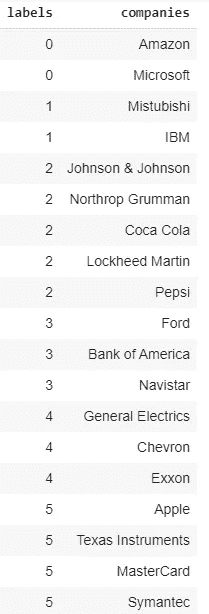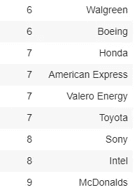

有 PCA 减少的簇形成不同于没有 PCA 减少的簇形成。PCA 减少的缺点是丢失了一些细节。结果不是很准确。主成分分析减少的优点是计算能力更低，易于可视化。

决策边界绘制如下。

```
**from sklearn.decomposition import PCA**# Reduce the dat**a
reduced_data = PCA(n_components = 2).fit_transform(norm_movements)**# Define step size of mesh **h = 0.01**# Plot the decision boundary **x_min,x_max = reduced_data[:,0].min()-1, reduced_data[:,0].max() + 1
y_min,y_max = reduced_data[:,1].min()-1, reduced_data[:,1].max() + 1
xx,yy = np.meshgrid(np.arange(x_min,x_max,h),np.arange(y_min,y_max,h))**# Obtain labels for each point in the mesh using our trained model **Z = kmeans.predict(np.c_[xx.ravel(),yy.ravel()])**# Put the result into a color plot **Z = Z.reshape(xx.shape)**# Define color plot **cmap = plt.cm.Paired**# Plotting figure **plt.clf()
plt.figure(figsize=(10,10))
plt.imshow(Z,interpolation = ‘nearest’,extent=(xx.min(),xx.max(),yy.min(),yy.max()),cmap = cmap,aspect = ‘auto’,origin = ‘lower’)****plt.plot(reduced_data[:,0],reduced_data[:,1],’k.’,markersize = 5)**# Plot the centroid of each cluster as a white X **centroids = kmeans.cluster_centers_
plt.scatter(centroids[:,0],centroids[:,1],marker = ‘x’,s = 169,linewidths = 3,color = ‘w’,zorder = 10)****plt.title(‘K-Means clustering on stock market movements (PCA-Reduced data)’)
plt.xlim(x_min,x_max)
plt.ylim(y_min,y_max)
plt.show()**
```

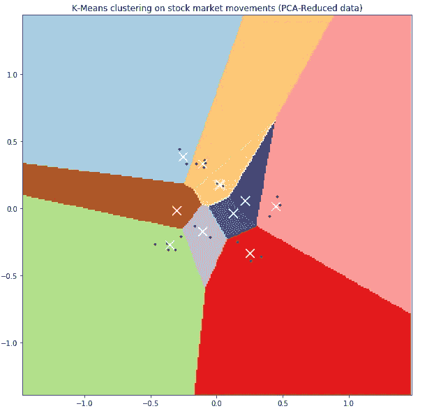

Each black point represents a company. Each white cross represents the centroid of respective cluster.

快乐阅读！