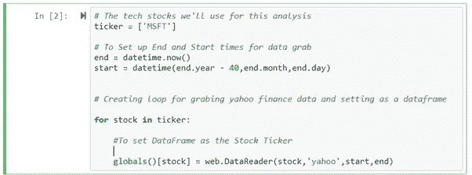
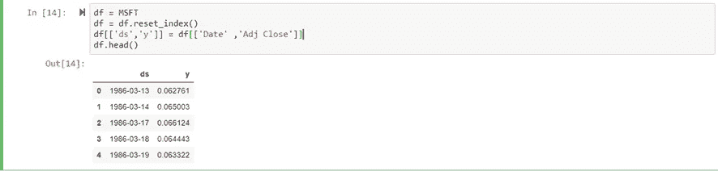
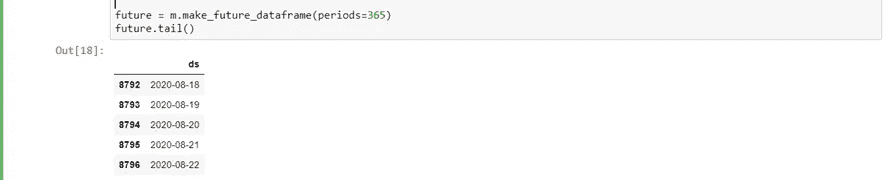
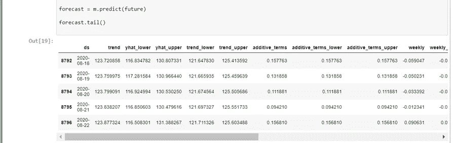
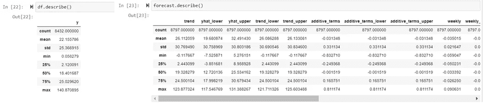
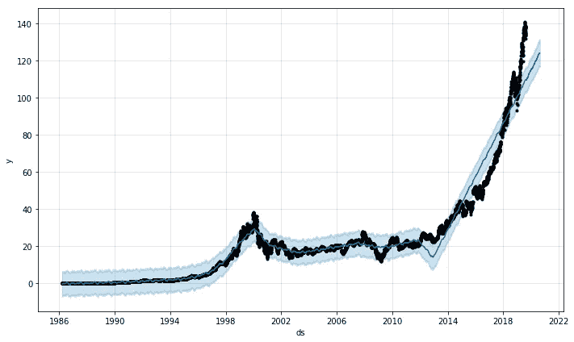
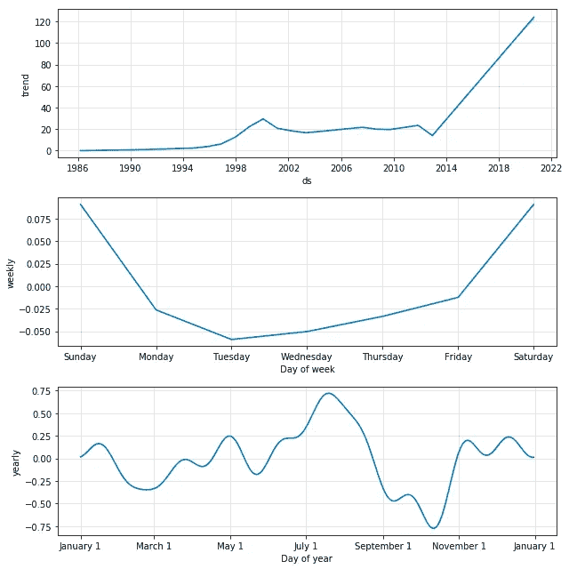

# 利用 python 和 fbprophet(prophet)库进行股票价格预测(上)

> 原文：<https://medium.datadriveninvestor.com/stock-price-prediction-with-the-help-of-python-and-fbprophet-prophet-library-part-1-3-f55ebff0b624?source=collection_archive---------2----------------------->

预测股票价格是金融市场上最热门的话题之一。所有这些预测和预报中最有趣的一点是它们都不准确。股票市场和股票价格的变化取决于很多因素，如供求关系、利率、利润以及市场和投资者的情绪。

因此，在预测价格时，我们只能希望尽可能准确。在本文中，我们不会讨论对错，而是将使用 Python 及其库等统计工具来分析过去的数据和趋势，以预测未来的价格。

我将这个项目分成了三篇不同的文章，在每一部分中，我们都将介绍不同的 Python 库来预测股票价格。在本文中，我们将使用脸书预测库“fbpredict”。

 [## 成为数据科学家所需的 8 项技能|数据驱动型投资者

### 数字吓不倒你？没有什么比一张漂亮的 excel 表更令人满意的了？你会说几种语言…

www.datadriveninvestor.com](https://www.datadriveninvestor.com/2019/02/07/8-skills-you-need-to-become-a-data-scientist/) 

K **ey 术语和工具:**

*   **Python** —一种用于数据分析的高级编程语言。
*   **熊猫**——数据争论、操纵和分析库
*   **NumPy** —统计计算库
*   **Matplotlib** —可视化和绘图库
*   **Jupyter 笔记本** —支持 python 代码的笔记本编辑器
*   **雅虎财经 API** —提供股票数据
*   **股票代码** —股票在交易所交易的符号。
*   **股市分析** —基于当前属性分析未来股票价格的过程，也包括基于历史数据和价格预测未来价格。Is 有两种常见的方法:1)基本面分析和 2)技术分析([更多](https://www.investopedia.com/terms/s/stock-analysis.asp) [这里](https://www.investopedia.com/terms/s/stock-analysis.asp))
*   **时间序列预测** —通过对历史事实、数字&数据进行时间排序分析后，预测或预测未来事件的一种方法，应用于各类领域。

**那么，我们开始吧:**

导入库:

> 从 pandas import Series 导入 pandas 作为 pd
> ，DataFrame
> 导入 numpy 作为 np
> 
> #为了可视化
> 导入 matplotlib.pyplot 作为 plt
> 
> %matplotlib 内联
> 
> #从 yahoo API 读取股票数据
> 导入 pandas_datareader 作为 web

C **颂:**

#我们将使用微软(股票代码为“MSFT”)的股票进行分析。

因为 Prophet library 只允许两列输入，并要求日期作为时间序列预测的输入之一。我们将使用“Adj Close”列值并创建另一个数据框，然后重置索引。因此，日期索引列成为 Prophet 模型的输入列。

> **或**我们可以使用上面下面的代码:
> 
> #将 DataFrame 设置为股票代码
> globals()[stock] = web。DataReader(股票，'雅虎'，开始，结束)['Adj Close']

F预测:

**先知:**

Prophet 是由脸书开发的 python 库，用于时间序列预测，不需要数据预处理。Prophet 中的模型采用具有两列(数据(ds)和目标(y ))的数据框架来捕获历史数据中的模式和季节性。

**Pro:** Prophet 处理缺失数据，相对于其他用于预测的 python 库更好。

**反对:**允许有限数量的列。

> #导入先知库:
> 
> 导入 fbprophet

#导入 prophet 库后，我们需要创建一个 Prophet 对象的实例。
# [实例化](https://www.tutorialspoint.com/python/python_classes_objects.htm)—创建一个类的实例。

方法——在类定义中定义的一种特殊的函数。对象——由其类定义的数据结构的唯一实例。

> m = fbprophet。先知()

#现在，我们必须对 prophet 对象使用 fit 方法，并传入我们的 dataframe，因为我们需要使我们的模型符合我们的历史数据。

> m.fit

#现在是时候使用 Prophet 及其内置的帮助功能“make_future_dataframe”来创建未来日期了

> future = m . make _ future _ data frame(periods = 365)
> future . tail()

#创建日期后，我们可以使用预测方法预测未来的股票价格:

C

显然，我们可以观察到预测的数据在许多属性上进行了比较。

V可视化:

> m.plot(预测)；

#可以使用 Prophet 内置的“plot_components”方法实现单个预测组件的可视化:

> m.plot_components(预测)；

F最终想法

这个项目是一个测试，在本文的下两部分中，我们将使用更多的预测库，并且我们将检查预测数据以进行验证。

J upiter 笔记本:点击[这里](https://github.com/rakshitratan/Stock-Price-Prediction)

# Python # fbprophet # Prophet #股票

S 暗示

有很多文章与这个主题相关，这里有一篇文章涵盖了所有的基础知识:**使用机器学习预测股票价格**

 [## 使用机器学习预测股票价格- neptune.ai

### 众所周知，股票市场是不稳定的，动态的，非线性的。准确的股价预测是极其…

海王星. ai](https://neptune.ai/blog/predicting-stock-prices-using-machine-learning)