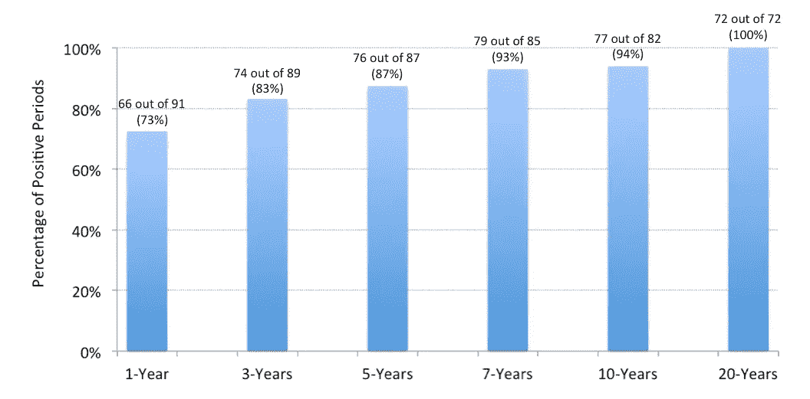

# 短线炒股？也许不是…

> 原文：<https://medium.datadriveninvestor.com/stocks-for-the-short-run-maybe-not-d2dcdcff9f73?source=collection_archive---------6----------------------->

Photo by [Aron Visuals](https://unsplash.com/photos/BXOXnQ26B7o?utm_source=unsplash&utm_medium=referral&utm_content=creditCopyText) on [Unsplash](https://unsplash.com/search/photos/time?utm_source=unsplash&utm_medium=referral&utm_content=creditCopyText)

传统观点认为，从长远来看，股票是最好的投资，这一观点因杰里米·西格尔博士的著作《长期股票》而闻名，该书于 1994 年首次出版，目前已出了第五版。

表面上看是有道理的。标准普尔 500 指数在过去 91 年(1928 年至 2018 年)*的年均回报率为 9.5%。

 [## 算法交易的机器学习-数据驱动的投资者

### 当你的一个朋友在脸书上传你的新海滩照，平台建议给你的脸加上标签，这是…

www.datadriveninvestor.com](https://www.datadriveninvestor.com/2019/01/30/machine-learning-for-stock-market-investing/) 

在此期间，你可能不得不经历一些相当剧烈的下跌。包括目睹你的投资在 20 世纪 30 年代的大萧条期间缩水 65%，在 2008 年的金融危机期间缩水超过一半。

然而，1927 年底投资于股市的 1 美元到 2018 年底将增长到 3，828.50 美元。在 1 美元后面多加几个零，你就在谈论一些大数目了。

但我们大多数人不会投资 90 年以上。为退休储蓄通常是我们最长期的目标之一，即使如此，我们也在谈论 40-50 年(假设你在 20 多岁开始投资，在 60 多岁退休)。

短期财务目标呢？

我们的一些目标是短期的，大约 3 到 10 年。例如，为新房子或汽车存钱。像为大学存钱这样的目标只是稍微长一点，在 10 到 18 年之间，取决于父母什么时候开始存钱。

那么，如果你在为短期目标存钱，投资股票还有意义吗？

鉴于“长期股票”这一格言是基于历史证据，让我们也这样做，看看股票在短期内的表现如何。明显的警告是，过去的表现并不代表未来的结果。

我计算了 1928 年至 2018 年间标准普尔 500 股指的历史回报率，并计算了 3 年、5 年、7 年、10 年和 20 年的滚动回报率。例如，第一个三年期是 1928-1931 年，随后是 1929-1932 年，…最终在 2016-2018 年结束。

另一方面，前二十年是 1928-1947 年，后二十年是 1999-2018 年。

下图显示了每个投资范围的正周期百分比，以及正周期的实际数量。

Positive periods over various investment horizons for an all-stock portfolio (S&P 500 index).

一年期的不确定性最大:91 年中有 66 年出现正回报(73%)，而 25 年中股市下跌。

三年期的正周期频率上升，达到 89 个中的 74 个(83%)。在 15 个三年负周期中，最糟糕的一个发生在大萧条时期，当时股市下跌了 62% (1930 年至 1932 年)。

在 5 年期间，有 9 年是负回报。其中最糟糕的一次也发生在大萧条时期(1928 年至 1932 年)，当时标准普尔 500 指数下跌了 49%。

如果你在五年内投资 100，000 美元作为房屋首付，当你准备买房时，你不会想发现账户价值少于 50，000 美元。

将投资期限延长至 7 年或 10 年，可以降低出现负周期的可能性。但它们还是发生了:在 82 个十年期里，有 5 个十年期股市下跌。其中两项包括:

1929–1938: -16%

1999–2008: -13%.

只有当你把投资时间跨度延长到 20 年，你才不会得到单一的负回报期。“最糟糕”的 20 年(1929-1948 年)的总回报率接近 60%，相当于同期的年回报率为 2.4%。不是很好，但还是积极的。

事实上，最近的二十年，即 1999 年至 2018 年，是最差的五年之一。然而，尽管经历了两次市场崩溃(科技泡沫和金融危机)，股票仍然上涨了 195%——相当于每年上涨约 5.6%。

因此，股票是长期的。

虽然正如我们在上面看到的，不确定性随着投资时间的缩短而增加。

多元化投资组合怎么样？

如果 100%的股票投资组合对短期目标来说不理想，那么问题是用债券来平衡股票是否更好。当股票波动时，债券通常会波动，反之亦然。因此，理论上，将这两者结合起来应该会减少消极时期的频率。

与之前的练习类似，我研究了股票和债券各占 50%至 50%的投资组合的滚动 3 年、5 年、7 年、10 年和 20 年回报**。

下图显示了每个投资范围的正周期百分比，以及正周期的实际数量。

Positive periods over various investment horizons for a balanced 50–50 stock/bond portfolio (S&P 500 index and 10-year US treasuries).

在一年的时间里，50-50 的股票/债券投资组合比 100%的股票投资组合表现更好。首先，91 年中有 72 年是正数(81%)，相比之下，仅股票投资组合就有 66 年是正数。更大的问题是，50-50 投资组合的最差年份回报率为-23%，而全股票投资组合的回报率为-44%(两者都发生在 1931 年)。因此，你可以看到债券投资组合的多样化在过去是多么有帮助。

随着投资范围的扩大，50-50 投资组合继续表现更好。虽然即使在三年和五年的时间框架内，股票和债券的平衡投资组合也没有 100%的成功率。三年期和五年期最糟糕的负周期将分别从 1000 美元跌至 667 美元和 830 美元。

超过 7 年的平衡投资组合从未出现过负周期。当然，这是过去的事了，没有人确定将来会是这样。

因此，即使是一个五五开的股票债券投资组合，对于三到五年的短期目标来说也可能不理想。更不用说全股票投资组合了。

看到你的投资组合缩水的可能性可能很小，但它发生的可能性很小，就在你需要钱的时候。

相反，在为短期目标存钱时，流动性高的高收益储蓄账户可能是最佳选择。

***脚注***

**股票收益由标准普尔 500 指数代表。回报包括股息，是平均复合年回报。债券回报由 10 年期国债回报代替。*

*本文使用的所有数据均来自 Aswath Damodaran 博士的博客。*

** *股票和债券投资组合由 50%的标准普尔 500 指数和 50%的美国 10 年期国债组成，每年进行再平衡。*