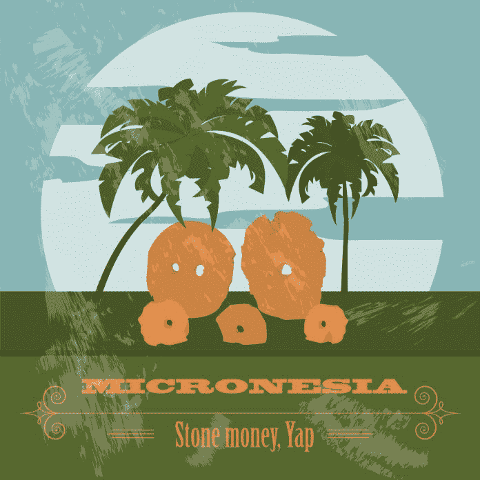

# 这个太平洋岛屿上的“石币”是历史上第一个公共账本

> 原文：<https://medium.datadriveninvestor.com/stone-money-on-this-pacific-island-is-historys-first-public-ledger-c422d92f9ad9?source=collection_archive---------5----------------------->

密克罗尼西亚的雅浦岛，也被称为石钱岛，是一个 40 平方英里的岛屿，位于南太平洋关岛西南 500 英里处。它位于赤道以北 9.5 度，这使得长达一年的夏季让人无法忍受*的炎热*(对于外人来说)。由于气候变化和厄尔尼诺/拉尼娜天气模式不断演变的影响，典型的降雨模式在过去几年发生了变化。

大多数远离少数游客的地方是美丽的石板路，作为村内的步行道。这些石板路延伸到芋头地和热带丛林深处。槟榔树和椰子树的树荫使道路凉爽，这是抵御赤道炎热的一种自然形式。

然而，天气模式和槟榔果不是 [Milton Friedman](https://archive.org/stream/IslandOfStoneMoney/island%20of%20stone%20money_djvu.txt) 写的一篇著名文章的主题。

虽然很少有人去雅浦，FM 旅游，尤其是那些在西半球的人，但它以其丰富的文化、蝠鲼和石钱而闻名于考古学家和潜水者圈子。由于它靠近关岛的安德森空军基地，它再次(可能)成为一个社会政治关注的地方。

在 20 世纪 70 年代之前，密克罗尼西亚的四个岛国(除了数百个外岛和更小的环礁之外)，除了共同的殖民主义历史之外，彼此之间几乎没有什么共同点。当初是西方帝国主义把四岛变成了一个国家。然而，尽管经历了漫长的殖民历史，密克罗尼西亚的四个岛屿----波纳佩岛、丘克岛、科斯雷岛和雅浦岛----都保持了独特的文化和语言。例如，雅浦直到今天还保持着严格的九级种姓制度。

雅浦剩余的第二个文化元素是石头钱。

# 石钱岛

石头钱到底是什么？在 700 到 1000 年前，古代雅皮士航海家在开阔的水域划了数百英里的独木舟，鲨鱼、台风和其他任何会让你在海洋中拖着 4 吨重的巨石时吓得魂不附体的东西。这些勇敢的航海家用一只只靠星光指引的小型舷外独木舟运送石头钱。“为什么会有人这么做？”你可能会问自己:把被称为 Rai 石头的巨大的 4 吨重的石头带到岛上的酋长那里，这样雅浦人就可以把这种石头作为一种原始货币。这种货币形式一直沿用至今。

是的，我们在谈论石头钱。迄今为止最大的 rai 石头有 8800 磅重，1.6 英尺厚。关于这些石头是否真的构成了一种货币形式，一直存在争议。为自己辩护，著名的经济学家如[米尔顿·弗里德曼](https://miltonfriedman.hoover.org/friedman_images/Collections/2016c21/Stanford_02_01_1991.pdf)写了大量关于岛上石头的文章。

# 石头货币:一种文化货币

石币是(直到今天，*仍是)*一种文化货币。例如，如果你的女儿要结婚了，你可能会把钱给儿子的家人作为欢迎的一种形式。现在，石头钱不像过去那样被广泛使用了。然而，石头钱在某些情况下有了新的含义。今天，石币通常被用来代表房子或房子所在的土地。因此，虽然石头钱是一种货币，但它并不是以你今天所认为的大多数货币的方式使用的，无论是数字货币还是法定货币。

然而，如果你认为它更像一种货币形式而不是另一种，那么与它的法定对应物相比，石头货币可能会令人惊讶地更像数字货币。对于这个论点，石头钱的所有权是在公共账上，很难开采，它的供应是固定的。政府没有自行决定印出更多。石头钱已经有 100 多年没有被开采了。

如果你问一个雅皮士谁拥有一块特定的石头钱，他们会告诉你。没有争论。事实上，雅皮士可以告诉你谁拥有沉入海底的石币。雅浦人对开采出来的每一块石头都保持着密切而仔细的记录。

# 不动的钱

在历史上的某个时间点之后，他们停止转移大量的石头钱，因为转移的过程变得太繁琐，石头变得太脆弱。此时，与另一个人交换的石头钱，不管是什么原因，都留在了原地。如果你给一块石头钱，作为对另一个村庄做了非常不尊重的事情的道歉，那么这块石头可能会留在它现在所在的地方。然而，每个人都会知道，那块特定的石头钱属于那个被不尊重的人。

这很可能是经济学史上第一个使用公共分类账系统的例子。由于有一个商定的所有权分类账，雅皮士保持了一种谨慎的组织方法。用石头钱是不可能发生双重花费的，因为你会被人们对账本的理解所阻止。“那属于某某人，”他们会告诉你。任何加倍花石头钱的努力都会被挫败。

石头货币更像数字货币而不是法定货币的第二个原因是开采石头货币的难度。比特币挖矿过程既昂贵又繁琐。所有的计算机硬件，更不用说花在安装上的时间了。然而，数字货币的加密、高处理器矿工不能抱怨采矿的困难，因为古代雅皮士航海家携带石头货币穿越数百英里的开阔水域。石头钱的价格评估的一部分是把石头带回雅浦的旅程。石头越大，旅程越乏味，石头的价值就越高。

除了前两个原因，石头货币与数字货币惊人相似的第三个原因是石头货币流通的固定供应。雅皮士人已经完全开采完了石头钱。现在在岛上的 rai 石头将会在剩下的时间里一直在那里，除了自然灾害或类似的事情。这些石头不再由航海家根据岛屿酋长的命令划着独木舟运送。换句话说，现在可用的石头钱的数量是将永远存在的石头钱的数量。它不能像钞票一样被随意复制。

旧学者认为雅浦人是原始的，石头钱的概念是愚蠢的。然而，几年后，我们看到了另一个例子，一些被认为是过时的东西实际上是超前的。鉴于石头货币和现代数字货币特征之间惊人的相似性，雅皮士人肯定比世界上其他人更早发现了一些东西。

# 最后

如果你有机会去雅浦亲眼看看石头钱，我强烈建议。太平洋日出的壮丽景色本身就值得一游。但如果这对你来说还不够，看到石头钱及其背后数百年的文化应该是一个主要的催化剂，让你立即预订飞往雅浦。

*原载于 2018 年 8 月 23 日*[*【www.datadriveninvestor.com】*](http://www.datadriveninvestor.com/2018/08/23/stone-money-on-this-pacific-island-is-historys-first-public-ledger/)*。*