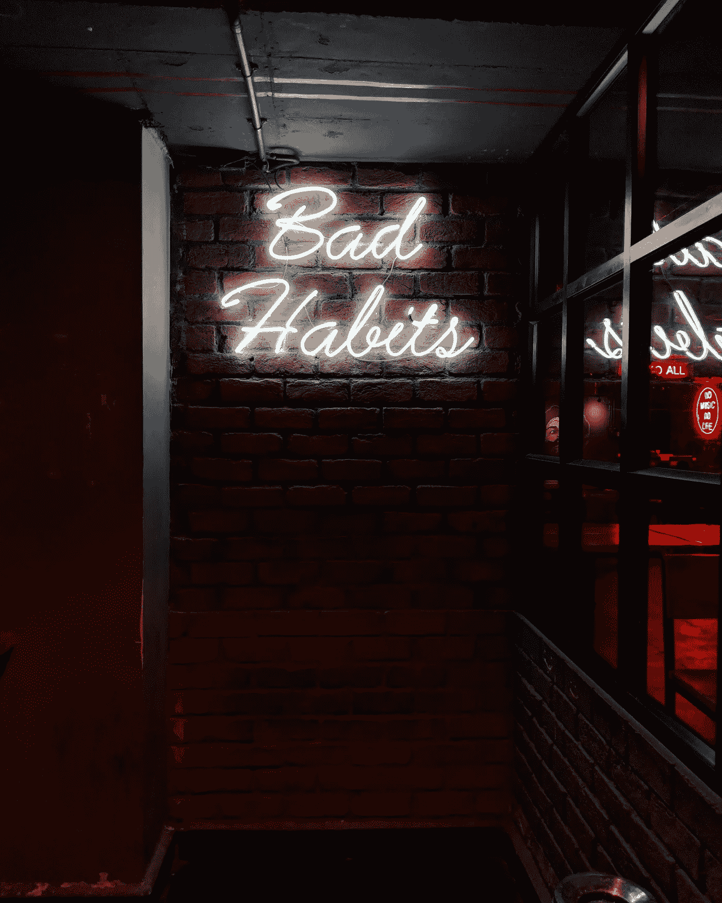

# 开始之前先停下来

> 原文：<https://medium.datadriveninvestor.com/stop-before-you-start-8fa1b683d766?source=collection_archive---------5----------------------->

与沃伦·巴菲特一起避免顽固不化的坏习惯(二手灵感项目)

Photo by [Manan Chhabra](https://unsplash.com/@manancfc23?utm_source=unsplash&utm_medium=referral&utm_content=creditCopyText) on [Unsplash](https://unsplash.com/search/photos/habits?utm_source=unsplash&utm_medium=referral&utm_content=creditCopyText)

二手灵感项目从一句激励性的引语开始，在创造性道路蜿蜒的任何地方冒险。

> "习惯的锁链轻到感觉不到，直到重到无法挣脱."—沃伦·巴菲特

像许多高成就者一样，我是一个个人进步迷。

我像一个瘾君子一样研究自助文章和书籍，寻找永远不会满足的快感。我尝试新的方法和工作表。我修补待办事项列表方法和个人使命陈述。冥想、咒语、节食、零收件箱、疯狂的日常锻炼——我都尝试过，试图把我变成一个更好的我。

 [## 成功的生活数据驱动型投资者的 25 种自我提升方式

### “我活得越久，学到的就越多。学的越多，体会的越多，知道的越少。”―米切尔·莱格兰德时间到…

www.datadriveninvestor.com](https://www.datadriveninvestor.com/2019/03/12/25-self-improvement-ways-for-a-successful-life/) 

在这个近乎疯狂地寻找下一个能优化我的方法的过程中，我注意到了一些事情——有很多关于你应该尝试的事情的建议，但是关于你不应该做什么的建议却不多。

自我提升的很大一部分是变得足够明智和成熟，以避免做出糟糕的选择。放弃捷径。回避自我破坏的行为。远离那些感觉错误的事情，而不是扭曲你的道德准则，让它们看起来正确。

我没有再列出一份崇高目标和不切实际习惯的清单，而是后退一步。我列出了 15 个我不想开始的习惯。显然是受到了我经历过的戏剧的影响。虽然很刻薄，但它巧妙地提供了一个有效的个人妥协路线图，这是我不想做的。

冒着过度分享的风险(见第四条)，以下是我个人想要避免的行为:

1.迟到。

2.走路没精打采。坐着时无精打采。总体上没精打采。

3.咬指甲。

4.告诉朋友和同事我生活的每一个细节。我不想过度分享，无论是在社交媒体上还是在现实生活中。

5.吃饭前不洗手。这对我来说从来都不是问题，但是我从来不想在卫生方面松懈。

6.想着有毒的人。

7.当我说话时使用填充词。那些“喜欢”、“嗯”和“呃”会让人们对我做出判断，无论对错。

8.开车时上网或发短信。

9.当我说“不”的时候说“是”。我不应该同意与我的目标不一致的废话。

10.不吃饭来减肥。

11.不接受别人提供的帮助，试图一个人做所有的事情。

12.试图完成我不喜欢的书、电影或项目……只是为了说我完成了它们。

13.在工作中抱怨太多(如果 T2 真的有那么糟糕，就找份新工作)。

14.在人们谈话时打断他们。即使他们错了。等到他们停止或暂停后再回应。

15.365 年 7 月 24 日都带着数码皮带。只要可行，就把智能手机收起来。

通过列出禁忌，我对自己有了更多的了解。虽然我永远不会完全放弃我一头扎进自助时尚的古怪做法，但列出一个禁忌清单是未来个人发展的一个有用的起点——我必须避免这些行为，因为我试图采取我的最终形式。

对于拥有不同生活经历和目标的人来说，我的清单可能是琐碎的，无关紧要的，或者毫无价值的。那么，在你的习惯清单上有哪些是永远不要开始的呢？这些事情说明了你什么？

阿德里安·s·波特是一名作家、工程师、顾问和演说家。他写诗歌、短篇小说和各种主题的文章，包括创造力和个人成长。他是诗集[和散文集](https://www.amazon.com/Everything-Wrong-Feels-Adrian-Potter/dp/109519061X/ref=sr_1_4?qid=1560264651&refinements=p_27%3AAdrian+S.+Potter&s=books&sr=1-4&text=Adrian+S.+Potter)[的作者。在](https://e2857002-6118-41be-9746-64261e36cacb.filesusr.com/ugd/21d2c2_03522f10c7c84340a05a8d03a97e1642.pdf)[http://adrianspotter.com/](http://adrianspotter.com/)在线拜访他。