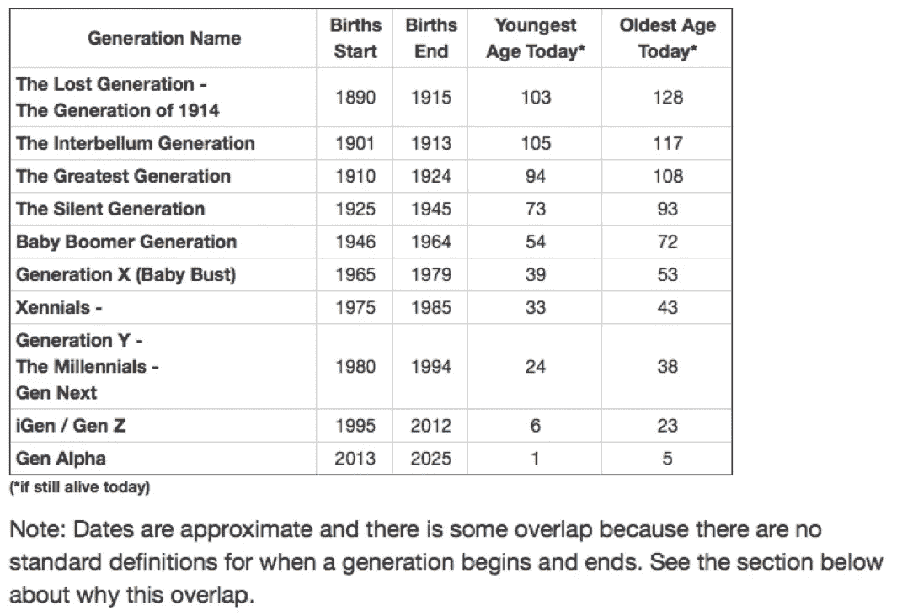

# 不是所有比你年轻的人都是千禧一代

> 原文：<https://medium.datadriveninvestor.com/stop-calling-everyone-younger-than-you-a-millennial-8d6af42e6f37?source=collection_archive---------5----------------------->

诚然，千禧一代获得了最酷的昵称。但是今天地球上有多达十代人(取决于你如何计算)还活着……

Photo by [redcharlie](https://unsplash.com/@redcharlie?utm_source=medium&utm_medium=referral) on [Unsplash](https://unsplash.com?utm_source=medium&utm_medium=referral)

一天晚上在酒吧，我们的一个朋友说，“我不认为自己是千禧一代。但是千禧一代到底怎么了？?"

我们委婉地解释说，你无法选择自己是否是千禧一代，这只是与你出生的年份有关，这让她很失望。她考虑告诉所有人她比实际年龄大 10 岁，只是为了避免被贴上这个标签，这个标签说明了整整一代人有多坏。

然而，仅仅因为某人比你小，并不一定使他成为千禧一代。

下面是来自 careerplanner.com[的一些分析:](https://www.careerplanner.com/Career-Articles/Generations.cfm)

没错，伙计们——最老的千禧一代快四十岁了！！修卡，对吗？此外，除了“千禧一代”，还有 X 世代、X 世代、Z 世代和 Alpha 世代。

“千禧一代”一词来源于这样一种想法，即这一代人将在 21 世纪初步入成年。这意味着他们必须在新千年到来之前出生。

我自己是 X 一代中骄傲的持卡人(我第一次不得不与千禧一代共用一间办公室时就印好了卡片)，也是帕克兰枪击案后致力于枪支法律改革的青少年的崇拜者，我希望人们不要再用“千禧一代”这个词来概括“不是婴儿潮一代”，或者更糟的是，“我无法理解的被宠坏的小性急”。

不管公平与否，千禧一代被贴上了被宠坏、有权利、成熟缓慢和/或搬出父母家的标签，并且通常对现实世界缺乏准备。再说一次，不管公平与否，这是这些 24-38 岁的人现在必须应对的情绪。这一代人需要更长时间才能负担得起搬出父母的房子的很多原因都与高等教育和新房成本的飙升以及目前困扰我们经济的停滞不前的工资问题有关——这些事情与千禧一代仅仅因为在团队中而获得奖杯的事实无关，更多的是与自由市场被推崇、保护和随时纾困有关。

尽管我开玩笑说与千禧一代一起工作，但让我明确表示，我个人更喜欢根据个人经历和互动结交每一个新朋友。我遇到过一些被宠坏的千禧一代，但我也遇到过一些自恋且有资格的老家伙。但是，给一个和你成长方式不同的人贴上标签可能会很有诱惑力，当几代人为了一个共同的目标走到一起时，我们真的需要处理很大的差异——比如在工作场所、社区活动或社交聚会上。

如果我们在随意的交谈中完全抛开这些标签，并记住我们都是有独特而宝贵的经历可以借鉴和学习的人，也许会更有帮助。