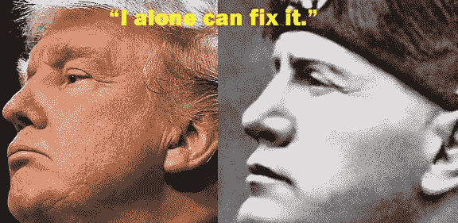

# 唐纳德·特朗普不只是在电视上扮演种族主义者；他真的是个种族主义者。

> 原文：<https://medium.datadriveninvestor.com/stop-kidding-yourself-trump-isnt-playing-a-racist-on-tv-he-is-a-racist-dd0cbd3a4b46?source=collection_archive---------8----------------------->

自从唐纳德·特朗普(Donald Trump)走下特朗普大厦(Trump Tower)的自动扶梯告诉我们，墨西哥没有给我们送去他们的“最好的人”，他的辩护者就一直在用一种有害的方式向我们灌输一种观点，有偿发言人向我们保证，他说的不是他真正的意思，我们应该忽略他每天在 Twitter 上的种族主义蠢话，我们应该关注他做的，而不是他说的，他知道得更好，但像约瑟夫·戈培尔(Joseph Goebbels)以来最稳定的营销天才一样在利用他的基础。

在上周的集会上，他允许他的一群令人痛心的吵闹的人高唱最古老、最厌倦的种族侮辱——“送她回家”——关于四名美国国会女议员，她们只是碰巧是黑人或棕色人种，什么也没说，这应该能说服最怀疑的人。唐纳德·特朗普是一个种族主义者，他真的相信他嘴里说的白人至上主义的废话。

 [## 保护主义、政治和经济动荡|数据驱动的投资者

### 美国股市昨日出现 400 多点的大幅反转，为未来的事情发出了警告信号。市场…

www.datadriveninvestor.com](https://www.datadriveninvestor.com/2018/06/28/protectionism-politics-economic-turmoil/) 

从那以后，他试图用美国国旗(奇怪的是，还有以色列国旗)包裹自己，指责这些女人“仇恨美国”，称美国和美国人是“垃圾”，是反犹太主义者，以此来稍微清理一下这个丑陋的事件。(实际上，没有一位女议员说过这些话。)

事实是，讨厌美国的是唐纳德·特朗普。他在就职演说中宣称“美国大屠杀”即将结束。正是他不相信“上帝之下，人人享有自由和公正的国家”这一概念。他显然不相信“人人生而平等”他说过(在这种情况下，我倾向于相信他)他不相信[美国例外论](https://www.nytimes.com/2019/07/16/us/politics/trump-america-criticism.html)——即美国比朝鲜更有资格占据道德制高点或更致力于自由和平等。

我在这个星球上生活了 75 年，在这期间的大部分时间里，我一直认为美国是世界上最伟大、最强大的国家，是由移民——逃离宗教和经济迫害的难民——建造的自由堡垒，在这里，所有种族的勤劳人民都有权成为他们想成为的任何人，只要他们有天赋和聪明才智。

这是一片真正充满机遇的土地，在这里，即使是一个德国移民后裔的年轻人，也可以从他热爱三 k 党的父亲那里继承 4 亿美元的遗产，建立一个帝国，这个帝国现在的价值至少相当于他把父亲的钱投资到一个像样的指数基金的价值。

事实上，正是唐纳德·j·特朗普(Donald J. Trump)为了自己的政治目的，将诋毁美国及其政治体系变成了一项冷血运动。否则我们怎么会知道，在过去 240 年的美国历史中，政客们一直在悄悄地从内部摧毁美国，他们是笨蛋，做糟糕的贸易交易，允许非白人甚至非基督徒进入我们的国家？

这就是为什么世界上所有的黑人、棕色人种和黄种人都比我们今天过得好得多。你知道我们美国人只拥有全世界 41.6%的财富吗？悲哀。

他向我们保证，我们需要的是一个能带领我们回到美国真正伟大的时代的男人。

你记得那些日子吗？

女人们天一亮就起床给她们的男人做饼干和肉汤，然后去田里和工厂挣足够的钱来支付亿万富翁的税款，并且住得离“有色人种”越远越好。

孩子们没有和你顶嘴，因为他们知道你会把他们痛打一顿。

学校是分开的，但却是平等的，每个 10 岁以上的孩子都有天赋的权利去矿山和磨坊工作。

女性不需要上大学，因为每个人都知道她们“无论如何都会结婚并怀孕。”粗野的男人在一顿公费午餐结束时互相说:“我会让我的女朋友打电话给你的女朋友。”

在那些日子里，没有穆斯林，没有战争，没有洪水，没有飓风，没有龙卷风。火车总是准时运行。

我过去不相信特朗普的大部分支持者是有意的种族主义者、恐同者或白人至上主义者(尽管这些人几乎肯定会投票给他)。现在，我不太确定。

显然，一小部分人(很大一部分人)已经被他们认为太多太快的变化弄得精神错乱了。白人多数的迅速衰落，白宫里的黑人家庭，同性婚姻，浴室里的变性人，嘻哈音乐，玉米卷卡车，宽松的裤子，在沃尔玛用西班牙语交谈而不是和你交谈的阿米加人。这些每天都在提醒我们，我们已经不住在堪萨斯了。年长的白人完全被对新事物和未知事物的恐惧淹没了。随着更年轻、更宽容、受过更好教育、更多样化的人改变我们的人口结构，这种情况最终将会改变。但是，种族主义者唐纳德·特朗普每天都在活生生地证明我们还没有到那一步。