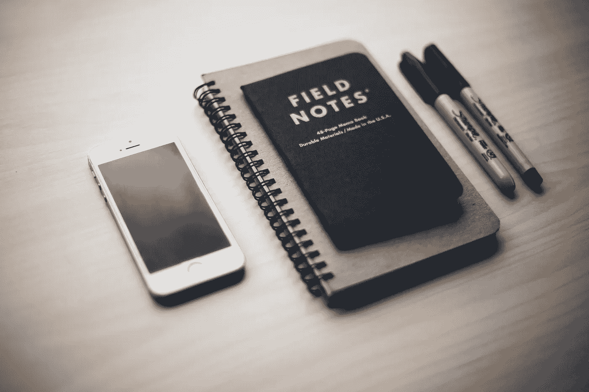

# 不要让好主意溜走

> 原文：<https://medium.datadriveninvestor.com/stop-letting-good-ideas-slip-away-8fad8097b49e?source=collection_archive---------13----------------------->

像有些人吸毒一样记笔记与科里·泰勒和蒂姆·费里斯(二手灵感项目)

Photo by [Kari Shea](https://unsplash.com/@karishea?utm_source=unsplash&utm_medium=referral&utm_content=creditCopyText) on [Unsplash](https://unsplash.com/search/photos/take-notes?utm_source=unsplash&utm_medium=referral&utm_content=creditCopyText)

二手灵感项目从一句激励性的引语开始，在创造性道路蜿蜒的任何地方冒险。

> “我每天都有想法，如果我没有带着一沓纸，我就会把它输入到我 iPhone 上的便签里，这太可笑了——闲手是魔鬼的玩物，我不能成为魔鬼的玩物。我要成为魔鬼；我要成为让这一切发生的人。”—科里·泰勒

我们都有大量非凡的想法、不可思议的想法和惊人的抱负。

但是没有执行的想法是没有价值的。如果我们甚至不记得最初是什么想法让我们的灯泡亮了起来，那么我们就不可能把它们付诸行动。

 [## 跑步摆脱疯狂:锻炼如何提高你的生产力|数据驱动的投资者

### 没有比锻炼更好的方式来开始一天的工作了。我试着一周至少做四天，在…

www.datadriveninvestor.com](https://www.datadriveninvestor.com/2018/10/23/running-to-get-rid-of-the-crazy-how-working-out-increases-your-productivity/) 

我们忘记事情的次数比我们愿意承认的要多——我们下一幅画的创意，我们下一次演讲会的一个显著主题，我们正在写的一个短篇故事的完美标题，或者我们在咖啡店调情的那个可爱的人的电话号码。人类是忘记我们最需要的东西的大师。

谁能责怪我们忘记了呢？如今我们发现自己被事实淹没了。智能手机、短信、电子邮件、社交媒体、互联网等加剧了这种情况。如果我们能处理好，所有这些数据都很棒。但是如果我们不记得我们午餐吃了什么，或者不记得我们应该去哪个会议室，那么是什么让我们相信我们会回忆起头脑风暴会议、课堂或电话交谈的要点呢？

答案很简单，也是我们经常做的事情——记笔记。

企业家、自助类书籍作者蒂姆·费里斯曾打趣说，他“记笔记就像某些人吸毒一样。”记笔记为我们提供了突出重点和细节的机会，否则我们可能会忘记，我们永远不知道这些智慧的片段何时会派上用场。

记笔记有助于我们保留更多的数据和策划我们的想法。但它对提高我们在工作和家庭中的生产力也至关重要。以下是笔记对每个人都很重要的一些关键原因:

**记笔记可以缓解压力。当我们的头脑被太多的琐事纠缠时，写笔记可以帮助我们减少杂乱的想法，减轻压力。这也是一个很好的方法，让我们把压倒我们的事情放在一边，这样我们就可以专注于手头的任务。**

**笔记可以成为优质的参考资料。如果我们想在各自的领域获得成功，记笔记是实现成功的敲门砖。当我们培养自己的职业生涯并记录我们所学的内容时，notes 将为我们提供轻松访问自己自制的复习课程的途径。**

**记笔记有助于保持我们的日程完整。在工作日做笔记可以帮助我们专注于我们的待办事项。请求来自四面八方——电子邮件、电话、短信——让我们不被卷入忙碌但没有效率的日常生活变得很困难。在我们知道之前，一天已经过去了，我们的待办事项列表中只有一小部分完成了。我们可能会迷失在那些感觉紧急但并不紧急的任务上。当有新的请求进来时做笔记可以帮助我们把它们编织到我们即将到来的时间表中，而不会打乱我们一天的游戏计划。**

**记笔记能提高我们所做的一切事情的质量。**无论我们是在工作中整理报告，还是为即将到来的聚会调整食谱，记笔记都可以提供一条改进我们参与的每个项目、爱好和活动的途径。这是一种以细节为导向的方法来记录我们的过程，这将导致在办公室的专家地位或社交聚会上的满意客人。

**把笔记转换成有效的待办事项清单很简单。**开会上课的时候尤其如此。假设我们与同事进行了一次头脑风暴会议，或者有关于讲座的问题，那么我们记下之后需要跟进的概念。集思广益会议的笔记可以被翻转成待办事项列表，以确保会议结束后我们完成了您需要完成的任务。同样，课堂笔记给了我们一份清单，让我们在填补知识空白时可以遵循。

笔记是可以分享的，我们不应该回避分享。我们可以轻松地将笔记借给员工、朋友、客户等。优质笔记不仅能帮助我们建立强大的知识宝库，还能影响我们关心的人的生活。如果一名新员工需要跟进一个项目，他们可以使用我们的笔记进入正轨。如果一个朋友因为紧急情况错过了一节课，我们的笔记可以帮助他们赶上。这对所有参与者来说都是一个双赢的局面。通过用我们的笔记帮助别人，我们可能会在以后为自己赢得一些好的因果报应。

做笔记让我们看起来更好。它证明我们完全参与其中。它促使我们集中注意力，而不是让我们的思想开小差。做好笔记的能力可能会让我们在通常情况下不会被邀请参加的会议上获得一个“席位”，因为我们是一个体面的记录员。

伟大的想法和有用的信息是濒危资源——我们不能浪费或忘记它们。记笔记是一个微妙的行动，它可以储存我们生存和发展所需的所有精彩观点和关键事实。如果我们学着像一些吸毒的人一样记笔记，我们都可能会沉迷于这个习惯对我们生活的积极影响。