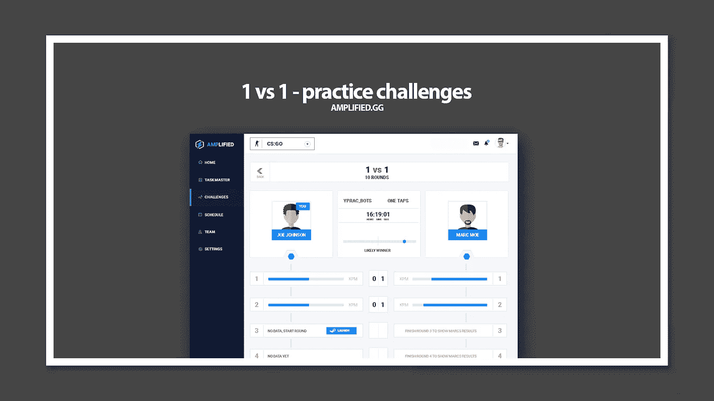
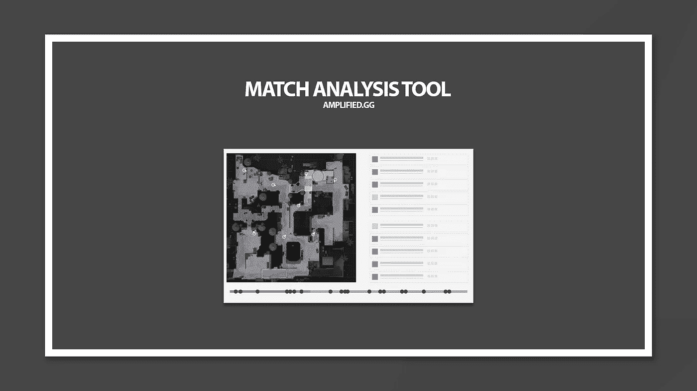

# 不要在游戏中失去理智——为什么心理学在电子竞技中如此重要

> 原文：<https://medium.datadriveninvestor.com/stop-loosing-your-head-in-your-game-why-psychology-matters-in-esports-f8e1f32ff289?source=collection_archive---------33----------------------->

amplified.gg

你可以拥有世界上最快的反应。你可以拥有成千上万的追随者——你可以在在线视频游戏中取得前所未有的连胜。

但当事情离线时，你可能会严重失败。你可以在舞台上直接出局，冻结并获得焦虑或恐慌发作，这将使你完全陷入专业电子竞技场景的黑暗中。

## 一致性是关键——当所有其他指标相同时

在很大程度上，对于全球数亿视频游戏玩家中的绝大多数来说，他们永远不会面临需要在舞台上面对成千上万观众持续表演的巨大压力。

肌肉记忆——手眼协调和团队合作可以得到完善和排练，所以你可以在蒙着眼睛的情况下做到这一点，但当你走上舞台时，你可能会害怕失败——你可能会在比赛中挑战你的直觉，你可能会被一个已经详细看过你所有比赛的敌人分析错误。

## 心理上——我们对环境的反应不同

即使我们的基本组成部分是相同的——我们的反应方式是非常不同的——这在很大程度上是因为大脑的决策过程依赖于情绪，对事件的准确预测，作为决策的数据。

情绪就像适应环境变化的算法，可以在相同的反应模式下将不同的事件聚集在一起。当算法是正确的时候，这是非常强烈的——然而，当它是基于所谓的坏情绪习惯时——这个决定可以被身体认为是成功的，但对外界来说是彻底的失败。

我们正在为电子竞技打造一个人工智能教练和教练，它不仅致力于游戏分析、战术和团队合作，还致力于建立对你的情绪反应及其后果的内在理解。

这意味着我们正在为你的情绪免疫系统打造一个教练，就像我们正在为你的游戏、战术和团队合作打造一个教练一样。

我们称之为——被放大。

 [## 放大. gg - Alpha 注册

### 编辑描述

α放大. gg](https://alpha.amplified.gg) 