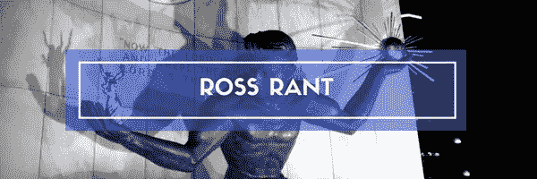

# 停止按小时销售—开始按创造的价值销售

> 原文：<https://medium.datadriveninvestor.com/stop-selling-by-the-hour-start-selling-by-the-value-created-2aa0eafba60b?source=collection_archive---------53----------------------->

我这周做了一些设计工作。

在我看来，设计工作是一个定制的解决方案，而不是通过在线市场从匿名设计师那里购买的商品化产品解决方案。

的确，这是一个简单的项目，我从一开始就提供了明确的方向。

我知道我用什么作为灵感，也知道最终状态应该是什么。

我给出了清晰的例子来激发最终的设计结果。

在给出设计方案后，我问这位平面设计师，他希望得到怎样的报酬。

他回答说:“嗯，我没花那么长时间，所以……”

他还没来得及给我他的价格，我就叫了暂停，说:“加油！”

我说来吧，因为他不重视效率和轻松，他可以工艺这个设计项目。

他不重视他的本科和研究生图形设计学习。

他不重视自己多年来与各行各业大大小小的客户打交道的经验。

他并不重视他在图案匹配方面的专业知识，以前就看到过这种设计需求，也不重视他花在观察街头和流行文化趋势上的时间。

他没有重视这个项目没有花他那么长时间的事实，因为他有多年的高等教育，多年的专业经验，以及多年的观察设计趋势。

这项任务对他来说很简单，因为他具备所有这三个要素——而不是因为最终产品容易设计。

我们得到的报酬和我们投入的时间应该没有什么关系。

定价应该完全与产出和成就有关。

作为企业家和思想领袖，我们大多数人都有三样东西可以出售，通常反映了企业的三个主要阶段:起步、存在和繁荣。

在创业之初，我们中的大多数人由于缺乏信心或智慧，从出售时间开始。我们出售时间和材料的投入。

为了达到现有的下一个业务级别，我们开始销售可交付的产品。因此，我们不再根据我们的时间收费，而是根据某些东西的市场价值收费，并开始收取额外费用。我们用价格溢价换取价格确定性，因为我们出售的是可交付物。

在第三个也是最繁荣的商业层面，当我们放弃这两个东西时，我们就根据创造的价值进行销售。

在繁荣企业的顶层，你需要增加收入，而不是销售。您专注于为客户增加价值，无论是确保收益、降低成本，还是您的专家解决方案将提供的其他情感形式的价值。

为了达到商业的第三阶段，你的定价需要从时间和材料的投入中解放出来。

一旦你能进入第三阶段，你将会有一个繁荣的事业。

你将根据你的教育、经验、专业知识和效率，从销售投入，到销售产出，再到最终销售结果或价值。

你的百万美元解决方案可能只需要一分钟就可以制定出来，因为你选择了多年的教育，多年的经验，多年的专业知识，才能如此高效。

-马克·a·罗斯|布里格登创始人+ TLC

Marc A. Ross 是 Brigadoon 的创始人，专门从事思想领袖交流和活动制作。Marc 与实干家、企业家和思想领袖一起工作，帮助他们创建引人注目的通信、赢得商业和强大的联系。