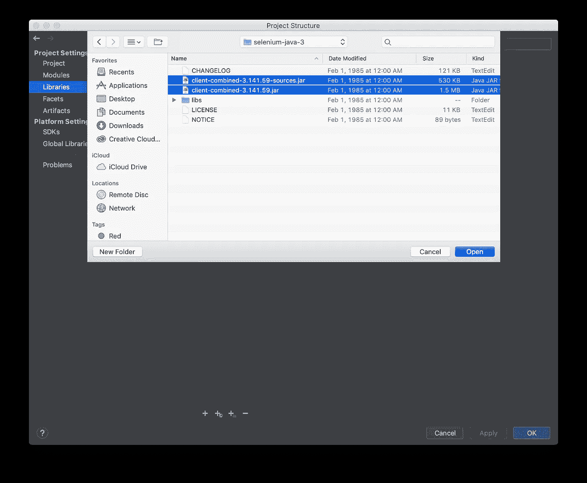
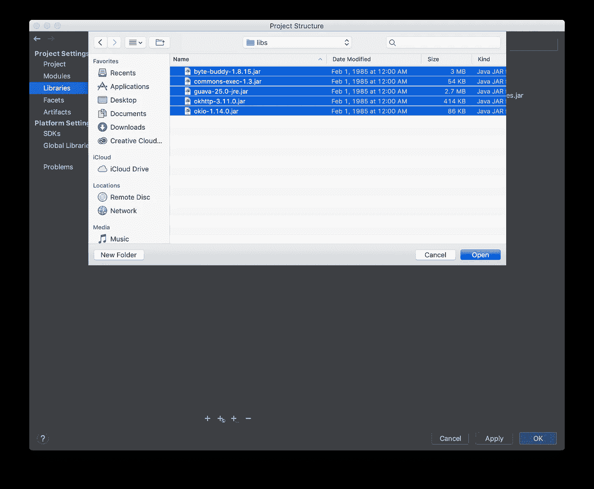

# 停止测试你的应用

> 原文：<https://medium.datadriveninvestor.com/stop-testing-your-app-d82a180fd3e2?source=collection_archive---------12----------------------->


几十年来，开发人员和 QA 工程师使用许多不同的方法测试他们的应用程序，例如，如果是 UI，他们检查所有的 UI 元素是否可见，所有可点击的元素是否可点击，或者文本框是否有效，等等。如果是后端，他们检查对于一组给定的输入，是否有正确的输出，等等。这是测试的基本思想，但是在不断变化的技术和应用程序的复杂性的发展中，通过应用这些方法来测试你的应用程序就足够了。如果程序/应用程序不断变化，会发生什么？是否值得做所有的测试，一次又一次，经历同样的过程。

[](https://www.datadriveninvestor.com/2019/02/12/ready-or-not-the-revolution-is-upon-us/) [## 不管准备好了没有，革命就在我们面前|数据驱动的投资者

### “对于技术如何影响我们的生活和重塑经济，我们必须形成全面的全球共识……

www.datadriveninvestor.com](https://www.datadriveninvestor.com/2019/02/12/ready-or-not-the-revolution-is-upon-us/) 

问题是，这既费时又会导致错误。“因为我们都是人，我们都会犯错”。作为一个解决方案，开发人员开始以单元为单位测试应用程序，这被称为**单元测试**。

单元测试是如何完成的，开发人员在开始编写实际代码之前就开始编写测试用例。首先，当你编写单元测试时，它失败了，因为实际的实现还没有完成。在这一点上，开发人员必须编写必须在实际代码中实现的每一个可能的场景，并且需要对正在开发的内容有一个清晰的概念。然后，开发人员编写代码以通过之前编写的测试。在 java 中，我们可以使用 **Junit** 框架来编写单元测试。这种方法被称为**测试驱动架构。**即使这是测试代码的好方法，这就足够了吗？。开发人员也必须对他正在开发的东西有一个清晰的概念，否则测试将会按照开发人员想要的方式编写，并据此编写代码并通过测试。因此，即使所有的单元测试都通过了，实际需求和构建的应用程序仍然是两回事。另一种测试方式是**自动化测试。**

在自动化测试中，由软件开发人员或 QA 工程师手动执行的测试用例是自动化的。例如，如果我们正在检查某个错误页面，当插入错误数据时就会出现该页面。我们必须手动启动应用程序，进入页面，插入并提交数据，然后进行验证。在自动化测试中，我们可以在脚本中编写这些步骤，然后通过单击运行它。一个主要的优势是我们可以一遍又一遍地运行脚本，如果需求发生变化，我们可以很容易地修改脚本。因此，即使在我们开发应用程序多年之后，我们也可以轻松地运行自动化套件并测试应用程序。我们可以使用几个工具来编写自动化脚本。硒、TestNg、黄瓜就是其中的一些。

**如何使用 Selenium 创建自动化项目**

在这一部分，我将指导您使用 java 创建一个基本的自动化项目来测试一个简单的网站。此外，您将发现如何在**页面对象模型中编写自动化。**

我们正在编写简单的自动化程序来测试维基百科页面

需要什么

*   Java 语言(一种计算机语言，尤用于创建网站)
*   IDE ( IntelliJ Idea，Eclipse 等..)
*   硒网驱动(【https://www.seleniumhq.org/download/】T4)
*   网络浏览器(Google Chrome 或 Mozilla Firefox)
*   Web 浏览器驱动程序用于识别浏览器。
*   谷歌 Chrome 驱动程序—[https://sites . Google . com/a/chromium . org/Chrome driver/downloads](https://sites.google.com/a/chromium.org/chromedriver/downloads)
*   火狐驱动—[https://github.com/mozilla/geckodriver/releases](https://github.com/mozilla/geckodriver/releases)
*   java 编程的基础知识

我将使用 IntelliJ Idea(你可以使用任何你喜欢的 IDE)和 Google Chrome 浏览器。

**第一步**

创建一个基本的 maven 项目并添加

Junit 依赖性

```
<dependency><groupId>junit</groupId><artifactId>junit</artifactId><version>4.11</version></dependency>
```

**第二步**

提取所有下载的 zip 文件

导入 **selenium web 驱动**

从解压缩的 selenium web driver 文件夹和其中的 libs 文件夹导入所有 jar 文件。

在 IntelliJ Idea 中

转到文件->项目结构，然后转到库并单击添加按钮

日蚀

右键单击项目->转到属性-> java 构建路径->转到库选项卡->添加外部 jar



Importing selenium web driver jars



Importing libraries related to Selenium web driver

**第三步**

在 **src 文件夹**中创建一个 Java 类名 TestSimpleWebSite

```
import org.openqa.selenium.WebDriver;import org.openqa.selenium.chrome.ChromeDriver;import org.openqa.selenium.support.PageFactory;public class TestSimpleWebSite {private WebDriver webDriver;public WebDriver createWebDriver() {System.setProperty(“webdriver.chrome.driver”, “/Users/deelakaalgawatta/documents/chromedriver”);webDriver = new ChromeDriver();PageFactory.initElements(webDriver, this);return webDriver;}public void closeWebDriver() {webDriver.close();}}
```

我在这里所做的是创建一个简单的类来初始化 Selenium web 驱动程序

在 CreateWebDriver 方法中，我已经设置了下载的 web 浏览器驱动程序的路径，如果没有驱动程序，测试将不会运行。

```
“System.setProperty(“webdriver.chrome.driver”, “/Users/deelakaalgawatta/documents/chromedriver”);”
```

对于 chrome，属性应该是**web driver . chrome . driver**

对于 firefox，属性应该是 **webdriver.gecko.driver**

**page factory . init elements(web driver，this)** 将初始化所有页面元素，这样我们可以使用@FindBy 或 webDriver.findElements 捕获类中的元素

***第四步***

页面内对象模型基本上我们所做的是单独定义页面

例如，我们在一个单独的类中定义与某个页面相关的所有元素和方法，我们在测试类中调用方法并获取元素。

因此，我们必须创建另一个名为 WikipediaHomePage 的类，并添加这个

```
import org.openqa.selenium.WebDriver;import org.openqa.selenium.WebElement;import org.openqa.selenium.support.FindBy;public class WikipediaHomePage extends TestSimpleWebSite {protected WebDriver webDriver;@FindBy(id = “www-wikipedia-org”)private WebElement wikipediaLogo;@FindBy(id = “js-link-box-en”)public WebElement englishLanguage;public WikipediaHomePage() {webDriver = createWebDriver();webDriver.get(“https://wikipedia.org");}public boolean isWikipediaPageLoaded() {return wikipediaLogo.isDisplayed();}public void selectLanguage() {englishLanguage.click();}}
```

这里我所做的是创建了一个简单的类，并扩展了先前构建的类，这样我们就可以在 page 类中初始化 WebDriver。

之后，我定义了元素。

有哪些要素？

元素是我们在网站上看到的组件

例如，标题、按钮、文本框、图像等…

在编写测试的自动化中，我们需要捕捉那些元素。找到一种我们可以使用的元素

@FindBy 和 WebDriver.FindElement/网络驱动。FindElements

如上我们可以使用 **@FindBy** 注释和使用

**id** 用 id 来标识元素，

通过 CSS 选择器来识别元素

**类名**通过类名识别元素

像前面的方法一样，我们可以使用 WebDriver find element 方法来识别元素

**WebDriver.FindElement/网络驱动。查找元素**

web driver . find element(by . id(" id 名称")

web driver . find element(by . class name("类名")

web driver . find element(by . CSS selector(" CSS 选择器")

在构造函数中，我调用了 TestSimpleWebSite 类中的 createWebDriver 方法，并将初始化的 WebDriver 分配给 WebDriver 对象，然后调用 web driver 类中的 **get** 方法打开浏览器并转到特定的 URL。

**isWikipediaPageLoaded()**

在这个方法中，我使用了 web 驱动程序中的 **isDiplayed( )** 方法来检查元素是否显示。

在“我的有”中，检查是否显示了维基百科徽标。如果显示，则返回布尔值 true。

**选择语言()**

*在这个方法中，我使用****click()****方法编写了点击元素的代码。在这个例子中，它点击了英语语言元素*

***第五步***

***编写测试用例***

在 test -> java 文件夹中创建一个测试类

```
import org.junit.AfterClass;import org.junit.Assert;import org.junit.Test;public class TestWikipediaPage {private static WikipediaHomePage wikipediaHomePage = new WikipediaHomePage();@AfterClasspublic static void tearDownClass() {wikipediaHomePage.closeWebDriver();}@Testpublic void testWikipediaHome() {Assert.assertTrue(wikipediaHomePage.isWikipediaPageLoaded());wikipediaHomePage.selectLanguage();}}
```

在这里，我已经使用 **Junit 测试框架编写了测试。**

为了加载页面，我已经初始化了页面类 **WikipediaHomePage** 来获取所有的页面元素。

在 testWikipediaHome 测试方法中，我在 WikipediaHomePage 的 Assert.assertTrue 中调用了 isWikipediaPageLoaded()。

在 Junit 中，我们可以检查值、等式和条件。

assertTrue-检查条件是否为真/假，如果条件为真则通过，如果条件为假则测试为假。

assertFalse-检查条件是否为真/假，如果条件为假，则测试通过，如果条件为真，则测试失败。

assertEquals-检查两个值的相等性

在检查页面是否被加载后，它调用 WkipediaHomePage 类中的 selectLanguage 方法。

所有测试完成后，它将运行 **@AfterClass** 方法 tearDownClass()

当我们添加@AfterClass 时，该方法将在所有其他方法执行之后执行。

所以在这个方法中，我们可以在所有事情完成后写下你想做的事情。

比如关闭一个连接，关闭一个缓冲流等等。

在这个例子中，我编写了 tearDownClass 来关闭 webDriver，这样它将关闭测试中所有打开的浏览器。

同样，您可以使用不同类型的方法来测试网页。

这是我写的一篇关于设置 Selenium 自动化项目和测试的简单文章，如果有任何更正/问题，请分享和评论。

Git hub 项目链接:-[https://github . com/deela ka 96/Sample-Selenium-Automation-Project](https://github.com/deelaka96/Sample-Selenium-Automation-Project)

谢谢:)