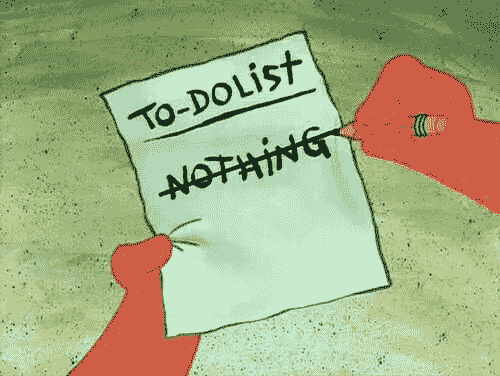
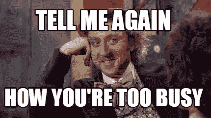
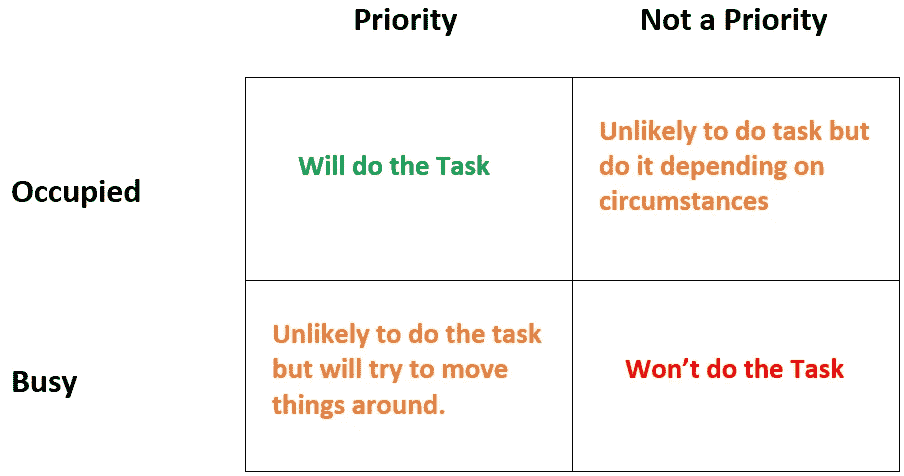
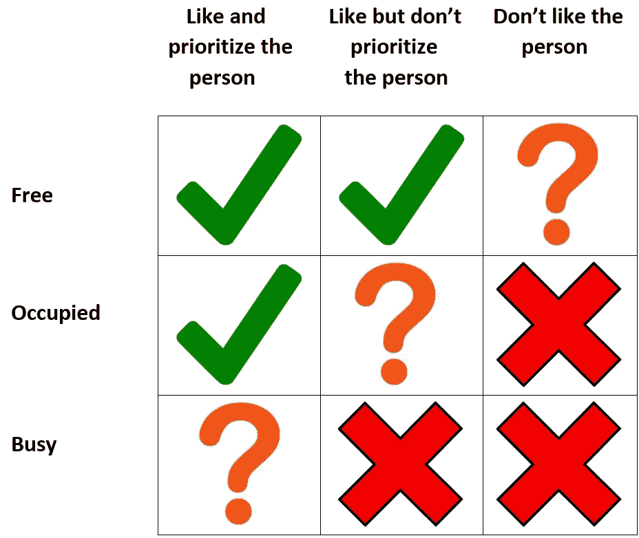

# 不要试图忙碌

> 原文：<https://medium.datadriveninvestor.com/stop-trying-to-be-busy-2669e2dd86a7?source=collection_archive---------3----------------------->

注意:本文表达的观点仅是我个人的观点，并不代表我的雇主或任何其他人的观点。

从高中开始，我就听到人们非常频繁地使用“忙”这个词。直到大学毕业，我都信以为真，甚至用“忙”这个词来形容自己。忙碌被视为学校、大学和工作生活的一部分，没有人真正质疑它。在大学期间和毕业后，我开始注意到**人们不仅仅是忙碌，而是积极地努力让自己忙碌起来**。

在我看来，人们应该停止试图忙碌。我这么说是什么意思呢？我们都过着忙碌的生活，大多数人的日程都排得满满的。有意思的是，大部分人都喜欢，其实更喜欢忙碌。原因各不相同，但其中之一是关于社会地位。**我们不只是想变得忙碌，我们希望能够告诉别人我们有多忙。**这是我们整个社会的一个更广泛的主题——[bug 现在是特性](https://medium.com/datadriveninvestor/the-bug-is-now-the-feature-ec28c5e62b13)。过去人们害怕的事情，比如工作和忙碌，现在被认为是社会所需要的。

真正忙碌是好的，但你应该问问自己，你是否符合以下一个或多个条件:

1.你有孩子

2.你有个人或家庭的承诺

3.你从事的工作压力很大，比如投资银行

如果你在这三个时段中，那么你真的很忙，即使你只有其中一个时段，也足以在你的时间表中消除很多空闲时间。即使对投资银行家来说，一周工作 100 小时也是非常低效的，换句话说，没有人真的一周工作 100 小时。当人们说他们一直在学习或一直坐在办公桌前没有休息时，他们几乎不可能接近 100%的效率。我可以说我自己的经历，当我为了考试而通宵达旦时，大约有 3 个小时被浪费在看随机的 YouTube 视频或盯着同一个问题集上，即使这是学习也是没有效率的。

即使效率低下，忙碌也是一种文化。在亚洲，文化是长时间工作，因为否则会显示你不感兴趣和不努力。尽管工作时间很长，但只有日本、新加坡和香港被世界经济论坛评为全球竞争力前十名。部分原因与一些西方经济体的技术和金融优势有关，这些优势让它们开始变得更有生产力。但部分原因也在于长时间工作并不那么有效率。事实上，[日本实际上正试图让雇主减少工作时间，以提高日本的生产率。](https://www.cnbc.com/2018/06/01/japan-has-some-of-the-longest-working-hours-in-the-world-its-trying-to-change.html)

在工作环境中，对一些人来说，忙碌部分是因为他们不知道还能做什么。他们排得满满的时间表在某个时候可能是真实的，在那段时间里，他们从未投资于爱好或其他附带活动。因此，当他们不再真正忙碌时，他们不知道还能做什么，因为他们最终试图用工作来填补生活中的空白。他们最终不知道在社交场合还能聊些什么；也就是说，他们经常谈论工作。它有点像是在为人们开脱。当你有一段时间没见到某人，你问他们“最近怎么样”，他们一般会聊工作或者只是说“忙”；这是一个非常简洁的回答。

即使他们不忙于办公室工作，**他们来自一个时间就是金钱的世界**，因此他们浪费的任何时间要么不工作，要么没有生产力，对他们来说都是浪费金钱。这不仅仅是因为忙，像这样的人和整个社会在短时间内都不知道该做什么。假设你在等你的朋友，他们迟到了 15 分钟，你会做的第一件事是什么？你拿出手机。你在那里做重要的事情吗？可能不会，但你不知道如何在 15 分钟内什么都不做。即使你正在做的事情像玩涂鸦跳跃一样毫无意义，你也会比你只是等了 15 分钟什么都不做感觉更好。

然而，总的来说，人们总是很忙，即使他们中的很多人都不属于这三类人。很多可能是为了社会地位，但很多可能是糟糕的时间管理。有一大堆原因。

那么，他们为什么真的很忙呢？

当人们说他们一直很忙，我指的是连续三个月，他们不属于以上三类中的任何一类，显而易见的答案是他们不喜欢你，并试图避开你。这可能是真的，说你很忙比说你不喜欢某人或说你不喜欢计划中的特定活动更容易。但是我遇到过这样的情况，有人反复说他们很忙，并积极努力重新安排时间，结果只是再次重新安排。在这些情况下，这个人看起来真的很忙，但是这里有 6 种可能:

1.他们的朋友都很忙——当我在高中的时候，人们参加很多活动，参加很多 AP 课程，日程排得满满的。一部分原因是大学建立了奖励这些活动的激励机制，有些人可能真的喜欢这些活动，但也有一部分原因可能是他们的朋友很忙(FOMO)。本质上，如果我们的朋友很忙，它会促使我们也想忙起来。如果你周围的人无所事事，你可能会觉得不那么被迫总是忙碌，除非那是你的性格类型。

2.**他们不喜欢闲着**——有些人就是不喜欢什么都不做的想法，不管他们的朋友是不是闲着。这可能是他们习惯于从事的高压力工作以某种方式培养了他们。他们现在可能没有这样做，但这种态度已经在他们心中根深蒂固。他们通常已经计划好了每一个小时的日程，这是在工作之外。如果这种人一天中没有做一些有成效的事情，需要一些活动来维持他们的工作，他们会觉得“浪费了”。

3.**他们不知道自己喜欢什么**——有时候人们会尝试很多东西，因为他们还不知道自己喜欢什么。当我第一次搬到休斯顿和纽约时，我参加了很多聚会，看看我会和什么类型的人一起玩。我的时间表排得满满的，我很“忙”，但大部分都是无聊的，我不喜欢其中一半以上的活动。最终我找到了我喜欢的东西，并且在我的日程表上腾出了很多时间。

4.他们贪多嚼不烂——有时当我们有空闲时间时，我们认为有很多事情可以塞进我们的日程表。慢慢地，随着这些活动变得更加忙碌，我们原本的空闲时间变得比预期的少，我们的时间表变得更加忙碌。有些人会在日程超负荷的情况下取消多余的活动和承诺。有些人实际上会坚持他们的承诺，并想出办法来应付这一切。

5.**他们不擅长时间管理**——这与上一点有关。就像上面的投资银行家的例子一样，一周工作 100 个小时是没有效率的。因为忙而取消计划的人通常不会在该花时间的时候明智地花时间。他们可能贪多嚼不烂，但更有可能的是他们的工作效率不高。

6.**他们认为自己给人留下了深刻印象**——这可能是最糟糕的忙碌理由，但也是最常见的。这在投资银行和咨询等高压力行业中很常见，在这些行业中，A 型性格的人总是试图在接受更艰巨的任务和做更多的工作方面胜过对方。**这里的人们不仅仅想变得忙碌，他们还想确保每个人都知道他们在忙。这是以谈论通宵工作或谈论他们正在做的大量项目的形式。以我的经验来看，他们并没有给任何人留下深刻的印象，即使有，也是非常微小和暂时的满足。**

人们不仅仅局限于这些可能性中的一种，他们很可能因为所有 6 种原因而忙碌。我见过的最常见的忙的原因是因为他们的朋友很忙，不善于管理时间。

**忙碌并不等同于长期规划**

每个人都计划未来；这包括短期、中期和长期计划。中长期计划倾向于更高层次，更注重目标设定；短期计划往往更加细化。忙碌意味着你已经计划好了每一件事情；这不再是你计划要做的事情，而是你将要做的事情。所以现在的问题是人们已经提前几周计划好了吗？我知道对我来说，在我的个人生活中，答案是 3 周。我有中长期计划，但这些都是高水平的。就执行和承诺而言，我没有像一些人那样为自己预定未来 3 个月的时间。为了能提前那么久被预订，你必须参加一些课程或者做一些有固定日期的事情，比如音乐会。还有其他一些性质更宽松的承诺。从现在起的三个月内，我的日历上有一些承诺，我可能会参加，也可能不会参加，这取决于具体情况。**当人们说他们 3 个月后会很忙时，他们的答案很可能会改变，这取决于他们是否喜欢做他们已经松散承诺的活动！**

**占线与占线**

当人们说他们很忙的时候，通常他们都很忙。那么有什么区别呢？就像上面的计划示例一样， **busy 往往更难处理，而 employed 是您正在做的事情，但如果需要的话，您可以暂停**。如果你在工作，你很“忙”,你没有优先考虑的人让你做某事，你可能会告诉他们你很忙，不能做这项工作。如果你的老板让你做某件事，你暂停你正在做的事情，去完成任务。关键的区别在于优先级。在第一种情况下，你很忙，但这并不是一成不变的。你也不认为让你做任务的人在你的优先列表中是优先的，所以你说你“很忙”。如果你很忙，你可能不会帮助你的老板，因为这是一个难以达成的承诺。例如，如果你在下午 3 点有一个会议，你的老板要求你在那个时间做某事，大多数人会说他们不能做，除非是某种紧急情况。这不仅仅适用于工作，人们通常会优先考虑某些人，并决定在哪里度过他们的半忙碌时间。

**喜欢某人还是优先考虑某人**

在上面的例子中，我们看了人们喜欢另一个人的情况，以及他们有工作要做的情况，不管他们是忙还是被占用。两者都有第三个组成部分，那就是不喜欢这个人，以及这个人有真正空闲时间的情况。在下面的表格中，我根据你的空闲时间和你是否喜欢这个人，概述了你做某事的可能性。其中 3 个有一个问号，那是因为它相当主观。如果你喜欢一个人，但是你真的很忙，你可以试着去做这件事，但是不太可能。同样的道理也适用于被占用和喜欢，但不优先考虑某人。如果这个人不是真的喜欢你，那么只有当他们真的真的有空的时候，他们才会试着为你腾出时间，如果有的话。**最常见的垂直人要做的处理就是“喜欢但不优先考虑某人”**。世界上大多数人并不刻薄，他们也不讨厌你，但他们也不会优先考虑你，所以知道他们有多大可能根据他们的空闲时间来帮助你是至关重要的。

总之，“忙”是我们在社会中无情使用的一个词。人们说他们很忙，但更多的时候，他们被占用了。更重要的是，我们应该停止试图忙碌，尤其是如果我们认为我们正在给人们留下深刻印象。它不起作用。真正忙碌是好的，但是为了忙碌而忙碌对任何人都没有帮助。