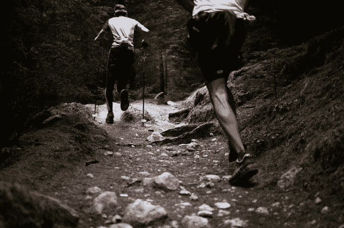

# 当涉及到个人发展时，不要再用这些借口了

> 原文：<https://medium.datadriveninvestor.com/stop-using-these-excuses-when-it-comes-to-personal-development-9c3f5f284fd2?source=collection_archive---------10----------------------->

与乔治·华盛顿·卡弗一起消除借口(二手灵感项目)

二手灵感项目从一句激励性的引语开始，在创造性道路蜿蜒的任何地方冒险。

> "百分之九十九的失败来自那些习惯找借口的人."―乔治·华盛顿·卡弗

快到新年决心季了，这是一个充满希望和熟悉的失望的时刻。你以前也遇到过这种情况——就在你致力于改善的时候，你不知何故提出了无数站不住脚的借口。

恐惧劫持了我们的动机，让我们对自己说一些你不相信的话。也许是因为你害怕被拒绝，害怕失败，害怕被别人审视。

别折磨自己了。通往成功的道路不涉及侮辱、借口或自我价值的降低。

打乱现状。不要把这些借口当作不可靠的拐杖。

# “我只是不够好。”

我们来翻一翻任何一个成功人士早期项目的档案。畅销书作家的第一部小说草稿。一个冠军程序员开发应用程序的尝试。工程师为建筑制定的初步计划。企业家在制定商业计划方面的独到见解。

我敢打赌那些人会承认他们早期的尝试并不是他们最好的作品。

但他们没有放弃，即使他们的开始有点不正常或令人尴尬。他们坚持自己的手艺，从错误中学习，不断努力，直到有所改进。

 [## 摔倒不是失败。数据驱动的投资者

### 你只有在放弃的时候才会失败。每个英雄都会倒下，我们活着就是为了失败者出现的时刻；上升到…

www.datadriveninvestor.com](https://www.datadriveninvestor.com/2019/01/17/falling-isnt-failing/) 

不要怀疑你的旅程。出身卑微并发展能力是令人钦佩的。无论你已经做了几十年还是刚刚开始…如果你尽了最大的努力并试图变得更好，那么你已经足够好了。

不要拿自己和竞争对手比较，也不要猜测自己的评价。专注于磨练你的手艺。只有这样，你才能实现从早期工作到进化技能水平的成长。

# "没有足够的时间让我接受新的东西。"

扯淡。总有时间提升自己。

我们每天都有同样的 24 小时。我们必须决定如何让它们发挥作用。晚上狂看真人秀或浏览社交媒体不会给你的生活留下太多改变的时间。

花一些你浪费在那些空虚行为上的时间，把它导向你想要的转变。去健身房。看书。练钢琴。给潜在客户打一些额外的陌生电话。

Photo by [Aron Visuals](https://unsplash.com/@aronvisuals?utm_source=unsplash&utm_medium=referral&utm_content=creditCopyText) on [Unsplash](https://unsplash.com/s/photos/time-wasting?utm_source=unsplash&utm_medium=referral&utm_content=creditCopyText)

我并不主张废除所有的停工期。给自己充电至关重要。但如果是在你渴望的成长和放松之间做出选择，要意识到你控制着这个决定。明智地选择。

每天刻出几块时间，把它献给你的蜕变。无论是两个小时还是二十分钟，都要关注这个变化，并给予充分的关注。

# “我不知道如何在我的生活中做出这种改变。”

不知道如何开始新的事物的困惑是一件讨厌的事情，它会偷走你的动力。但你不能让这阻止你去尝试。我们生活在一个惊人的时代，有大量的数据和指导可供使用——其中大部分是免费的。

想成为更好的领导者？找一个能把你推向正确方向的 TED 演讲。

需要修理你家的东西吗？[YouTube 上的无数视频](https://healthyhandyman.com/best-youtube-channels/)将指导你完成家居装修项目。

试图清理你的饮食？谷歌搜索会产生大量的食谱和[膳食计划资源。](https://projectmealplan.com/ultimate-list-of-resources-for-meal-planning-and-prep/)

不知道该做什么是一种阻碍，但你不应该以此为借口不去尝试。

有人已经做了你正在尝试的事情，或者类似的事情。如果网上搜索或自助书籍不能让你从起点起步，那就找一个能做到的导师、家庭教师或老师。不要让未知阻碍你实现你想要的改进。

# “我不能称自己为 _ _ _ _ _ _ _ _ _ 因为……”

我对自己说这个借口感到内疚，尤其是关于我的写作。我在 200 多家文学期刊和网站上发表了[诗歌](https://northamericanreview.org/open-space/7367-2)和[短篇小说](https://aquietcourage.wordpress.com/tag/adrian-s-potter/)，在几家期刊上发表了[文章](https://www.roadsbridges.com/land-scoping)，但我仍然觉得自己不是一个真正的作家。因为我没有出书，我觉得自己是个冒名顶替者。

每次我这样破坏自己的信誉，我都会感到内心的紧张。我不想认为我是装的，直到我真的做到了。即使我已经踏上了成功之路，我仍然带着积极的动力前进。

我认为自己还不是一个真正的作家，这让我暗自怀疑自己的成就——竞赛获奖、研讨会、出版学分和经历。我是我最响亮，最讨厌的反对者，这种毒性正在毒害我的心灵。

Photo by [Jen Theodore](https://unsplash.com/@jentheodore?utm_source=unsplash&utm_medium=referral&utm_content=creditCopyText) on [Unsplash](https://unsplash.com/s/photos/self-doubt?utm_source=unsplash&utm_medium=referral&utm_content=creditCopyText)

今年早些时候，当我的第一本书出版时，这一切都改变了。我非常感谢这个机会。但我现在可以承认，我站在另一边，我不再是一个作家，只是因为我现在出了一本书。

回顾过去，沉迷于冒名顶替综合症是愚蠢的。如果我从第一天开始就专注于让自己合法化，而不是把自己推倒，我会进化得更快。我浪费了太多精力恨自己。这些能量本可以用来培养热情，而不是阻碍我的成长。

也许你刚刚开始为你的第一场比赛训练。把自己想象成一个跑步者没关系。或者也许你开始在办公室管理一些任务，而不是做初级的单调工作。不要低估自己，你现在是领导了。

不要限制自己。如果你对你想成为的人有一种不断发展的热情，那么你正在成为它。认为自己是冒名顶替者会给自己带来巨大的伤害。

# 成为你想看到的改变。

列出的所有借口(以及更多没有列出的借口)对你没有任何帮助。它们不会帮助你实现目标或促进个人发展。相反，你应该问:“为了改变，我愿意放弃什么？”

要做最好的自己，放弃旧的有害心态，拥抱积极向上的心态。别找借口了。

**阿德里安·s·波特**是一名作家、工程师、顾问和演说家。他写诗歌、短篇小说和各种主题的文章，包括创造力和个人成长。他是诗集《T4》和散文集《自我手册》的作者。在[http://adrianspotter.com/](http://adrianspotter.com/)在线拜访他。

*原载于 2019 年 11 月 25 日*[*https://www.datadriveninvestor.com*](https://www.datadriveninvestor.com/2019/11/25/stop-using-these-excuses-when-it-comes-to-personal-development/)*。*