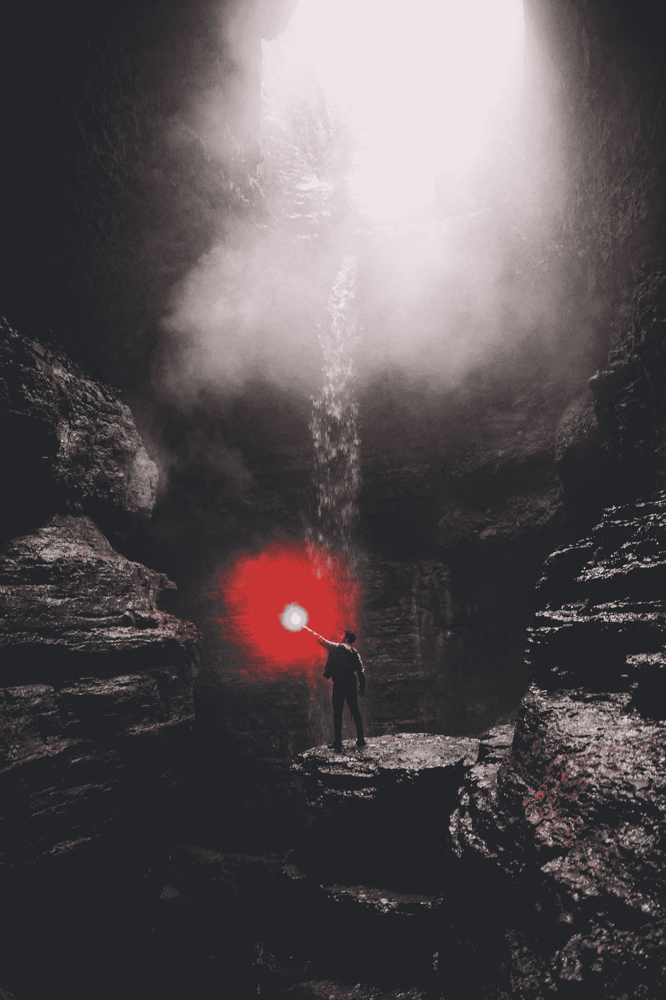

# 不要在你的生活、事业或者你的创业上浪费时间，设定虚假的目标

> 原文：<https://medium.datadriveninvestor.com/stop-wasting-time-with-your-life-your-career-your-startup-or-your-goals-25bbe0abe3ba?source=collection_archive---------15----------------------->

## 我的职业运动员博客讲述了生活经验，学习自我，以及所有的事情

“how to succeed” by [Blake Cheek](https://unsplash.com/@blakecheekk?utm_source=medium&utm_medium=referral) on [Unsplash](https://unsplash.com?utm_source=medium&utm_medium=referral)

我确实知道卡罗尔·德韦克、安吉拉·杜克沃斯和蒂姆·格罗弗所说的勇气、毅力和努力，因为所有的战斗都始于“思想之战”

自我意识到那些在我们头脑中告诉我们故事的声音，但是我们以后会学到更多。

> 首先，我们需要从我们真正了解的东西开始，因为如果你明确地知道你最想要的是什么，你将不得不学习如何掌握一些关于你自己的东西来得到它。

把成功想象成一辆人车。思想是点火开关。燃料是知道你想要什么。目标只是你写下并贴在汽车挡风玻璃上的一些有形的东西。你的成功、你的精通、你的知识和你的执行力取决于你多长时间按一次开关、转一次钥匙、踩一次油门、开多快、开多远。

我知道很多职业运动员随着年龄的增长输掉了这场战斗。我知道我做了，通常，这是我所能谈论的，因为我在生活给予我的几乎所有其他平民方式上都是失败的(Ps。从好的方面来说，在与[克里斯·盖奇](https://medium.com/@krisgage/how-to-be-successful-e23253739672)交谈后，我已经写了并发表了 170 篇文章，所以至少我的努力是为了写作，尽管 Medium 每个月付给我 40 美元，但嘿，我小时候也没人付钱让我打篮球。

毅力、毅力和努力就像一张张精神砂纸，你越在乎某样东西，你就会在你们之间制造越多的摩擦，让目标远离你。

因为说实话，我们要么是在追逐目标。或者我们不是。我们在打磨东西。或者我们不是。我们要么在进步，要么在成长。或者我们不是。这是一场赛跑，即使当你到达你认为你想去的地方，当你停下来闻闻玫瑰花香，你会突然意识到你要么开始变得自满，要么变得不快乐，要么变得太放松，要么变得太懒惰。

这也适用于为人父母。为了合作。做教练。对于创业公司来说。因为你成功了你想要的。为了一切。

当你意识到快乐是你如何生活和为什么生活以及每天做你简单关心的事情的副产品时，那么你的比赛就有了意义。如果你的比赛有意义，即使你输了，你真的只关心再次比赛。

*或者这只是我和我微不足道的篮球成功故事。*

我在许多小的方面追求成功，主要是因为我从 14 岁起就痴迷于篮球，每次我更接近我的最终目标，就像天堂裂开了，多巴胺像雨点般落在我的灵魂上。小而有意义的胜利让我不断努力，即使我在失败、沮丧、受伤、焦虑和恐惧中挣扎。你内心强烈渴望继续前进，这是你无法触及、无法定义、甚至无法解释的。对我来说，它就像一个他妈的喷气燃料、煤、汽油和核废料的孵化器。我太他妈想赢了，我能尝到嘴里的金属味道。

直到有一天，我参加了 D1 篮球赛，这是我们第一个月的季前赛训练，几乎每一天我都想放弃。(**我在笑，太真实了。术语“苦差事”被过度使用了，但我明白。这是一种折磨，一旦我的脚和屁股动了起来，这种折磨就变得有趣了。这场比赛对我来说是愉快的。*

> 很简单，精英中的精英每天都在努力变得更好。

当你不是最有天赋的时候，你是怎么赢的？最聪明的？最聪明？当你失败时，你是如何坚持下去的？当你破产的时候。分手的时候？当你爱的人去世时。如何在某件事上变得最擅长，掌握自己热衷的某件事？

# 蒂姆·格罗弗的书《无情》总结道:你开始无情地行动，即使你不喜欢这样。

你醒了。你走一步。你跑一英里。半英里。100 英尺。你在每个街角张贴传单。你每天写 100，然后 1000，然后 3000 字(*即使那些字烂*)。你打电话给你的爱人，你的妻子，你的孩子，你告诉他们关于一个白人在拉面馆把面条吸进脑袋里，就像一个没有手的奇怪的倒挂婴儿。

努力和成功开始会感觉像是一种折磨，但有时不会，有时又会。这是成功的一部分，你只要坚持下去，因为在你之前的成功人士就是这么做的。

想象一下，一个教练对你大喊，“继续走！你得了这个！”

听你教练的。继续前进，即使你认为你不会有任何进展。然后在你认为你已经尝试了一切之后，再尝试一些。继续尝试，即使那个声音在抨击你。找到你最大的努力，你最好的系统，然后拆开它，然后再把它组装起来，就像一个陆军突击队员为战争打包行李一样。

> 你尽最大努力成为与你的目标相关的习惯系统的一部分。

# 目标越高，系统就必须越特殊。

习惯和纪律给你创造力。具体地说，你的灵魂(唯一的)目的是一次又一次地将你的系统拆解和重组。把你所有的鸡蛋放在那个篮子里，然后拿出来，下次再多放一个鸡蛋进去。继续这样做，不要把你知道你喜欢的多样化。

总有一天，你的篮子会装不下所有的鸡蛋。你会得到比你实际想要的更多的鸡蛋。

十几岁时，我喜欢在脑海中描绘出一个成功的 D1 大学篮球运动员的日常习惯。我制定了各种特殊的系统、训练和日常习惯来压制我头脑中的声音。所以，如果你想成为一名职业篮球运动员，或者一个百万富翁，或者畅销书作家，或者成为一个更好的父亲，或者一个著名的初创公司，那么你的系统最好是不可否认的，始终痴迷于成为一个更好的人。

不是说不惜一切代价的成功就是一切。

不是的。

你的旅程可以也应该是合作的。你的幸福不仅仅是你追求的一件事。你的平衡，你的快乐，你的孩子，你的家庭，你的健康，所有这些事情都更重要，所以请记住这一点。真的，你追求的东西会给你带来快乐和健康。

> 追逐你所爱的会留下快乐的残渣。

# 驯服的声音:为什么我们没有取得应有的成功。

当我退出时，当我作弊时，当我没有做我新任命的不断发展的成功系统要求我做的事情时，理性的声音抬起它丑陋的头，就像一条双面龙向我的屁股和赤脚吐火，告诉我他妈的继续前进，继续工作。

这就是灵感的妙处。感觉并不总是很好。有时候会疼。很痛。它弄脏了。太草率了。这种感觉每天都不一样——有时被内疚、羞愧所掩盖，有时被胜利、惊讶、借口所掩盖，大部分时间都是那个小小的声音在告诉你*尽管去做，*但你不听。

*是的，你应该多遛狗*。

是的，你身材走样了，你应该放下米饼，拿起芹菜杆，挑战自己。

那个声音，那个说到努力、勇气和去做的声音，是你的指南针。如果你的声音不再谈论努力、勇气和毅力，它会对你撒谎，告诉你你有多棒，你应该在 Instagram 上发布一张照片，告诉你你的生活有多特别。

我知道，我也这么做。

# 如果你真的听了这个声音所说的一切，它会毁了你。

大多数人放弃的原因是因为下跌击中了他们，他们的“温柔的声音”压倒了他们的“努力的声音”锻炼的那一刻似乎毫无意义，因为你再也看不到任何结果。当你觉得你已经尝试了一切，不再寻找的时候。著名的营销大师塞思·戈丁称之为“下跌”别人成功了而你没有成功的原因是你放弃了。如果你真的不够在乎某件事，当你的声音告诉你这不值得时，你就会放弃。

畅销书作家史蒂文·普莱斯菲尔德称这种声音为“反抗”的声音抵抗是一只长满跳蚤的疯狗，它会过来索要食物和水，然后在你邀请它进入你家的时候咬你的手并感染你。

你的家是你真正想要的东西。

但你邀请它进来，我邀请，我们都邀请。

# 我称之为做人。

你觉得你的灵魂曾经诅咒过你吗？它是否告诉你下一步应该做什么，或者下一步尝试做什么？

时间是我们在头脑中创造的一种幻觉，是社会编织进我们生活的一部分。你可能明天就走了。我可能是。见鬼，有了特朗普的环保局，我们都有可能。

无论如何，我认为等待，不尝试，放弃，成为受害者是人的本性，就像当你赢了的时候变得自满一样。如果你真的想在某件事上获得成功，你必须从现在开始，并且坚持做下去，直到你真的不再在乎它。

我要感谢[克里斯·盖奇给我的动力](https://medium.com/@krisgage/how-to-be-successful-e23253739672)。六个月前，她告诉我不要再做业余作家，要像专业作家一样写作。她真正想说的是:如果你真的足够在乎，你会找到办法的。

发表了 171 篇文章、回应和系列文章之后，我开始明白她的意思了。