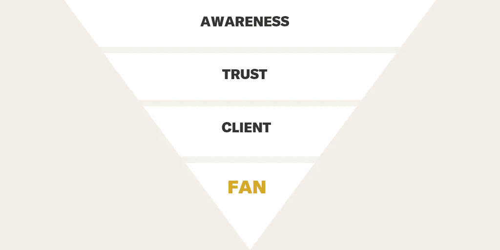

# 停止对客户的期望

> 原文：<https://medium.datadriveninvestor.com/stop-wishing-for-clients-and-build-a-reliable-system-to-attract-them-a02cbaf23c7f?source=collection_archive---------18----------------------->

您知道吗，66%的小型企业将获得客户列为他们最关心的问题。然而，只有大约 50%的小企业有任何形式的营销计划。那些数字显然不匹配。

顾客是企业发展的动力。对于从自由职业者到财富 500 强公司的每一个人来说，弄清楚如何得到它们应该是第一要务。

那么，你呢？

你有营销计划吗？

我敢打赌，答案是否定的。尽管几乎所有的企业家都把获得顾客/客户列为首要任务，但很少有人真正制定了一个战略来持续实现这一目标。

在建立任何类型的营销系统方面，基于客户的业务通常是最糟糕的。这包括从事营销业务的营销公司和广告公司。

但是，我不能责怪他们。过去对我来说，这个问题的诚实答案是否定的。我拥有一家没有正式营销系统的品牌公司。

**我信口开河。**

不幸的是，信口开河不是策略。这太愚蠢了。我们以平庸的营销(最好的情况)和无数随机策略串成一条不一致的消息流而告终。

基于客户的企业往往认为，如果他们做得很好，让客户满意，他们就不需要担心营销。他们会得到足够的推荐，让自己忙起来。

是的，推荐和回头客对以客户为基础的企业至关重要，但它们应该只是营销策略的一部分。你的推荐策略是推动新业务的一个策略(通常是一个相当不可预测的策略)。

完全依靠推荐是营销的希望和祈祷方法。你希望引荐继续到来，你祈祷他们在你失业(或没钱)之前到来。

我们的祈祷得到了回应，我之前的生意。我们有足够的推荐和回头客，这让我们不断前进。然而，在这个过程中，有几个星期、几个月甚至几年是充满压力的。我们坐在现金流过山车上，这一年你准备买法拉利，然后下一年寻找项目养活你的家人。

停止希望和祈祷。今天就开始做一些可以在未来拯救你的生意的事情。你所要做的就是建立并执行一个营销系统。

**这不是火箭科学。见鬼…这甚至都不是科学。**

建立一个像样的营销系统主要是常识，并加入一些最佳实践来指导你。让我们来看看建立和执行营销系统的三个步骤。我会保持简单。重点是让这些变得如此简单，以至于你可以坐下来建立一个系统，并在 2019 年开始使用。

# **第一步:市场**

伟大的营销与一个人交谈，而不是每个人。从确定你的理想客户和他们的痛点开始，这样你就可以精心策划针对他们的营销。向一个人呼吁要比向所有人呼吁容易得多。

让我重复一遍，以确保你能理解。

不要试图和每个人交谈，定义一个人，你可以用你的产品/服务改变他的生活。那是你的客户。然后，你可以围绕这个单一的客户群建立更大的“市场”。

我与许多营销人员的不同之处在于，我喜欢从一个真实的人开始。我认为重要的是你要找到一个真正的人，他会从你提供的东西中受益匪浅。经常教授的技巧是创造一个“角色”,你将把它作为你的理想客户。这两者之间似乎没有太大的区别，但在我看来，这实际上是至关重要的一点。有几个原因。

1.  真实的人有真实的问题要解决，有真实的习惯要遵循，对你提供的任何东西都有真实的反对意见。关注一个真实的人可以让你看到你是否真的解决了一个问题，以及你需要克服这个人的哪些反对意见。没有怀疑或猜测。
2.  创造人物角色太容易变得不切实际的完美。我们需要他们有问题 A，所以我们把问题 A 写进他们的故事。我们需要他们有异议 B，所以我们让他们有异议 B。长话短说，我们把人物角色往有利于我们的方向倾斜，它变得如此虚构以至于毫无用处。我们不知道我们是否真的在解决一个真实的人的问题。我称之为完美世界角色…因为完美世界并不存在。

一旦你找到了你的意中人，并确定你能帮助他们，定义你的定位。你的那个人是你会专门与之交谈的人，但是你要确保你的那个人周围有足够大的市场来保证你的努力。

例如，也许你是一名家庭法律律师，而你的一个人是一位有三个孩子的千禧妈妈，正在经历她的第一次离婚。你更大的市场(或利基市场)是正在经历第一次离婚的女性。你将建立你所有的营销来与一个有三个孩子的千禧一代母亲交谈，以及她心中所有的挣扎，但你不可避免地要与更大的女性群体交谈。

在上面的例子中同样重要的是谁不是你的市场。你不是在和男人说话。你也没有和第四次婚姻的职业离婚者说话。这些人的动机、关注点和痛点与经历第一次离婚的女性的核心受众非常不同。

利基下来，只要你能去与你的市场。专注于一个群体会让你成为专家，可以为少数人收取溢价，而不是被一大群人以价格购买的另一种商品选择。

## **回答这两个问题:**

***1。谁是你解决问题的真正的人？***

**2*。你的小众受众是谁？***

# **步骤 2:消息**

困惑的客户不买。阐明你的信息。多卖。就这么简单。创建一个清晰的信息，传达你如何解决你的理想客户的大问题。

这里有一个快速简单的三部分填空，你可以用它来建立你的信息基础。

***我们的客户是…***

***他们与……斗争***

***我们通过……***帮助他们

这种模式非常普遍。从摄影师到律师，每个人都可以使用同样的三个提示系统来轻松设计他们的[客户搭讪线](https://medium.com/special-sauce/create-an-irresistible-pick-up-line-for-clients-1ad5e70fd100)。

下一步是确定并说出你的竞争优势。让你与众不同的一件事是什么？不是两件、三件或四件事，而是你可以不断重复的一件事，来建立知名度，让你脱颖而出？

当你强调一切的时候，你什么也没有强调。选择一件你希望人们记住的关于你公司的事情。

这一件事不应该是价格。价格不是一个可持续的差异化因素。总有人愿意卖的更便宜。在价格上给自己定位是一场竞争。没有人会赢得比赛。

不要试图将自己定位在“高质量”或“优质服务”上，因为这些只是预期的功能(而不是差异化优势)。你的竞争优势需要有所不同。

## **构建您的信息:**

***我们的客户是…***

***他们与……***斗争

***我们通过…*** 帮助他们

***让我们与众不同的一点是……***

# **第三步:漏斗**

在第一步和第二步，你要明确你在和谁说话，你要说什么。这一步展示了你如何接触他们，让他们购买，然后把他们变成狂热的粉丝。

有许多不同的营销渠道在使用。我创造了自己的变体，与你会发现的大多数变体略有不同。我的漏斗关注四种结果，而不仅仅是流行语。每个结果都是客户旅程中的一个重要里程碑。

# **意识**

如果有人想从你这里买东西，他们必须知道你的存在。漏斗这一步的目标是让合适的人意识到你的存在。你需要确定你将用来接触你的理想客户的工具，以及你将提供什么来吸引他们的注意。

## **几个例子:**

脸书& Instagram 广告宣传网上研讨会

LinkedIn 广告宣传销售线索磁铁

中等物品

客座博文

演讲约会

搜索引擎营销(竞价排名和搜索引擎优化)

## 轮到你了:

***你将如何吸引合适的人的注意？***

# **信任**

我们从我们信任的人和公司购买。这一步的目标是与我们的潜在客户建立信誉。我们能为我们的客户提供什么，让他们对我们的专业知识产生好奇心和真正的信任？专注于真诚地帮助你的理想客户。建立真实的关系，到时候销售会自己照顾自己。

## **例子:**

免费指南

小抄

网络研讨会

自动电子邮件序列

一致的博客内容

免费审计

免费咨询

电子邮件简讯

视频系列

## 轮到你了:

你将向客户提供什么，以提供价值并让客户真正信任你的专业知识？

# **客户端**

一旦你有了意识和信任，就该开始销售了。这里显而易见的目标是把他们变成客户。我们可以用什么方法把他们从好奇推向购买？怎样才能产生紧迫感？

许多基于客户的企业在这个阶段犯的主要错误是陷入绝望。没人愿意和一个绝望的乞求工作的人一起工作。每个人都想找一个能把他们挤进日程的热门公司。围绕你提供的东西创造一种紧迫感。

## **示例:**

电子邮件培养系列(解决他们的潜在问题并培养他们进行销售)

时间稀缺

有限可用性稀缺

日程稀缺(我们下个月的日程还剩下一个位置)

保证(消除客户购买的风险)

## 轮到你了:

你将如何让你的观众放松下来，制造一种紧迫感，从而把他们变成你的客户(而不显得虚假和低俗)？

# **范**

万岁！！！我们完成了销售，现在他们是客户了，下一步怎么办？是时候把他们变成粉丝了。球迷对他们喜爱的球队(商业、自由职业者等)极度忠诚。球迷会告诉任何愿意听的人他们的球队有多棒。球迷毫不犹豫地一次又一次向自己喜欢的球队购买。

创造粉丝是产生回头客和推荐的关键。重复业务和推荐就像是基于客户的业务的类固醇。

当有人成为你的客户时，你的营销不应该停止。你提供服务的方式，工作完成后你如何跟进，以及你对现在和过去客户的持续培养都应该在你的营销系统中列出。提供持续的奇妙体验，并确切地知道在每个项目后你将如何跟进。

你如何让客户上船？你如何确保他们的成功？项目结束后你如何跟进？你送项目后礼物吗？你要求对他们的经历进行反馈吗？怎么要求引荐？

这些都是你应该解决的重要问题。建立一个系统，告诉你如何把你的过程变成一台无止境的营销机器。

## 轮到你了:

你会用什么方法让和你一起工作成为一次难忘的经历，让客户开心，让他们觉得你很棒？

***你会采用什么流程来增加重复购买和忠诚客户的可能性？***

# **恭喜你！**

在 2019 年，你有一个营销系统可以运行。创建营销系统这个简单的行为已经让你领先于 50%的小企业。

你不再只是希望和祈祷有人走进你的门。你实际上有一个营销系统来运作。

最后，我想指出营销系统和营销计划之间的重要区别。营销系统是你用来指导你行动的东西。关键词是行动。一份营销计划常常被匆匆拼凑在一起用于演示，再也不会被引用。一个导致行动，一个导致一无所获。

如果你想从这个过程中看到任何结果，你必须计划和行动。

每周五，我都会给企业家和营销人员发一封电子邮件，告诉他们如何在乏味的企业和山寨品牌的海洋中脱颖而出。想象一下，如果你把我行之有效的策略和你的聪明才智结合起来，我们会取得怎样的成就。 [***在这里报名***](https://specialsaucebranding.com/the-recipe/)