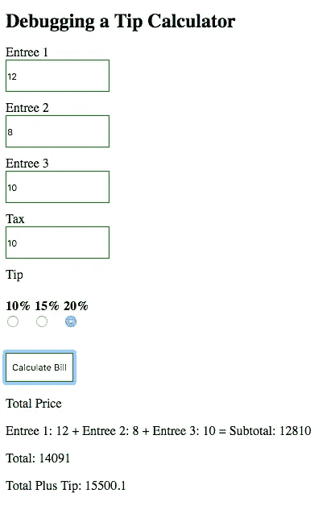
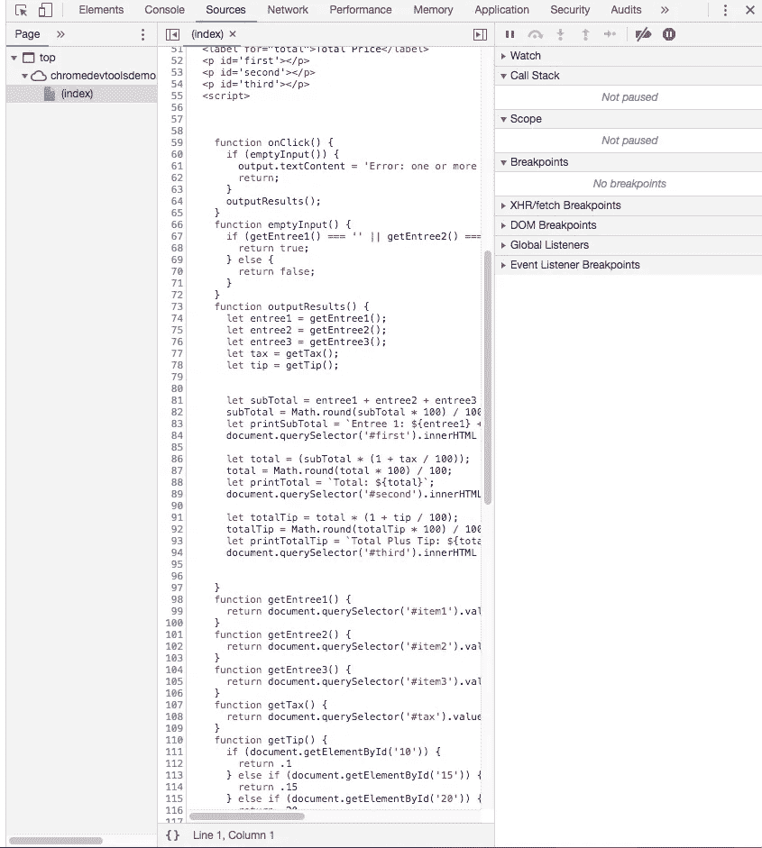
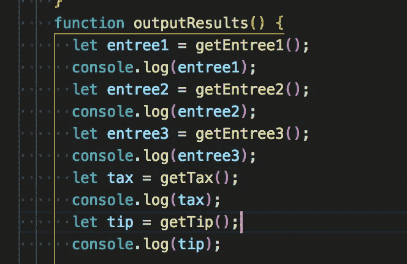
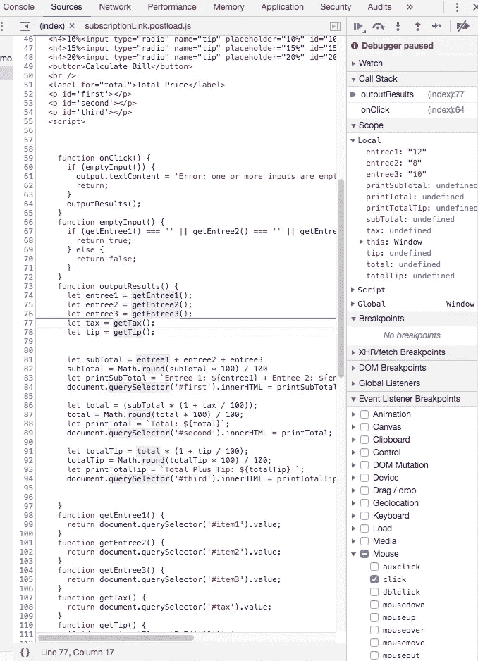
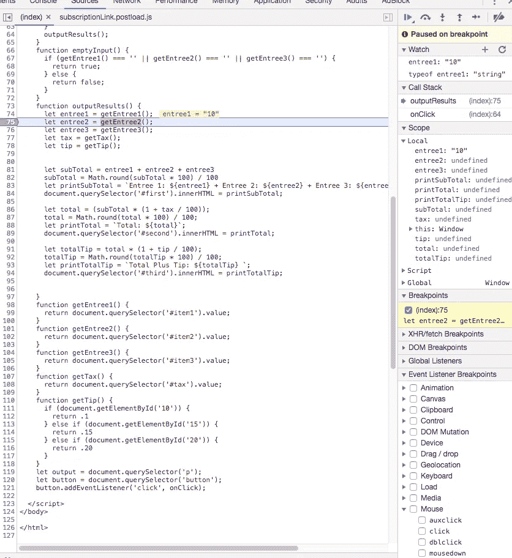
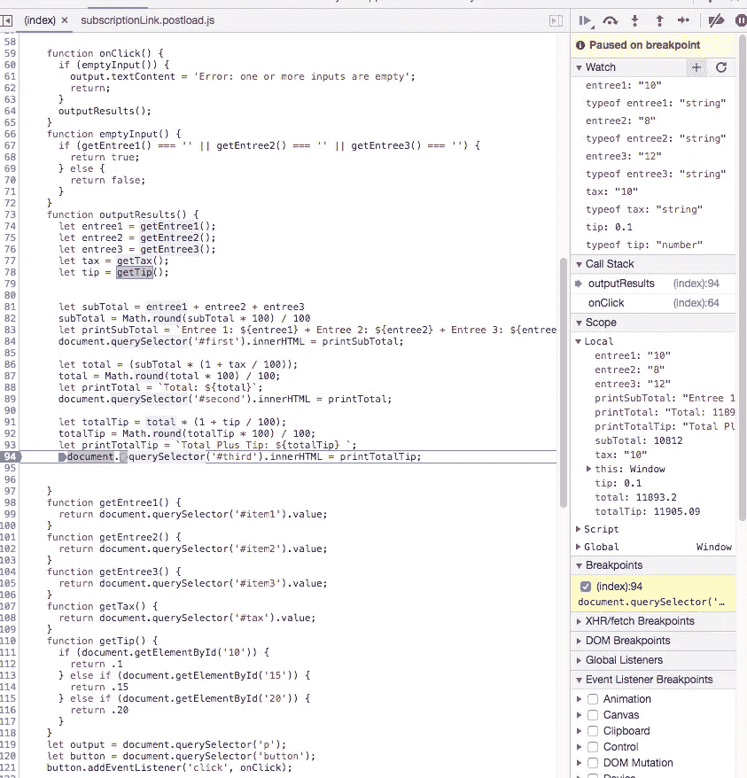
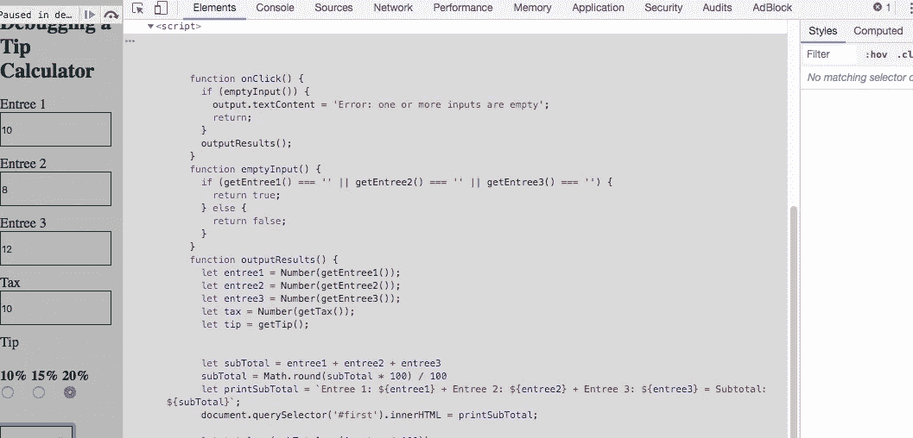
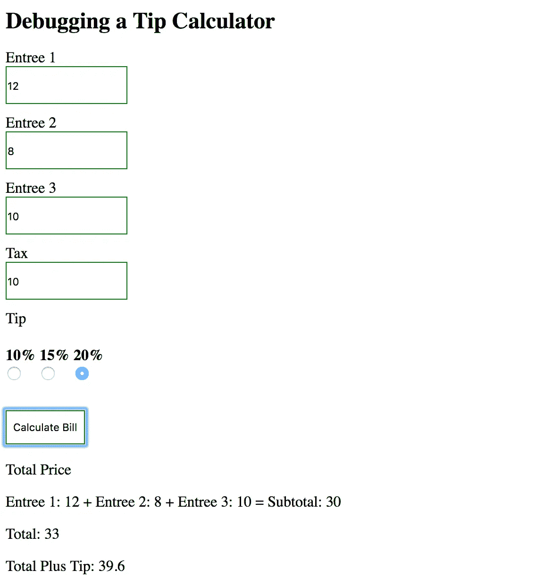

# 如何停止使用 console.log()并开始使用浏览器的调试器

> 原文：<https://medium.datadriveninvestor.com/stopping-using-console-log-and-start-using-your-browsers-debugger-62bc893d93ff?source=collection_archive---------0----------------------->

当我开始成为一名软件开发人员的旅程时，我肯定遇到了相当多的坎坷。大多数新开发人员面临的最常见的困难之一是调试。起初，当我意识到我可以在 chrome 中打开控制台并通过 console.log()输出我的值来发现我的错误时，我认为我发现了圣杯。这被证明是非常低效的。出于幽默的考虑，这里有几个我最喜欢的用例:

console.log('Total Price:'，Total)//查看值是否已存储

console . log(' Here ')//如果我的程序执行到了某个函数

我认为大多数开发人员开始意识到这不是你实际上应该调试程序的方式。一定有更好的方法！

幸好有，你的浏览器调试工具。具体来说，我将讨论 Chrome 开发者工具。

在这篇文章中，我将介绍如何使用断点，如何单步调试你的代码，如何设置观察表达式，以及如何在 Chrome 开发工具中应用你的补丁。

> 为了跟随本教程，你需要使用我创建的一个示例代码库。 [***点击这里***](https://chromedevtoolsdemo.herokuapp.com/) ***。(可能需要一分钟来加载)***

# 第一步:重现 Bug

我们从执行一系列的动作开始，这些动作不断地重现 bug。

1.  在我们的例子中，我们将使用一个错误的小费计算器。如果您还没有打开示例代码。请在这里做 [**。**](https://chromedevtoolsdemo.herokuapp.com/)
2.  为“主菜 1”输入 12
3.  为“主菜 2”输入 8
4.  为“主菜 3”输入 10
5.  为“税”输入 10
6.  选择 20%作为“小费”
7.  点击计算账单。总数应该是 39.6，但是我们得到一个非常不同的结果。相反，我们似乎有 14105.09…呀！

# 步骤 2:学习使用源面板

为了在 Chrome 中调试这个，你需要习惯使用 DevTools。要打开 Chrome 开发者工具，请按 Command+Option+I (Mac)或 Control+Shift+I (Linux)。

单击顶部的 sources 面板后，您应该可以访问三个面板进行调试。文件导航器、源代码编辑器和调试窗格。在进入第 3 步之前，四处点击，找点乐子。

# 步骤 3:设置第一个断点

在向您展示如何设置第一个断点之前，让我先演示一下我所说的使用 console.log()的含义。显然，在我们程序的执行过程中，小计的计算发生了一些变化。人们可以这样调试程序:

幸运的是，对于浏览器中的开发工具来说，这不再是必要的了。相反，我们可以简单地设置一个断点，并通过我们的代码找到浏览器看到的值。

先说如何设置断点。断点是您的浏览器为了知道何时暂停代码的执行并允许您有机会调试它而寻找的东西。

出于我们的目的，我们将通过设置鼠标事件在程序执行的最开始设置一个断点。

> 在调试器窗格上，展开“事件侦听器断点”的视图。从那里，展开“鼠标”。然后选中“点击”按钮。

现在，当您单击 Calculate Bill 按钮时，调试器将在第一个函数“onClick()”的第一行暂停执行。如果调试器在其他地方，按下 play 按钮，调试器就会跳到那里。

# **第四步:单步调试你的代码**

在所有调试工具中，用户有两种选择来导航代码的执行。用户可以“步入”或“跨过”下一个函数调用。

单步执行将允许每行代码在每个函数中逐一执行。

Step into next function call

单步执行将允许跳过已知正在工作的整个功能。

Step over next function call

这是一个我单步调试代码的例子。在 scope 选项卡下，我的前三个条目的值显示在右侧。

# 步骤 5:设置代码行断点

哇！能够逐句通过你的代码是惊人的，但有点笨重，对不对？通常，我只想知道某些位置的值。这个问题的解决方案是代码行断点。

> **作者指出**:代码行断点是我停止使用 console.log()转而使用 Chrome 开发者工具的原因

为了设置代码行断点，只需单击您想要查看更多信息的行号。然后照常运行您的代码，执行将在您设置的代码行断点处停止，而不是需要逐句通过或遍历每个函数。

*注意:如果你有问题，确保你已经取消了鼠标下的点击复选框。*

如您所见，我的小计值显示为我请求的值“10812”。我的 entree 值也显示在 scope 窗格中，并覆盖在代码本身上。

嗯……我想我可能已经找到问题了。有人知道字符串连接吗？

不过，让我们设置一些观察表达式来确认一下。

# 步骤 6:创建观察表达式

好了，现在我们知道我们的主菜值没有正确地加在一起，让我们为每个值设置一个观察表达式。

观察表达式将给出关于代码中任何给定变量或表达式的更多信息。

> 要定义“监视”的值，请单击最顶部的“监视”窗格，并在它打开时单击+符号。在这里，您可以键入变量名或其他表达式。

对于演示，我将对我的第一个主菜值和该主菜值的类型设置一个手表。

啊哈！我想我找到问题了。我的第一道主菜似乎是以字符串的形式存储的！它似乎来自于我如何获得价值本身。也许，querySelector()是罪魁祸首。几个其他值也可以被影响。让我们进一步调试，然后在 DevTools 中修复我们的代码。

# 步骤 7:修改代码

进一步回顾，querySelector()绝对是罪魁祸首！

那么我们如何解决这个问题呢？我们可以简单地使用 Number(getentre 1())将字符串强制转换成数字值，如第 74 行所示。

> 为了实际编辑代码，你需要去“源代码”左边的“元素”面板。如果您看不到 javascript 代码，那么您需要扩展脚本标签。从那里，右键单击代码并选择“编辑为 html”。

如果您使用的是工作区，保存代码将会很容易，并且可以立即查看。否则，您需要使用 command+s (mac)或 control+s (linux)来存储网页的本地副本。

从那里，您可以打开您的本地副本并查看更改。

瞧啊。

> 调试方法被 developers.google.com 采用，灵感来自 Kayce Basques 的文章[开始调试 Chrome DevTools 中的 Javascript](https://developers.google.com/web/tools/chrome-devtools/javascript/)。
> 
> 演示代码:【https://github.com/paragzaveri/chromeDevTools 

# DDI 推荐的资源:

*   [完整的 JavaScript 课程 2019:构建真实的项目！](http://go.datadriveninvestor.com/jsprojects/mb/mp000003)