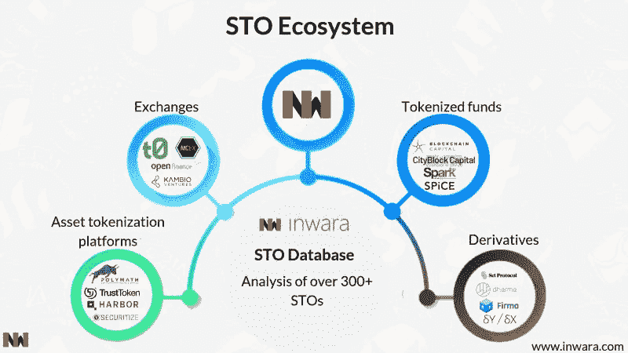
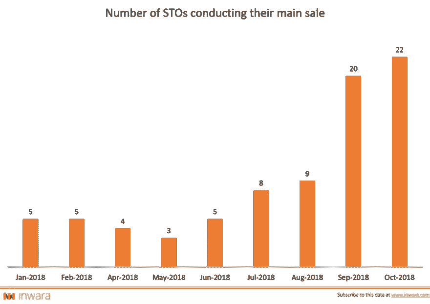
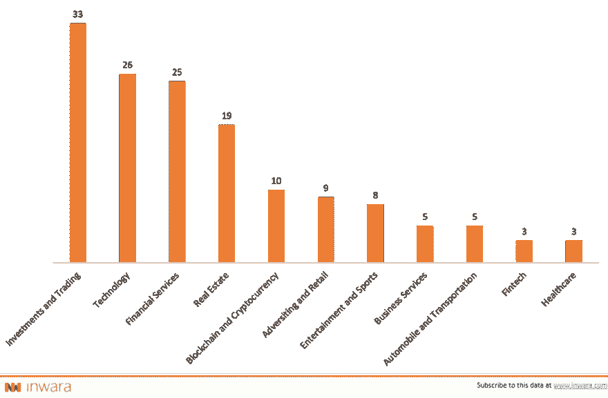
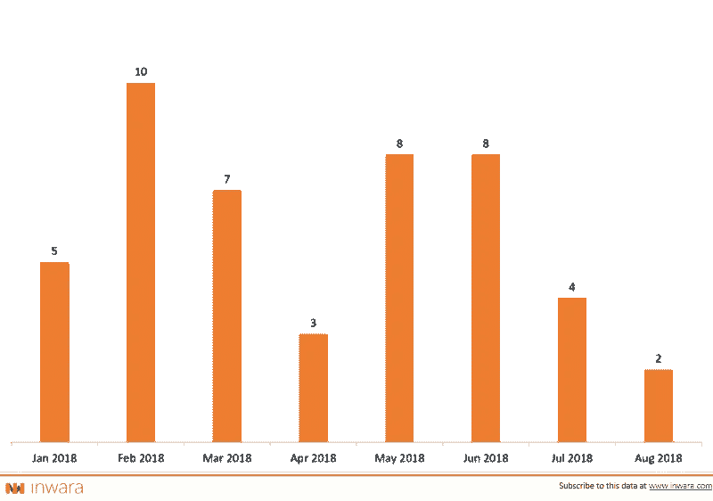
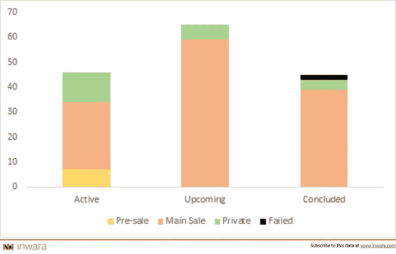

# 2019 年将会是 STO 之年吗？

> 原文：<https://medium.datadriveninvestor.com/stos-will-be-rule-over-icos-in-2019-security-token-offerings-on-the-spurt-inwaras-insights-d0f61838b012?source=collection_archive---------12----------------------->

> [**下载完整报告**](https://www.inwara.com/report/security-token-offerings?utm_source=stoddi&utm_medium=stoddi&utm_campaign=stoddi)

# STO:安全令牌产品

安全令牌发行(sto)是一种类似于 ICO 的筹资工具，但有一些法规要求令牌发行者对其行为负责。

ico 相对迅速的成功使其成为一种可行的众筹方式。虽然 ico 已经帮助许多初创公司筹集了大量资金，但不幸的是，这种筹资方式也为大量骗局铺平了道路。

# 了解安全令牌产品(sto)

区块链作为一项技术，自从主要因比特币而获得牵引力以来，一直在不断发展。现在，随着智能合约的发展，安全令牌应运而生，其唯一目的是将自己确立为实时数字资产的全新用例，以便在当前的法律和监管框架内运行。

## 简化 STOs 层

## 区块链议定书

安全令牌无权拥有自己的协议技术，但是，它们是在现有协议的基础上构建的，以太坊是当前空间中的首选。然而，有趣的是以太坊并不是唯一的选择，更多的协议正在进入这个领域。

## 智能合同

无论这个术语听起来多么时髦，它与智能合约和法律债券没有任何关系。这些基本上是受区块链协议约束的编程语言。它们本应具有效用和价值，这也是它们被命名为效用*令牌*的原因。

## 发行平台

这些平台生成和分发数字令牌，并负责为令牌发行制定合规和受监管的智能合同。

## 交换

数字资产生态系统中最重要的组成部分，因为它们促进交易，从而提供流动性。没有他们，就没有代币兑换货币/其他代币的平台。

## 这些规定背后的原因

*SEC 对不合规 ico 的打击引发了投资者和企业家心态的转变，从****ico****转向****sto****。*

由于基础资产的支持，大多数司法管辖区将这些视为证券，并要求项目背后的公司对其投资者负责。

> [下载完整报告](https://www.inwara.com/report/security-token-offerings?utm_source=stoddi&utm_medium=stoddi&utm_campaign=stoddi)

# sto 迅速取代 ico

[Source: InWara’s Security token offerings report](https://www.inwara.com/report/security-token-offerings?utm_source=stoddi&utm_medium=stoddi&utm_campaign=stoddi)

2018 年 10 月 sto 数量最多。从 ico 到 s to 的明显转变主要是由散户投资者对 ico 的需求减弱和骗局变得司空见惯所驱动的。

# STO 景观

[Source: InWara’s Security token offerings report](https://www.inwara.com/report/security-token-offerings?utm_source=stoddi&utm_medium=stoddi&utm_campaign=stoddi)

投资和交易在 2018 年领先，迄今为止 sto 数量最多，占 sto 总数的 20%以上。ICO 数字的领头羊金融服务公司后退了一步。

sto 推动了投资流入真正的链外业务，遵循提供股权/股份以换取资本的传统路线。

> [**下载完整报告**](https://medium.com/datadriveninvestor/complete-analysis-of-ico-market-in-2018-funding-trends-and-analysis-top-icos-and-stos-of-2018-3bdb336f2041)

# 令牌标准后跟 sto

[Source: InWara’s Security token offerings report](https://www.inwara.com/report/security-token-offerings?utm_source=stoddi&utm_medium=stoddi&utm_campaign=stoddi)

[以太坊的](https://www.ethereum.org/) ERC 20 以 68%的 sto 代币采用率独占鳌头。

[Polymath，](https://polymath.network/)首批支持 STOs 的公司之一，凭借其 ST-20 令牌标准获得了 23%的第二大份额。

[Securitize](https://www.securitize.io/) 开发了多个数字证券发行人，分别是 [Spice venture capital](https://spicevc.com/) 、 [Blockchain capital](https://blockchain.capital/) 、 [22X](https://22xfund.com/) 和 [Augmate](https://www.augmate.io/) ，全部专为推出 sto 而制作。采用这些平台来推出代币的比例很低，但在不断增长。sto 的激增可以看到证券化令牌的采用增加。

就数字资产投资而言，s to 被认为是低风险的，因为与 ico 相比，token 发行平台的运营具有多样性。不可否认，ERC 20 在 ico 领域以超过 95%的代币采用率领先，这扭曲了 ico 根据 ETH 价格波动筹集的资金。

此外，以太坊正在推出一个独特的令牌标准，ERC-1400 专门用于安全令牌。以太坊社区目前正处于测试阶段，该令牌旨在使安全令牌更加可信，使 **ERC-1400** 符合 ERC-777 和 ERC-20 标准。

> [下载完整报告](https://www.inwara.com/report/security-token-offerings?utm_source=stoddi&utm_medium=stoddi&utm_campaign=stoddi)

# 未来令牌的简单协议(SAFT)

[Source: InWara’s Security token offerings report](https://www.inwara.com/report/security-token-offerings?utm_source=stoddi&utm_medium=stoddi&utm_campaign=stoddi)

随着美国证券交易委员会对诈骗犯采取行动，SAFT 在美国证券交易委员会的登记数量有所增长。最近的报告表明，美国证券交易委员会将开始对所有在未来证券简单协议(SAFTs)框架下工作的项目进行系统调查。

# STOs 发展强劲:迄今为止成功率为 99%

[Source: InWara’s Security token offerings report](https://www.inwara.com/report/security-token-offerings?utm_source=stoddi&utm_medium=stoddi&utm_campaign=stoddi)

越来越多的 sto(超过 60%)正在运行或即将运行。此外，打算筹集资金的公司已经开始意识到，投资者和基金的兴趣正在向“安全”代币而不是“实用代币”倾斜。

Inwara 报道说 [Neluns](https://neluns.io/) 通过 STO 筹集了 1 . 36 亿美元，紧随其后的是 [Tzero](https://www.tzero.com/) 筹集了 1 . 35 亿美元

> [下载完整报告](https://www.inwara.com/report/security-token-offerings?utm_source=stoddi&utm_medium=stoddi&utm_campaign=stoddi)

# SEC 在股权融资领域显示出强大的立足点

SEC 正在发表声明，在“既定”规则和法规的许可和执行之间建立平衡，并不回避对 ICOs 采取法律行动，就像它对 Paragon 和 Airfox 所做的那样。

Paragon 和 [AirFox](https://airfox.com/) 已经同意参与销售未注册证券，美国证券交易委员会因此对他们处以 25 万美元的罚款。

# 综上

在不久的将来，sto 似乎有望取代 ico。它们将是合法的，受州/中央司法管辖，并提供具有真实回报预期的投资机会，回报不受 BTC 价格的影响，而是受企业正现金流的影响。这对数字经济生态系统来说是个好兆头。

*哪里可以看到这个数据？*

*要查看 InWara 的 STO 数据库，请在此安排您的* [*专家演练。*](https://calendly.com/amathur)

> [下载完整报告](https://www.inwara.com/report/security-token-offerings?utm_source=stoddi&utm_medium=stoddi&utm_campaign=stoddi)

