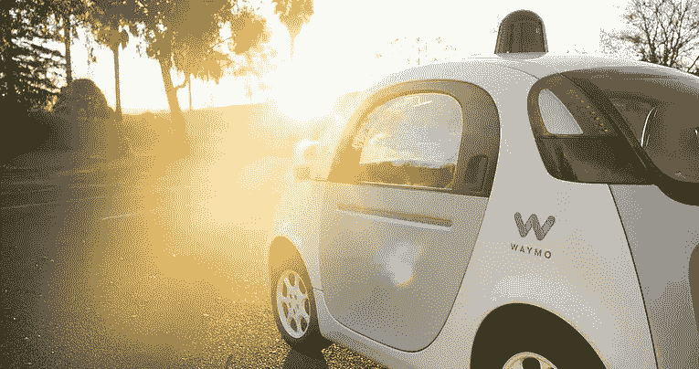

# 为自动驾驶汽车系好安全带

> 原文：<https://medium.datadriveninvestor.com/strap-in-for-self-driving-cars-46444a076ab4?source=collection_archive---------7----------------------->

关于自动驾驶汽车的地位，已经有了很多讨论。技术领导者很快宣布他们是第一家实现汽车完全自主的公司，这无疑改变了我们所知的世界。这种颠覆性的进展已经被广泛报道了很多年，然而人们并不确定我们在终点线的位置。由于过分的承诺和令人失望的结果，对该行业的信心受到考验也就不足为奇了。事实是，没有人准备在自动驾驶竞赛中声称自己是第一名，否则就是非常不负责任的。

# 技术现状:

事实证明，教会一个无生命的物体像人一样思考是很困难的。目前，汽车配备了摄像头、传感器、雷达和黑匣子，用于跟踪和监控司机的行为，通过监督学习训练汽车运行。尽管企业已经成功实施了一种收集所需大量数据的方法，但汽车仍然不具备在不可预测和非理性的人类行为中导航所需的文化或行为本能。这些汽车有眼睛看路，但它们没有大脑来处理和应对独特的情况和挑战。因此，我们现在可以结束这些谣言，并确认没有一辆汽车，没有一家公司，可以在不使用无监督学习的情况下实现 5 级自主。车辆必须能够像人类一样处理和解释信息。基本上，他们需要学习如何思考。

 [## 在自动驾驶汽车发生事故的情况下，谁应该承担法律责任？-数据驱动型投资者

### 我仍然认为自动驾驶汽车是一种奢侈品，而不是必需品…

www.datadriveninvestor.com](https://www.datadriveninvestor.com/2018/11/02/who-is-legally-accountable-in-the-case-of-an-autonomous-vehicle-accident/) 

# 雷曼兄弟的类比:

自 1948 年以来，现代巡航控制系统就已经为驾驶员所用。一个可以“无人监督”地保持车速的系统确实有助于帮助驾驶员。认为这种程度的“自主”免除了司机的责任是愚蠢的。当然，每个司机必须确保他们保持警觉和安全，在可能的情况下，他们必须干预。完全相同的类比可以应用于科技巨头今天为明天生产的车辆的当前状态。

# 公司承诺和信誉:

像特斯拉这样的公司因其进展的模糊性而受到抨击。他们的模糊定义在未来的消费者中造成了混乱，他们认为他们可以在行驶的汽车中睡着，或者在通勤途中看电影，或者——也许更危险的是——在晚上喝醉时依赖汽车。特斯拉、优步、[、Waymo](http://www.waymo.com/) 和通用汽车都没有明确规定驾驶员需要多少互动，所以这就是我们集体定义的问题所在。

# 需要什么？

那么，我们能做什么呢？随着公众准备在世界各地更多的道路上实施自动驾驶车队，我们必须保持一致。我们必须停止损害领导人声誉的夸张和令人失望的言论。我们必须正视我们的能力和限制。公司必须告知并教育公众；每天都有人被扔进交通混乱的中心。如果我们不知道我们在哪里或我们要去哪里，我们将无法把这些变化变成我们这个世纪最大的成功故事。因为事实就是如此。

【www.jamesspiro.com】最初发表于**。2017 年 11 月 9 日**