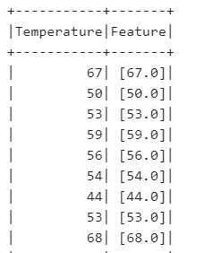
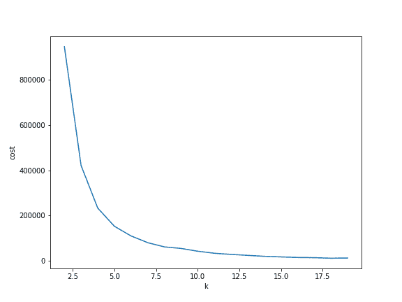
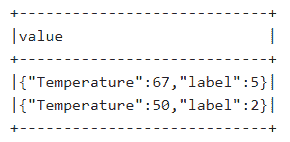
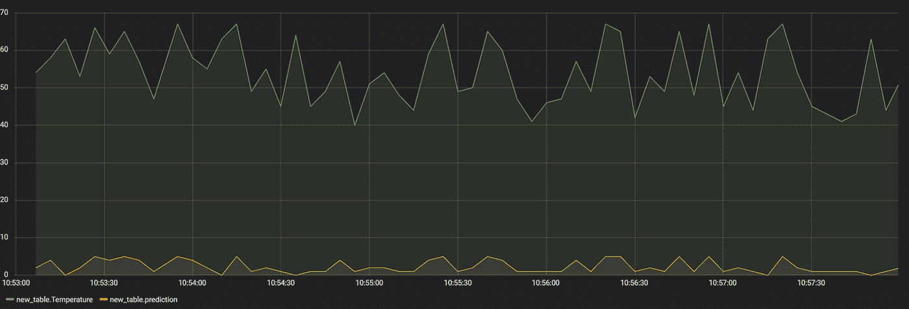

# 使用 Kafka、InfluxDB 和 Grafana 进行流分析

> 原文：<https://medium.datadriveninvestor.com/streaming-analysis-with-kafka-influxdb-and-grafana-d5bba9cc2b1a?source=collection_archive---------4----------------------->


如果您正在处理数据的流分析，有一些工具可以提供执行和易于解释的结果。首先，我们有 Kafka，这是一个分布式流媒体平台，允许其用户发送和接收包含一系列数据的实时消息(你可以在这里阅读更多信息)。我们将使用它作为我们的流环境。然后，如果我们想实时可视化我们的结果，我们需要一个工具来捕捉我们的数据和预测:它是 Grafana，在它的数据源中，它可以连接到 InfluxDB，一个开源的时间序列数据库。因此，通过本文，我们将构建一个 ML 算法，它可以通过以下步骤提取信息并对我们的数据进行实时预测:

*   加载我们的数据并准备进行处理
*   构建算法并保存它以激发环境
*   编写一个脚本来读取我们的数据，并在接收数据时将它们发送到 Kafka 主题，这样我们就可以模拟流式采集
*   编写一个脚本，从 Kafka topic 收集数据，并通过我们训练和保存的算法处理它们。然后，它将结果发送到另一个 Kafka 主题
*   最后，编写第三个脚本，它从第二个主题中读取内容，并将消息直接发送到 InfluxDB，这样我们就可以在 Grafana 上绘制结果。

[](https://www.datadriveninvestor.com/2019/01/25/why-data-will-transform-investment-management/) [## 为什么数据将改变投资管理|数据驱动的投资者

### 有人称之为“新石油”虽然它与黑金没有什么相似之处，但它的不断商品化…

www.datadriveninvestor.com](https://www.datadriveninvestor.com/2019/01/25/why-data-will-transform-investment-management/) 

那我们开始吧。我想模拟的任务如下:想象我们被提供了一些关于工作机器的温度的数据。我们知道这台机器在不同的状态下工作，对应不同的温度水平和波动。因此，我们首先要识别那些工作状态(未知)，然后训练一个分类算法，该算法可以对实时数据进行预测，并根据实际温度预测相应的工作状态。正如你可能已经猜到的，我们正面临着一个无人监管的任务，我们正在将其转化为有人监管的任务。

首先，我将创建一个包含我的温度变量的随机数据集。为了编写这些代码行(以及后面的代码行)，我使用了 Apache Zeppelin 和 *%pyspark* 解释器。

```
%pyspark

import pandas as pd
import numpy as np
df = pd.DataFrame({'Temperature': np.random.randint(40,70, 50000)})
```

然后，我将它转换成 spark 数据帧，这样我们就可以通过我初始化的 Spark 上下文将它连接到我们的 Spark 环境:

```
%pyspark

from pyspark import SparkContext
sc = SparkContext("local[*]", "Example")

from pyspark.sql import SQLContext
sqlContext = SQLContext(sc)
spark_df = sqlContext.createDataFrame(df)
```

然后，为了让我们的算法正确处理我们的数据集，我们必须将其矢量化。其思想是，您希望将用作特性的列转换为值的向量，存储在一个新列中，当然名为“Feature”。请注意，这里我们将只使用温度作为一个特征，但是，无论如何，格式必须是一个向量:

```
%pyspark

from pyspark.ml.feature import VectorAssembler
vectorAssembler = VectorAssembler(inputCols = ['Temperature'], outputCol = 'Feature')
vspark_df = vectorAssembler.transform(spark_df)

vspark_df.show()
```



如您所见，变量的格式变成了 vector 类型。现在我们的特征准备好被处理。

因为我们正在处理未标记的数据，所以我们要做的第一件事是用一种无监督的算法对它们进行聚类。为此，我将使用 K-means(如果你想了解更多关于这个算法的信息，你可以在这里阅读我的文章)。

因此，我将开始确定我想用肘方法设置的质心的数量:

```
%pyspark

import matplotlib.pyplot as plt
from pyspark.ml.clustering import KMeans
from pyspark.ml.evaluation import ClusteringEvaluator
cost = np.zeros(20)
for k in range(2,20):
    kmeans = KMeans().setK(k).setSeed(1).setFeaturesCol("Feature")
    model = kmeans.fit(vspark_df.sample(False,0.1, seed=42))
    cost[k] = model.computeCost(vspark_df) 

fig, ax = plt.subplots(1,1, figsize =(8,6))
ax.plot(range(2,20),cost[2:20])
ax.set_xlabel('k')
ax.set_ylabel('cost')
```



似乎在第六个质心之后，组内方差没有显著减小。因此，我们可以设置 K=6。让我们将 K-means 应用于数据集:

```
%pyspark

from pyspark.ml.clustering import KMeans
k = 6
kmeans = KMeans().setK(k).setSeed(1).setFeaturesCol("Feature")
model = kmeans.fit(vspark_df)
from pyspark.sql.functions import col
df_transformed=model.transform(vspark_df).select('Temperature','Feature', col('prediction').alias('label'))

df_transformed.show(2)
```


如您所见，我们现在有了第三列，这是我们的目标，我们的标签。因此，我们现在可以以监督的方式训练分类算法，更具体地说，我们将训练具有 2 个隐藏层的神经网络(输入=1，因为我们只有一个特征，输出=6，因为我们有 6 个聚类)。

```
%pyspark

from pyspark.ml.classification import MultilayerPerceptronClassifier
from pyspark.ml.evaluation import MulticlassClassificationEvaluator

*# Split the data into train and test*
splits = df_transformed.randomSplit([0.6, 0.4], 1234)
train = splits[0]
test = splits[1]

layers = [1, 6, 8, 6]

*# create the trainer and set its parameters*
trainer = MultilayerPerceptronClassifier(featuresCol='Feature', labelCol='label', maxIter=200, layers=layers, blockSize=128, seed=1234)

*# train the model*
model_NN = trainer.fit(train)

*# compute accuracy on the test set*
result = model_NN.transform(test)
predictionAndLabels = result.select("prediction", "label")
evaluator = MulticlassClassificationEvaluator(metricName="accuracy")
print("Test set accuracy = " + str(evaluator.evaluate(predictionAndLabels)))

Output: Test set accuracy = 0.802813400934
```

我们的神经网络的精度约为 80%，所以我们很满意，可以这样保存我们的模型:

```
%pyspark from pyspark.ml.classification import MultilayerPerceptronClassificationModel model_NN.save("file:///home/cloudera/Desktop/Neural_Network")
```

为了保存我们的数据集，我们首先需要将其解析为 json 格式(键值类型):

```
%pyspark from pyspark.sql import functions as F json_file=final_df.select(F.to_json(F.struct([final_df[x] for x in final_df.columns])).alias("value")) json_file.show()
```



很好。现在让我们来看看我们的 Pyspark 脚本。首先，我正在编写一个程序，它将从我们的 mydata.json 中收集数据，并以流的形式发送给我们的 Kafka 消费者，主题为“example_1”。

```
*#! /usr/bin/env python2.7*

import json
from pprint import pprint
from time import sleep
from json import dumps
from kafka import SimpleProducer, KafkaClient

kafka = KafkaClient('quickstart.cloudera:9092')
producer = SimpleProducer(kafka)

with open('mydata.json', 'r') as f:
    for line in f:
           data = json.loads(line)
           for val in data.values():
                   producer.send_messages('example_1', val.encode('utf-8'))
                   sleep(5) *#it will send a line to kafka every 5 seconds*
```

现在，我正在编写一个从 Kafka 主题“example_1”中读取数据的脚本。为此，我使用了 Spark 结构化流方法，如果您希望您的流是结构化的而不是非结构化的(这是通过 Spark 流上下文收集流数据的典型格式)，这种方法非常有用。[这里](https://spark.apache.org/docs/latest/structured-streaming-kafka-integration.html)是 Spark 结构化流媒体与 Kafka 集成的完整指南。

然后，一旦收集了我的数据，我就使用我存储的 ML 模型从我的特征温度中提取工作状态，然后在一个名为“预测”的新列中收集输出。

最后，我将再次向 Kafka 写入我的最终数据帧，但在一个名为“example_2”的不同主题中(实际上，“example_1”已经被我的初始数据帧的行队列占用)。

```
*#! /usr/bin/env python2.7*

*#initializing my Spark Session*

from pyspark.sql import SparkSession
spark = SparkSession.builder.master("local[2]")\
                    .appName("Influx").getOrCreate()

from pyspark.sql.functions import col, from_json, to_json
from pyspark.sql.types import *

*#initializing the schema of my json file*

schema = StructType([
    StructField("Temperature", IntegerType()),
    StructField("label", IntegerType())])

*#reading structured streaming data from kafka topic 'example_1'*

df = spark \
  .readStream \
  .format("kafka") \
  .option("kafka.bootstrap.servers", "quickstart.cloudera:9092") \
  .option("subscribe", "example_1") \
  .option("failOnDataLoss", False)\
  .load()

*#extracting from the df our values through the json schema*

df_2=df.selectExpr("CAST(value AS STRING)")\
       .select(from_json(col("value"), schema)\
       .alias("tmp"))\
       .select("tmp.*")

*#vectorize our feature*

from pyspark.ml.feature import VectorAssembler
vectorAssembler = VectorAssembler(inputCols = ['Temperature'], outputCol = 'Feature')
vspark_df = vectorAssembler.transform(df_2.dropna())

*#loading our NN*

from pyspark.ml.classification import MultilayerPerceptronClassificationModel
NN_model=MultilayerPerceptronClassificationModel.load("file:///home/cloudera/Desktop/Neural_Network")

*#predicting the work regime of our data*

NN_predictions = NN_model.transform(vspark_df)
final_df=NN_predictions.select("prediction","Temperature","Feature")

*#writing our final df to kafka topic 'example_2'*

ds=final_df.select(to_json(struct("prediction","Temperature")).alias("value"))\
         .writeStream\
         .format("kafka")\
         .option("kafka.bootstrap.servers", "quickstart.cloudera:9092")\
         .option("topic","example_2")\
         .option("checkpointLocation", "file:///home/cloudera/Desktop/checkpoint")\
         .start()

ds.awaitTermination()
```

最后，我将创建一个脚本，它从 Kafka 主题“example_2”中读取内容，并将其内容直接发送到 InfluxDB。

```
*#! /usr/bin/env python2.7*

import json
from influxdb import InfluxDBClient
client = InfluxDBClient(host='localhost', port=8087, database='example')
client.create_database('example')
import kafka
from kafka import KafkaConsumer
consumer = KafkaConsumer('example_2', bootstrap_servers=['quickstart.cloudera:9092'])

from pyspark.sql.functions import col, from_json
from pyspark.sql.types import *

for message in consumer:
    json_body = [
    {
        "measurement": "new_table", *#this table will be automatically created*
        "tags": {
        },
        "fields":json.loads(message.value)
    }
]

    client.write_points(json_body)
```

现在，我们在三个不同的终端中运行我们的脚本:

```
*#this is a spark job, hence we run it through spark-submit*[root@quickstart]  ./bin/spark-submit --packages\                         org.apache.spark:spark-sql-kafka-0-10_2.11:2.3.0, \                         org.apache.kafka:kafka-clients:0.10.2.1, \                         org.apache.spark:spark-streaming-kafka-0-10_2.11:2.3.0 reading_from_kafka.py  
#then we write our two further scripts: ./writing_to_kafka.py  
 ./writing_to_influx.py
```

现在让我们跳到格拉法纳。在将我们的仪表板连接到 InfluxDB 后(你可以很容易地在 [Grafana 网站](https://grafana.com/)上看到如何做)，我们可以创建我们的图表，它显示了实际温度和我们的神经网络预测的工作状态。



绿线是我们的温度，而黄线是相应的工作制度。

您可以向图表中添加许多变量:通过添加任意数量的查询，可以对数据进行聚合、分组或计算操作。此外，尽管我一直在处理时间序列，Grafana 还是根据任务提供了大量图表。通过集成这三个工具，您不仅可以构建实时模型，还可以高效地展示它们。

*原载于 2019 年 7 月 17 日*[*【http://datasciencechalktalk.com*](https://datasciencechalktalk.com/2019/07/17/streaming-analysis-with-kafka-influxdb-and-grafana/)*。*