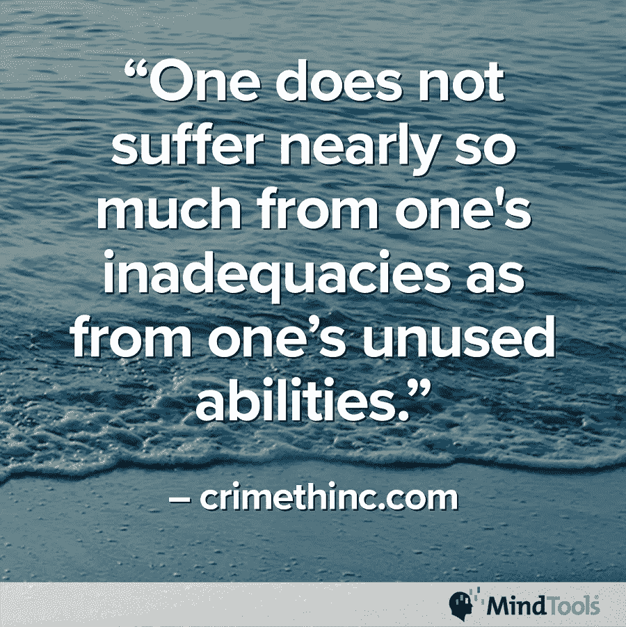
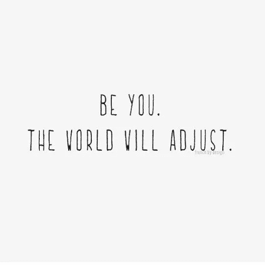
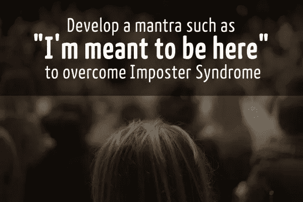
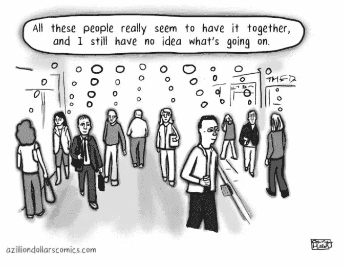

# 摆姿势并不流行

> 原文：<https://medium.datadriveninvestor.com/striking-a-pose-is-not-in-vogue-7b09379e3f9b?source=collection_archive---------4----------------------->

## 冒名顶替综合症随时可能出现，削弱自信

不满足感——生活在谎言中——在工作中和工作之外都会发生。善于在生活中表现得很好的人会让别人感到疑惑，“为什么我不是？”

欢迎来到[冒名顶替综合征](https://en.wikipedia.org/wiki/Impostor_syndrome)，“一种心理模式，人们怀疑自己的成就，并对被揭穿是骗子有一种持续的、通常是内在的恐惧。”

[思维工具](https://twitter.com/Mind_Tools)智囊团专家和其他参与者谈论了冒名顶替综合症，感觉不充分和真实地生活。“头脑工具”有助于传播领导力、管理和个人效率方面的最佳理念

 [## 自毁会造成不必要的伤害

### 鼓起勇气说不，并重申你的价值

medium.datadriveninvestor.com](/self-sabotage-inflicts-needless-harm-1c90df956946) 

Michele Doucet 是 Mind Tools 社区参与促进者，“帮助人们发展卓越的领导、管理和个人效率技能。”

查斯·桑德斯自称是“ambivert 和 90 年代迷”

他们一起讨论了“不足”对他们意味着什么。

一种观点认为，能力不足是因为你认为自己的技能与他人相比有所欠缺，所以没有发挥你的作用。

“这意味着不够……没有足够的技能、经验、知识、勇气和社会资本，”多塞特说。“与我‘相信’别人和社会对我的期望相比，这还不够。”

# 不配

桑德斯视野开阔。

“不足仅仅意味着一些东西不值得，”她说。“它不符合预期，不足以用于特定用途。”

头脑工具网站同意有不值得的想法，不值得和达不到期望。

“不充分的感觉可能包括通过放大镜看你的错误，而根本不注意你做对的事情，”Mind Tools 说。

 [## 慷慨的礼物不断给予

### 注意并尊重彼此的贡献

medium.datadriveninvestor.com](/generositys-gift-keeps-giving-155adfc5dd54) 

当你环顾四周，认为其他人都比你做得更好时，你会觉得自己工作不称职。还有就是不被赏识。

桑德斯说:“当我的老板问我是否知道如何使用像裁纸刀这样的基本办公设备时，我就不记得我简历中的工作经历了。”“加油。”

多塞特已经到达了她的舒适区。

“我今天工作时没遇到什么困难，”她说。“我对自己的皮肤很满意。我的同事重视并欣赏我做“我”我花了很长时间才到达现在的位置。

“当我走出工作，进入同龄人的‘小圈子’环境，别人试图评判时，我开始质疑自己，”杜塞说。

“有些人在做每件事都不完美时会觉得自己不够好，”Mind Tools 说。“将自己与他人或他人的成就进行比较的情况可能会让你感到不满足。

"如果你停止破坏自己，你的生活会有多大的不同？"智库专家问道。

Mind Tools 发表了一篇关于[克服自我破坏](https://www.mindtools.com/pages/article/newTCS_95.htm?utm_source=social&utm_medium=organic&utm_campaign=tweetchat)的文章。

# 不同的标准

进入一个由有才能的人组成的组织可能会让你大吃一惊，觉得自己不配或者是个骗子。

“有时候在男性高管身边，我觉得自己不够格，觉得自己不是他们俱乐部的一员，”杜塞说。

Mind Tools 设想了一个例子，当“你因为工作出色而受到表扬，但你认为你的工作很简单，任何人都可以做得和你一样好。如果是这样，你可能会觉得自己是个骗子。

Mind Tools 表示:“在获得晋升或开创自己的事业后，感觉自己像个冒名顶替者并不罕见。”。“感觉好像每个人都会很快意识到你其实知道的不多。”

智囊团成员提醒该小组，“即使是阿尔伯特·爱因斯坦也觉得人们夸大了他毕生工作的重要性。”

为了对抗不充分的感觉或冒名顶替综合症，与其他人交谈。在你打破僵局后，你可能会发现他们在你旁边感到不自在。

“这是如此正确，”杜塞说。“当我与比我更有经验或职位更高的人交谈时，我总是感到惊讶，并听说他们有时感觉像是骗子。”

 [## 自信让你的世界变得更加美好

### 当你跳入社交媒体流时，伟大的对话正在等待着你

medium.datadriveninvestor.com](/confidence-opens-your-world-to-much-better-engagements-a2b3b0c88457) 

自信可以击败冒名顶替者的想法。

“从根本上说，相信你自己，”杜塞说。“从内心深处知道自己的归属，你的声音很重要，你可以做出很多贡献。

“了解你自己，”她说。“了解你的优势和劣势，你的价值观以及什么对你来说最重要。拥抱你的成功。”

杜塞建议放弃完美主义——“一种幻觉和自尊的杀手。”

“承认你的感受，但是提醒你自己，感觉不是真实的，”思维工具说。“你觉得自己不够格并不意味着你就是。

该网站称，“对自己的优势和劣势有一个正确的认识”。“如果你了解自己的优势和劣势，你就不必担心自己不适合某个特定的项目或角色。”

Mind Tools 发表了一篇博客来解释什么是冒名顶替综合症，它如何限制你生活中的可能性，以及你可以用什么策略来克服它。

# 展示真实的你

真实不是装腔作势，也不是玩玩可怜。只是做你自己，而不是假装或试图像其他人一样。

“这是拥有和展示诚信，”桑德斯说。“保持客观，但要对自己感到满意。达到这样一种境界，你可以毫无问题地表达自己的感受、想法和观点。”

杜塞实际上是在唱她的回答。

"我必须成为*我*！"她说。“我真的认为我们有太多的压力去顺从。多无聊啊。”

 [## 商业对商业仍然是个人的

### 对自己的个性放松会带来财务上的成功

medium.datadriveninvestor.com](/business-to-business-is-still-personal-15cab40acb5) 

心灵工具和谐回答。

智囊团专家指出:“真实意味着你忠于自己的个性、价值观和精神，不管你面临着什么样的压力。”

“对自己和他人都要诚实，”思维工具说。“为自己的错误负责。”

“跟着你自己的鼓点跳舞，”杜塞说。“我就是我，并按照我的价值观行事。外面有很多批评家。从那些热衷于评判的人那里了解哪些声音是重要的。

“我是原创的，”她说。“我不需要成为一个不是我的人，也不需要去模仿别人对我的期望。"

有时，人们会被迫展示某种形象来获得成功。一个例子可能是工作面试。

“在某种程度上我不同意，”桑德斯说。“请记住，在特定活动中不展示不相关的东西并不等同于被迫成为另一个人。

她说:“做真实的人，损失是必须的。”。"然而，你从真实中获得了永远无法得到的东西."

# 骗人的外表

桑德斯解释说，装模作样会伤害他人。

“知道有多少人这样做，我很失望，”她说。“你剥夺了一个别人比你更值得拥有的机会，因为他们在这方面的经验和专业知识。”

与此同时，桑德斯在消极中看到积极。

“我感到有压力，要展现某种形象才能获得成功，”她说。“比平时更频繁地微笑，让周围的人感到舒服，这并不是一件坏事。”

 [## 订婚是一个四个字母的单词

### 工作场所文化弥合了员工沟通中的差距

medium.datadriveninvestor.com](/engagement-is-a-four-letter-word-e49970cdd3fb) 

类似的场景在大企业中也时有发生。

“当我在企业环境中工作时，你必须说‘正确的’事情，”杜塞说。“使用专有语言——行话——来维持你在团队中的地位。按照“古鲁”所说的方式行事，将你定位。隐藏自己的感情。”

在这种情况下,《心智工具》指出，“真实地生活并不总是容易的。有时，忠于你认为正确的事意味着你要与众不同。

“一方面，真实可能意味着错过机会——你不得不接受这一点，”该网站称。“然而，从长远来看，这可能会带来更多的机会。”

# 忠于你

根据 Mind tools 的说法，扮演一个合群或给别人留下深刻印象的角色会阻碍你发挥真正的潜力。网站有一篇文章，“ [*如何对自己真实*](https://www.mindtools.com/pages/article/authenticity.htm?utm_source=social&utm_medium=organic&utm_campaign=tweetchat) ”

新手被告知“假装直到你成功”，这在某种意义上是一种逃避，给你一种逃避学习和更加努力工作以获得成功的方法。

“当我第一次进入企业生活时，我怀疑自己是否真的属于那里，”杜塞说。“我学会了企业用语，穿得像个克隆人一样以适应环境。感觉太假了。维护起来很费力。”

“如果你是真实的，并愿意接受忠于你认为正确的事情的后果，假装可能不会引起你的共鸣，”Mind Tools 说。

“现在的你和你知道你可能成为的那个人之间有差距吗？”网站问。"与其假装，不如设定目标，帮助你努力成为那样的人."

你可以试着成为另一个人，但你有时只会愚弄一部分人。

杜塞说，“当你戴上面具隐藏真实的自己时”就会发生这种情况

# 不真实

Mind Tools 指出，摆姿势发生在——“我们不是以真实的方式表现，而是告诉人们我们认为他们想听的话。

“如果我们的行为违背了我们的本性，我们就活得不真实，”专家说。“保持真实总是很重要的，但如果你处于领导地位，这是没有商量余地的。”

一个头脑工具博客解释了[真实领导力](https://www.mindtools.com/pages/article/newLDR_43.htm?utm_source=social&utm_medium=organic&utm_campaign=tweetchat)是如何运作的。

 [## 真实和善良展现真实的你

### 表现自然会给个人和职业带来巨大的回报

medium.datadriveninvestor.com](/being-authentic-and-kind-reveals-the-real-you-753f1e04510b) 

别人对你的看法与你不同。这很自然，因为你的声音对你来说和对别人来说听起来不一样。最好的解决办法就是做自己最好的人。让你的内在自我来定义你。

“我根据别人的性格类型来判断他们如何看待我，”桑德斯说。"我这样说是因为有同样的人不喜欢我。"

对策是关注自己而不是别人。

“我们可能一辈子都在担心别人对我们的看法，害怕他们的评判，”杜塞说。“我们需要深刻地认识到我们已经足够了。

“向你信任的人伸出援手可以减少你的恐惧，”她说。“他们可能会看到你看不到的一面。你可能还会发现，有这种感觉的不只是你一个人。”

“其他人可能会认为你在你所做的事情上有能力和技能，”Mind Tools 说。“他们甚至可能会钦佩你。

“当职业发展受到威胁时，其他人——比如你的上司——如何看待你很重要，”该网站称。"当谈到内心的平静和自我接纳时，你如何看待自己是很重要的."

# 善行会得到回报

尽你最大的努力，利用你最好的技能，把别人放在心上。如果你为他们做好事，他们会感激你的努力，并消除你的不满足感。

“写下你在怀疑自己的情况下的感受，”杜塞说。“当你觉得自己能力不足时，确定你正在告诉自己的故事。“真相”是什么？你如何重写你的故事？

“听听你对自己说的话，”她说。“积极思考。用积极的形象来肯定自己。”

根据 Mind Tools 的说法，比较游戏可能会变成一个恶性循环——令人衰弱。

“不要拿自己和别人比较，也不要拿别人和别人比较，”专家说。“攀比是快乐的小偷。

“学会给予*和*接受赞美和称赞，”思维工具说。“增强你的自尊可能有助于你不觉得自己不够或者‘不够，不值得’"

**关于作者**

吉姆·卡扎曼是[拉戈金融服务公司](http://largofinancialservices.com)的经理，曾在空军和联邦政府的公共事务部门工作。你可以在[推特](https://twitter.com/JKatzaman)、[脸书](https://www.facebook.com/jim.katzaman)和 [LinkedIn](https://www.linkedin.com/in/jim-katzaman-33641b21/) 上和他联系。