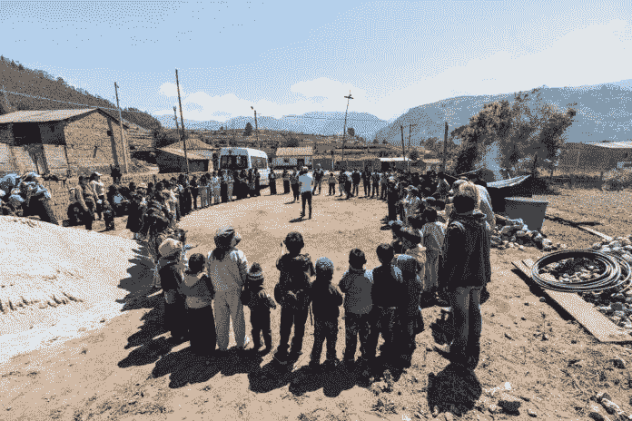
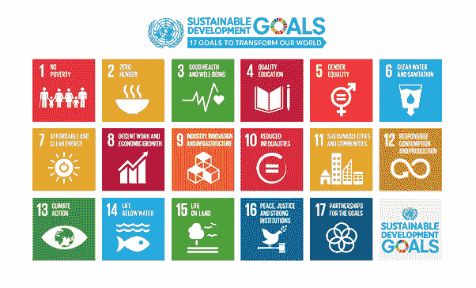

# 强大的联系创造社会影响

> 原文：<https://medium.datadriveninvestor.com/strong-connections-create-social-impact-67e7ea96748e?source=collection_archive---------10----------------------->

## 社交媒体是建立信心和力量的催化剂

Photo by Dario Valenzuela on Unsplash

社交网络依赖于人们之间的互动。随着联系的增加，参与者建立了信心，整个系统也积聚了力量。

[蒂莫西·马查里亚](https://twitter.com/marshall_timm)会告诉你浪费一个强大的网络是一件可怕的事情。Arielle 在非洲的首席管理官是一名热情的数字营销人员、品牌开发人员和平面设计师。

 [## 我们屏蔽了社交媒体，这引起了公愤。数据驱动的投资者

### 上瘾，我们看不出来。在最近的一项研究中，基于以前的研究成果，我们想…

www.datadriveninvestor.com](https://www.datadriveninvestor.com/2018/12/01/we-blocked-access-to-social-media-it-caused-an-outrage/) 

在[非洲推特聊天](https://twitter.com/AfricaTweetChat)中，他重申了他对社交媒体社会影响力的信念。

马查里亚说:“社会影响可以包括组织和个人，以及以改善他们周围社区的经济和社会状况为使命的运动。”

“用更通俗的语言来说，社会影响包括为改善他们所针对的社区而开展的任何活动，”他说。"想想清洁水项目和农业团体项目."

[可持续发展目标](https://twitter.com/SDG2030)和企业社会责任也在社会影响领域占有一席之地。

“我曾与东非转型商业网络合作过，”马查里亚说。“它专注于帮助企业家发展他们有影响力的业务，从而增加他们的社会影响和改善社区。我目前是非洲 Arielle 的首席管理官，这是一家专注于可持续发展目标的初创公司。

社会影响会影响那些利用热门话题在线对话的民间社会组织。

“大多数政府都试图利用网络社区来表达他们的观点，”马查里亚说。"然而，媒体在报道政府新闻方面占据了更优先的地位."

教育和赋权在社会影响中发挥着重要作用。

“有相当数量的非政府组织在东非和非洲运作，”马查里亚说。"他们专门参与社会影响下的教育项目."

社交媒体正在许多方面改变当今社会的面貌。

“超过 30 亿人使用社交媒体，”马查里亚说。“这几乎是世界人口的一半。它帮助重新定义了一系列文化和社会问题。我可以有来自世界各地的朋友，这意味着我说一种新的语言和文化。

“我可以通过手机在世界任何地方找到合适的生活伴侣，”他说。“爱被重新定义了。我可以通过拥有一批追随者来赚钱。丰富性得到了提炼。”

# 不全是 rosey

这只是社交媒体改变或影响人们生活的一种方式。

马查里亚说:“我希望这件事能充满笑容，但也有可行的负面影响。”。“社交媒体成瘾及其影响是相当大的。最直言不讳的影响社会和家庭生活、心理健康，甚至注意力缺陷多动障碍。”

 [## 有力的对话会产生影响

### 在线社区有广泛的网络优势

medium.datadriveninvestor.com](/forceful-conversations-create-impact-df95389d5f29) 

社交媒体经常帮助倡导社会影响力的组织扩大影响力并实现转型。

“看看苏丹起义，”马查里亚说。“全世界都为他们聚集在一起。这说明了为什么几乎不可能将社区局限于任何一种定义，这是一件相当不可思议的事情。

他说:“我对许多组织转向社交媒体进行沟通并提高对他们努力产生社会影响的认识印象深刻。”“联合国是一个很好的例子，说明这些平台可以用来传播这种影响。”

这种溢出效应通过传统新闻媒体传播。

“非洲之眼 [BBC 新闻非洲](https://twitter.com/BBCAfrica)正在改变非洲大陆的新闻传播方式，通过社交媒体分享其内容，使用一种许多人都能理解的非常特殊的语言，”马查里亚说。“社交媒体让他们能够分享他们的愿景、进展和影响报告。这激励了积极的运动，并促使政府参与进来。

“社交媒体也成为一个平台，在这个平台上，消费者的观点比以往任何时候都更加重要，”他说。“一个错误和一个品牌可能会付出高昂的代价。或者，伟大的企业因社交媒体的影响而成长。”

社交也极大地丰富了其他媒体，如广播和电视，并让公众参与到有关问题的节目中。

“他们现在越来越依赖社交媒体来扩大影响力，”马查里亚说。“仔细想想，这就是相关性。”

人们通过社交媒体建立起社区，这影响了整个国家。马查里亚指出了苏丹起义、埃及革命以及津巴布韦总统罗伯特·穆加贝下台的后果。

“不可否认在线社区的影响，”马查里亚说。

# 避免自担风险

他为那些为了社会影响力而避开社交媒体的组织提供建议。

“有没有企业自杀这种事？”马查里亚说。“任何无视社会影响的组织都会付出代价。

“社会影响的美妙之处在于，它本身就是一种营销策略，”他说。“不言而喻， [Safaricom PLC](https://twitter.com/SafaricomPLC) 用斯瓦希里语发起的# Twaweza——“我们可以让它发生”——活动就是一个完美的、可借鉴的例子。”

 [## 品牌宣传值得冒险吗？

### 代表某些东西的公司会有所作为

medium.datadriveninvestor.com](/is-brand-advocacy-worth-the-risk-c984c6d81f5e) 

为了让一个组织获得资金和奖励，人们更加关注社会企业家精神和社会企业责任。

马查里亚说:“有相当多的国际组织愿意向以社会影响为核心价值的企业提供赠款或资金。

随着社交媒体产生更广泛的影响，它有助于行为的改变。

“在许多闪亮的例子中有更多的警示，”马查里亚说。“成瘾、恶意、数据泄露和各种各样的危险趋势都是社交媒体和整个在线社区造成的。

“作为模范公民，我们有责任确保我们在社交媒体上所做的一切有利于我们和我们有影响力的社区，”他说。

仔细观察社交媒体成瘾，马查里亚认为这是一个合理的担忧。

“已经有研究，特别是在第一世界国家，使用了诸如青少年每晚看手机的次数、睡觉时带着手机的社交媒体用户的百分比等指标，”他说。

虽然这些研究引起了关注，但马查里亚说，企业家必须向前迈进。

“任何企业，如果不能对它所服务的社区产生影响，就根本不应该存在，”他说。“这个世界不需要更多的赚钱计划。它需要通过这些机构实现真正的转变。”

同样，使用社交媒体接触潜在客户的组织也应该小心数据泄露。

“违规对组织的影响不如对消费者的影响那样直接，”马查里亚说。“但是，组织应该站在最前列，反对第三方组织的数据泄露和对消费者数据的操纵。

“他们也应该[向他们的客户强调网络安全](https://www.datadriveninvestor.com/2018/10/24/good-security-protects-us-from-ourselves/)，”他说。“他们需要他们的客户和潜在客户在线，让他们有相关性。”

**关于作者**

吉姆·卡扎曼是拉戈金融服务公司的经理，曾在空军和联邦政府的公共事务部门工作。你可以在[推特](https://twitter.com/JKatzaman)、[脸书](https://www.facebook.com/jim.katzaman)和[领英](https://www.linkedin.com/in/jim-katzaman-33641b21/)上和他联系。

*原载于 2019 年 11 月 22 日*[*https://www.datadriveninvestor.com*](https://www.datadriveninvestor.com/2019/11/22/strong-connections-create-social-impact/)*。*