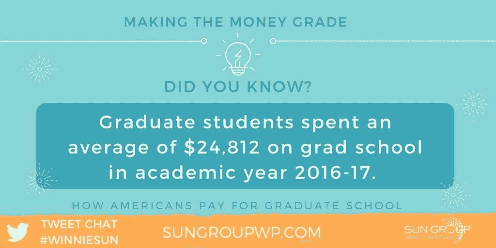
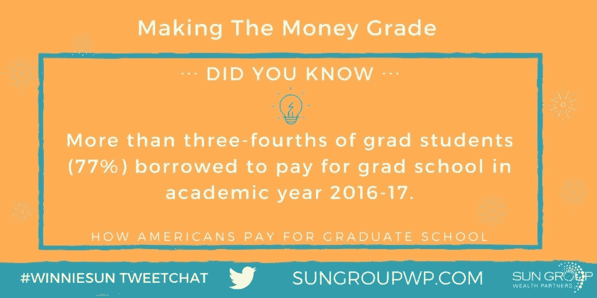
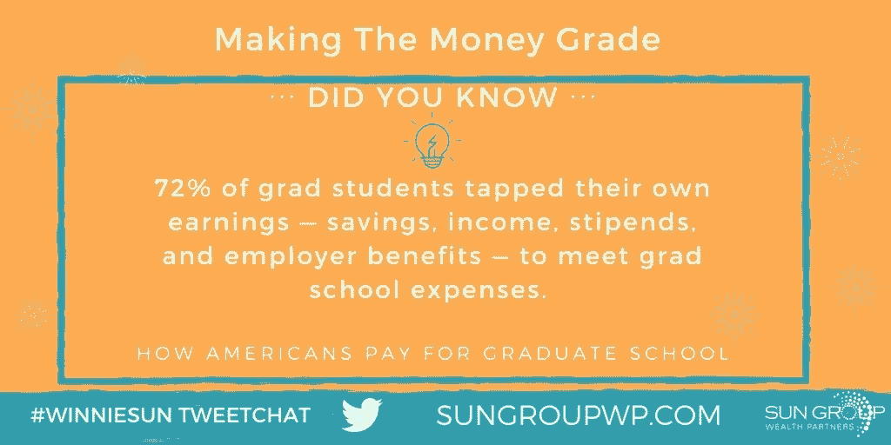
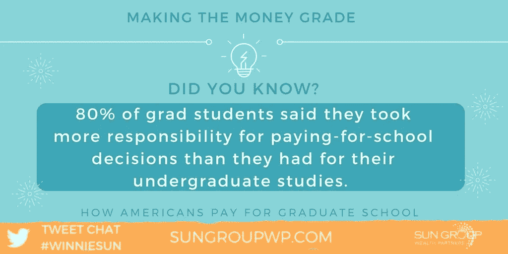

# 学生贷款不是职业选择

> 原文：<https://medium.datadriveninvestor.com/student-loan-payments-are-not-a-career-choice-7b84214acd7e?source=collection_archive---------0----------------------->

## 负债累累地开始毕业后的生活是一个残酷的现实

Photo by [Artem Bali](https://unsplash.com/@belart84?utm_source=medium&utm_medium=referral) on [Unsplash](https://unsplash.com?utm_source=medium&utm_medium=referral)

毕业典礼，毕业生。你已经完成了一个里程碑。欢迎来到高等教育和随之而来的多年债务的世界。

这不是大学新生和研究生想听到的信息，但这往往是他们的现实。

幸运的是，有办法减少终身学生贷款债务的前景。[约翰·林](https://twitter.com/bemovingforward)、[艾丽莎·卡彭特](https://twitter.com/NotOkThatsOk/)和[温妮·孙](http://winniesun.com/about/)提出了一些建议，这些建议可能会让当代学生和未来的学生受益。

Lim 是一名企业家，擅长公共演讲、高影响力演示、在线课程和数字产品。卡彭特是千禧一代的劳动力专家和顾问。孙是金融行业最受欢迎的专业人士之一。

“我毕业于加州大学洛杉矶分校，”孙说。“我最美好的回忆是我在宿舍工作的那些夏天。我遇到了很多优秀的学生，他们来自世界各地参加暑期课程。我遇到了很多来自不同文化的人。”

 [## 毕业生进入了砖头和灰泥的世界

### 离开大学后不久，信贷和贷款就汇合了

medium.com](https://medium.com/datadriveninvestor/graduates-take-on-the-brick-and-mortarboard-world-ea1ed3b5b889) 

卡彭特在宾夕法尼亚米勒斯维尔大学读本科，在匹兹堡大学读研究生，并在几所学校工作，包括宾夕法尼亚州立大学和宾夕法尼亚大学。

林最美好的回忆是他的父母参加了他所有的毕业典礼。其中包括宾夕法尼亚大学、乔治敦大学法学院和约翰霍普金斯大学凯瑞商学院的本科生。

“从大学出来最有价值的事情是开始和完成一些事情，获得我的学位，并在一个给我提供大量工作机会的地方，”孙说。

# 利用网络

上课对卡彭特有好处，但她更重视人。

“我的关系和网络很有价值，”她说。“虽然课程和学术知识很有帮助，而且往往是必要的，但我遇到的人已经成为我的导师、最大的支持者和我的责任伙伴。”

Lim 的第一个目标是学术。

他说:“我在本科时增加了课程，以便提前一个学期结束，这样我就可以一边工作一边申请法学院。”“商学院是在有了十多年工作经验之后才出现的。

“在读研究生之前，拥有真实世界的经历是非常重要的，”林说。“网络——尤其是在研究生院——是课堂内外投资的最佳回报。”

高等教育很重要，因为许多公司希望申请人持有大学学位作为考虑因素。实际学位可能与工作无关。

Sallie Mae——美国大学公司的储蓄、规划和支付机构——发现 95%的学生表示，在他们选择的职业中，高学历是进入、提升、加速或保持竞争力的必要条件。

“我相信高等教育，我同样相信尽快在你感兴趣的领域找到实习或专业工作的重要性，”孙说。

 [## 今天是摆脱学生债务的时候了

### 知道你将要面对什么，以及如何减轻负担

medium.com](https://medium.com/financial-strategy/today-is-the-time-to-break-free-of-student-debt-2c88f8d471) 

木匠也知道羊皮的价值。

“这因行业而异，但研究生学位或证书——CFA、CPA——很容易成为最低资格，”她说。“竞争很激烈。许多千禧一代在经济衰退期间找不到工作时回到了学校。

“本科是公共关系，研究生是教育中的社会和比较分析，”卡彭特说。“你在大学里遇到的人——朋友、教授、俱乐部赞助商——比你早了四年。”

学位曾经为你敞开大门，但今天情况不同了。

“当我去法学院的时候，一份工作几乎是有保障的，”林说。“现在难多了。你必须投入时间和精力才能真正脱颖而出。

“对研究生学位能做什么和不能做什么有现实的预期是很重要的，”他说。“除了学位之外，我们还可以学到很多东西——与以前相比，今天的高等教育有了更多的选择。”

# 避免债务束缚

一个重要的教育考虑因素是支付能力。没有人想加入不断增长的被无尽的学生债务束缚的人群。

孙说:“作为一名理财顾问，我认为你应该在读研前认真评估一下自己的目标和个人财务状况。”。“你的激情是什么？研究生学位有必要吗？对你来说有意义吗？找工作会更有意义吗？

她说:“在考虑重返校园时，为了帮助评估你的财务状况，你可以使用预算工作表来真正了解你的财务状况，并帮助你保持正轨。”

Sun 集团在网上有各种各样的[预算工作表](https://sungroupwp.com/budgets/)。

“我不会建议你去上学，除非你知道你想要什么学位，你为什么想要它，毕业后你打算用它做什么，”卡彭特说。

“看看平均工资，你想要的工作需要什么证书，在承诺之前和业内人士谈谈，”她说。

这些考虑最终归结为为什么。

“财务——谁来支付，尤其是如果你从事全职工作，他们会提供时间和金钱吗？”老林说。“看看时间承诺，尤其是如果你有工作和家庭责任的话。

“有一个重要的原因——你为什么要获得研究生学位？”他说。“是为了推进事业还是为了磨练一技之长？应该是具体的，有目标的。”

# 争取免费资金

研究生或任何其他学生都没有足够的奖学金。

“奖学金很难获得，但许多学校提供研究生和助教奖学金，支付学费，给你津贴，还可以包括住房，”卡彭特说。

她说:“这不是‘免费’的钱，但可以给你提供丰富的经验、人脉和支付账单。”

Lim 补充说，利用外部资源，如助学金和奖学金，比以往任何时候都更重要。

“我肯定会推荐听保罗·柯利的演讲并向他学习，”林说。柯利是 Strategic Insight 的大学储蓄研究主任，也是“ *529 Dash* ”电子通讯的主编。

对奖学金最有用的建议是现在就申请，并取得好成绩。一些奖学金是基于经济需要，但是大脑给你更多的选择。

“早点开始，拥抱谷歌，寻找奖学金专家，”孙说。“有些人非常了解这个领域。”

Lim 说，奖学金申请者需要了解申请过程、规则和要求。

孙说:“支付读研费用的一些明智的方法是找到奖学金，找一份校园工作，在业余时间工作，在网上卖东西或在像 Fiverr T5 这样的网站上做合同工作，然后找一份带薪实习或兼职。”。

“我非常相信量入为出，”她说。“早点计划挣钱，对你的债务和未来的职业生涯都有好处。”

 [## 通过几个简单的步骤来管理你的钱

### 最难的部分是进入正确的心态

medium.com](https://medium.com/financial-strategy/take-charge-of-your-money-through-a-few-easy-steps-2ab642841684) 

个人和企业融资机会都有。

“助教奖学金和研究生奖学金是支付账单和潜在获得住房的好方法，”卡彭特说。

“如果你目前正在工作，许多雇主至少会支付一部分学费，”她说。"确保你与人力资源部和你的老板谈过，这样你就不会错过机会."

# 为以后的收入而练习

虽然 Lim 支持奖学金，但他说，除了推销和演示之外，还有竞争——尤其是在商学院。

“这些可以给你很好的练习，为以后支付学费，”他说。“对于本科生来说，有工作研究。研究生可以得到助教的工作。

“如果攻读博士学位，许多领域都有补贴，”林说。“最后，开始副业。这比以往任何时候都容易。许多学生带着一些商业经验来到这里，甚至是本科生。”

关键是要避免长期的财务困境。

“无负债生活等于幸福生活，”孙说。“难道你不想摆脱债务的压力吗？我知道我有。

“想想这些钱会花在什么地方，”她说，“一辆新车，一次放松的假期，甚至是你的退休生活。谁知道呢？你也许可以提前退休。”

 [## 管理良好的信用卡可能是好东西

### 考虑现金和信用卡的利弊

medium.com](https://medium.com/datadriveninvestor/credit-cards-managed-well-can-be-good-things-654506b8daeb) 

她推荐文章，“ [*关注这笔债务，为更好的退休生活做准备*](https://www.cnbc.com/2018/06/26/focus-on-this-debt-for-a-better-retirement.html) ”

“我认为本科生和研究生支付大学费用的方式没有太大区别，”孙说。“你需要赚钱或者找钱来支付学费。”

Lim 认为工作是决定性的差异。

“许多研究生可能会去学校兼职和全职工作，”他说。“此外，如果你为了一份工作而获得高等学位，你的公司可能会补贴部分甚至全部费用。”

在支付研究生费用的方式中，经常被忽视的是兵役。他们的项目将支付大部分课程的费用。

“一个被忽视的支付读研费用的方式是你可以在家兼职做的大量工作，”孙说。“我的朋友[玛莎·科利尔](https://twitter.com/MarshaCollier/)在[易贝](https://twitter.com/eBay/)卖东西供女儿上学。变得斗志昂扬，把尽快还清学费作为目标。”

卡彭特建议公共部门给予支持。

她说:“公共服务贷款豁免项目从长远来看是有帮助的。”“在你支付了 120 笔符合条件的付款、填写了必要的文件并与符合条件的雇主——非营利、非盈利或政府组织——合作后，这一点就会发挥作用。”

# 竞争宣传

Lim 再一次提到了为推销和演讲而进行的竞赛，以及案例研究——尤其是在研究生院——是未开发的资源。

“这也是‘循环经济’的一部分，”他说。“在商学院，我在学期结束时在亚马逊上卖掉了我所有的教科书。

“如今，学生也可以更容易地开始兼职，”林说。“如今的学生拥有惊人的技能，可以在 Fiverr 或 Upwork 上做兼职顾问或自由职业者。还有助学金计划，特别是针对专业领域的。

 [## 收入流始于滴滴

### 兼职和自由职业可以减轻你的经济负担

medium.com](https://medium.com/datadriveninvestor/income-streams-start-from-drips-7ec21e042a59) 

衡量投资回报是研究生面临的另一个挑战。

“你的学位只有在你创造它的时候才有价值，”孙说。“尽早投资自己。为工作实践社交媒体。在你感兴趣的行业的公司找实习和兼职。

“把每一个决定都看作是对你未来的投资，”她说。“为你的未来负责。尽快还清学生贷款。”

Lim 强调人际关系。

“确保你利用了课外的社交机会，尤其是当公司首席执行官或高管是演讲嘉宾时，”他说。“通常，你建立人际网络或职业生涯的机会就在课堂之外。

“我还建议——如果你要兼职兼做一份工作——把你在每堂课上学到的东西应用到你的工作或职业中。实现最大投资回报率，”Lim 说。“参加那些即将毕业的关于偿还贷款和制定预算的研讨会。这一点非常重要，各级教育都提供这一课程。”

卡彭特敦促学生不要盲目地大胆探索未知。

“在承诺之前做好调查，”她说。“看看你打算从事的行业的薪水。

“确定你是否真的需要这个学位来完成你想要完成的事情，”卡彭特说。“与拥有你想要的工作的人交谈。资历看职位描述。”

**关于作者**

吉姆·卡扎曼是[拉戈金融服务公司](http://largofinancialservices.com)的经理，曾在空军和联邦政府的公共事务部门工作。你可以在[推特](https://twitter.com/JKatzaman)、[脸书](https://www.facebook.com/jim.katzaman)和 [LinkedIn](https://www.linkedin.com/in/jim-katzaman-33641b21/) 上和他联系。