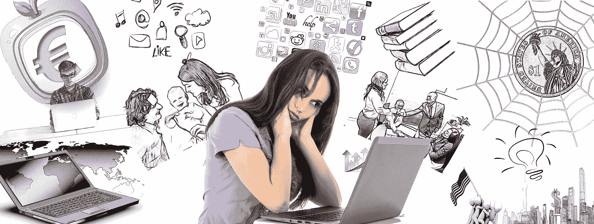
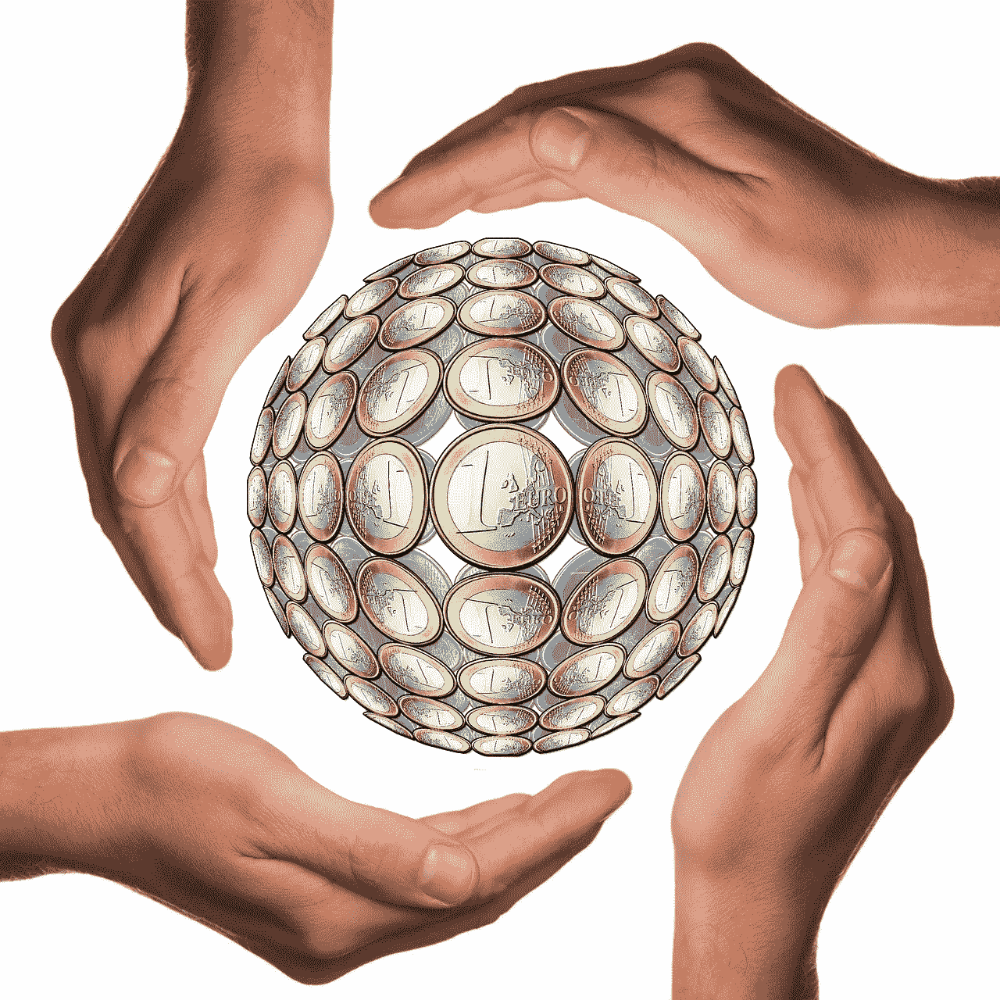
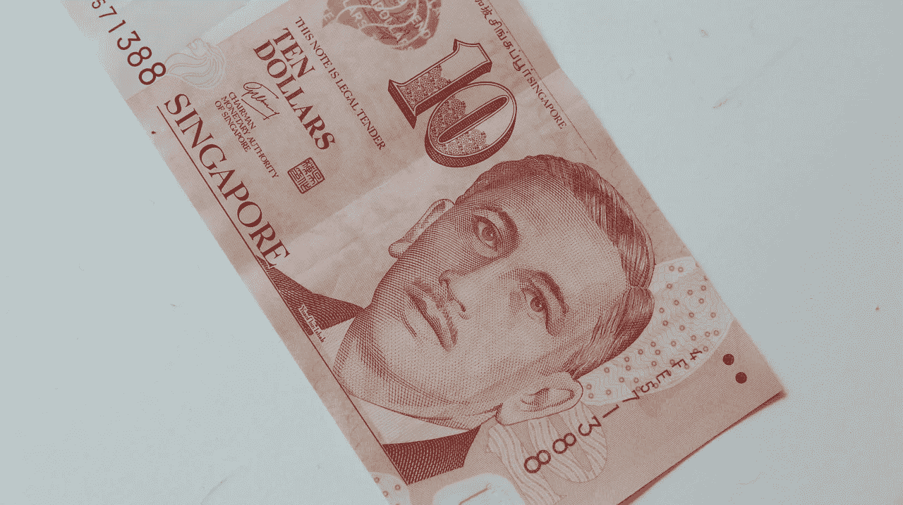
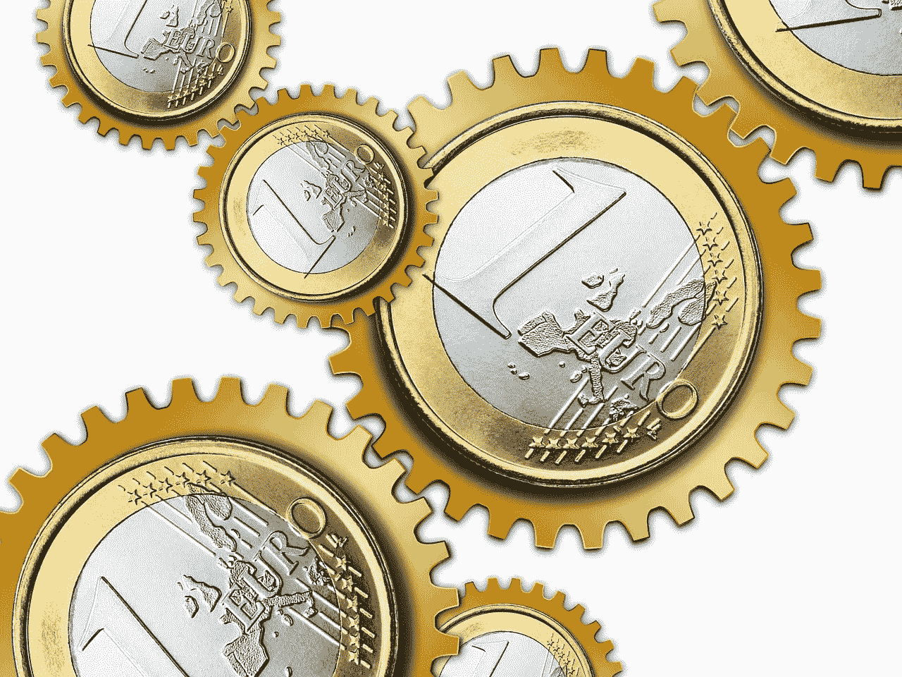
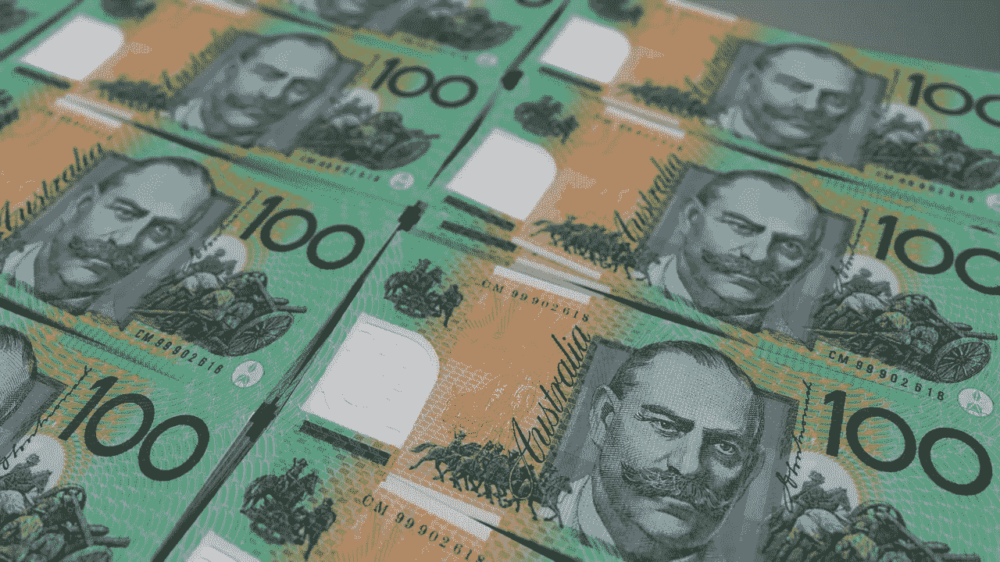
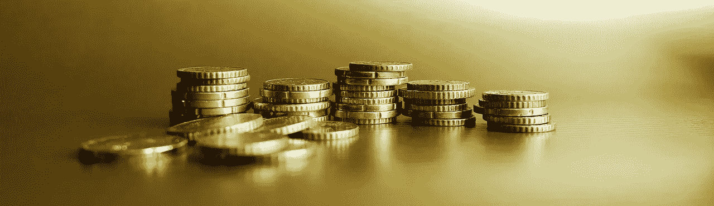

# 用新的数字美元研究稳定硬币:Paxos 标准(PAX)

> 原文：<https://medium.datadriveninvestor.com/studying-stablecoins-with-the-new-digital-dollar-paxos-standard-pax-a700e59698ca?source=collection_archive---------3----------------------->

**Paxos 标准令牌(PAX)** 是以太坊征求意见稿(ERC20)稳定币，他们将其称为“新数字美元”

像大多数 stablecoins 一样，PAX 是一个金融服务应用程序，他们将其作为加密货币进行营销。例如，Paxos 的开发者[声称](https://www.paxos.com/pax/)你可以将 PAX 用于点对点(P2P)资金转移、商业、交易，以及作为一种持有机制。

 [## 分散金融的出现——数据驱动的投资者

### 当前的全球金融体系为拥有资源、知识和财富的人创造了巨大的财富

www.datadriveninvestor.com](https://www.datadriveninvestor.com/2019/03/14/the-emergence-of-decentralized-finance/) 

澄清一下，持有机制包括一个智能合约，当你花一个 PAX 时，用美元支付。Paxos 信托公司持有美元。

Paxos 白皮书声称纽约州金融服务局监管 Paxos 信托公司。然而，美国联邦政府并不监管 Paxos 信托公司或 Paxos 标准。

# 【Paxos 标准有什么价值？

Paxos 的控股机制似乎正在发挥作用，因为 CoinMarketCap 在 2019 年 4 月 18 日将 PAX 的估值定为 1.00 美元。

此外，Paxos 标准代币在投机者中有一定的信誉。解释一下，Paxos Standard 在 2019 年 4 月 18 日的市值为 1.08456 亿美元。因此，CoinMarketCap 当天将 PAX 列为第 62 种最有价值的加密货币。

此外，CoinMarketCap 在同一天给了 PAX 6180.7 万美元的 24 小时市场交易量。因此，投机者对 Paxos 令牌表现出兴趣。

此外，Paxos 本身[声称](https://www.paxos.com/pax/)在 2019 年 4 月 18 日创造了 4.648 亿美元的 PAX。此外，Paxos 计算出人们在那天花了 3 . 56 亿美元的 PAX。此外，Paxos 声称截至 2019 年 4 月 18 日，已处理的 PAX 交易总额为 164.58 亿美元。

最后，CoinMarketCap 计算出 2019 年 4 月 18 日的流通供应量为 1.08401 亿 PAX，总供应量为 1.08721 亿 PAX。

# **PAX 是加密货币和美元的 Venmo 吗？**

查看 Paxos 标准令牌的最佳方式是将其视为他们在以太坊区块链建立的 P2P 支付解决方案。

以下是 Paxos 的创建者打算如何使用 PAX 令牌。首先，你把 1 美元存入 Paxos 信托账户。第二，Paxos 铸造了一个 PAX Token。第三，您可以通过电子邮件、电子商务平台或社交媒体将 Paxos 标准令牌发送给收件人。第四，接受者可以花掉 Pax Token 或兑现 1 美元。

因此，查看 Paxos 标准的一个好方法是将其视为区块链文莫。解释一下， [Venmo](https://en.wikipedia.org/wiki/Venmo) 是 **PayPal(纳斯达克股票代码:PYPL)** 拥有的流行 P2P 解决方案。Venmo 使用智能手机应用程序使 P2P 支付易于访问和使用。

值得注意的是，Venmo 发展迅速。例如，据 Statista [估计](https://www.statista.com/statistics/763617/venmo-total-payment-volume/)，Venmo 的净支付量从 2017 年第四季度的 120 亿美元增长到 2018 年第四季度的 190 亿美元。此外，Statista 计算出 Venmo 的净支付量在 2018 年增长了 80%。

而且，*扩展漫谈* [*估计*](https://expandedramblings.com/index.php/venmo-statistics-facts/) Venmo 在 2018 年 11 月有 2700 万用户。此外，2018 年 1 月，200 万美国零售商接受了 Venmo 支付。

# **Pax OS 能赚钱吗？**

不幸的是，PayPal 首席执行官丹·舒尔曼(Dan Schulman)在 2018 年第四季度的电话会议上承认，Venmo 没有赚钱。

因此，Paxos 可能很难从其 P2P 解决方案中赚钱。因此，Paxos 需要提供商业和贸易解决方案。例如，Paxos 可以对与 PAX 进行的每笔购买或交易收取费用。

此外，Paxos 还可以提供汇款、国际汇款、跨境支付和向消费者贷款等服务。具体来说，麦肯锡估计金融机构在 2017 年从跨境支付中创造了 1.9 万亿美元的收入。

此外，麦肯锡的分析师预计，跨境支付收入将在 2018 年增长至 2 万亿美元，五年后增长至 3 万亿美元。特别是，麦肯锡估计 2017 年跨境支付收入增长了 11%。

# **跨境支付是 Paxos 的未来吗？**

因此，Paxos 标准令牌在跨境支付中可能有很大的市场。

此外，个人消费者需要更好、更快、更便宜、更方便的个人跨境支付解决方案。例如，世界银行[估计，个人跨境电汇支付的平均成本为 6.9%。](https://www.worldbank.org/en/news/press-release/2018/12/08/accelerated-remittances-growth-to-low-and-middle-income-countries-in-2018)

因此，给另一个国家的朋友汇 200 美元要花 13.80 美元。因此，如果 Paxos 提供跨境点对点支付，发送费用不到 5 美元，它就能赚钱。

特别是，低固定费用的 P2P 跨境和货币转账支付解决方案将有巨大的市场。然而，为了进入大众市场，该解决方案需要像 Venmo 一样成为智能手机应用程序。注意:我在它的网站上找不到任何关于 Paxos 应用的计划。

个人跨境支付市场；或称汇款，正在快速增长。事实上，世界银行预计，2018 年所有汇款额增长了 10.3%，达到 6890 亿美元。此外，世界银行预测，2019 年汇款市场将增长至 7150 亿美元。

# **Pax OS 稳定令牌合法吗？**

像其他 Stablecoins 一样，Paxos 也面临一些问题。我认为其中两个问题可能会威胁到 Paxos 的发展。

首先，Paxos 提供监管有限的银行服务。例如，纽约州；不是联邦机构，监管帕索斯信托公司。因此，Paxos 标准令牌在联邦存款保险公司(FDIC)或证券交易委员会(SEC)没有法律标准。

因此，任何地方的当局都可以限制或禁止 PAX，因为它是一种不受监管的、潜在非法的金融工具。此外，收款人没有接受 PAX 代币付款的法律义务。如果出现这种情况，PAX 将毫无价值。

# 【Paxos 和 Stablecoins 是美元帝国主义的标准代币吗？

Paxos 和其他 stablecoin 努力的一个大问题是“美元帝国主义”的指控。

奇怪的是，一些国家的政治家、知识分子或监管者可能会将像 Paxos Standard Token 这样的稳定货币视为颠覆其国家主权的努力。为了解释这一点，稳定的硬币提供了一种像委内瑞拉玻利瓦尔这样有问题的法定货币的替代品。此外，如果公民可以忽视其法定货币，央行将很难制定货币政策。

特别是，美元的稳定可能会增加美国在拉丁美洲的影响力，在那里美元是最受欢迎的货币。在这种情况下，民族主义者可能会将稳定的硬币视为“美元帝国主义”，并试图禁止它们。

美元帝国主义的指控将会在像拉丁美洲这样反美情绪普遍的地区流行。值得注意的是，山姆大叔总是把一个国家的问题当成替罪羊。

# **帕克斯需要更多法定货币**

幸运的是，对于美元帝国主义的指责有一个简单的解决方案；发起人可以发行与其他货币挂钩的稳定货币。例如欧元、日元、英镑、加拿大元、澳大利亚元、港币、人民币、新加坡元和瑞士法郎。

此外，这种稳定的硬币在美国也有市场。有许多美国人对美国领导人和他们的经济政策持怀疑态度。

因此，像 Paxos 这样的稳定货币创造者需要提供更多的法定货币。我相信替代美元的稳定货币有巨大的市场。此外，绿背替代品将使 Paxos 的产品在拥挤的 stablecoin 市场脱颖而出。

归根结底，我认为 **Paxos 标准令牌(PAX)** 是一个很好的稳定币计划，没有现实价值。所以，投机者要看 PAX，不要买。