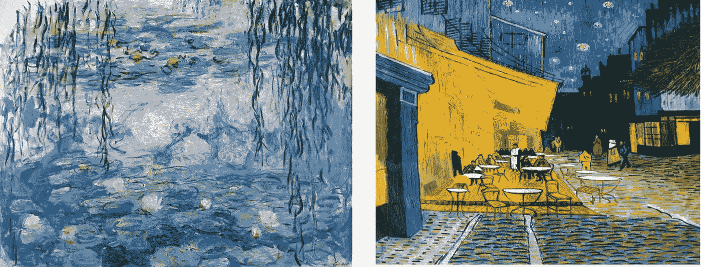
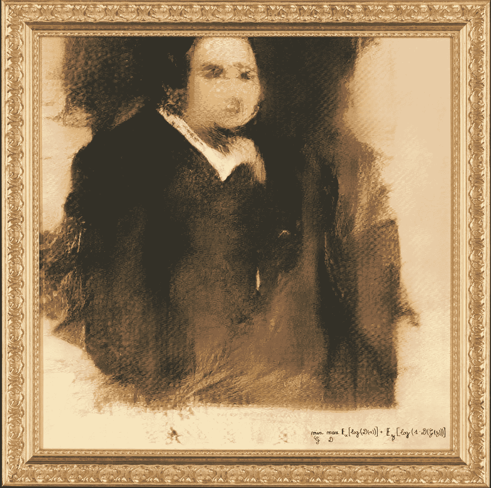
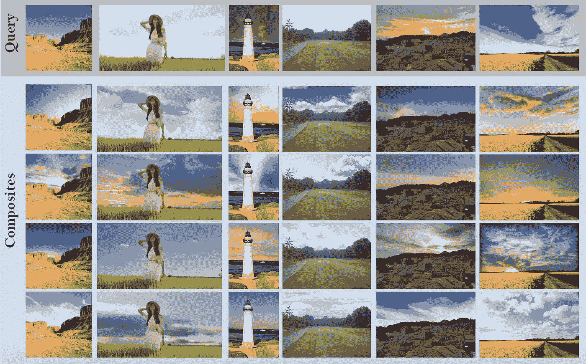

# 计算机视觉中的风格

> 原文：<https://medium.datadriveninvestor.com/style-in-computer-vision-77c41732399?source=collection_archive---------10----------------------->

These are some examples of art generated by a Generative Neural Network called [artGAN](https://github.com/robbiebarrat/art-DCGAN), which is a modified version of DCGAN.

*这将是一篇* ***系列*** *的文章或博文，在这里我将撰写关于最近在* ***计算机视觉*** *相关领域所做的工作和研究***。**

*一幅图像、一张照片或一件艺术品的风格在观众对它的感知和感受中起着非常重要的作用。一件美丽的艺术作品可以在我们内心产生快乐或愉悦的情绪，另一方面，一幅暗淡的图像可能会使观者陷入沉思或沉思。*

*风格可以被理解为许多不同的东西，风格的概念并不明确。人们可以把风格定义为不同的艺术形式——水彩、油彩、石墨艺术、钢笔画、矢量图形等。运筹学*

*人们可以比较不同画家的不同艺术风格、绘画技巧、不同的艺术形式甚至不同的艺术时代。*

*艺术专家可能会很容易地向我们描述莫奈和梵高的不同之处。*

**

*Left: Monet’s **Water Lilies**, Right: Van Gogh’s **Café Terrace at Night***

*这里的目的是在计算机视觉、 人工智能和机器学习中探索出一种 ***风格的总结。有些文章会探讨不同的风格，风格的不同应用，如 [***神经风格转移***](https://github.com/jcjohnson/neural-style) ***，***[***artGAN——生成艺术形式***](https://github.com/robbiebarrat/art-DCGAN) 等。****

*最近，像 Prisma 这样的应用程序获得了巨大的人气。其中无非是一个 ***神经网络*** 执行 ***风格转移*** 。*

*令人惊讶的是，最近一幅由神经网络生成的艺术品卖到了 40 多万美元。*

**

**This is the Portrait of Edmond Belamy* sold for an incredible $432,500, in the *Prints & Multiples* sale at Christie’s on 23–25 October, 2019.*

*下面是一个简短的列表，列出了最近与计算机视觉和人工智能风格相关的工作*

*   *风格分类*
*   *基于样式的搜索和检索*
*   *风格和时尚*
*   *理清图像的风格和内容。*
*   *神经类型转移*
*   *来自生成对抗网络的艺术合成(artGAN)*

*事实上，我个人对时尚的兴趣源于我在这一领域的研究工作和我参与的项目。第一个发布的项目是“ [*“给我找一片天空——一种颜色一致的天空搜索和替换的数据驱动方法*](https://cvit.iiit.ac.in/research/projects/cvit-projects/findmeasky)*”*，涉及从精选的数据库中寻找风格相似但有趣的背景天空，以替换现有的不感兴趣的天空背景。下面给出了这篇论文的一些结果。*

**

*Results from the work **Find me a Sky**.*

*然后我做了一个项目，我们在电影海报上尝试了类型分类，结果发现这并不是一个简单的任务。*

*理解一张电影海报需要风格和设计的许多方面。人们会认为属于同一类型的电影海报会有非常相似的结构或风格。虽然，这在一定程度上可能是真的，但要定义这样的结构或风格并不容易。*

**

*This is the t-sne visualization of CNN embeddings of movie poster taken from a pre-trained CNN (VGG). I have used [Andrej Karpathy’s code](https://cs.stanford.edu/people/karpathy/cnnembed/) for generating this.*

*这引起了我的兴趣，并引导我在计算机视觉中探索风格这一领域做进一步的工作，并阅读了更多关于风格的书籍。*

*探索和学习更多关于**风格、风格表现、艺术和开发深度学习模型** 的旅程将在一系列即将发布的文章中记录。(这将更具技术性，涉及更多的等式和代码片段。)*

*再见。🙂*