# 计算机视觉中的风格——神经风格转移

> 原文：<https://medium.datadriveninvestor.com/style-in-computer-vision-neural-style-transfer-c44da727f1c4?source=collection_archive---------0----------------------->

## 神经类型转移中使用的类型。计算机视觉系列风格的第一部分。

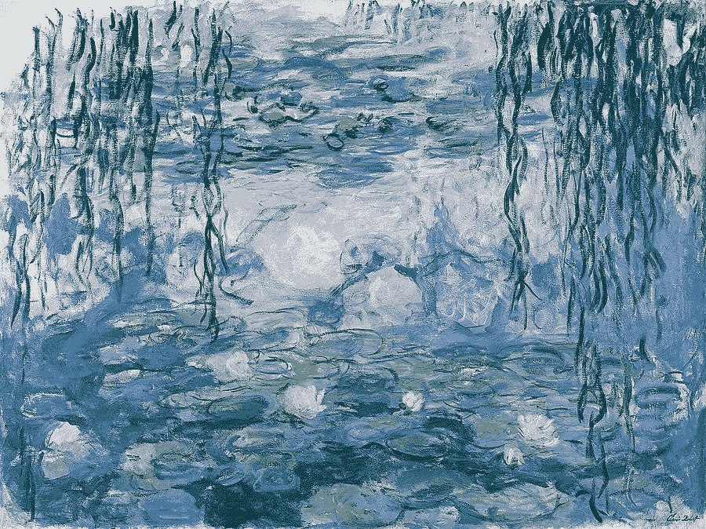

Water Lilies painting by Claude Monet ([source](https://fineartamerica.com/featured/70-water-lilies-claude-monet.html))

这是关于计算机视觉中风格的 [***系列的第一篇文章***](https://medium.com/datadriveninvestor/style-in-computer-vision-77c41732399) ，它将探索风格定义在不那么近的神经艺术风格转移作品中。

***注:*** *这不是一个关于神经风格迁移实现的教程。已经有很多关于神经风格转移的教程、博客文章和代码实现，互联网上也有很多变体。执行一次谷歌搜索就会带你找到他们。*

这篇文章探讨了风格是如何被量化地表现出来的，从而捕捉图像的纹理并进行风格转换。

**问)什么是风格？**

***俺们。)风格*** *具体到* ***神经风格转移*** *定义为一幅图像的***(图像的观感)。**

***问)什么是质感？***

****Ans。)图像的纹理*** *捕捉到了笔触、棱角分明的几何形状、图案以及颜色之间的过渡。**

*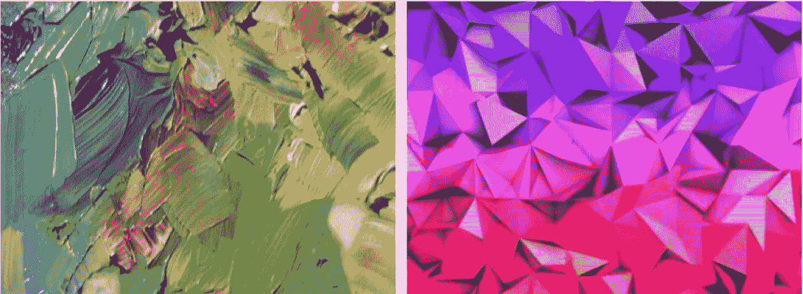*

*Fine-scale brush strokes vs Coarse-scale angular geometric shapes*

*艺术品可以用很多方式来描述—*

1.  *分别描述不同地区的不同风格(天空 vs 地面)。*
2.  *调色板及其与底层场景的关系(这与图像构图或笔触纹理等因素无关)。*
3.  *精细尺度的空间结构，如笔触、有角度的几何形状和纹理(这些与粗糙尺度的结构是分开的)。*

*在 NST(神经风格转移)中，*风格作为纹理*被 *Gram 矩阵特征*封装，这些特征是从在 [ImageNet 数据集](http://www.image-net.org)上训练的*深度卷积神经网络*(最常见的是 VGG19)的多个层中提取的*相关特征*，用于对象分类的任务。*

*什么是格拉姆矩阵特征？我们如何利用 Gram 矩阵特征和深度 CNN 特征进行风格转移？在风格转换中，我们如何控制不同的感知因素，如颜色和比例？我们将进一步回答这些问题。*

*最近有很多关于神经类型转移的文献和工作。但是在这里，我将只探索/参考图宾根大学的 Gatys 等人[1]在 2016 年的开创性工作，以及他与 Adobe Research 的 Aaron hertz Mann 在 2017 年合作的后续工作[2，3]，这些工作为 NST 奠定了基础。*

***问)什么是风格转移？***

****俺们。)*** *转移源图像的样式，同时保留目标图像的内容。**

**(域区域:纹理传递的问题)。**

***风格(纹理)转移的目标:***

**从源图像合成纹理，同时约束纹理合成，以便保留目标图像的语义内容。**

*早期的工作涉及纹理传递的非参数方法，例如:*

1.  **图像强度匹配，图像类比。**
2.  **操作高频纹理，保留目标的粗尺度。**
3.  **添加边缘方向信息，用于通知纹理传输算法。**

***问)图像风格转换的理想场景是什么？***

****Ans。)*** *风格传递算法应该能-**

1.  **从目标图像(物体、一般景物)中提取语义内容。**
2.  **然后通知纹理传递程序，以源图像的风格渲染目标图像的语义内容。**

***ST 的先决条件:***

**在* ***语义图像内容*** *和* ***样式*** *中找到独立的模型变体的图像表示。**

**这就迫切需要开发一种方法来理清图片中* ***的风格和内容*** *。**

# ***使用 CNN 的图像风格转移(CVPR 2016)***

*这项工作—*

1.  **介绍一种艺术风格的* ***神经算法*** *(纹理传递算法)**
2.  **分离和重组自然图像中的图像内容和风格，即将任意照片的内容与知名艺术品的外观相结合。**
3.  **在单个预训练的卷积神经网络(针对对象分类优化的 cnn)内，将样式(纹理)转移减少到一个* ***优化问题****

**它是一个基于细胞神经网络的参数纹理模型，并有一种反转其图像表示的方法。**

**有一个关于 NST 的极好的[教程](https://pytorch.org/tutorials/advanced/neural_style_tutorial.html)是使用 PyTorch 用 Python 写的。一定要去看看，亲自动手去更深入地理解这个简单而又美妙的想法。**

## ****深度图像表示****

****内容**和**风格**的数学表示都是从深层特征中提取的，方法是将图像通过在 [ImageNet 数据集](http://www.image-net.org)上训练的预训练卷积神经网络( [**VGG19**](https://arxiv.org/abs/1409.1556) )进行对象分类任务。**

**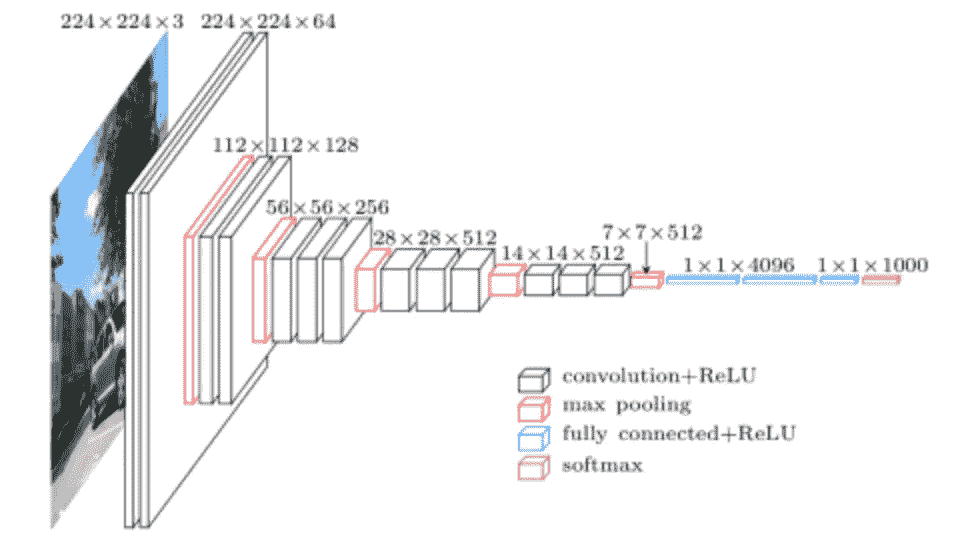**

**VGG19 Architecture ([source](https://www.cs.toronto.edu/~frossard/post/vgg16/)).**

**通过缩放权重使网络*归一化*，使得图像和位置上每个 *conv 滤波器*的*平均激活*等于*一个*。**

****附带说明:**对于*图像合成*的任务，经验上发现用*平均池层*替换*最大池层*会产生稍微更吸引人的结果。**

**以下 2 小节详细解释了*内容*和*样式表示*。**

## **内容表示**

**预训练 CNN 的 ***层 l*** 层具有 **N** *l* 个截然不同的滤镜。这些是尺寸各为**M**l(**M***l*= H x W)的 **N** *l* 特征图。**

****层中的响应 *l* 层****

**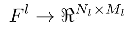**

****F** *l(i，j) =在****图层中的****j*******【l .***位置激活* *滤镜*****

******p =*** *原始图像****

******x =*** *生成图像****

*****P** *l，* **F** *l =图层上的要素制图表达* ***l.******

*****内容损失(平方误差损失):*****

***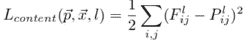***

***Squared Error Loss***

***预训练 CNN 的较高层中的特征响应被用作内容表示。 ***平方误差损失*** 用于在执行梯度下降时保留目标图像的内容。***

***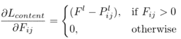***

******注:*** *高层中的特征响应被用作内容表示。****

## ***样式表示***

***不同滤波器响应之间的相关矩阵被用作 ***样式表示*** 。(*对特征地图的空间范围进行期望)****

***相关矩阵被称为 **Gram 矩阵(G)。*****

******克矩阵的数学公式:******

***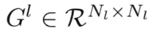***

***Gram Matrix***

***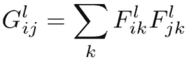***

***Gram Matrix mathematical formulation.***

***为了获得更多的 ***鲁棒风格表示*** 和捕捉 ***多尺度信息*** ，使用了来自 ***多层*** 的特征相关性。这有助于捕捉纹理信息，但不能捕捉全局排列。***

***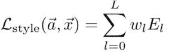***

***Include feature correlations of multiple layers, weighting factors **w** of the contribution of each layer to the total loss.***

*****风格损失(平方误差损失):*****

***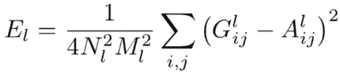***

***MSE loss***

***使用梯度下降，以**最小化源图像和正在生成的图像之间的 **MSE** (均方误差)损失。*****

***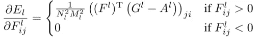***

***First order derivative of Style Loss w.r.t. feature responses at layer L***

## ***风格转移程序***

***现在已经分别从目标和源图像中提取了内容和样式表示，我们执行样式传输过程。***

***ST 后生成的图像同时匹配 ***p*** *(目标图像)****x****(源图像)的内容表示。****

***为了执行样式转移，白噪声图像 ***i*** 被初始化为输出图像，并且在白噪声图像 ***i*** 上执行梯度下降以匹配源图像的样式，同时保留目标图像的内容。***

***这项工作的作者在[1。]使用 [**L-BFGS**](https://en.wikipedia.org/wiki/Limited-memory_BFGS) 优化算法，他们通过实验发现这种算法最适合图像合成的任务。***

*****联合最小化距离:*****

1.  ***白噪声图像的特征表示 ***i*** 来自一层照片的 ***内容表示*** 。***
2.  ******风格表示法*** (gram matrix)将绘画定义在若干层的 CNN 上。***

*****损失函数最小化:*****

***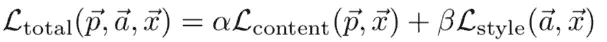***

***Loss function to minimize using L-BFGS optimization procedure.***

****这里的****alpha****和****beta****分别是内容和风格的权重因子。****

***优化过程中的梯度是以像素为单位计算的。***

*****描述α/β比率变化影响的一些示例:*****

***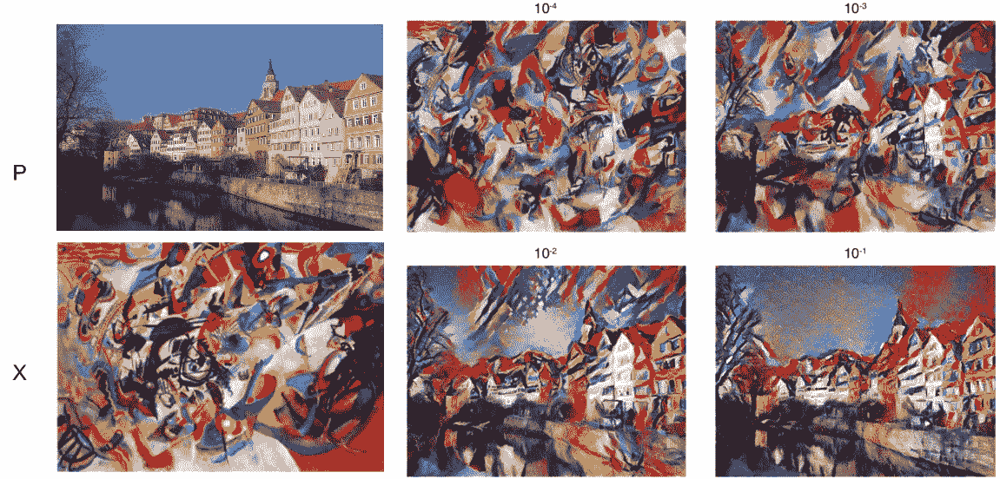***

*****p -> target image, x->source image,** the numerical values above the images represent the ratio of alpha / beta. These examples have been taken from [1.]***

# ***控制神经类型转移中的感知因素(CVPR 2017)***

***这项工作扩展了 NST，允许在执行风格转换时控制某些因素。使用来自多个来源的样式信息的组合。***

******扩展控制范围:******

1.  ****空间位置****
2.  ****颜色信息****
3.  ****跨越空间尺度****

***正如上一节所讨论的，如果两幅图像体现了特定图像特征的相同相关性，则它们具有相同的风格[2]。](针对内容和风格预先训练的 CNN 特性)。***

***这项工作的发现是为了访问这些统计数据中的*感性因素。****

****艺术品可以用多种方式描述:****

1.  ****分别描述不同地区的不同风格(天空 vs 地面)。****
2.  ****调色板及其与底层场景的关系(这与图像构图或笔触纹理等因素无关)。****
3.  ****精细尺度的空间结构，如笔刷笔划形状和纹理(与粗糙尺度的结构分开)。****

## ****实现空间控制****

****控制样式图像 ***x*** 的哪个区域用于样式化内容图像 ***p*** 中的每个区域。****

****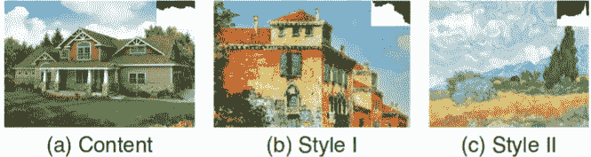****

****Content image **a** can be styled with **b** and **c** for the foreground (house) and background (sky) separately [2.]****

****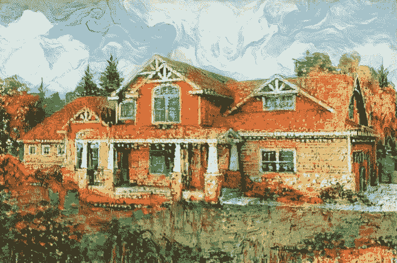****

****Spatially combine Styles I and II [2.]****

****输入 **R** 空间引导通道为内容 ***p*** 和样式图像****【x】********

****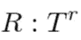****

****Spatial guidance channels****

****图像映射 **T** *r* 有值**【0，1】。**如果 **r** *th* 内容引导通道= 1，那么应该从 **r** *th* **样式引导通道= 1 的区域中获取样式。******

******方法 1:引导 Gram 矩阵******

****用 **R** 引导通道**t**t86】l^r 将风格特征中包含的各层特征图相乘****

****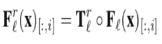****

******i**th column vector of F(x), r E **R,** element wise multiplication****

****为风格图像中的每个区域计算一个空间引导的 gram 矩阵 **G** 。****

****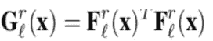****

****Gram matrix computation with spatially guided feature maps****

******t**l^r:矢量化。对于硬制导可以是二进制的*或者对于软制导可以是实值的*。我们根据下面的等式归一化 **T** *l^r*****

****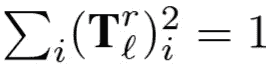****

****Normalize **T******

****最后，风格损失计算如下:****

****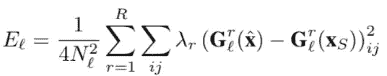****

****Style Loss****

******用于引导通道:******

1.  *****确保在样式* ***x*** *和内容图片* ***p*** *中的内容在相似的区域之间传递样式。*****
2.  ****通过组合多个示例中的样式来生成新样式。****

******引导信道的传播:******

****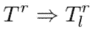****

****Propagation of **T**r to different layers****

*******天真道:*******

1.  *****向下采样 Tr 到每层特征图的尺寸大小。*****
2.  *****这无法按区域保持所需的样式分离(地面特征可能出现在天空中)。*****
3.  *****一个引导区域边界附近的神经元可以有很大的感受野，重叠到另一个区域。*****

****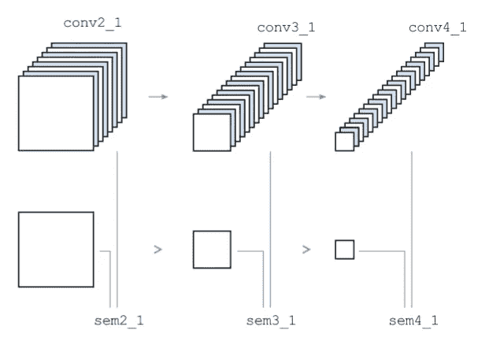****

*******(更好的替代方式):*******

1.  *****使用侵蚀版本的空间导向通道。*****
2.  *****仅在感受野完全位于引导区域内的神经元上，通过添加另一个在整个图像上恒定的全局引导通道，实施空间引导。*****

******方法 2:引导求和******

****将引导频道与预先训练的 CNN 的特征地图堆叠。****

****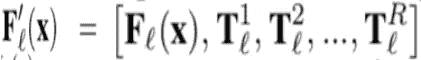****

****制导通道**t**t56】l^r 只是 T^r.的下采样地图****

****带引导求和的 Gram 矩阵计算如下:****

****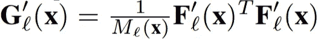****

****Gram matrix for guided sums****

****Gram 矩阵 **G** 捕捉图像特征与引导通道非零条目的相关性。因此，鼓励使用样式图像的区域 **r** 中的特征来风格化内容图像中的区域 **r** 。****

****层 **L** 对风格损失的贡献 **:******

****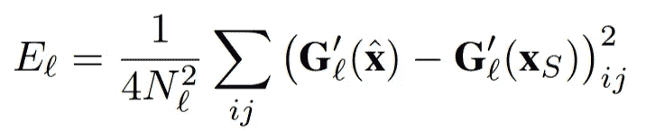****

****Contribution of layer **L** on style loss****

******引导求和与引导 Gram 矩阵的比较******

****引导求和方法比**更有效，因为不是计算和匹配 **R** Gram 矩阵，而是仅用 **R** 附加通道来计算单个 Gram 矩阵。******

*****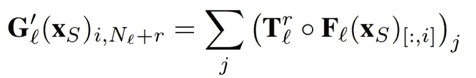*****

*****但是这种效率的提高是以牺牲纹理质量为代价的，而纹理质量在引导的 Gram 矩阵方法中得以保持。*****

## *****彩色调节*****

*****色彩是一种重要的感知风格。但它独立于其他风格方面，如使用的笔触类型或主要的几何形状。*****

*****因此，在神经类型转移中独立控制颜色信息是可取的。*****

*****要求我们保留原始内容图像的颜色，在不将颜色从样式图像转移到内容图像上的情况下执行样式转移。*****

*****这是通过两种方法实现的*****

1.  ******仅亮度传输******
2.  *****颜色直方图匹配*****

********

****Style Transfer without preserving colour [2.]****

******方法 1:仅亮度传输******

****仅在 ***亮度通道*** *中执行风格转换。*视觉对亮度变化的敏感度远高于色彩通道。****

****分别为样式和内容图像提取**L**s 和 Lc。然后应用神经类型转移算法产生输出 **L.******

****如果样式和内容图像之间存在严重不匹配，请在转换样式之前，将样式亮度通道**L**s 的直方图与内容图像*Lc*的直方图进行匹配。****

****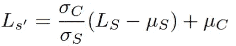****

******u**c 和**u**s 是两幅图像的平均亮度。**西格玛**T42 c 和*西格玛 s*都是标准差。****

******方法 2:颜色直方图匹配******

****样式图像的颜色被转换以匹配内容图像的颜色。****

****样式图像中的每个 RGB 像素都转换为:****

****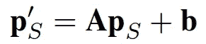****

******A:** 3x3 变换矩阵， **b:** 三维向量****

****变换使得新样式图像**p**s 中的 RGB 值的均值和协方差与原始内容图像**p**c 的均值和协方差相匹配****

******上述两种方法的比较******

****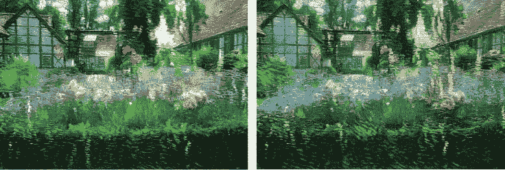****

****Luminance only transfer (left) vs Colour Histogram Matching transfer (right)****

****色彩匹配方法自然受到从内容图像到风格图像的色彩转换效果的限制。****

****颜色分布通常不能完美匹配，导致输出图像的颜色和内容图像的颜色不匹配。****

****仅亮度传输完美地保留了内容图像的颜色。亮度和颜色通道之间的相关性在输出图像中丢失。****

## ****标度控制****

****以不同的比例混合不同的样式，并以所需的比例生成带有样式的高分辨率输出。****

******风格混合的比例控制******

*****在不同的空间尺度上独立控制风格化。*****

****Ex —将一幅画的精细比例的笔触与另一幅图像的粗糙比例的有角度的几何形状结合起来。****

****为此，创建一个新的样式图像。****

****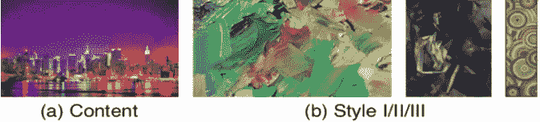****

****(a.) Sample Content image, (b.) Different style images I, II, III [2.]****

****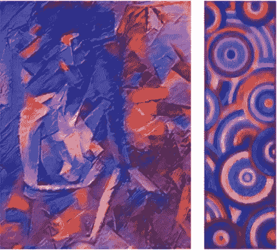****

****Style image IV (left) and style image V(right)****

****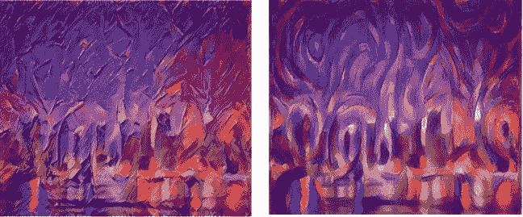****

****Stylized image with Style IV (left) and with Style V (right)****

******步骤:******

1.  ****使用粗糙样式图像初始化优化****
2.  ****省略内容损失。这样做是为了用来自精细尺度样式图像的精细尺度纹理替换来自粗略尺度样式图像的精细尺度纹理。****
3.  ****当图像结构的规模大于样式特征时，优化会保持图像结构不变(不总是如此，取决于 L-BFGS 算法)。****
4.  ****生成的图像用于原始内容图像的样式转换。****

## ****结束语****

****在本文中，我们探讨了 ***风格*** 如何在 ***神经风格转移算法*** 的上下文中使用。****

****我们还回顾了控制风格转换中不同感知因素的技术，包括空间位置、颜色信息和空间尺度。****

****请在评论区发表你的疑问或澄清。****

## ******参考文献:******

1.  ****[使用卷积神经网络的图像风格转换(CVPR 2016)](https://www.cv-foundation.org/openaccess/content_cvpr_2016/papers/Gatys_Image_Style_Transfer_CVPR_2016_paper.pdf)****
2.  ****[控制神经风格转移中的感知因素(CVPR 2017)](https://arxiv.org/pdf/1611.07865.pdf)****
3.  ****[在神经艺术风格转移中保持色彩(对上述工作的补充)](http://preserving color in style tranfer aaron hertzmann)****

## ****来自 DDI 的相关故事:****

**** [## 用 7 个步骤解释深度学习——数据驱动投资者

### 在深度学习的帮助下，自动驾驶汽车、Alexa、医学成像-小工具正在我们周围变得超级智能…

www.datadriveninvestor.com](https://www.datadriveninvestor.com/2019/01/23/deep-learning-explained-in-7-steps/)  [## 成为数据科学家所需的 8 项技能——数据驱动型投资者

### 数字吓不倒你？没有什么比一张漂亮的 excel 表更令人满意的了？你会说几种语言…

www.datadriveninvestor.com](https://www.datadriveninvestor.com/2019/02/07/8-skills-you-need-to-become-a-data-scientist/)****