# 使用(CycleGAN)进行图像的风格转换

> 原文：<https://medium.datadriveninvestor.com/style-transferring-of-image-using-cyclegan-3cc7aff4fe61?source=collection_archive---------0----------------------->

# 介绍

**Cycle *-* 一致对抗网络*s****[**Cycle gans**](https://arxiv.org/pdf/1703.10593)由朱俊彦、朴泰成、菲利普·伊索拉和阿列克谢 A 提出 **CycleGANs** 是一种新颖的将图像从源**域 A** 翻译到目标**域 B** 的方法。 **CycleGANs** 的一个很酷的特性是，它不需要成对的训练数据来产生令人惊叹的风格转换结果。*

> *在许多风格转换应用中，**配对数据**是训练所必需的。*

*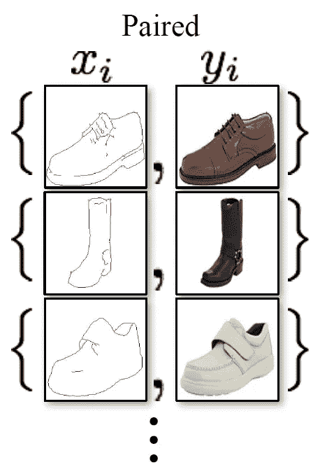*

> ***CycleGAN** 是**不需要配对**数据**输入来训练一个模型。***

*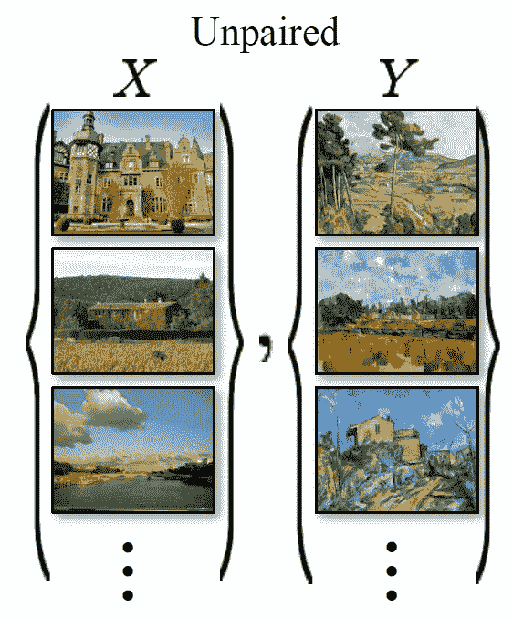*

*一个 **CycleGAN** 试图学习一个**生成器**网络，它学习两个映射。 **CycleGANs** 训练两个**发电机**和两个**鉴别器**网络。这不同于大多数具有单个**发生器**和**鉴别器**网络的 GANs。*

* [## DDI 编辑推荐:5 本机器学习书籍，让你从新手变成数据驱动专家…

### 机器学习行业的蓬勃发展重新引起了人们对人工智能的兴趣

www.datadriveninvestor.com](https://www.datadriveninvestor.com/2019/03/03/editors-pick-5-machine-learning-books/) 

# CycleGAN 有两个**发电机**网络

*   **生成器 A** :学习映射 G:X - > Y，其中 X 是来自源**域 A** 的图像，Y 是来自*域*目标**域*B*的图像。它从源**域*A*中获取图像，并将其转换为与目标**域*B*中的图像相似的图像。基本上，网络的目的是学习映射，使得 *G(X)* 类似于*y。*******
*   **生成器 B** :学习一个映射 F:Y- > X，然后从目标**域 B** 中取一个图像 Y，转换成与源**域 A** 中的图像相似的图像 X。类似地，网络的目的是学习另一个映射，使得 F(G(X)类似于 X。

# CycleGAN 有两个**鉴别器**网络

*   **鉴别器 A**:**鉴别器 A** 用于**鉴别**发生器网络*A*产生的图像，表示为 *G(X)* 和来自源**域 *A*** 的真实图像，表示为 *X* 。****
*   **鉴别器 B**:**鉴别器 B** 用于**鉴别**发生器网络 *B*** 产生的图像，表示为 *F(Y)* 和来自源**域 *B*** 的真实图像，表示为 *Y* 。**

# CycleGAN 的架构图

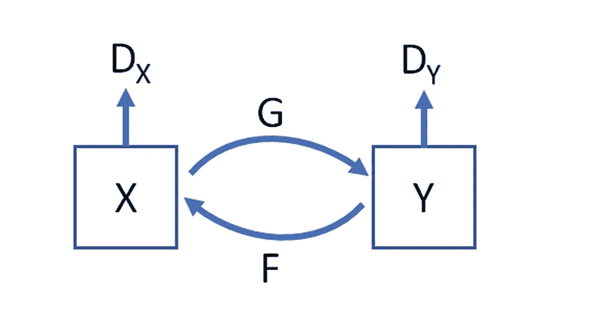

**CycleGANs** 的目标是学习如何将图像从一个**域 A** 映射到另一个**域 B** 。 **CycleGAN 的**架构图显示了两个映射函数 G 和 F 以及两个**鉴别器 DX** 和 **DY** 的使用。

*   鉴别器 **DX** 用于验证来自**域 A** 的图像和翻译后的图像 **F(y)** 。
*   鉴别器 **DY** 用于验证来自**域 B** 的图像和翻译后的图像 **G(x)** 。
*   **CycleGANs** 使用循环一致性损失进行图像转换。循环一致性损失用于确定来自**域 A** 的图像 X 是否可以从翻译的图像中恢复。

# X 到 Y 然后重建了 X CycleGAN 的架构

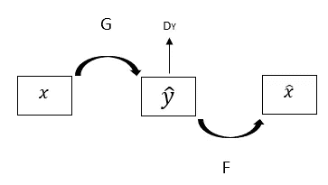

# Y 到 X 然后重建 Y CycleGAN 架构

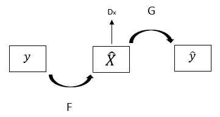

# 损失函数

与其他 GAN 一样，**cycle GAN**也有一个训练目标函数，需要在训练过程中最小化。损失函数是以下损失的加权和。

*   对抗性损失。
*   循环一致性损失。

# 对抗性损失:

这是来自真实分布域 A 或域 B 的图像与由**生成器**网络生成的图像之间的损失。我们有两个映射函数，我们将对这两个映射应用对抗性损失。

映射的不利损失是

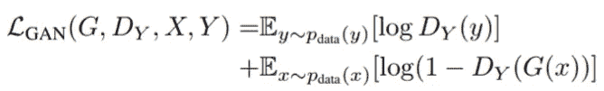

*   其中，X 是来自**域 A** 分布的图像，Y 是来自**域 B** 分布的图像。
*   **鉴别器 D(Y)** 试图找出由 **G** 映射 **G(X)** 生成的图像与来自**域 B** 的不同分布的真实图像 Y 之间的差异。
*   **鉴别器 D(X)** 试图从**域 A** 的分布中找出 **F** 映射 **F(Y)** 生成的图像与真实图像 X 之间的差异。
*   **G** 的目标是最小化对抗**鉴别器 D** 的对抗性损失函数，鉴别器 D 不断尝试最大化它。

# 循环一致性损失:

循环一致映射函数是可以将来自**域 A** 的图像 x 转换到**域 B** 中的另一个图像 y，并生成原始图像的函数。

*   **正向循环一致映射函数出现如下**

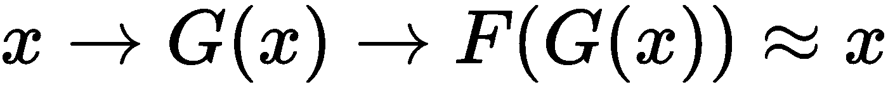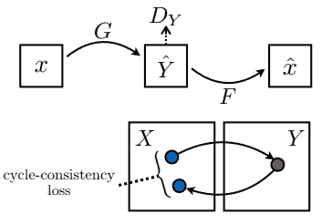

**forward cycle consistent loss**

*   **反向循环一致映射函数看起来如下**

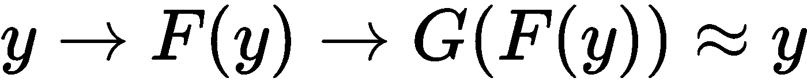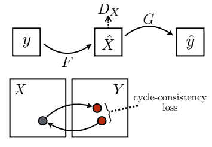

**backward cycle consistent loss**

*   **周期一致性损失公式如下**

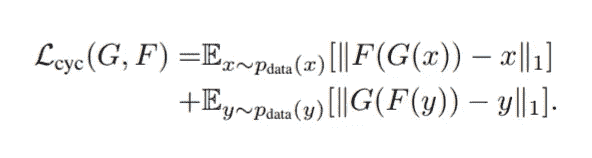

*   在循环一致性丢失的情况下，由 *F(G(x))* 和 *G(F(y))* 重建的图像将分别与 x 和 y 相似。

# 完全目标损失函数

完全目标函数是对抗性损失和周期一致性损失的加权和，表示如下

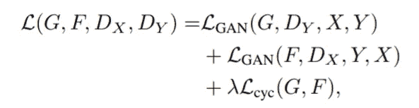

在这里，第一个对抗性损失为

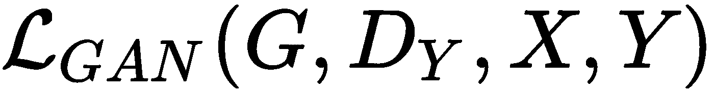

第二种对抗性损失如下

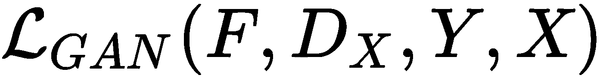

在**发生器 A** 和**鉴别器 B** 上计算第一次对抗性损失。在**发生器 B** 和**鉴别器 A** 上计算第二次对抗性损失。

**陪同朱庇特本帖的笔记本可以在这里找到******。****

# **结论**

****CycleGANs** 更神奇的应用之一是*风格转移。这里列出了一些非常酷的* **CycleGANs** 的应用**

*   **夏天的景色变成了冬天的，反之亦然。**

**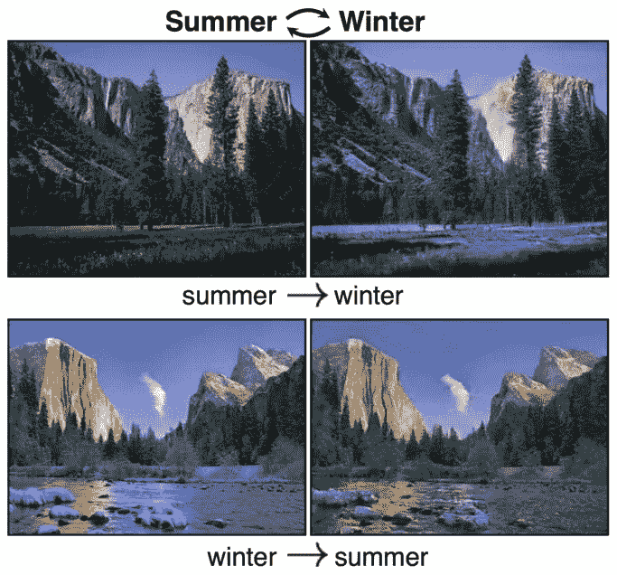**

*   **莫奈的画作转换成照片般逼真的图像。**

**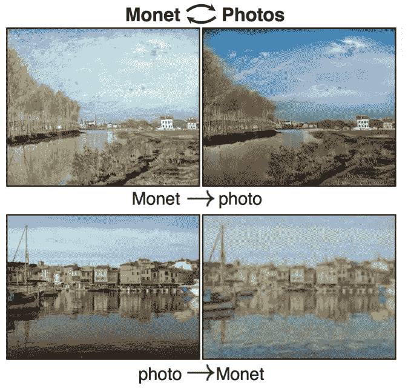**

*   **一筐筐苹果变成了一筐筐橘子，反之亦然。**

**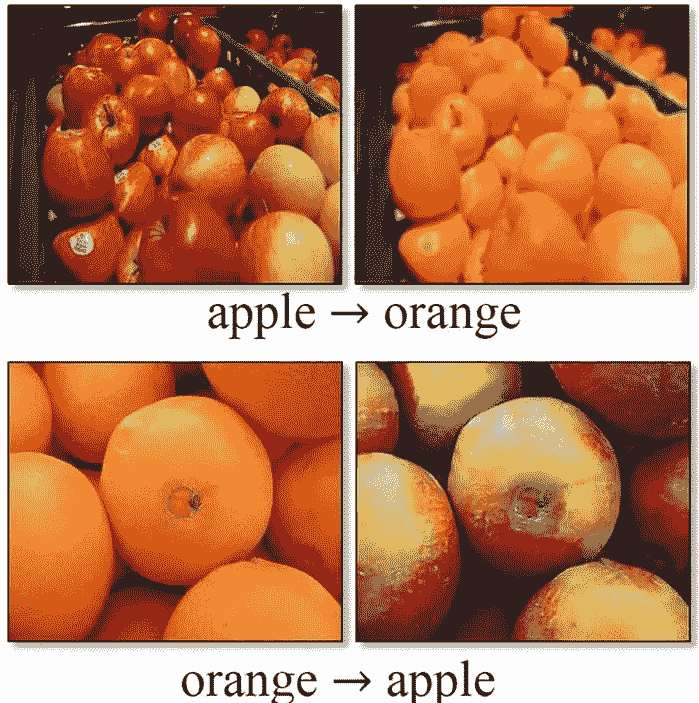**

*   **一张马变成斑马的照片，反之亦然。**

**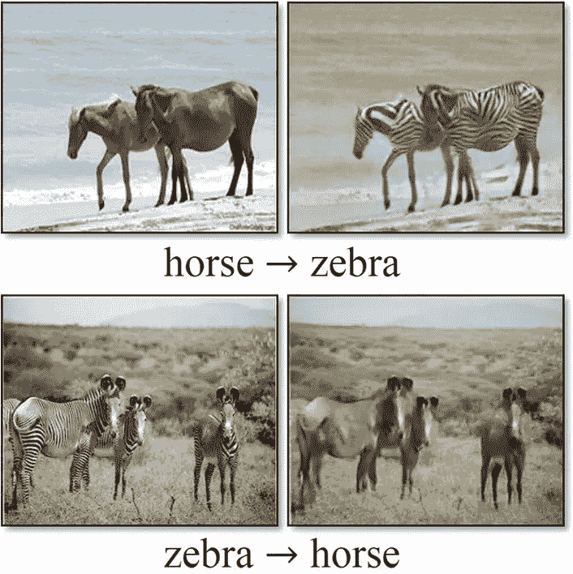**

*   **一个马在田野里奔跑变成斑马的视频。**

****

*   **艺术家画作的真实照片。**

**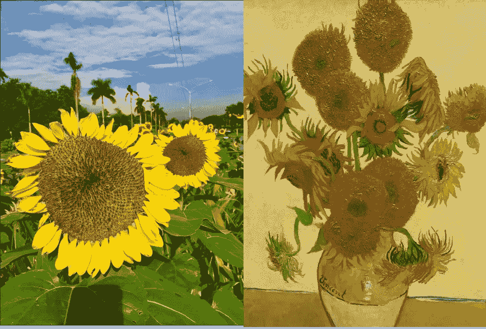**

*   **一段白天拍摄的驾车视频被转换成了夜间视频。**
*   **平面、低质量的照片被转换成看起来像是由高端单镜头反光相机拍摄的照片。**
*   **卫星图像到地图。**
*   **面部图像表情符号，漫画或动漫。**
*   **化身的身体形象。**
*   **灰度照片的彩色化。**
*   **医学扫描到真实的照片。**
*   **艺术家画作的真实照片。**

*****我希望这篇文章能帮助你开始构建自己的*cycle gan*。我认为这至少会提供一个关于*周期根*的很好的解释和理解。******