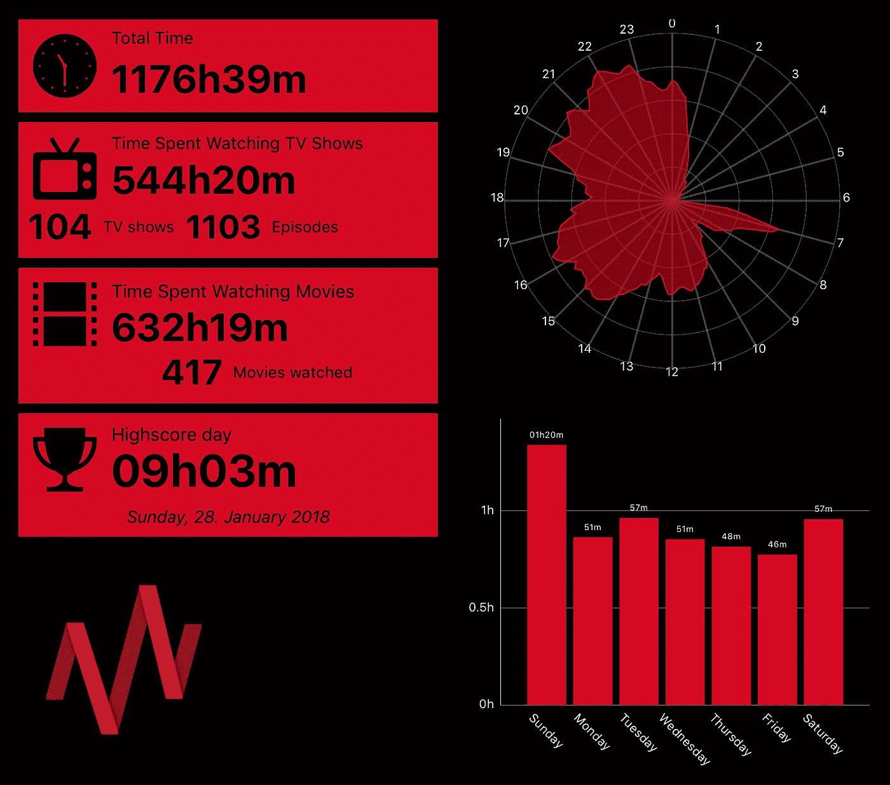
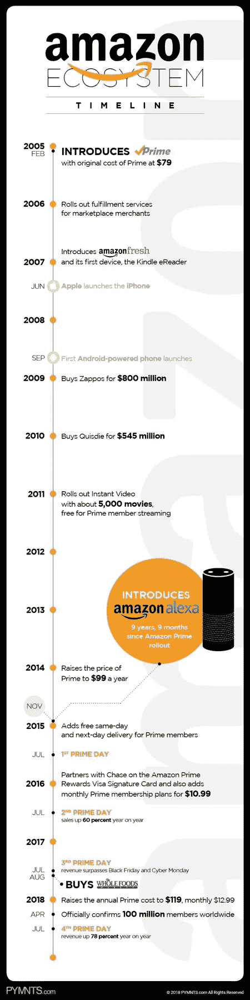
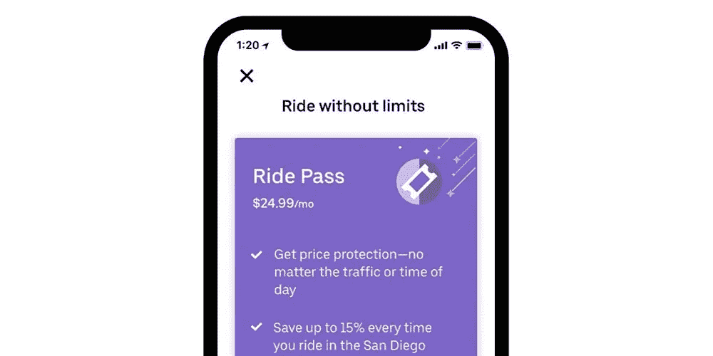
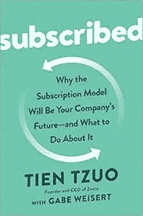

# 为什么企业需要采用订阅模式…现在！

> 原文：<https://medium.datadriveninvestor.com/subscribe-adigandhi-19c3a043ceed?source=collection_archive---------3----------------------->

Photo by [Thibault Penn](https://unsplash.com/@petibalt?utm_source=medium&utm_medium=referral) on [Unsplash](https://unsplash.com?utm_source=medium&utm_medium=referral)

长久以来，我一直对企业采用的基于订阅的收入模式很感兴趣。在当今这个很难找到忠实客户的时代，这似乎是一个吸引客户并建立忠实粉丝群的好方法。我们可以看到，甚至像亚马逊这样的公司也试图抓住热情的顾客。

当然，订阅带来的月复一月的收入保证了极好的现金流(在大多数情况下)。此外，从客户的角度来看，订阅正在爆炸式增长，因为数十亿数字消费者越来越喜欢访问而不是拥有，但大多数公司仍然是为了销售产品而建立的。那么，为什么一些公司仍然对订阅模式持怀疑态度呢？

 [## 苹果会成为新的网飞吗？-数据驱动型投资者

### 有可能。然而，该公司肯定会与大公司竞争。许多人不得不看到这一天的到来…

www.datadriveninvestor.com](https://www.datadriveninvestor.com/2019/02/15/will-apple-be-the-new-netflix/) 

首先，让我们看看这个世界的国王，网飞。网飞太大了，它消耗了全世界 15%的互联网带宽！今天，它有大约 1.5 亿用户，相当于每年 150 亿美元。网飞在原创内容上花费了大约 80 亿美元。对一些人来说，这可能是一个很大的数字，但这些节目都有助于所谓的“投资组合效应”。不管一个节目的受欢迎程度如何，投资新内容有助于网飞(a)吸引新订户和(b)延长现有订户的寿命。由于这些节目永远留在平台上，它们增加了组合的价值，并证明在降低客户获取成本(CAC)的同时创造大量用户参与度至关重要！

接下来，我们来看看亚马逊是如何采用 Prime 订阅的。亚马逊 Prime 现在拥有超过 1 亿的客户。曾经有一段时间，亚马逊没有忠诚的客户群。人们会在网上比较价格，然后从他们发现价格最低的网站上订购。Prime 改变了这一点。有了快递和其他折扣，一个主要客户将**只**从亚马逊订购。除此之外，Prime 视频和音乐在获取有用的用户数据的同时，帮助创造了广泛的用户参与。这有助于亚马逊从众多电子商务竞争对手中脱颖而出。有了 Prime Day 这样的活动，人们很难忽视亚马逊提供的服务。通过 Prime，亚马逊将其基于交易的方法转变为基于参与的方法。

各种各样的初创公司和公司都试图以这样或那样的方式整合订阅服务。最吸引人的是保时捷。保时捷最近推出了自己的订阅服务保时捷护照。每月 2000 美元的固定费用可以让你通过手机应用程序获得一辆保时捷！legacy 公司正试图将目标锁定在不愿意签订三年租约但愿意按月消费的年轻客户身上。

就连优步也推出了统一的包月服务，在此之后，用户能够以大幅降低的价格使用 it 服务。在这种情况下，使用服务少于普通用户的客户能够补贴重度用户。

在今天这个时代，行业总是被“打乱”,一个组织别无选择，只能进化，保持相关性。1955 年的《财富》500 强公司中，只有 12%今天仍在名单上。那些设法坚持下去的人肯定已经“同意”改变。如今，人们希望服务能够提供即时、持续的满足感，从拼车到流媒体服务，再到订阅盒。他们想要定期的惊喜。他们想要的是兜风，不是车。牛奶，不是奶牛。新的坎耶音乐，不是新的坎耶唱片。

传统公司已经变得无能，因为他们落后了:产品第一，顾客第二。这个订单需要翻转。

这个帖子的灵感来自于天卓的《订阅》(这里 可以买到 [**)。**](https://amzn.to/2F4nhfx)

