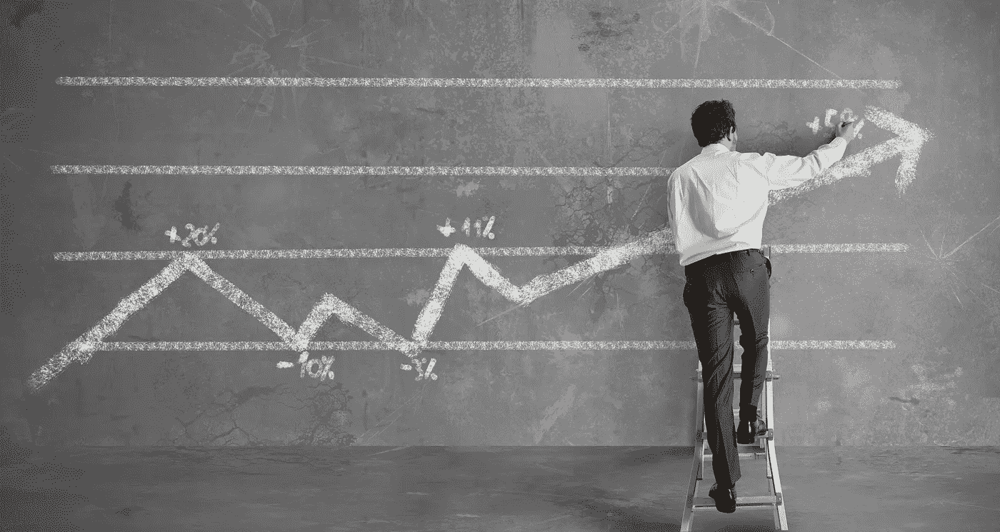

# 投资投机而非产品？

> 原文：<https://medium.datadriveninvestor.com/subscribe-itunes-stitcher-google-play-ihearradio-4dea153bf0c6?source=collection_archive---------3----------------------->

**Subscribe-**[iTunes](https://itunes.apple.com/us/podcast/bit-better-have-my-money/id1374764732)[Stitcher](http://www.stitcher.com/s?fid=183129&refid=stpr)[Google Play](https://playmusic.app.goo.gl/?ibi=com.google.PlayMusic&isi=691797987&ius=googleplaymusic&apn=com.google.android.music&link=https://play.google.com/music/m/Ikoddu7nd3g5ijjnhnedvdpgzo4?t%3DBit_Better_Have_My_Money!%26pcampaignid%3DMKT-na-all-co-pr-mu-pod-16)[iHearRadio](https://www.iheart.com/podcast/269-Bit-Better-Have-My-29238100)

组合-[https://cointracking.info/portfolio/bitbetterhavemymoney](https://cointracking.info/portfolio/bitbetterhavemymoney)

我总是试图学习新的东西，这也适用于我的投资策略。我偶然发现一些信息，可能会改变我看待硬币的方式。

**当我看着一枚硬币时，我会看看他们是否有可用的工作产品。大多数硬币都没有成品，所以如果有成品，我会认为这是一件了不起的事情。**

现在我不太确定。

密码市场非常年轻。大多数投资都是基于投机和希望。我们推测他们试图建造的东西会是好的，并希望它能成功。

这种猜测和希望可以推动价格上涨。人们热爱希望，包括我自己。

当看到仅仅是一个想法的东西时，很难对它进行估价。例如，当苹果只是一个想法时，你能猜到它的价值是 9000 亿美元吗？

如果你能做到这一点，那么你可能是世界上最富有的人。

现在看看有工作产品的东西。你可以看到它有多少用户，有多少被购买，等等。你可以更容易地确定它的实际价值。

通过对某物的估价，你知道它值多少钱。它让投资者知道一枚硬币应该值多少钱。这可能会导致每枚硬币的价格没有没有价值的东西涨得高或快。

所以展望未来，我不认为我会太在意某样东西是否有可用的产品。我可能会仔细看看他们的想法。

