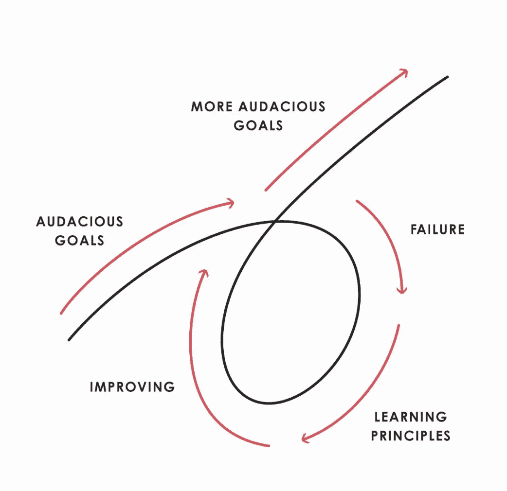

# 失败中成功

> 原文：<https://medium.datadriveninvestor.com/succeeding-at-failure-4636b650f8ae?source=collection_archive---------27----------------------->

## 如何把你的赤字变成盈余

最近，我失败了很多。虽然我感觉自己处于一个永无止境的失败季节，但我选择了保持自信，因为有一个更大的目标在召唤着我的生活。

作为人类，我们倾向于关注世界上所有消极的方面。我们关注他们，让他们把我们变成我们不想成为的人。

然而，在我失败的季节里，我强迫自己把消极的结果变成积极的结果。当无数的失败不断地把自己钉在我看不见的图钉板上时，我不断地问自己:我从这种情况中学到了什么？如何让自己做好准备，避免再次出现这种情况？我怎样才能装备自己走向成功？

我对抗对失败的恶意想法的一个方法是通过阅读。我决定开始写一本新书，书名是雷伊·达里奥的《原理》。在这本书中，他讨论了他用来指导自己生活的原则，以及我们如何适应和修改他的原则，将我们的生活变成一系列成功的旅程。

Dalio’s perspective on audacious goal-seeking through series of failure.

他定义的第一个原则是:我们想要什么样的原则来指导我们的生活？

当我读到定义生活原则的前三章时，我立刻为自己的“原则”绞尽脑汁。可悲的是。我至少花了 30 秒来制定哪怕一盎司独特的、驱动生活的原则。在对失败的想法进行了几周的反思后，我最终列出了一系列原则，我相信这些原则会让我走向一个充满活力、目标明确的未来。

## 1.选择让失败来驱动你，而不是定义你。

回到我以前的一篇关于固定心态和成长心态的文章。我们要么 a)让失败打败我们，呆在一个自我厌恶的地方，要么 b)决定我们目前的情况不是我们的最终目的地，并最终处于领先地位。

## 2.在失败的季节里找到目标。

做让你开心的事情。是什么给你带来了赋予生命的快乐？我不是在谈论巨大的野心。我说的是让你的一天变得更好的小乐趣。对我来说，就是写这个博客。这是对新友谊的投资。它是通过联系、建议和同情赋予他人力量。

## 3.让你周围都是好人。

我立刻想到了我的上一篇文章，其中讨论了发展强大的势力范围。最终，我们的成功根植于我们周围的人。如果我们周围没有那些鼓舞我们的人，生活就毫无意义。尽管这个月给了我很多打击，但我不断被提醒良好的关系有多重要*。在教会中，我们一直非常关注势力范围。我们要么承受好关系的果实，要么被坏关系的重压拖垮。*

## 4.你呢，阿布。

停止生活在恐惧、不安全感和攀比中。社交媒体是真实性和快乐的敌人。即使我们都知道社交媒体是音乐会、海滩和聚会的亮点，我们仍然允许自己只相信屏幕上看到的。请记住，每个人也在打自己的仗。

## 5.接受未知的事物。

我们没有人了解生活，即使我们认为我们了解。即使我不完全知道我要去哪里，但这从来没有阻止过我。有时候，生活中最大的成功来自未知。推动自己走出舒适区，等待伟大的可能性展现。