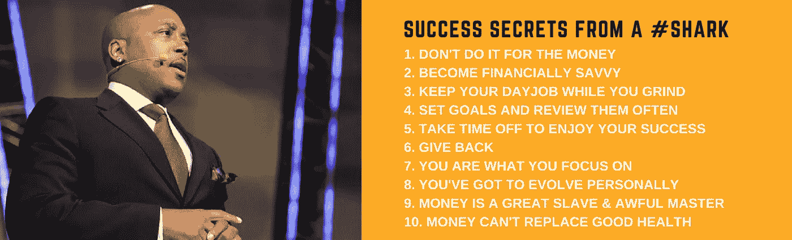
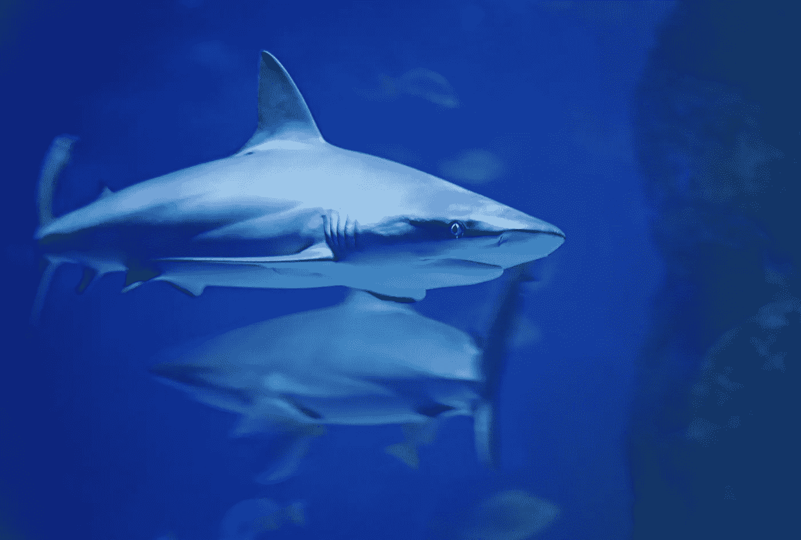

# #鲨鱼的成功秘诀

> 原文：<https://medium.datadriveninvestor.com/success-secrets-from-a-shark-7db63f9e1b8e?source=collection_archive---------27----------------------->

戴蒙德·约翰最近来到镇上，我有机会观看了他的现场采访。我相信不是吉米·罗恩就是托尼·罗宾斯说过成功会留下线索。所以当成功人士分享他们的智慧时，我试着用笔和拍纸簿倾听。

不再拖延，这里是我从鲨鱼身上学到的 10 个成功秘诀:

不要为了钱而做。商业有字面和比喻的底线。无论哪种方式，通常都是用美元和美分来表示的。有道理。(无意押韵)。如果你伪装成一个企业进行某些活动，但你没有底线的钱，你可能没有生意。

也就是说，鲨鱼讲述了把赚钱作为主要追求的不完美之处。不管是合法还是非法，最终的结果通常是空虚，有时是过早的坟墓或牢房。

**变得财务聪明**。虽然金钱不是生活中最重要的东西，但它肯定和氧气一样重要。困难就在这里。如果你不知道钱是如何运作和如何使用的，那么你赚多少钱也没用。花些时间接受金融教育，或者准备好从艰苦的学校接受教育。

**继续你的日常工作，直到你的梦想开始。你听过这样的建议:破釜沉舟！断绝你自己朝九晚五的生活，这样你就可以用双脚跳入你的梦想。对鲨鱼来说却不是这样。他谈到了自己在红龙虾全职工作时养成的纪律，回家缝衬衫缝到凌晨，睡上几个小时，然后再回到红龙虾工作。**

然后他冲洗，重复这个过程三年！

这种日常生活不仅建立了个人纪律，还提供了稳定性、工作中朋友的支持网络以及让他的梦想得以实现的金融安全网。

设定目标并经常回顾。目标是成功的燃料。想想任何成就，无论大小。毫无疑问，它始于某种目标。从逻辑上讲，很难击中你看不见的目标。目标提供了那个目标。他们也是进步的标尺和成就所需的能量。

目标是如此重要，以至于鲨鱼每天晚上睡觉前和早上第一件事就是回顾他写下的目标。他保持短期、中期和长期目标，并把它们想象成完整的。这些实践让他的目标始终在脑海中。当他为自己的目标努力时，他们也在为他努力。

抽出时间享受你的成功。成功就像毒品一样。得到的越多，想要的越多。根据你对成功的定义，或者你对企业的感知需求，你很容易陷入一个永无止境的帝国建设周期。

最终，没有能力享受的财务成功是空洞的。事实上，享受生活的能力必须包含在你对成功的定义中。如果不是，那么你可能会失败。

Photo By David Clode Via Unsplash.com

**回馈**。对一些人来说，创业本身就是一种回报。如果你做得好，你一定会收获很多回报。鲨鱼是一个很好的例子，说明商业生活是多么值得。

也许最终的回报是创业所带来的巨大利益。你可以通过发展生意赚很多钱。你用你的贡献创造了生活。

**你专注于什么你就是什么**。这是生活的普遍原则。无论你关注什么都会成长。所以完全由你来管理你的焦点。

你可以关注消极的事情，也可以关注积极向上的事情；你所没有的和你所拥有的；你要走多远和你已经走了多远。掌控你的焦点，你将塑造你的现实。

**你必须作为一个人进化**。你不应该一成不变。随着你成长和获得经验，你必须作为一个人进化。明天的梦应该和昨天的不同。

鲨鱼想象着有一天它的下一个动作可能会和现在完全不同。对各种可能性保持开放。

金钱是伟大的奴隶，但也是可怕的主人。这是在回答一个关于有史以来收到的最好的建议的问题时给出的。创办或拥有一家企业背后的一大动力是自由。财务自由，时间自由，选择自由。

具有讽刺意味的是，当企业主变成了企业或企业所创造的金钱的奴隶。它颠覆了这个梦想。它剥夺了旅行的乐趣。一个好的做法是问自己，“谁是老板？”

金钱不能代替健康。鲨鱼是癌症幸存者。他用一句名言总结道:“健康如一千个梦的人。没有健康的人有一个。”

如果你是一名企业家，那么你一定有过被吸入压力工作真空的经历。时间停止了，你可以放弃吃东西，甚至放弃健康。然而，当你的健康消失的时候，其他的都不重要了。

因此，你必须逆向工程的理解。从对你健康的承诺开始，在你的生活中建立利润和时间的恢复。

说得好，约翰先生。

# 关于韦恩

*感谢阅读我的帖子。我是一名律师，有商业讨债、商业诉讼和小企业的背景。我也是一名# keynote #演讲者和作家。我写关于商业、生活和信仰的文章，重点是如何通过建立企业、做出合理的财务决策和回馈来积累财富。*

在监管了超过 10 亿美元的坏账，打了无数的商业纠纷官司后，我已经解决了几乎所有犯过的金钱错误。我的目标之一是用这些知识来教育公众如何在生活中获得真正的财富。

*我是绿洲慈善机构的联合创始人，这是一个为低收入家庭和贫困妇女赋权的非营利组织。您可以在这里或点击下面与我进一步联系！*

点击这里加入我的邮件列表，免费获得我的专题报告《财富之路》