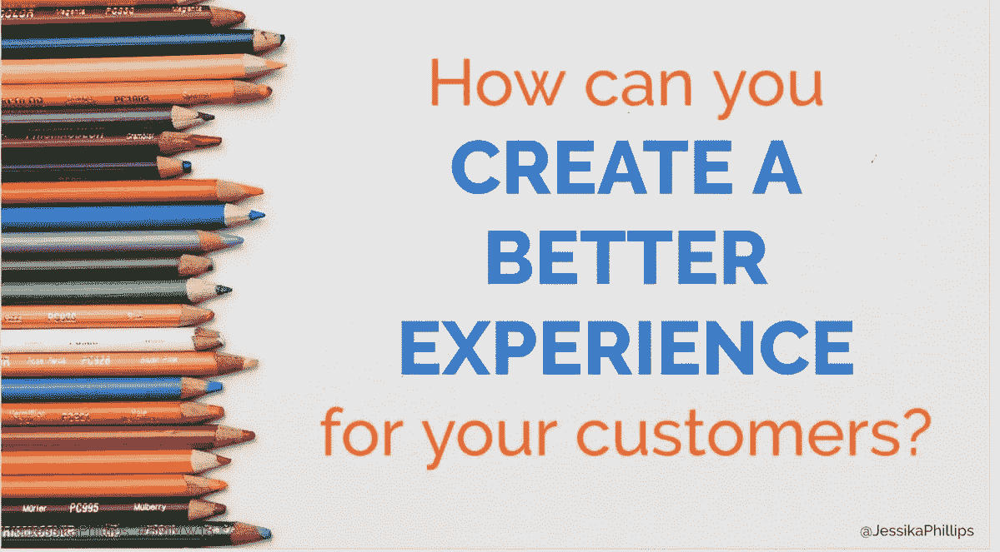
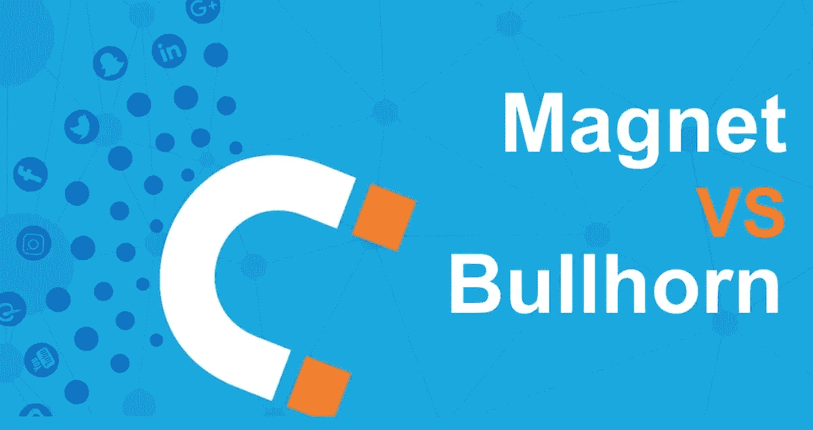
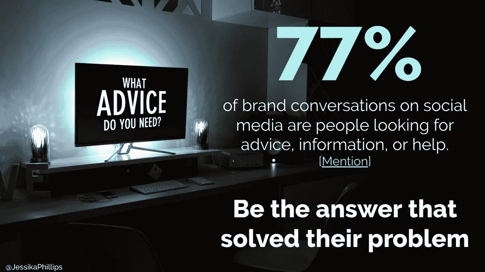
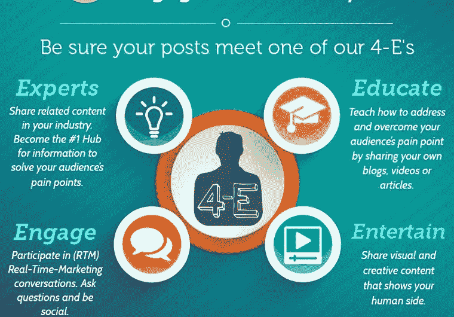
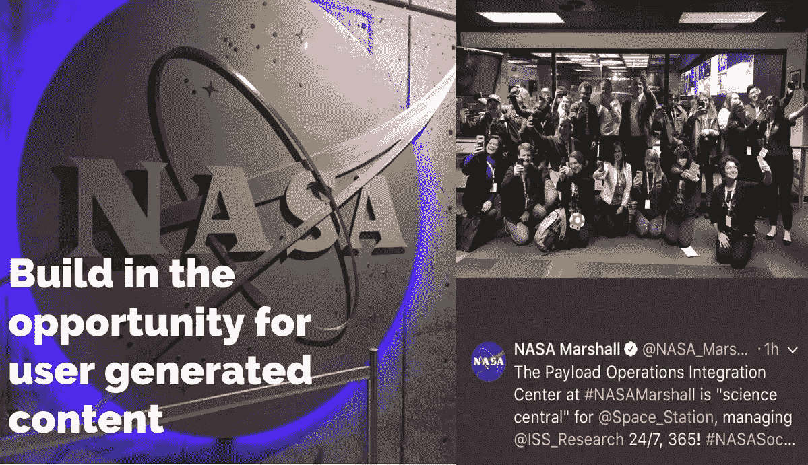

# 成功源于关系

> 原文：<https://medium.datadriveninvestor.com/success-springs-from-relationships-9db5934821d8?source=collection_archive---------5----------------------->

## 营销成功就是为你的受众提供价值

根据 [NOW 营销集团](https://twitter.com/NOWMG)的[杰西卡·菲利普斯](https://twitter.com/jessikaphillips)的说法，关系营销是一个不断追求更好、做得更好的过程。“[关系营销布道者](https://jessikaphillips.com/)”的使命是让关系成为商业营销的前沿。

菲利普斯以“他们真实的声音”说话，帮助企业主与他们的理想受众建立真正的关系，因为企业家会问，“我如何才能为他们服务？”

“我们创造的营销应该是提供价值，”她说。

菲利普斯与营销企业家 Madalyn Sklar 谈论了如何加速网上和网下的关系。

 [## 将关系放回商业营销中

### 正如 Jessika Phillips 所描述的那样，她“肩负着让人际关系回归商业前沿的使命……

blog.markgrowth.com](https://blog.markgrowth.com/put-relationships-back-into-business-marketing-b9c8a9d58704) 

关系营销强调先建立关系。只有当人们互相了解时，他们才知道如何互相帮助。

菲利普斯说:“这是一种艺术，它更加关注首次销售之后的整个客户生命周期。”“了解你的客户，建立忠诚度和长期客户关系，而不是一次性销售。花时间与人交流。

“本质上，你永远不会停止追求你的客户，”她说。“关系营销意味着你更像磁铁而不是扩音器。你赢得了关注、忠诚和参与，而不是短期租用。”

# 口头推荐

自然的结果是更多的生意。

菲利普斯说:“因为‘口碑’业务是最好的潜在客户，关系营销让你加倍努力增加口碑推荐。”

更多的推荐带来更大的社区，这不是理所当然的。

“社区管理绝对是关系营销的一部分，”菲利普斯说。“这是一种全面的方法，专注于与你的理想客户建立长期关系，而不仅仅是专注于销售。

“问问你自己，‘我们能真正最好地帮助谁——比其他任何人都好？’她说:“为你的理想受众量身打造一个解决方案。只吸引合适的人。"

与其他社交媒体平台相比，Twitter 上的交流是即时和广泛的。你不仅与目标人群建立了关系，观众也看到了你如何互动，带来了意想不到的粉丝。

“Twitter 是最终的对话启动器，”菲利普斯说。“它允许你在它的平台上找到、接触并直接回复任何人。与某人或某个品牌建立联系是一个无摩擦的过程。

“Twitter 不仅受众多样，而且你可以与你直接认识的人建立关系，”她说。“你可以很容易地通过标签、视频和你认识的其他人找到志同道合的人。”

# 广泛的网络

菲利普斯补充说，Twitter 聊天提供了“丰富的网络和参与机会，让人们感受到他们所代表的一部分。”

通过 Twitter，企业家可以找到合适的受众来建立关系。

 [## 如果你做得对，有一个标签

### 了解标签的基本知识来推销你的业务

medium.com](https://medium.com/datadriveninvestor/theres-a-hashtag-for-that-if-you-do-it-right-79b9d167c86a) 

菲利普斯说:“从与你当前的客户、社区和合作伙伴建立联系开始。”“在线搜索或使用工具在线查找或跟踪他们。然后开始参与。首先确定你的受众和买家角色。然后想想他们会用什么作为标签来寻找相关的兴趣。

她说:“我们在 [HubSpot](https://twitter.com/HubSpot) 中使用了一个名为‘Streams’的工具，让我们跟踪并参与我们的观众参与的对话，以建立关系。”"我们关注会议、对话和话题标签."

Sklar 使用 Twitter 的[高级搜索功能](https://twitter.com/search-advanced)来寻找她的观众。

“我还使用 [ManageFlitter](https://twitter.com/ManageFlitter) 强大的搜索功能和省电模式来过滤和分割列表，”她说这是一个惊人的功能。"

越来越多的企业家在销售和营销过程中使用 Twitter 来加强关系。菲利普斯列举了信任、保留、建立关系和推荐:

*   信任。Twitter 可以用在你营销和销售过程的每个阶段。发布内容时的意识有助于你的人物角色找到你，与你的信息相关联，并建立对关系至关重要的信任。
*   保留。他们说，每个月你不和客户交流，你就会失去 10%的关系。Twitter 可以用来加强关系。一旦人们成为客户，你就可以继续与他们接触并支持他们的计划。
*   建立关系。更快地建造它们。你可以将 Twitter 关系转移到其他渠道，如 LinkedIn、脸书和 Instagram。也在这些平台上连接。Twitter 让品牌能够真正倾听每天影响他们客户的事情。当品牌明智地利用这一点时，他们可以调整和应对他们推出的新服务或产品。
*   推荐。如果你分享了你的观众喜欢的有益内容，他们很可能会再次分享。这导致更多的推荐，因为志同道合的人在平台上联系。

# 最重要的信任

“你必须让人们了解、喜欢和信任你，”Sklar 说。“我用视频来做这件事。我喜欢在推特上录制视频，尤其是回复推文。这是加强人际关系的一种不可思议的方式。”

做得好，关系营销策略在 Twitter 上脱颖而出。

Twitter 上最好的关系营销策略就是做你好奇的、乐于助人的自己。这给了你一个巨大的优势，因为你不必去想它。

 [## 关系是你最大的投资回报

### 商业和个人投资不仅仅是金钱

medium.com](https://medium.com/datadriveninvestor/relationships-are-your-greatest-return-on-investment-8b0c254281b5) 

菲利普斯说:“让你的推文对你的观众个性化是关键。“写帖子的时候，就好像你在和你面前的人说话一样。然后保持发帖和参与的一致性。

“关键是要比你在 Twitter 上发布的内容多三倍，”她说。“可能有很多天，我只在推特上发布一两条自己的帖子，但我会吸引和分享其他人的内容，我的观众会喜欢这些内容。与您自己添加的评论分享内容。”

参与包括交流的多样性。

菲利普斯说:“使用 Twitter 的个性化不仅意味着分享你的观众会产生共鸣的事情。“这意味着尽可能使用吸引人的回应，包括视频。

“使用协作内容，”她说。“让你的社区——志同道合的人——分享专业知识、故事和有用的技巧——尤其是你的客户的受众。当你关注他们而不是只关注你时，他们会*关心*并分享更多。”

Sklar 遵循这一个性化处方，在市场营销中崭露头角。

“这正是我做视频回复的原因，”她说。“我喜欢在 Twitter 上与我联系的人进行个性化的对话。”

菲利普斯告诫不要过于机械。

“有时候，这不是使用另一种工具的问题，”她说。“是关于你的技术。视频、列表、Twitter 卡片和保存等内置工具是你可以用来有目的地建立关系的一些最佳功能。”

菲利普斯也喜欢《T4》和《飞人》两部电影。

“Missinglettr 让我可以快速地将博客转化为随时可用的帖子，”她说。“这样，我花在创作内容上的时间更少，而有更多的时间参与其中。

“我喜欢 ManageFlitter 来监控我们应该使用的标签，找到最活跃的联系，看看我们在推特上发布的内容的影响，”菲利普斯说。“然后我们就知道我们所说的是否适合我们的观众。”

# 建立信誉

最终，更有益的关系是在社交媒体之外达成的。

菲利普斯说:“我最喜欢的一些工具是那些将 Twitter 关系离线的工具。”“这可能是用 [Sugarwish](https://twitter.com/Sugarwishgirl) 给某人发一张卡片，或者通过[炸弹](https://twitter.com/BombBomb)发送一条个性化的视频信息，以便在现实生活中见面。仅仅因为它是从网上开始的，并不意味着它必须停留在那里。”

除了 ManageFlitter 和 Twitter 高级搜索，Sklar 还使用 [AgoraPulse](https://twitter.com/AgoraPulse) 和[社交点唱机](https://twitter.com/SocialJukebox)来帮助获得动力。

 [## 了解、喜欢和信任推动转化和销售

### 志同道合的人推动社区的发展

blog.markgrowth.com](https://blog.markgrowth.com/know-like-and-trust-drive-conversion-and-sales-51c791e7c6b6) 

最好的建立关系的内容不仅是有帮助的，而且是可信的。最后一部分由于太多未经证实的信息来源而丢失了。转发是你的推文。所以，在与你的追随者分享之前，要相信但要核实。

[NOW Marketing Group 的一篇文章](https://nowmarketinggroup.com/elements-of-a-good-social-post/)解释了如何创建“个性化的、开放式的、具有你自己的语调和适时风格的”帖子

菲利普斯说:“我们在社交媒体上创建内容时也使用 10–4–1 规则。“在你创建的每 15 个帖子中，有 10 个来自你的读者会喜欢的志同道合的来源。四是自己有帮助的内容。最后一个是行动的软号召。

“发布符合 4 个 E 之一的内容——专家、教育、参与和娱乐，”她说。“然后，你可以分享你所在领域的专家的信息，以提高你的可信度，并精选与你的受众及其兴趣相关的内容。”

# 发表意见

Sklar 建议了几种方法来确定和分享与社区相关的内容。

“他们想要什么？问他们，”她说。“做一个推特投票。我是推特上的资源。我分享关于社交媒体的文章和信息，这是我的专长。”

 [## 挖掘客户的力量

### 小型企业通过个性化客户服务获得优势

medium.com](https://medium.com/datadriveninvestor/tap-into-the-power-of-customers-876388cc8f8f) 

当企业家知道如何充分利用这个平台时，Twitter 是最有效的。

“Twitter 不仅仅是关于新的销售和线索，”菲利普斯说。“它有助于留住人才、社区、客户服务、运营等等。确保你看一看你努力的整体用途。

“根据你的目标来衡量结果，”她说。“检查客户留存率、评论、网站回头率或整体转化率。审视你在 Twitter 上的所作所为是否与你的目标直接相关。”

没有一个社交媒体程序会独立运作。

菲利普斯说:“确保你的品牌有专门的社交媒体品牌大使来吸引你的观众。”“使用团队成员、选定的社区经理或影响者。让关键人物参与进来。让他们帮助讲述你的品牌故事。

她说:“每年至少进行两次持续的 Twitter 审计，以确保你在人际关系中真正成长并产生影响。”。“我喜欢 Twitter 是一个公平的竞争环境。你才能真正快速获得动力。”

菲利普斯补充说，用户生成的内容在关系营销中是巨大的:“这是关于其他人的，而不仅仅是品牌。”

Sklar 强调，这也是关于可靠的可用性。

“为了充分利用 Twitter，坚持使用它，”她说。“当你定期上网站时，你会成为最受关注的人，不仅仅是发布内容，还有吸引力。每天花时间与人交流。这是一个游戏改变者。”

Phillips 和 Sklar 在脸书直播继续他们的对话[。](https://www.facebook.com/LearnWithMadalyn/videos/532354460540891/UzpfSTY5NjU0NTMyOToxMDE1NjU4ODM5OTMzNTMzMA/)

**关于作者**

吉姆·卡扎曼是拉戈金融服务公司的经理，曾在空军和联邦政府的公共事务部门工作。你可以在[推特](https://twitter.com/JKatzaman)、[脸书](https://www.facebook.com/jim.katzaman)和 [LinkedIn](https://www.linkedin.com/in/jim-katzaman-33641b21/) 上和他联系。