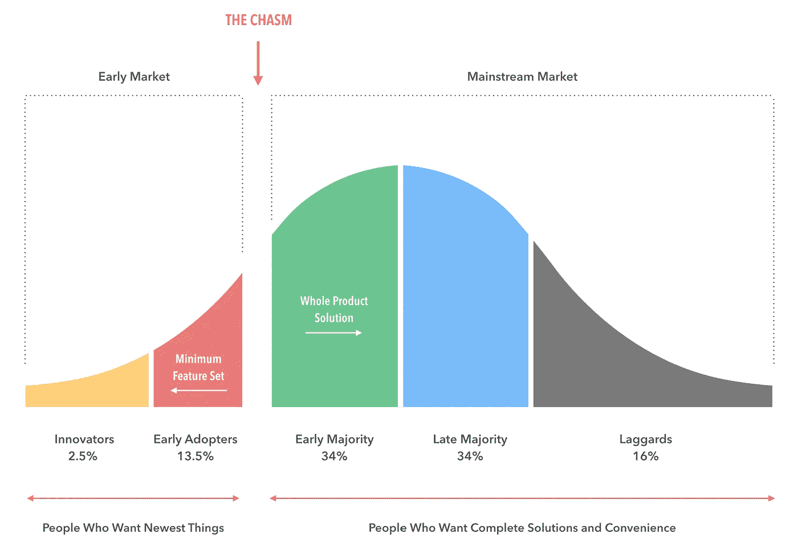
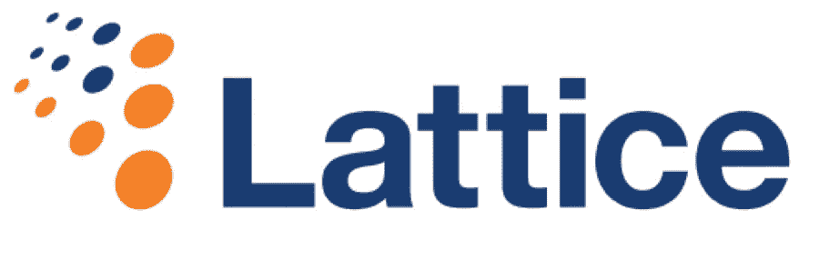
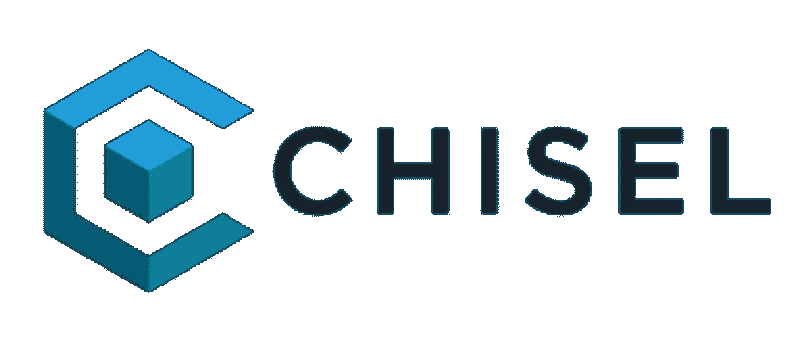

# (成功地)与人工智能一起跨越鸿沟

> 原文：<https://medium.datadriveninvestor.com/successfully-crossing-the-chasm-with-ai-ae88a0d19eb6?source=collection_archive---------3----------------------->

Codifying the Do’s and *D’OH!* n’ts of AI product development

1991 年因许多事情而被人们铭记:沙漠风暴行动、迈克尔·杰克逊的《危险的 T0》、《T2》和《终结者 2》的票房成功。

它不是因为人工智能的重大进步而被记住的。

事实上，1991 年发生在[人工智能冬天](https://en.wikipedia.org/wiki/AI_winter)最黑暗的时期，在这个时期，人工智能技术挣扎着度过了投资者、研究人员和普通公众都不感兴趣的几十年。

然而，1991 年出版的一本书再次成为 2019 年人工智能产品开发的惊人先见之明。

这本书是 [*跨越鸿沟*](https://www.amazon.com/Crossing-Chasm-Marketing-High-Tech-Mainstream/dp/0060517123) ，其中包含的经验教训提供了三个清晰的原则，值得任何今天寻求推动企业采用人工智能技术的人理解。

# 穿越峡谷的悬崖笔记

*跨越鸿沟*的核心原则是，颠覆性技术的营销需要适应技术采用生命周期的每个阶段。

这本书的关键观点是，每一个颠覆性的技术产品为了生存都必须经历一次飞跃。这是早期采用者和早期大多数之间的跳跃。

The Chasm is the gap between the Early Adopters and the Early Majority (source: [Prototypr](https://www.google.com/search?q=crossing+the+chasm+images&tbm=isch&source=iu&ictx=1&fir=bMbOFbVIlvmAYM%253A%252CP8dutS-RhC77zM%252C_&usg=AI4_-kRe_SFifsIp6rD64OE_1Bv51hZfXg&sa=X&ved=2ahUKEwi4wPTh-5HgAhWGZd8KHZEwA98Q9QEwAHoECAAQBA#imgrc=bMbOFbVIlvmAYM:))

这就是齐名的“鸿沟”。这是有远见的早期采纳者和务实的早期大多数之间的差距。这也是这本书在 2019 年与人工智能如此相关的原因，因为这正是我们在人工智能技术的采用方面所处的位置。

在我们深入研究人工智能采用的细节之前，这里有两个特别突出的点值得暂停一下。

首先是客户，而不是技术，推动了技术采用的生命周期。

每个群体的决定性因素——从创新者到早期采用者、早期多数、晚期多数以及最终的落后者——与技术本身没有太大关系，几乎与客户追求(或更常见的是抵制)采用的原因完全相关。换句话说，这是一个深刻的以客户为中心的框架。

第二点是，出现“鸿沟”的原因是，在产品的生命周期中，对于下一批客户来说，它的相对优势——它的新技术——第一次变成了它的相对劣势。

理解这一点至关重要。像创新者这样的早期群体将倾向于采用纯粹的新产品，因为新技术在其中；新奇本身就有价值。然而，务实的早期大多数人——虽然不一定反对技术创新——并不受其驱动。驱动它们的是有用性。当你只关心有用性时，“新”通常意味着“未经证实”。

# 对 AI 产品开发有哪些借鉴？

这正是我们今天对人工智能的理解。我们已经过了创新阶段，这意味着人工智能产品现在必须在设计和营销时考虑到这一早期的大多数。

应用*跨越鸿沟*的经验教训，人工智能产品支持者为了让他们的人工智能产品成功地到达另一边，需要优先考虑三个非常明确的原则:

## 1.展示早期大多数人能够感受到的投资回报🤩

这个时代最成功的人工智能产品将是那些在采用和增加“有意义的投资回报率”之间建立不可否认的联系的产品。

有意义的 ROI 是我们用来描述可测量和可触摸的业务影响的术语。它通常被称为“痛苦”的来源。事实上，杰弗里·摩尔称最容易接受的早期多数顾客为:“[痛苦中的实用主义者](https://www.forbes.com/sites/danschawbel/2013/12/17/geoffrey-moore-why-crossing-the-chasm-is-still-relevant/#1865a08e782d)”。

这种动态最好的早期例子是在企业销售和营销功能中早期采用人工智能产品。这些团队感到的痛苦来自他们所处的日益拥挤的销售环境。新营销渠道的扩散加上进入成本的下降产生了一个注意力已经饱和的客户群。越来越难突破，这意味着更多的努力白费，更多的销售目标无法实现。

根据[超过 90%的 B2B 营销人员](https://blog.topohq.com/account-based-marketing-the-definitive-guide/)的说法，这个问题的解决方案是更好的个性化；能够在正确的时间针对正确的客户采取量身定制的行动，通常称为基于客户的营销(ABM)。ABM 非常有效，据称与标准方法相比，收入提高了 3 倍。问题是传统的 ABM 不容易扩展。不可避免的是，它的高接触要求总是把它限制在少数最重要的客户上。

人工智能是为解决这个问题而量身定制的，这就是为什么我们看到 Lattice Engines 等人工智能产品非常有效的进入，Lattice Engines 是快速增长的预测创收领域的市场领导者，使用预测分析来转变组织内的创收能力，包括最终实现大规模的 ABM。

Lattice 的人工智能是将专有的机器学习技术应用于第一方和第三方客户数据的组合，以预测性地识别现有和潜在客户群中的模式，识别哪些客户最有可能在特定时间对特定行为做出反应。将人工智能应用到这个数据集不仅减少了扩展 ABM 的痛苦，而且在[更大的交易规模](https://intelligentgrowth.siriusdecisions.com/studies/2017-state-of-abm-study-findings)、[更高的转换率](https://hbr.org/2015/03/making-the-consensus-sale)和[更快的收入增长](https://www.salesfusion.com/resource/10-key-account-based-marketing-stats-marketers-know/)方面带来了可衡量的投资回报。

晶格给那些想要跨越鸿沟的人的教训？ 找到采用你的产品和有意义的投资回报率之间不可否认的联系，并以此信息为导向。

## 2.将预测转化为行动🔥

成功的早期多数人工智能产品将是那些推动行动的产品。

人工智能产品的趋势是依靠预测的力量:“你可以知道你以前不知道的事情”。这已经不够了。

早期大多数客户的实用主义意味着他们将需要人工智能产品来让他们更容易“做”一些事情，而不仅仅是更容易“知道”一些事情。

这推动了垂直人工智能应用的成功；专注于特定行业的应用。

招聘是一个很有希望的例子。以前的招聘技术主要关注于扩大任何给定职位的申请人总数，这一过程非常成功，以至于超过 50%的人才招聘负责人将从他们收到的大量申请中进行分类作为招聘过程中最困难的部分。

通过 Ideal AI 这样的公司进入 AI，Ideal AI 正在应用非结构化数据处理和强化学习算法等技术来自动化招聘筛选流程，这种方式不仅减少而且往往消除了人工筛选简历等消费活动中的人工干预需求。

Ideal 成功的关键在于将它的人工智能应用到人类的实际利益中。

Ideal 的核心技术使其能够处理非结构化简历数据，并使用机器学习来预测候选人对特定角色的适合性。然而，它对早期大多数消费者的价值不在于技术，而在于它将技术转化为行动的能力，通过集成到现有的申请人跟踪软件中，自动列出最佳候选人名单，并实现轻松推广，以及其他增值功能，如自动识别不同人才库中以前申请过的其他候选人，并建议推广给他们潜在的合适人选。

***理想人工智能给那些希望跨越鸿沟的人的教训？*** 将你的技术应用推向尽可能减少或消除人类活动，并尽可能突出其功能。

## 3.提供清晰的用户控制💪

人工智能产品支持者优先考虑的最后一个原则是，最成功的人工智能产品将是那些让用户牢牢控制的产品。

这可以概括为“反黑箱”原则，它源于这样一个事实，即早期的大多数客户通常会对新技术持更加怀疑的态度，尤其是当他们觉得自己正在放弃任何有意义的控制权时。

“AI-UI”领域是用户体验和设计的一个令人兴奋的增长领域，但这一原则超越了设计功能，如更好的仪表板。取而代之的是让用户能够检查和调整正在使用的人工智能模型的实际性能和结果。

这方面的一个很好的例子是在人工智能增强的法律服务领域，像 [*Chisel AI*](https://www.chisel.ai/government.php) 这样的公司可以自动执行重要但耗时的重复任务，如从(编辑)法律文件中删除机密信息。

Chisel 使用人工智能来处理各种各样的文本文档，并自动识别文档中可能是机密的元素——自动向人类用户呈现该文档的编辑版本。

Chisel 在其工作流设计中添加了两个关键元素，以促进其在早期大多数用户中的采用:首先，Chisel 通过提供包含文档每个修订部分的简单摘要，为人们提供了一个审查每个修订(和被忽略的修订)的简单机会；第二，用户可以在应用程序中随时调整编校算法的敏感度，调高或调低预测算法的敏感度，从而影响算法标记文档中潜在机密信息的可能性。

这些措施中的每一项都具有内置的人在回路中的审查机制，并使用户能够轻松控制算法的应用，因为需要更多的人力输入而降低了技术的原始效率( [Chisel 仍然声称成本降低了 80%](https://www.canadianbusiness.com/innovation/knote-document-redaction-ai/) )，但综合起来，它们大大简化了早期大多数用户采用的可能性，因为它们有效地改善了对失控的潜在担忧。

***凿子 AI 给那些想跨越鸿沟的人的教训？*** 优先考虑让用户掌控的产品设计特征，即使它们会降低技术的原始影响。

# 结论

第一批企业人工智能产品正在快速接近(或已经在飞行中)这个鸿沟。很少有人能成功到达彼岸。

学习跨越鸿沟的 30 年经验提供了一套不太可能但非常清晰的原则，人工智能产品支持者应该优先考虑这些原则，因为他们试图推动人工智能产品在其组织内或在更广泛的市场上的采用。

应用这些原则将使人工智能产品有最好的机会成功地从热情的创新者跃升为繁荣的早期大多数，并将很好地实现我们迄今为止所看到的人工智能产品采用的最重要阶段。

在 Asta，我们正在应用预测性人工智能来转变工作中的信息流。你可以在这里下载它。

你也可以直接在 LinkedIn 和 Twitter 上关注我，了解更多关于我们人工智能的未来。

