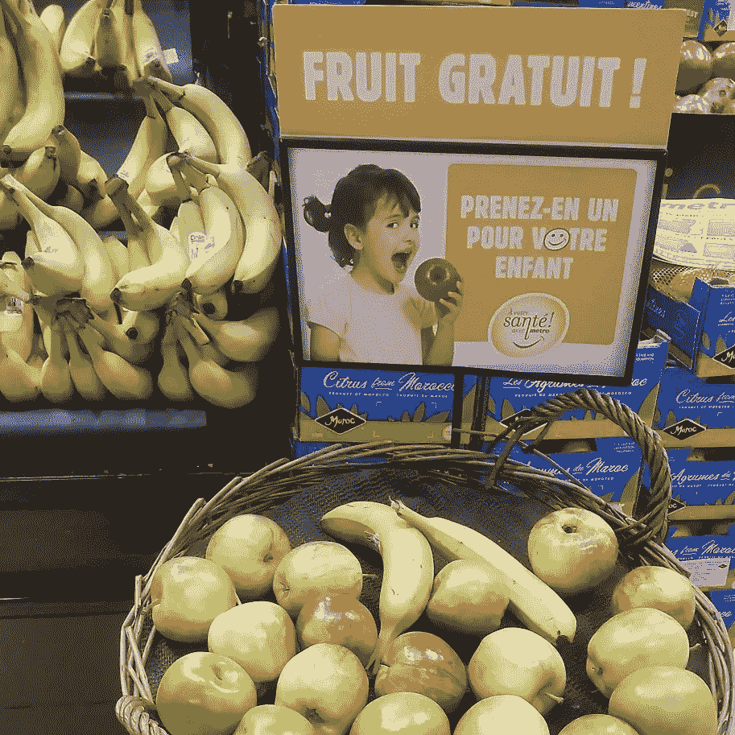

# 糖是甜的，但对你的健康不利

> 原文：<https://medium.datadriveninvestor.com/sugar-is-sweet-but-not-for-your-health-bfdfc812fdc3?source=collection_archive---------1----------------------->

## 空卡路里以对你不利的方式充斥着你的身体

The sign says, “Free fruit. Take one for your child.” (Photo courtesy of Sandra Woods)

它们被称为[无热量](https://en.wikipedia.org/wiki/Empty_calorie)——主要由糖、脂肪、油或酒精组成的饮料和食物。

一个例子是含糖软饮料。他们是医疗保健提供者的克星，如[的杰弗雷德·克里斯蒂安“吉姆”洛佩兹医生](https://twitter.com/jaifredlopez)。他在马尼拉菲律宾大学公共卫生学院任教。他也从事健康政策和管理方面的研究。

洛佩兹和其他医疗保健专家谈到了含糖饮料的过量摄入以及他们可以做些什么。

几个因素使得减少这种饮料的摄入变得困难。首先，它们味道好极了。味蕾倾向于喜欢甜食，它们让你感觉良好——好到想要更多。

洛佩兹说:“是的，给它添加一点情感，在不太甜蜜的生活中有一些甜蜜的东西是很好的。”“喝含糖饮料与文化有很大关系，甚至我们如何将它与积极的生活事件和假期联系起来。

“就像在圣诞节期间，一家大型咖啡连锁店供应有史以来最甜的饮料，”他说。"我想一小口就能满足我一周的糖需求。"

# **茶不那么绿**

Shereese Maynard 在马里兰州从事医疗保健设计战略和信息治理工作。她也是 EnvisionCare Strategies 的董事总经理。

“含糖饮料的使用占绝对优势，这使得减少摄入量成为一项艰巨的任务，”她说。“不仅是饮料本身，我们添加的东西都有这么多糖分。甚至当我们认为自己很健康的时候，糖也会悄悄的进来。阅读[你的绿茶里有什么](https://well.blogs.nytimes.com/2013/05/23/whats-in-your-green-tea/)。”

 [## 健康三位一体:精神、社交媒体和医疗保健

### 医生与人们的信仰和网上的错误信息作斗争

medium.datadriveninvestor.com](/wellness-trinity-spirituality-social-media-and-healthcare-785ce1147f52) 

桑德拉·伍兹每天看到健康食品和不健康饮料的例子时都摇头。她在蒙特利尔专门研究生物医学伦理、病人隐私、研究伦理和退伍军人健康。

“即使是杂货店里‘看起来’健康的饮料——比如冰茶——也含有大量糖分，”她说。“购买者必须阅读成分和营养信息标签——在我所在的加拿大，这是强制性的——但许多人不这样做。解决办法是制作不加糖的冰镇草药茶和水果茶。

“我喜欢咖啡，但不能含有咖啡因，”她说，“所以，我一周去几次大型连锁咖啡店——见见我的丈夫，他在附近工作——但他们出售的一些调味饮料是糖——外加一些咖啡。”

劳伦斯·谢尔曼对过量糖分的危害有第一手经验。他也是戒烟好处的传播者。

“我在 2002 年放弃了碳水化合物，减掉了 25 公斤，并且一直保持下去，”他说。“如果你真的想的话，你可以改变你的生活方式。开始的时候要有目的。”

Prova Education 教育战略高级副总裁 Sherman 是全球知名的继续医学教育创新者。他住在纽约，在他设计的活动、教学和演讲中运用幽默和科技。

“所有的单糖都会导致体重增加，所以明智地摄入所有的糖是很重要的，”他说。

# **不明智的选择**

含糖饮料有许多种类，有免费续杯和吸管。新机器既满足了新奇感，也满足了爱吃甜食的人。感知价值让人觉得聪明。

其中一家医疗保健提供商建议，吸管可以帮助人们喝得更快——可能会消耗两到三倍的液体。

“说得好，”谢尔曼说。“我想对我来说也是如此。也许我们应该进行一次民意测验来确定其他人的看法。"

很难找到让患者减少含糖饮料摄入的策略。

你是怎么说服病人戴眼罩和耳塞的？跟他们说说甜食的危害。然后他们走出门去，被广告轰炸。回到家里，迎合家人说，“你必须有一些甜的东西。”

洛佩兹建议，“选择水，并确保它是干净的。从饮食中去掉含糖饮料需要一段时间。味蕾必须调整。总是检查饮料的标签。大型咖啡连锁店公布营养成分是件好事。”

梅纳德也是一个清液迷。

“我们应该鼓励摄入更多的水，仔细阅读标签，减少你力所能及的糖分，”她说。

# **比赛时间**

谢尔曼说，如果其他方法都失败了，“那就试试竞赛。”

“提出一个挑战:要求患者记录他们一周内的饮料摄入量。然后要求他们在下一周用水或不加糖的食物代替一半，并记日记，”他说。“如果他们觉得简单，就让他们继续减少。

“对孩子们来说，把它变成一个有奖励的游戏，”谢尔曼说。“而且很有趣。让他们给黄瓜水、黄瓜汗打电话，让他们看看他们的一群朋友中，哪一个能最大程度地从含糖的选择转向更好的选择。”

伍兹也想改变，但更倾向于逻辑。

“告诉人们，‘每次你想喝水果饮料的时候，就吃水果吧——这对你更好。’如果不方便，那就试试不加糖的冰镇果茶吧。它们在成本上应该是相当的。

“如果有干净的水，睡觉前在一个大水罐里装满水，放入两袋水果或草药茶，浸泡一夜。那不需要甜味剂，”伍兹说。“我专门为冰茶准备了可重复使用的水瓶，如果有冰就扔进去，骑自行车的时候带上。”

促进含糖饮料摄入的社会因素带来了巨大的挑战。首先，牙齿和牙科需要被欣赏和尊重。

# **牙齿的故事**

一位医疗保健专家回忆道:“我妻子在菲律宾的姐姐在 20 出头的时候就装上了全口假牙。她的儿子腐烂的乳牙上覆盖着完整的银层，让我想起了詹姆斯·邦德的《大白鲨》。家人对此毫不在意。”

洛佩兹承认家庭问题，“特别是因为他们是那些看到狂吃糖的影响的人。再加上需要哄着刷牙的孩子。我们不应该在食品机构中推广大杯含糖饮料，或者至少重新配方——但不要达到人工甜味剂过多的程度。

“社交媒体活动的一部分将是展示如何避免含糖饮料，而不会产生这么多成本，”他说。"生活方式的改变总是需要一些个人牺牲，饮料的选择也不例外."

对她来说，伍兹已经把牺牲变成了享受。

“我在咖啡店买了不加糖的冰无咖啡因咖啡，”她说。“牛奶或大豆加浓咖啡。在家里，我用一台*老式*浓缩咖啡机和 1%的牛奶制作热咖啡或冷咖啡。

“当我们在炎热的天气里有客人时，我喜欢把压碎的新鲜薄荷放在一大罐水中过夜，然后用冰块——加一片柠檬或酸橙——端上桌，”伍兹说。“它看起来像酒吧饮料，但客人开车时不含酒精，也不含糖。”

# **香喷喷的餐桌**年代

她试图以身作则，具有讽刺意味的是，当其他医疗保健领导人会面时，这是一个挑战。

"有多少医学会议有巨大的甜点或糖果桌，并提供花式或含糖饮料？"伍兹说。“提前要求组织者停止这种行为。分享新鲜水果桌和各种无糖饮料的照片。”

远离含糖饮料是一个迫不及待的新习惯。

“现在开始，”伍兹说。“点一杯加冰的浓缩咖啡。如果你想的话，可以加一点牛奶，但是不要加甜味剂。没有。习惯了味道。然后继续点它或者不加糖的拿铁。总有一天，含糖饮料会显得太甜——就像喝糖果一样。”

她承认，这是一种来自个人经历的感觉。

**关于作者**

吉姆·卡扎曼是拉戈金融服务公司的经理，曾在空军和联邦政府的公共事务部门工作。你可以在[推特](https://twitter.com/JKatzaman)、[脸书](https://www.facebook.com/jim.katzaman)和[领英](https://www.linkedin.com/in/jim-katzaman-33641b21/)上和他联系。