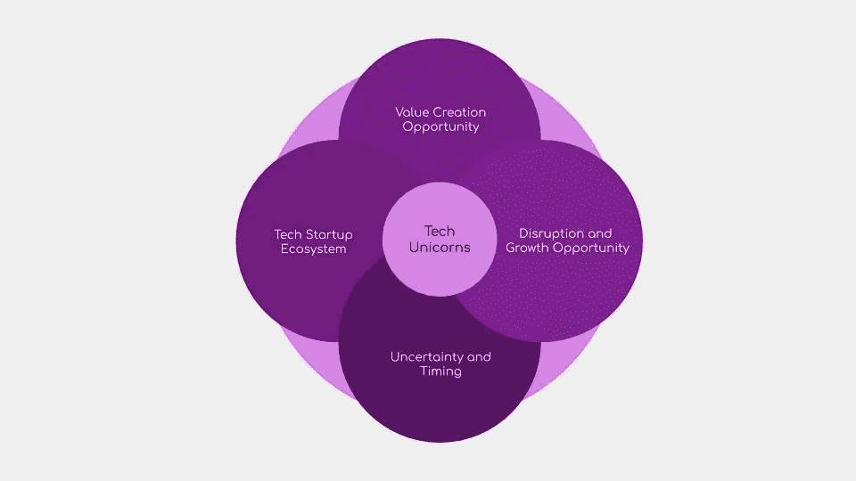

# 摘要——科技初创企业独角兽

> 原文：<https://medium.datadriveninvestor.com/summary-tech-startup-unicorns-728e9f0ca976?source=collection_archive---------11----------------------->

***回顾:*** *这是一个中型系列，着眼于在理解巨型科技独角兽如何形成中发挥作用的不同因素(以维度表示)。你可以在这里找到* [*简介*](https://medium.com/datadriveninvestor/intro-tech-startup-unicorns-be40ed9ff9c9) *。*

该系列代表 4 个维度的关键因素:

**维度 1:**

*我们之前谈到了如何创造新的价值机会层(表示为* [*维度 1*](https://medium.com/datadriveninvestor/dimension-1-value-creation-opportunity-at-macro-level-b205a8f05561) *)。*在一段时间内稀缺的技术，当被提取并变得丰富时，会带来增长或价值创造。如果这种技术消除了摩擦(换句话说，提供了获取稀缺资源的途径)，并且可以在全球范围内推广或惠及数十亿人，那么价值数十亿美元的公司就诞生了。我们看到了其他公司中的科技独角兽如何利用这个机会

**尺寸 2:**

*我们介绍了微观层面的颠覆机会和增长机会是如何出现的(表示为* [*维度 2*](https://medium.com/datadriveninvestor/dimension-2-disruption-opportunity-at-micro-level-and-growth-e37f078544eb) *)。*新进入者通过夺取客户服务不足和服务过度的一小部分市场来扰乱市场。一旦这些公司在市场上站稳脚跟，他们就会不断创新(商业模式、战略、管理和流程)，并实现规模增长。

 [## 睁大眼睛冲破多样性壁垒——数据驱动的投资者

### “科技女性”是蒂芙尼·霍兰的激情之一，最初她在 Twitter 上主持“科技女性”聊天。她也是一个…

www.datadriveninvestor.com](https://www.datadriveninvestor.com/2019/03/20/hurtle-diversity-barriers-with-eyes-wide-open/) 

**尺寸 3:**

*我们讲了对创业独角兽成功起塑造作用的外部因素(表示为* [*维度 3*](https://medium.com/datadriveninvestor/3-1-dimension-3-luck-and-timing-2240c222bed6) *)。在技术驱动的创业公司中，时机扮演着重要的角色。一些最成功的科技独角兽，如亚马逊(Amazon)和特斯拉(Tesla )( autonomy through software updates ),提前做好了准备，赢得了快速扩张的时间。我们还讨论了技术生态系统是如何抗脆弱的，从而使真正的黑天鹅(技术独角兽)能够出现。*

**维度 4:**

*我们讨论了科技创业生态系统在构建这些创业独角兽中的作用(表示为* [*维度 4*](https://medium.com/datadriveninvestor/dimension-4-role-of-tech-startup-ecosystems-6ee1c632718c) *)* 。像埃隆·马斯克这样的远见卓识者拥有独特的技能，通过建立大胆的愿景和在每一步找到新的价值创造机会，为初创公司奠定基础。社会资本等风险投资公司通过建立数据驱动模型来帮助开发增长机会。像 Entrepreneur First 这样的公司建设者已经建立了一个行之有效的模式，来帮助有雄心的科技创业公司扩大人才规模。

*虽然我们永远无法预测未来，但构建框架使我们能够了解新的机会是如何出现的，并研究这些机会，以便在一只新的科技独角兽像黑天鹅一样突然出现时，搞清楚“正在发生什么”。*