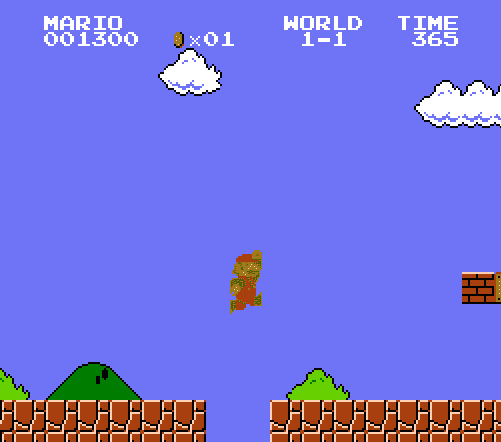
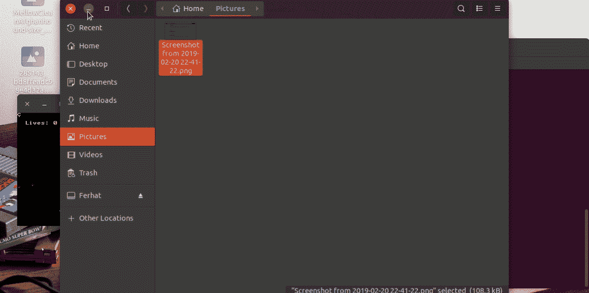

# 具有强化学习的超级马里奥兄弟机器人

> 原文：<https://medium.datadriveninvestor.com/super-mario-bros-reinforcement-learning-77d6615a805e?source=collection_archive---------0----------------------->

[](http://www.track.datadriveninvestor.com/1B9E)

# 0.介绍

你好，世界！我相信你玩过超级马里奥兄弟。如果你玩过，你就知道它有多难。如果我告诉你计算机可以不用描述游戏的所有规则就能解出这个游戏呢？我将向您展示强化学习方法在 it 领域的一个令人兴奋的新应用。游戏的第一关将由电脑在没有我们智能的情况下学习，它会自己学习。我们开始吧！



Classic Mario Game

# 0.1 先决条件

我会假设你的机器上安装了 python3(至少 3.5)、pip3、OpenCV2 库。

# 1.设置

我们将使用一些库来模拟旧 NES(任天堂仿真系统)游戏，并检索有用的游戏瞬时数据。我们将使用的第一个库是 OpenAI Gym Retro。这个库为我们提供了仿真工具。我们可以读取像当前分数，屏幕等参数。从图书馆。您可以通过以下链接访问该库:

[**OpenAI 健身房复古**](https://github.com/openai/retro)

首先，我们将为虚拟环境创建一个新目录。之后，我们可以创建一个新的虚拟环境，然后我们应该通过 pip3 安装 **gym-retro** 、 **opencv2** 和 **neat** 库。

```
# Install virtual environment
python3 -m venv marai
cd marioai
source bin/activate# Install gym-retro and cmake
pip3 install gym-retro
pip3 install cmake# Clone and Build gym-retro
git clone --recursive https://github.com/openai/retro.git gym-retro
cd gym-retro
pip3 install -e .# Update submodules
git submodule deinit -f --all
rm -rf .git/modules
git submodule update --init
```

安装后，我们可以使用 Airstriker 游戏测试我们的库是否正确安装。这个游戏可以通过 examples/random_agent.py 文件进行测试。可以像 python 3 examples/random_agent.py 一样运行这个 random _ agent . py 文件，不过，我修改了部分代码。可以接触到下面的代码。

[https://github . com/kortakferhat/contrai/blob/master/random _ agent . py](https://github.com/kortakferhat/contrai/blob/master/random_agent.py)

输出应该是这样的。



Randomly generated input for the Airstriker-Game

# 2.检查

NES 游戏的输入是 11 位向量，比如按右键的 action = [0，0，1，0，0，0，1，1，0，0]。

让我们检查一下代码。env 是主要的对象，我们将使用它来渲染游戏，并从游戏中检索有用的数据。我用 ContraForce-Nes 游戏和 Level1 初始化。游戏的 rom 应该在游戏文件夹里(**gym-retro/retro/data/stable/SuperMarioBros-Nes**)。默认情况下，级别 1 的状态将位于文件夹中。

将游戏渲染到屏幕上。这是有用的，看看游戏如何工作，但虽然神经网络的计算，它应该是封闭的。ob 是我们将用作神经网络输入的屏幕，rew 是奖励；请记住，我们可以从 data.json 文件中设置另一个奖励(例如:杀死的数量)，但我们向右走多远对我们来说是最重要的参数，done 是游戏的终点。我们可以运行我们的代码 **python3 marioai.py**


如你所见，我们可以在马里奥移动时观察奖励。但我们应该增加奖励，我们的马里奥不能总是试图向右移动，它应该在游戏的每一帧随机移动，然后马里奥可以学习每个状态(帧)的最佳移动。

**action = env . action _ space . sample()**为游戏生成随机输入向量。

# 3.用神经网络实现

我们可以手工实现神经网络，但我将使用 neat 库。

```
pip install neat-python
```

对于神经网络的生成输入，我们将使用 OpenCV2 库。因为我们不需要彩色的游戏当前帧作为输入，灰度图像也可以工作。此外，我们将减少我们目前的图像从 2D 到 1D，其分辨率将减少到 8 倍。然后，我们将这个 1D 向量(帧)馈送给我们的神经网络，神经网络将给出一个输出(游戏的 12 位输入向量)，然后神经网络将尝试为不同的输入-输出设置权重和偏差。我们将使用 20 个网络进行计算，每一代人将养活下一代人。健身价值对我们来说很重要。适应值的增加取决于马里奥向右走了多远。

从整洁的库文件，配置前馈文件应该被编辑。并且这个文件应该复制到与 marioai.py 相同的文件夹中。

# 4.结论

配置前馈文件中最重要的行是 num_inputs 和 num_outputs。num_inputs 是游戏的当前帧的 1D 向量。num_output 是游戏输入的生成输出。适应性阈值是最大适应性，但是我们可以早于 100000 达到它，对于这个场景，我们将其设置为 100000。

遗传算法会一直工作到游戏结束。当游戏结束时，获胜者将被保存。

我将手工实现强化学习部分的所有组件。保持联系！

# 5.参考

T2 的 Youtube 视频

[*Gitlab 资源库*](https://gitlab.com/lucasrthompson/Sonic-Bot-In-OpenAI-and-NEAT)
[*Youtube 播放列表*](https://www.youtube.com/playlist?list=PLTWFMbPFsvz3CeozHfeuJIXWAJMkPtAdS)

[*https://medium . com/@ dnk8n/open ai-retro-contest-getting-started-62 a9 e5cc 3801*](https://medium.com/@dnk8n/openai-retro-contest-getting-started-62a9e5cc3801)

[*https://medium . com/intelligent unit/征服-open ai-retro-contest-1-准备好一切迎接比赛-a278050e131*](https://medium.com/intelligentunit/conquering-openai-retro-contest-1-preparing-everything-for-the-contest-a278050e131)

[*https://medium . com/aureliantactics/integrating-new-games-into-retro-gym-12b 237 D3 ed 75*](https://medium.com/aureliantactics/integrating-new-games-into-retro-gym-12b237d3ed75)

*OpenAI 健身房——复古利落的文档*