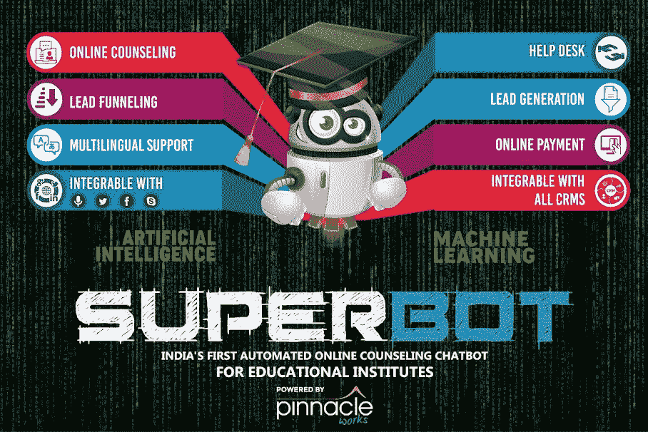

# 超级教育机器人-用于入学咨询的对话聊天机器人

> 原文：<https://medium.datadriveninvestor.com/superbot-for-education-conversational-chatbot-for-admission-counselling-b854b1189652?source=collection_archive---------24----------------------->

两件事情——移动通讯应用的日益普及和人工智能的进步，共同催生了新一代工具，使品牌能够以更强大、更具成本效益的方式与客户沟通。零售商和科技公司正在试验人工智能聊天机器人，在机器学习和自然语言理解的帮助下，这些机器人可以充当服务台、咨询代理、销售支持和其他行业相关功能。

意识到不断发展的业务对这种需求的不断增长，PinnacleWorks 在 1 月份推出了***超级机器人，一个人工智能驱动的通信聊天机器人*** 。它的创建是为了满足所有**行业的需求，但教育行业作为公司的专业领域被首先挖掘。在它发布的时候，我们不确定它是否被行业专家采用，因为改变一个古老的操作方式不是一件容易的事情。但是，令我们惊讶的是，仅仅在推出的 8 个月内，它就被 25 个以上的组织信任和使用。在此期间，SuperBot 能够解决超过 250 万个查询，并产生 25，000 多个销售线索。**

***“在这 8 个月的时间里，PinnacleWorks 团队密切关注 SuperBot 的性能，并在改进其性能的同时不断修复漏洞，从而使聊天成功率达到 97%”pinnacle works 联合创始人 Ankit Ruia 先生***

在移除所有 bug 并覆盖可能改进的领域后，超级机器人 2.0 版本于 2018 年 9 月的最后一周推出。更新的版本有一些惊人的功能，使它更智能的使用。例如:在线支付网关被集成到聊天工具中，允许用户只从聊天窗口支付所需的服务。此外，还为学生添加了同伴课程建议，以帮助他们获取同伴课程的线索，并帮助他们了解自己的选择。在机器学习的帮助下，还为游客设置了自动提醒，游客可能会对入场或任何其他服务表现出兴趣，但不会留下他们的详细信息。利用这种提醒通知，用户被动地接近并被提醒他们的兴趣，因此潜在的线索被捕捉。该团队仍在研究各种元素，以确保在行业中保持的领先地位得以延续。

***“聊天机器人是人们获取信息、做出决策和沟通方式的最新发展。本着这一信念，我们在印度和海外的其他行业也推出了超级机器人，包括汽车、BFSI、旅游等。”pinnacle works*T3 联合创始人 Sarvagya Mishra 先生说**

