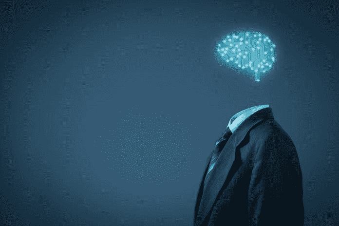
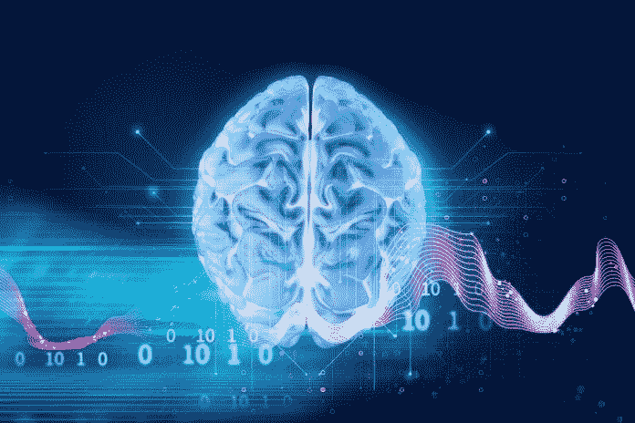

# 超人 AI 不是神话

> 原文：<https://medium.datadriveninvestor.com/superhuman-ai-is-not-a-myth-ff6f63f5e75d?source=collection_archive---------4----------------------->

## 尽管衡量智力可能很难，但我们头顶上肯定还有空间

我猜想，大多数《数据驱动投资者》的读者都会听说过人工超级智能:一种未来的人工智能，甚至比阿尔伯特·爱因斯坦或任何你最喜欢的天才都(要)聪明得多。像亿万富翁企业家埃隆·马斯克和已故物理学家斯蒂芬·霍金这样的重要思想家警告我们，这样的[人工智能](https://www.datadriveninvestor.com/glossary/artificial-intelligence/)可能会毁灭人类。虽然我很乐观，但我也有这些担忧:根据定义，一个超级智能的人工智能将非常擅长追求它的目标，假设它被编程为拥有一个这样的目标。除非它也被编程为对人类友好(所谓的友好 AI)，否则人工超级智能可能会为了达到其目标而做出伤害人类的行为。它们甚至可能导致人类灭绝。另一方面，人工超级智能也可以创造人类永生。这真的取决于具体情况。正是因为巨大的影响，无论是正面的还是负面的，我才关注这个话题。

在发表于 [Wired](https://www.wired.com/2017/04/the-myth-of-a-superhuman-ai) 的一篇名为《超人人工智能的神话》的文章中，凯文·凯利认为这种超人人工智能的接管场景建立在没有证据的假设之上。由于我认为凯文是错误的，我决定写这篇文章作为回应。凯文有许多假设，根据他的说法，为了“很快”出现超级智能，这些假设必须成立。让我们逐一讨论。

 [## 人工智能预测能力的神话|数据驱动的投资者

### AI(人工智能)最有前途的优势之一似乎是它预测未来的能力…

www.datadriveninvestor.com](https://www.datadriveninvestor.com/2019/03/01/the-myth-of-ais-predictive-power/) 

# 人工智能已经以指数级的速度变得比我们更聪明

凯文·凯利指出，超人人工智能崛起所需的第一个假设是，人工智能已经变得比我们更聪明，并且以指数速度增长。我在这里不是要争论这个假设本身是假是真。我能说的是，很难确定它的真实性，因为它取决于许多事情:智力的确切定义(特定领域，如国际象棋，或一般)，过去研究人员的数量，现在和未来的预测数量，等等。然而，大多数人都会同意人工智能变得越来越聪明。意想不到的突破确实会发生。例如，以 [AlphaZero](https://deepmind.com/blog/alphazero-shedding-new-light-grand-games-chess-shogi-and-go/) 形式出现的人工智能现在在围棋方面比人类强得多，而在过去，人类可以在这场比赛中轻松击败计算机。我无法确定进度是否是指数级的；但鉴于以前的突破，如果人工智能在未来十年内再次飞跃到人类水平的智能，并在此后不久达到超级智能，我不会感到惊讶。

# 我们将使人工智能成为一种通用智能，就像我们自己一样

我显然同意凯文的观点，超级智能的崛起需要这个假设。我也认为这个假设是对的。我们将建立人工智能:人工智能在三个智能领域都和人类一样聪明。诚然，今天的人工智能大多是狭义的人工智能，只为特定的任务而设计，但 AlphaZero 的早期例子已经相对通用:它可以教会自己下围棋、国际象棋*和*松吉。任何使人工智能更加通用的持续进展都将导致人工通用智能。当然，这是否会“很快”取决于“很快”的定义。然而，构建通用人工智能的(金钱)回报将是巨大的，谷歌等科技公司肯定意识到了这一点。我怀疑，我们在实现人工智能方面取得的进展越多，就会有更多的钱花在它的开发上，从而加快进展。

# 我们可以用硅制造人类智能

这是一个有争议的话题。我们确实模仿了我们智力的许多部分。我认为没有理由假设这不会发生在我们的其他智力上，因为我们的(大部分)智力发生在大脑中，大脑完全由神经元组成——神经元群已经被建模。硅中的智能是否真的能达到人类的水平还很难说，但是可以肯定的是，我们的智能水平是可以在硅中创造出来的。说这不可能发生，就是说我们的大脑相对于硅有一些特殊之处，这使得它不可能建模，而目前来自神经科学的证据并不表明这是事实。

# 智力可以无限制地扩展

为了产生超级智能，这当然不一定是真的。唯一需要的是有可能比人类更聪明。鉴于我们的大脑体积小，信号传输速度慢，认为我们人类拥有最高水平的智力似乎很愚蠢。

# 一旦我们拥有爆炸式的超级智慧，它就能解决我们的大部分问题

嗯，这叫超智能是有原因的。智力至少在一定程度上是指一个人解决问题的能力，因此，根据定义，超级智能在这方面比人类更好。凯文为自己的立场辩护说，解决问题需要的不仅仅是智力:需要做实验。虽然这肯定是真的，会减缓人工智能的进步，但这并不意味着这些问题不会得到解决。如果一个问题原则上可以解决，那么就有足够高的智力水平来解决它。

凯文·凯利继续谈论他认为有更多证据支持的五种异端邪说。其中大部分我或多或少同意或以前讨论过——然而，第一个仍然值得讨论。

# 智力不是单一维度，所以“比人类聪明”是一个没有意义的概念

我同意智力可以从多个维度来衡量。然而，这绝不意味着“比人类聪明”是没有意义的。如果一个人工智能只下国际象棋，而另一个只下围棋，那么很难说哪个更聪明。然而，另一个下棋和下围棋都比前两个 AI 好的 AI 肯定比前两个更聪明。因此，即使智力是从多个维度来衡量的(国际象棋和围棋)，还是有可能确定一个智力水平。人们甚至可以想象第四个人工智能比第三个人工智能更擅长国际象棋，也和第三个人工智能一样擅长围棋；这个人工智能会比第三个更聪明。

# 结论

超智能 AI 来了。无论是在未来十年还是五十年(甚至更远的未来)，它都将强烈而永久地改变我们的社会。这种影响是积极的还是消极的取决于我们。结果可能是人类灭绝或人类不朽，所以我们需要仔细考虑这个问题，因为我们不知道时间框架，我们应该现在就考虑。

*原载于 2019 年 7 月 18 日*[*【https://www.datadriveninvestor.com】*](https://www.datadriveninvestor.com/2019/07/18/superhuman-ai-is-not-a-myth-although-it-may-be-hard-to-measure-intelligence-there-is-certainly-room-above-us/)*。*