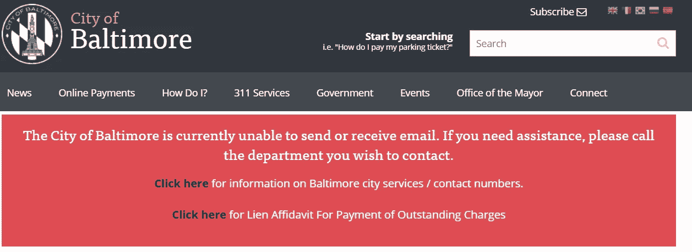

# 没有人工智能的超级智能

> 原文：<https://medium.datadriveninvestor.com/superintelligence-without-ai-dc580c376e91?source=collection_archive---------6----------------------->

Photo by [Aperture Vintage](https://unsplash.com/@aperturevintage?utm_source=medium&utm_medium=referral) on [Unsplash](https://unsplash.com?utm_source=medium&utm_medium=referral)

根据尼克·博斯特罗姆的说法，超智能是“在几乎所有感兴趣的领域大大超过人类认知表现的任何智力”。

未来学家担心超智能人工智能的发展可能会出现得如此之快，比我们聪明得多，以至于我们无法控制它。他们认为，当开发这样的人工智能时，我们需要小心，这样如果这种可能性实现了，人工智能就会以我们已经习惯的机器对待我们的方式对待我们。

 [## 哲学、象形文字和技术——数据驱动的投资者

### 在发现罗塞塔石碑之前，象形文字已经被视为信息，即使它们的语义…

www.datadriveninvestor.com](https://www.datadriveninvestor.com/2018/10/16/philosophy-hieroglyphics-and-technology/) 

这里有一点:*我们*可以说比我们的祖先更聪明，这要感谢计算机、互联网和像样的人工智能的发展。我可以毫不费力地解决复杂的微积分问题；我可以了解哈萨克斯坦的首都是什么；我甚至可以制作一个[蒙娜丽莎说话的视频](https://mashable.com/article/samsung-ai-deepfake-video/?europe=true)。我现在就可以做到，坐在我的床上，在我的电脑前，只需要几分钟。

我的祖父是工程师。他能解决微积分问题。但是他至少需要纸和笔，还需要一些时间。也许他需要一本书来提醒自己链式法则(或者一些更难的微积分法则，我不知道它的名字)。他几乎肯定需要一本书来了解哈萨克斯坦的首都。

但是他并没有很多书。所以他不得不去图书馆，但那需要来回走 15 分钟，而且今天是星期天，所以图书馆不会开门。他要花很长时间，大约几天，才能找到信息，如果他正在做的事情需要这些信息，他就会被耽搁。

至于第三个——这一点很重要——他甚至无法想象如何让蒙娜丽莎说话。对他来说，这看起来完全是胡说八道，而不是在点击回到你工作的标签页之前，带着远距离娱乐转发的东西(显然，他不知道什么是转发或标签页)。

但是，虽然我和你可以做这些事情，但我们能做到这一点只能归功于互联网，因此，如果互联网远离我们，我们的认知能力将受到极大的限制。如果我们失去了技术支柱，我们就会变得和我们的祖先一样。

但是现在想象一下，我们不仅失去了我们的技术支柱，而且它被保留它的人从我们这里拿走了，比如说，一个好战的国家发动网络战来摧毁我们的互联网。那么交战国将保留对互联网的访问，因此他们的认知能力不会像我们一样受到限制。我的主张是，它们对我们来说就像是超级智能。制造超级智慧的一个完美方法是让事物*比我们*聪明，另一个方法是让许多人*不如我们*聪明，相对于我们*比谁*聪明。这就是我在这里要探讨的。

## 一场网络战争可能会发生

通过网络战创造出亚智能人并非不可思议，因为不同程度的网络犯罪已经在发生；你只需要看看报纸。

WannaCry 袭击是其中最突出的一个。就在昨天,*纽约时报*刊登了一篇[报道](https://www.nytimes.com/2019/05/25/us/nsa-hacking-tool-baltimore.html)巴尔的摩市的计算机系统如何感染了勒索软件，该软件最初是由美国国家安全局开发的，但却落入了反对者的手中。这种软件在电脑之间传播，对文件进行加密，只有在支付了比特币赎金的情况下才会解密。根据 NYT 的文章，这已经在巴尔的摩的“冻结了数千台电脑，关闭了电子邮件，扰乱了房地产销售，水费单，健康警报和许多其他服务”。

WannaCry 已经不是第一次用了。它[2017 年 5 月](https://en.wikipedia.org/wiki/WannaCry_ransomware_attack)它在互联网上传播，从亚洲的某个地方开始，感染了英国 NHS 的电脑，导致 NHS 不得不拒绝非关键的紧急情况，并转移救护车。

不过，不仅仅是 WannaCry。与本文主题同样突出和相关的是 IRA 的工作，它是俄罗斯的互联网研究机构，本质上是通过钓鱼来干涉选举。他们建立虚假的 Twitter 账户，转发虚假的故事，帮助颠覆在线讨论的质量，让人们很难知道什么是真的。

关键的一点是，这在认识论上是有害的。通过让网民接触这些错误信息，这些虚假账户伤害了我们作为理性代理人的能力。我感兴趣的可能性是这样的，只是更加极端:关闭我们如此依赖的计算机系统的可能性。人们，实际上是政府机构(或其附属机构)已经在这一领域工作，并取得了持续的成功，这一事实应该让我们积极地担心这一点。

Baltimore City’s computer system, as of the time of writing, has been damaged by WannaCry

## 如果发生网络战，亚智能就会出现

在这里，我想声明，某些类型的网络犯罪可能会对我们的智力产生直接影响，因此，网络犯罪的受害者和实施者可能会像我们的祖先对我们一样——作为亚智能和超智能，其中后者我再次指的是认知能力远远超过我们的生物(其中“我们的”意味着类似于 2019 年的互联全球社区)。

思考网络攻击会对我们产生怎样的影响令人担忧，但也是有益的。举一个小例子:想象一下，我们镇上的通信基础设施瘫痪了一周，特别是所有的互联网连接都中断了。

这听起来并不激烈，但确实如此。我将无法工作——我的工作是基于网络的。我无法使用我的金融科技无分行银行，所以我无法获得我的钱(好吧，我不完全依赖这样的银行，但我很容易可以)。我不能和住在另一个国家的女朋友聊天，也不能看《网飞》,这是我放松的方式之一。我的整个生活都会被颠覆。

这只是我。我真的不知道细节，但我不得不想象一切都会超级糟糕——将食物从远处运送到当地超市的基础设施，决定如何分配电力和水的系统，公共交通，等等。我们所知的生活将会改变，因为我们所知的生活依赖于交流，而大多数交流都是通过互联网进行的。

这显然很糟糕。但是这篇文章的目的并不在于论证没有互联网的生活会很糟糕。我对智力感兴趣。互联网的缺失会如何影响智力？你可能会认为，尽管这会让我失业、破产、孤独、无聊和饥饿，但这不会影响我的智力。

但是我们依靠互联网获取知识。为了说明这一点，介绍一些哲学著作是有用的。安迪·克拉克和大卫·查尔莫斯在一篇著名的论文中认为知识是或者应该被认为是 T2 的延伸。一个人所知道的比你大脑中所包含的还要多。如果某条信息以一种你可以可靠访问的方式存储在某个地方，它应该算作你知道的东西。例如，如果你的朋友的电话号码储存在日记里，你应该算作知道他们的电话号码。

尽管担心“知道”到底是什么意思，但似乎很难否认扩展的知识是极其重要的。我的日常工作依赖于谷歌和维基百科上的大量内容，你可能也是如此。举个例子，现在编程简单多了，无论何时你得到一个错误信息，你只要把它粘贴到谷歌上，你就会在 StackExchange 上找到一个非常聪明的人，告诉你到底是什么问题，以及如何修复它。

也许这一点不需要赘述，但我还是要说一下。我年纪已经够大了，我还记得那个时候，你不得不进入图书馆的地下室，在书架中查找学术论文。这至少要求图书馆提供期刊并开放，你要穿上裤子，亲自去图书馆。

这还不是全部。它要求你首先知道你想阅读什么样的论文，这是你无法依靠搜索引擎来告诉你的，而且它要求——这一点非常重要——该论文足够古老，以至于它已经被撰写、接受和印刷。对于非常前沿的研究，图书馆是没有用的。

总之，过去获取信息需要很长时间，而且信息是有限的。我们的扩展知识更难获取，总体来说更难。尤其令人担忧的是，我们在这方面的进展会多么快地倒退。没有互联网，我们的扩展知识会减少，如果其他人的扩展知识没有减少，他们将成为我们的超级智能。

*2020 年 6 月 23 日补充:从 2020 年夏天开始，我将把我的临时写作从中型转移到小型。如果你想在收件箱里读到更多我的消息，请考虑注册:*[*https://tinyletter.com/mittmattmutt*](https://tinyletter.com/mittmattmutt)*。我会相对不频繁地，希望有趣地，在和博客相同的主题上发表文章，比如:流行哲学/解释者，文化，文学，政治/经济，等等。我可能还会做一些事情，比如对我读过的书做简短的评论等等。*

## 更多的后果

在我所描绘的“扩展知识缺失导致的亚智力”场景中，有两个特别有趣的特征。第一个问题是我上面提到的快速研究，这意味着许多最新的知识只包含在互联网上。

这一点的重要性如下。假设开发了一种关闭互联网的病毒，并假设这种病毒利用了计算机科学的最新发展，迄今为止的研究仅发布在 arXiv(一种预印服务器，学者将尚未发表的工作放在其中)上。然后，如果它足够近，即使它位于世界上最好的图书馆附近，那项研究也可能不在其中。有可能只有在你能上网的情况下，才能获得关于这种病毒的研究，以及对抗这种病毒的方法。因此，重新访问互联网的唯一方法就是你已经可以访问它了！

当然，也可能是你可以依靠别人给你信息。想象一下，你的国家受到攻击，而友好的国家没有受到攻击。然后，你可能会想，你会要求友好国家的研究人员打印并向你发送关于这个主题的所有信息，这样你就可以着手对抗它。

但似乎在许多情况下，这种可能性将再次依赖于互联网。我猜，许多研究人员依靠电子邮件和教员网页与其他研究人员保持联系。因此，如果这些停止运作，那么你将变得孤立，无法获得解决问题所需的研究。

那么，我认为，这种类型的攻击有一个非常真实的风险，将人推入一种你无法摆脱的无互联网的盆地，因为打击软件和恢复对互联网的访问将需要在这个过程的每一步都访问互联网。这是因为，再重复一遍，我们在生活的每个领域都依赖于互联网。

这是这类问题的第二个有趣的特征。人工智能令人毛骨悚然的一点是，它可以做我们认为不可能的事情，这在不久前还是不可理解的。想想谷歌翻译(Google Translate)看似一夜之间取得的进展，或者人工智能(AI)下棋和下围棋，或者再一次想想深度造假和类似的事情。

因此，想象一下我的祖父在 20 世纪 50 年代在电视上遇到了 deepfakes 比如说，伊丽莎白女王向美国宣战。他可能根本不会想到这是假的。但他甚至无法想象这是真的——这毫无意义。他会完全彻底地迷失，他的现实感会减弱。

简而言之，我认为，先进而令人费解的技术有从认知角度削弱你对世界的把握的趋势。如果我们被切断了互联网，相应地，但技术进步仍在继续，谁知道会发展出什么？

我们可能会开始很难区分交战者，他们只是沿着我们直到最近一直在走的技术道路，从魔法中区分出来，我们的现实感，甚至是我们理解世界的最基本的概念，都可能会受到侵蚀。到那时，我们和那些仍然掌握着技术的人之间的认知鸿沟将会如此之大和之深，以至于认为他们对我们来说会像人工智能对他们来说一样超级智能似乎一点也不合理。

## 好还是坏？

没有人工智能也可以有超智能——这需要我们找到一些方法来夺回我们已经取得的进步，以制造相对于我们——今天的人类——将成为超智能的亚智能。由于这些进步大部分归功于通信技术，通信技术是一个合适的战争领域，而人类是好战的，应该认真对待亚智能和超智能的出现。

我想以一个略带讽刺的调子来结束我的演讲。关注人工智能的人通常担心存在风险——可能大规模影响整个人类的风险。如果他们的价值观和目标不是我们的，而他们在实现他们的目标和实现他们的价值观方面做得更好，那么敌对的人工智能超智能确定性可能会导致生存风险。与他们创造的次级智能相比，超级智能又如何呢？它们会导致存在风险吗？

也许不是。想象一下，一个牵强附会的场景，通信技术在许多国家被一个成功的交战国永久摧毁，而这个交战国保留了对一切的完全访问权。很有可能，在由此产生的反乌托邦中，全世界的能源需求将会大大减少。我们不会开采比特币或乘坐跨大陆航班，或者生很多孩子——我们可能会专注于寻找为我们提供食物、电力和信息的方法。

如果我们中的大多数人陷入了需要互联网来拯救我们的无互联网盆地，从而降低到极其糟糕的生活水平，我们就不会使用太多的电力。在足够大的范围内，气候变化可能会停止。如果气候变化是生存风险的最大来源，超级智能可以减少而不是增加生存风险，尽管不是以我们大多数人都乐意看到的方式。